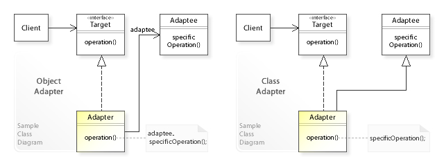
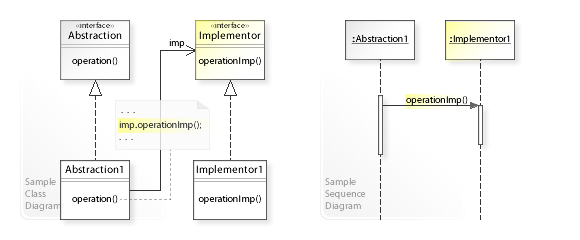
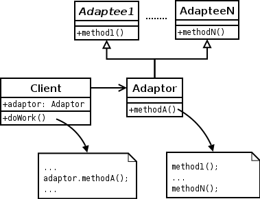
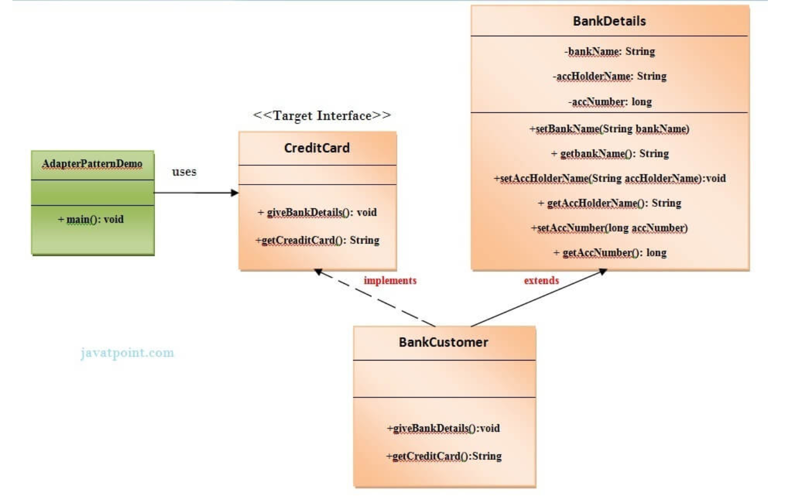
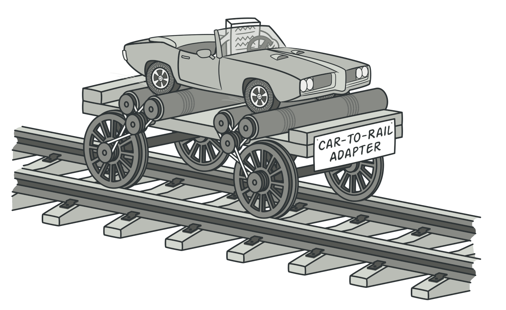
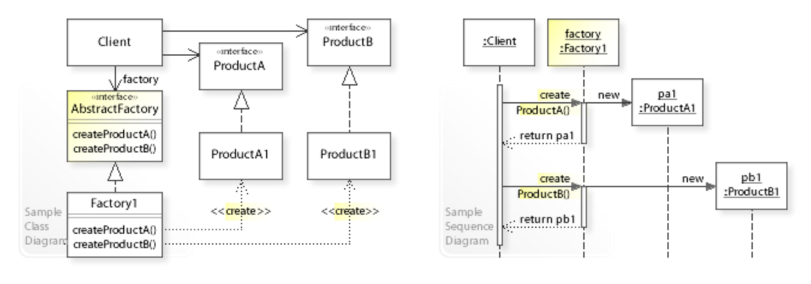
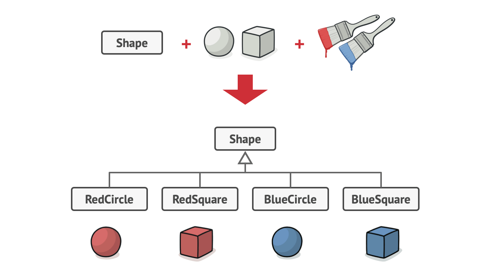

# Design Pattern

A design pattern is the re-usable form of a solution to a design problem. The idea was introduced by the architect `Christopher Alexander`.




# Why Design Patterns ?

Documenting a pattern requires explaining why a particular situation causes problems, and how the components of the pattern relate to each other to give the solution. Christopher Alexander describes common design problems as arising from "conflicting forces"—such as the conflict between wanting a room to be sunny and wanting it not to overheat on summer afternoons. A pattern would not tell the designer how many windows to put in the room; instead, it would propose a set of values to guide the designer toward a decision that is best for their particular application. Alexander, for example, suggests that enough windows should be included to direct light all around the room. He considers this a good solution because he believes it increases the enjoyment of the room by its occupants. Other authors might come to different conclusions, if they place higher value on heating costs, or material costs. These values, used by the pattern's author to determine which solution is "best", must also be documented within the pattern.

Pattern documentation should also explain when it is applicable. Since two houses may be very different from one another, a design pattern for houses must be broad enough to apply to both of them, but not so vague that it doesn't help the designer make decisions. The range of situations in which a pattern can be used is called its context. Some examples might be "all houses", "all two-story houses", or "all places where people spend time". 

For instance, in Christopher Alexander's work, bus stops and waiting rooms in a surgery center are both within the context for the pattern "A PLACE TO WAIT". 


So, The single biggest benefit of design patterns in my opinion is that `it gives developers a common vocabulary to talk about software solutions.`

If I say, "We should implement this using the singleton pattern", we have a common point of reference to begin discussing whether or not that is a good idea without me having to actually implement the solution first so you know what I mean.

Add in `readability` and `maintainability` that comes with familiar solutions to common problems, instead of every developer trying to solve the problem in their own way over an over again.

Pretty important. Software can be made without them, but it's certainly a lot harder.


# Differenet Types of Design Patterns

there are various types of design patterns exits in software engineering.

- `Software Design Pattern` in software design
- `Architectural Pattern`:  for software architecture
- `Interaction design pattern`: used in interaction design / human–computer interaction
- `Pedagogical patterns`:  in teaching
- `Pattern gardening` : in gardening


we will discuss `Software Design Pattern` & `Architectural Pattern` only.


# Software Design Pattern

A design pattern describes a relatively small, well-defined aspect (i.e. functionality) of a computer program in terms of how to write the code.

Using a pattern is intended to leverage an existing concept rather than re-inventing it. This can decrease the time to develop software and increase the quality of the resulting program. 

Notably, a pattern does not consist of a software artifact. Most development resources that a programmer uses involve configuring the codebase to use an artifact such as a library (to name just one example). In contrast, to use a pattern, a programmer writes code as described by the pattern. The result is unique every time even though the result may be recognizable as based on the pattern. 

Conceptually, design pattern may be described as more specific than programming paradigm and less specific than algorithm. 


## Motivation for Software Design Pattern

Design patterns can speed up the development process by providing proven development paradigms.Effective software design requires considering issues that may not become apparent until later in the implementation. Freshly written code can often have hidden, subtle issues that take time to be detected; issues that sometimes can cause major problems down the road. Reusing design patterns can help to prevent such issues, and enhance code readability for those familiar with the patterns. 

Software design techniques are difficult to apply to a broader range of problems.[citation needed] Design patterns provide general solutions, documented in a format that does not require specifics tied to a particular problem. 

`A pattern describes a design motif, a.k.a. prototypical micro-architecture, as a set of program constituents (e.g., classes, methods...) and their relationships. A developer adapts the motif to their codebase to solve the problem described by the pattern. The resulting code has structure and organization similar to the chosen motif. `


## Object-Oriented Design Patterns

Object-oriented design patterns typically show relationships and interactions between classes or objects, without specifying the final application classes or objects that are involved. Patterns that imply mutable state may be unsuited for functional programming languages. Some patterns can be rendered unnecessary in languages that have built-in support for solving the problem they are trying to solve, and object-oriented patterns are not necessarily suitable for non-object-oriented languages. 

Design patterns can be organized into groups based on what kind of problem they solve. 

- `Creational Design Patterns :` create objects. 

- `Structural Design Patterns :` organize classes and objects to form larger structures that provide new functionality. 

- `Behavioral Design Patterns :` provide communication between objects and realizing these patterns. 


# Creational Design Patterns

Creational Design Patterns are design patterns that `deal with object creation mechanisms, trying to create objects in a manner suitable to the situation.` The basic form of object creation could result in design problems or in added complexity to the design due to inflexibility in the creation procedures. Creational design patterns solve this problem by somehow controlling this object creation. 

Simply we can say, `Creational design patterns provide various object creation mechanisms, which increase flexibility and reuse of existing code.`

Creational design patterns are composed of two dominant ideas. `One is encapsulating knowledge about which concrete classes the system uses.` Another is `hiding how instances of these concrete classes are created and combined.`

Creational design patterns are further categorized into object-creational patterns and class-creational patterns, where object-creational patterns deal with object creation and class-creational patterns deal with class-instantiation. In greater details, object-creational patterns defer part of its object creation to another object, while class-creational patterns defer its object creation to subclasses.


The creational patterns aim to `separate a system from how its objects are created, composed, and represented. `They increase the system's flexibility in terms of the what, who, how, and when of object creation.


## Why Creational Design Patterns ?

As modern software engineering depends more on object composition than class inheritance, emphasis shifts away from hard-coding behaviors toward defining a smaller set of basic behaviors that can be composed into more complex ones. Hard-coding behaviors are inflexible because they require overriding or re-implementing the whole thing in order to change parts of the design. Additionally, hard-coding does not promote reuse and makes it difficult to keep track of errors. For these reasons, creational patterns are more useful than hard-coding behaviors. Creational patterns make design become more flexible. They provide different ways to remove explicit references in the concrete classes from the code that needs to instantiate them. In other words, they create independency for objects and classes. 


## When Creational Design Patterns can be apply ?

Consider applying creational patterns when:

- A system should be independent of how its objects and products are created.
- A set of related objects is designed to be used together.
- Hiding the implementations of a class library or product, revealing only their interfaces.
- Constructing different representation of independent complex objects.
- A class wants its subclass to implement the object it creates.
- The class instantiations are specified at run-time.
- There must be a single instance and client can access this instance at all times.
- Instance should be extensible without being modified.


## Structure of Creational Design Patterns

Below is a simple class diagram that most creational patterns have in common. Note that different creational patterns require additional and different participated classes. 


`Participants:`

-    `Creator:` Declares object interface. Returns object.

-    `ConcreteCreator:` Implements object's interface.


## Examples of Creational Design Patterns

There are some 10 examples of creational design patterns exist may be exist more than that as these are patterns for common occuring problems in software engineering:


- `Multiton:` Ensure a class has only named instances, and provide a global point of access to them.

- `Builder pattern:` Separate the construction of a complex object from its representation, allowing the same construction process to create various representations. 

- `Prototype pattern:` Specify the kinds of objects to create using a prototypical instance, and create new objects from the 'skeleton' of an existing object, thus boosting performance and keeping memory footprints to a minimum. 

- `Singleton pattern:` Ensure a class has only one instance, and provide a global point of access to it. 

- `Object pool pattern:` Avoid expensive acquisition and release of resources by recycling objects that are no longer in use. Can be considered a generalisation of connection pool and thread pool patterns. 

- `Factory method pattern:` Define an interface for creating a single object, but let subclasses decide which class to instantiate. Factory Method lets a class defer instantiation to subclasses.

- `Abstract Factory pattern:` Provide an interface for creating families of related or dependent objects without specifying their concrete classes. 

- `Lazy initialization pattern:` Tactic of delaying the creation of an object, the calculation of a value, or some other expensive process until the first time it is needed. This pattern appears in the GoF catalog as "virtual proxy", an implementation strategy for the Proxy pattern.

- `Dependency Injection pattern:` A class accepts the objects it requires from an injector instead of creating the objects directly. 

- `Resource acquisition is initialization (RAII):` Ensure that resources are properly released by tying them to the lifespan of suitable objects. 


## Factory Method Pattern

Factory Method is a creational design pattern that `provides an interface or abstract class` for creating objects in a superclass, `but allows subclasses to alter the type of objects that will be created [IMP.]`. In other words  `subclasses are responsible to create the instance of the class.`

The Factory Method Pattern is also known as `Virtual Constructor`.

Factory method pattern is a design pattern that uses factory methods to deal with the problem of creating objects without having to specify their exact class. Rather than by calling a constructor, this is done by calling a factory method to create an object.


Factory methods can either be specified in an interface and implemented by child classes, or implemented in a base class and optionally overridden by derived classes.

Factory Method Pattern "Define an interface for creating an object, but let subclasses decide which class to instantiate. The Factory method lets a class defer instantiation it uses to subclasses."




Creating an object often requires complex processes not appropriate to include within a composing object. The object's creation may lead to a significant duplication of code, may require information not accessible to the composing object, may not provide a sufficient level of abstraction, or may otherwise not be part of the composing object's concerns. The factory method design pattern handles these problems by defining a separate method for creating the objects, which subclasses can then override to specify the derived type of product that will be created. 


The factory method pattern relies on inheritance, as object creation is delegated to subclasses that implement the factory method to create objects.


### Which Problems Factory Method Pattern Solves ?

The Factory Method design pattern solves problems like:

- How can an object be created so that subclasses can redefine its subsequent and distinct implementation?
- How can an object's instantiation be deferred to a subclass?

### How Such Problems Factory Method Pattern Solves ?

The Factory Method design pattern describes how to solve such problems: 

- Define a factory method within the superclass that defers the object's creation to a subclass's factory method.
- Create an object by calling a factory method instead of directly calling a constructor.

This enables the writing of subclasses that can change the way an object is created (e.g. by redefining which class to instantiate).


### Structure of Factory Method

A sample UML class diagram for the Factory Method design pattern.



In the above UML class diagram, the Creator class that requires a Product object does not instantiate the Product1 class directly. Instead, the Creator refers to a separate factoryMethod() to create a product object, which makes the Creator independent of which concrete class is instantiated. Subclasses of Creator can redefine which class to instantiate. In this example, the Creator1 subclass implements the abstract factoryMethod() by instantiating the Product1 class. 


### Why Factory Method Pattern ?

The factory method pattern can improve performance by reducing the number of object creations and dependencies, and by enabling lazy initialization and caching of objects. It can also enhance maintainability by decoupling the client code from the concrete classes, and by allowing you to add new types of objects without modifying the existing code. The factory method pattern can also support the principle of open-closed design, which states that software entities should be open for extension but closed for modification.


Factory Method Pattern allows the sub-classes to choose the type of objects to create.

It promotes the `loose-coupling` by eliminating the need to bind application-specific classes into the code. That means the code interacts solely with the resultant interface or abstract class, so that it will work with any classes that implement that interface or that extends that abstract class.


### Why not Factory Method Pattern ?

The factory method pattern can also introduce some drawbacks that can affect performance and maintainability. For example, it can increase the complexity and size of the code, as you need to create a separate factory class or method for each type of object. It can also introduce an extra level of abstraction and indirection, which can make the code harder to understand and debug. Moreover, it can create tight coupling between the factory and the concrete classes, which can make the code less flexible and testable.


### C++ Example

```C++ 
#include <iostream>
#include <memory>

enum ProductId {MINE, YOURS};

// defines the interface of objects the factory method creates.
class Product {
public:
  virtual void print() = 0;
  virtual ~Product() = default;
};

// implements the Product interface.
class ConcreteProductMINE: public Product {
public:
  void print() {
    std::cout << "this=" << this << " print MINE\n";
  }
};

// implements the Product interface.
class ConcreteProductYOURS: public Product {
public:
  void print() {
    std::cout << "this=" << this << " print YOURS\n";
  }
};

// declares the factory method, which returns an object of type Product.
class Creator {
public:
  virtual std::unique_ptr<Product> create(ProductId id) {
    if (ProductId::MINE == id) return std::make_unique<ConcreteProductMINE>();
    if (ProductId::YOURS == id) return std::make_unique<ConcreteProductYOURS>();
    // repeat for remaining products...

    return nullptr;
  }
  virtual ~Creator() = default;
};

int main() {
  // The unique_ptr prevent memory leaks.
  std::unique_ptr<Creator> creator = std::make_unique<Creator>();
  std::unique_ptr<Product> product = creator->create(ProductId::MINE);
  product->print();

  product = creator->create(ProductId::YOURS);
  product->print();
}
```

// The program output is like 

```bash
this=0x6e5e90 print MINE
this=0x6e62c0 print YOURS
```


### JAVA Example



#1 Create a Plan abstract class.

```JAVA
import java.io.*;      
    abstract class Plan{  
             protected double rate;  
             abstract void getRate();  
       
             public void calculateBill(int units){  
                  System.out.println(units*rate);  
              }  
    }//end of Plan class.    
```  

#2 Create the concrete classes that extends Plan abstract class. 

```JAVA
class  DomesticPlan extends Plan{  
        @override  
         public void getRate(){  
             rate=3.50;              
        }  
   }//end of DomesticPlan class.


class  CommercialPlan extends Plan{  
    @override   
    public void getRate(){   
        rate=7.50;  
   }
}   
//end of CommercialPlan class. 

class  InstitutionalPlan extends Plan{  
    @override  
    public void getRate(){   
        rate=5.50;  
   }
}   
//end of InstitutionalPlan class.

```
#3 Create a GetPlanFactory `to generate object of concrete classes based on given information`.

```JAVA
class GetPlanFactory{     
   //use getPlan method to get object of type Plan   
       public Plan getPlan(String planType){  
            if(planType == null){  
             return null;  
            }  
          if(planType.equalsIgnoreCase("DOMESTICPLAN")) {  
                 return new DomesticPlan();  
               }   
           else if(planType.equalsIgnoreCase("COMMERCIALPLAN")){  
                return new CommercialPlan();  
            }   
          else if(planType.equalsIgnoreCase("INSTITUTIONALPLAN")) {  
                return new InstitutionalPlan();  
          }  
      return null;  
   }  
}//end of GetPlanFactory class.
```
#4 Generate Bill by using the GetPlanFactory to get the object of concrete classes by passing an information such as type of plan DOMESTICPLAN or COMMERCIALPLAN or INSTITUTIONALPLAN.

```JAVA
import java.io.*;    
class GenerateBill{  
    public static void main(String args[])throws IOException{  
      GetPlanFactory planFactory = new GetPlanFactory();  
        
      System.out.print("Enter the name of plan for which the bill will be generated: ");  
      BufferedReader br=new BufferedReader(new InputStreamReader(System.in));  
  
      String planName=br.readLine();  
      System.out.print("Enter the number of units for bill will be calculated: ");  
      int units=Integer.parseInt(br.readLine());  
  
      Plan p = planFactory.getPlan(planName);  
      //call getRate() method and calculateBill()method of DomesticPaln.  
  
       System.out.print("Bill amount for "+planName+" of  "+units+" units is: ");  
           p.getRate();  
           p.calculateBill(units);  
            }  
    }//end of GenerateBill class.
```

similar example :: https://www.tutorialspoint.com/design_pattern/factory_pattern.htm


## Abstract Factory Pattern

The Abstract factory pattern in software engineering is a creational design pattern that provides a way to create families of related objects without imposing their concrete classes, by encapsulating a group of individual factories that have a common theme without specifying their concrete classes.

`Abstract factory pattern define as "an interface for creating families of related or dependent objects without specifying their concrete classes."`

That means Abstract Factory lets a class returns a factory of classes. So, this is the reason that Abstract Factory Pattern is one level higher than the Factory Pattern.

An Abstract Factory Pattern is also known as `Kit`. 



According to this pattern, a client software component creates a concrete implementation of the abstract factory and then uses the generic interface of the factory to create the concrete objects that are part of the family.

The client does not know which concrete objects it receives from each of these internal factories, as it uses only the generic interfaces of their products.

This pattern separates the details of implementation of a set of objects from their general usage and relies on object composition, as object creation is implemented in methods exposed in the factory interface.


### When Abstract Factory Pattern can be apply ?

- When the system needs to be independent of how its object are created, composed, and represented.
- When the family of related objects has to be used together, then this constraint needs to be enforced.
- When you want to provide a library of objects that does not show implementations and only reveals interfaces.
- When the system needs to be configured with one of a multiple family of objects.


### Which Problems Abstract Factory Pattern Solves ?

Creating objects directly within the class that requires the objects is inflexible. Doing so commits the class to particular objects and makes it impossible to change the instantiation later without changing the class. It prevents the class from being reusable if other objects are required, and it makes the class difficult to test because real objects cannot be replaced with mock objects. 

A factory is the location of a concrete class in the code at which objects are constructed. Implementation of the pattern intends to insulate the creation of objects from their usage and to create families of related objects without depending on their concrete classes. This allows for new derived types to be introduced with no change to the code that uses the base class. 

It may be used to solve problems such as:

- How can an application be independent of how its objects are created?
- How can a class be independent of how the objects that it requires are created?
- How can families of related or dependent objects be created?

### How Such Problems Abstract Factory Pattern Solves ?

This makes a class independent of how its objects are created. A class may be configured with a factory object, which it uses to create objects, and the factory object can be exchanged at runtime.

- Encapsulate object creation in a separate (factory) object by defining and implementing an interface for creating objects.
- Delegate object creation to a factory object instead of creating objects directly. 


### Why Abstract Factory Pattern ?

Abstract Factory is a very central design pattern for `Dependency Injection (DI)`.

Here's a list of Stack Overflow questions where application of Abstract Factory has been accepted as the solution.

https://stackoverflow.com/questions/2280170/why-do-we-need-abstract-factory-design-pattern


### Why not Abstract Factory Pattern ?

Use of this pattern enables interchangeable concrete implementations without changing the code that uses them, even at runtime. However, employment of this pattern, as with similar design patterns, may result in `unnecessary complexity` and `extra work in the initial writing of code`. Additionally, higher levels of separation and abstraction can result in systems that are more `difficult to debug and maintain`. 


### Structure of Abstract Factory Pattern




In the above UML class diagram, the Client class that requires ProductA and ProductB objects does not instantiate the ProductA1 and ProductB1 classes directly. Instead, the Client refers to the AbstractFactory interface for creating objects, which makes the Client independent of how the objects are created (which concrete classes are instantiated). The Factory1 class implements the AbstractFactory interface by instantiating the ProductA1 and ProductB1 classes.

The UML sequence diagram shows the runtime interactions. The Client object calls createProductA() on the Factory1 object, which creates and returns a ProductA1 object. Thereafter, the Client calls createProductB() on Factory1, which creates and returns a ProductB1 object. 

- `Variants of Abstract Factory Pattern` 

The original structure of the abstract factory pattern, as defined in 1994 in Design Patterns, is based on abstract classes for the abstract factory and the abstract products to be created. The concrete factories and products are classes that specialize the abstract classes using inheritance.

A more recent structure of the pattern is based on interfaces that define the abstract factory and the abstract products to be created. This design uses native support for interfaces or protocols in mainstream programming languages to avoid inheritance. In this case, the concrete factories and products are classes that realize the interface by implementing it.


### C++ Example

```C++ 
#include <iostream>

enum Direction {North, South, East, West};

class MapSite {
public:
  virtual void enter() = 0;
  virtual ~MapSite() = default;
};

class Room : public MapSite {
public:
  Room() :roomNumber(0) {}
  Room(int n) :roomNumber(n) {}
  void setSide(Direction d, MapSite* ms) {
    std::cout << "Room::setSide " << d << ' ' << ms << '\n';
  }
  virtual void enter() {}
  Room(const Room&) = delete; // rule of three
  Room& operator=(const Room&) = delete;
private:
  int roomNumber;
};

class Wall : public MapSite {
public:
  Wall() {}
  virtual void enter() {}
};

class Door : public MapSite {
public:
  Door(Room* r1 = nullptr, Room* r2 = nullptr)
    :room1(r1), room2(r2) {}
  virtual void enter() {}
  Door(const Door&) = delete; // rule of three
  Door& operator=(const Door&) = delete;
private:
  Room* room1;
  Room* room2;
};

class Maze {
public:
  void addRoom(Room* r) {
    std::cout << "Maze::addRoom " << r << '\n';
  }
  Room* roomNo(int) const {
    return nullptr;
  }
};

class MazeFactory {
public:
  MazeFactory() = default;
  virtual ~MazeFactory() = default;

  virtual Maze* makeMaze() const {
    return new Maze;
  }
  virtual Wall* makeWall() const {
    return new Wall;
  }
  virtual Room* makeRoom(int n) const {
    return new Room(n);
  }
  virtual Door* makeDoor(Room* r1, Room* r2) const {
    return new Door(r1, r2);
  }
};

// If createMaze is passed an object as a parameter to use to create rooms, walls, and doors, then you can change the classes of rooms, walls, and doors by passing a different parameter. This is an example of the Abstract Factory (99) pattern.

class MazeGame {
public:
  Maze* createMaze(MazeFactory& factory) {
    Maze* aMaze = factory.makeMaze();
    Room* r1 = factory.makeRoom(1);
    Room* r2 = factory.makeRoom(2);
    Door* aDoor = factory.makeDoor(r1, r2);
    aMaze->addRoom(r1);
    aMaze->addRoom(r2);
    r1->setSide(North, factory.makeWall());
    r1->setSide(East, aDoor);
    r1->setSide(South, factory.makeWall());
    r1->setSide(West, factory.makeWall());
    r2->setSide(North, factory.makeWall());
    r2->setSide(East, factory.makeWall());
    r2->setSide(South, factory.makeWall());
    r2->setSide(West, aDoor);
    return aMaze;
  }
};

int main() {
  MazeGame game;
  MazeFactory factory;
  game.createMaze(factory);
}
```
//The program output is:

```bash
Maze::addRoom 0x1317ed0
Maze::addRoom 0x1317ef0
Room::setSide 0 0x1318340
Room::setSide 2 0x1317f10
Room::setSide 1 0x1318360
Room::setSide 3 0x1318380
Room::setSide 0 0x13183a0
Room::setSide 2 0x13183c0
Room::setSide 1 0x13183e0
Room::setSide 3 0x1317f10
```

### Java Example

We are going to create a `Bank interface` and a `Loan abstract class` as well as their sub-classes.
Then we will create `AbstractFactory` class as next step.
Then after we will create concrete classes, `BankFactory`, and `LoanFactory` that will extends `AbstractFactory` class
After that, `AbstractFactoryPatternExample` (main function) class uses the `FactoryCreator` to get an object of `AbstractFactory` class. 



#1 Create a Bank interface

```java
import java.io.*;     
interface Bank{  
        String getBankName();  
}
```

#2 Create concrete classes that implement the Bank interface. 

```java

class HDFC implements Bank{  
             private final String BNAME;  
             public HDFC(){  
                    BNAME="HDFC BANK";  
            }  
            public String getBankName() {  
                      return BNAME;  
            }  
}

class ICICI implements Bank{  
           private final String BNAME;  
           ICICI(){  
                    BNAME="ICICI BANK";  
            }  
            public String getBankName() {  
                      return BNAME;  
           }  
}

class SBI implements Bank{  
      private final String BNAME;  
      public SBI(){  
                BNAME="SBI BANK";  
        }  
       public String getBankName(){  
                  return BNAME;  
       }  
}

```

#3 Create the Loan abstract class.

```java
abstract class Loan{  
   protected double rate;  
   abstract void getInterestRate(double rate);  
   public void calculateLoanPayment(double loanamount, int years)  
   {  
        /* 
              to calculate the monthly loan payment i.e. EMI   
                            
              rate=annual interest rate/12*100; 
              n=number of monthly installments;            
              1year=12 months. 
              so, n=years*12; 
 
            */  
                
         double EMI;  
         int n;  
  
         n=years*12;  
         rate=rate/1200;  
         EMI=((rate*Math.pow((1+rate),n))/((Math.pow((1+rate),n))-1))*loanamount;  
  
System.out.println("your monthly EMI is "+ EMI +" for the amount"+loanamount+" you have borrowed");     
 }  
}// end of the Loan abstract class.
```

#4 Create concrete classes that extend the Loan abstract class.

```java
class HomeLoan extends Loan{  
         public void getInterestRate(double r){  
             rate=r;  
        }  
}//End of the HomeLoan class.  

class BussinessLoan extends Loan{  
    public void getInterestRate(double r){  
          rate=r;  
     }  
  
}//End of the BusssinessLoan class.

class EducationLoan extends Loan{  
     public void getInterestRate(double r){  
       rate=r;  
 }  
}//End of the EducationLoan class.
```

#5 Create an abstract class (i.e AbstractFactory) to get the factories for Bank and Loan Objects.

```java
abstract class AbstractFactory{  
  public abstract Bank getBank(String bank);  
  public abstract Loan getLoan(String loan);  
}
```

#6 Create the factory classes that inherit AbstractFactory class to generate the object of concrete class based on given information.

```java
class BankFactory extends AbstractFactory{  
   public Bank getBank(String bank){  
      if(bank == null){  
         return null;  
      }  
      if(bank.equalsIgnoreCase("HDFC")){  
         return new HDFC();  
      } else if(bank.equalsIgnoreCase("ICICI")){  
         return new ICICI();  
      } else if(bank.equalsIgnoreCase("SBI")){  
         return new SBI();  
      }  
      return null;  
   }  
  public Loan getLoan(String loan) {  
      return null;  
   }  
}//End of the BankFactory class.

class LoanFactory extends AbstractFactory{  
           public Bank getBank(String bank){  
                return null;  
          }  
        
     public Loan getLoan(String loan){  
      if(loan == null){  
         return null;  
      }  
      if(loan.equalsIgnoreCase("Home")){  
         return new HomeLoan();  
      } else if(loan.equalsIgnoreCase("Business")){  
         return new BussinessLoan();  
      } else if(loan.equalsIgnoreCase("Education")){  
         return new EducationLoan();  
      }  
      return null;  
   }  
     
}
```

#7 Create a FactoryCreator class to get the factories by passing an information such as Bank or Loan.

```java
class FactoryCreator {  
     public static AbstractFactory getFactory(String choice){  
      if(choice.equalsIgnoreCase("Bank")){  
         return new BankFactory();  
      } else if(choice.equalsIgnoreCase("Loan")){  
         return new LoanFactory();  
      }  
      return null;  
   }  
}//End of the FactoryCreator.
```
#8 Use the FactoryCreator to get AbstractFactory in order to get factories of concrete classes by passing an information such as type.

```java
import java.io.*;  
class AbstractFactoryPatternExample {  
          public static void main(String args[])throws IOException {  
           
          BufferedReader br=new BufferedReader(new InputStreamReader(System.in));  
      
          System.out.print("Enter the name of Bank from where you want to take loan amount: ");  
          String bankName=br.readLine();  
      
    System.out.print("\n");  
    System.out.print("Enter the type of loan e.g. home loan or business loan or education loan : ");  
      
    String loanName=br.readLine();  
    AbstractFactory bankFactory = FactoryCreator.getFactory("Bank");  
    Bank b=bankFactory.getBank(bankName);  
      
    System.out.print("\n");  
    System.out.print("Enter the interest rate for "+b.getBankName()+ ": ");  
      
    double rate=Double.parseDouble(br.readLine());  
    System.out.print("\n");  
    System.out.print("Enter the loan amount you want to take: ");  
      
    double loanAmount=Double.parseDouble(br.readLine());  
    System.out.print("\n");  
    System.out.print("Enter the number of years to pay your entire loan amount: ");  
    int years=Integer.parseInt(br.readLine());  
      
    System.out.print("\n");  
    System.out.println("you are taking the loan from "+ b.getBankName());  
      
    AbstractFactory loanFactory = FactoryCreator.getFactory("Loan");  
               Loan l=loanFactory.getLoan(loanName);  
               l.getInterestRate(rate);  
               l.calculateLoanPayment(loanAmount,years);  
      }  
}//End of the  AbstractFactoryPatternExample
```   


## Builder Pattern


## Prototype Pattern


## Singleton Pattern

## Object Pool Pattern

## Dependency Injection Pattern

## Lazy initialization Pattern

## Resource acquisition is initialization (RAII) Pattern

## Multiton Pattern


 