# Design Pattern

A design pattern is the re-usable form of a solution to a design problem. The idea was introduced by the architect `Christopher Alexander`.


# Why Design Patterns ?

Documenting a pattern requires explaining why a particular situation causes problems, and how the components of the pattern relate to each other to give the solution. Christopher Alexander describes common design problems as arising from "conflicting forces"—such as the conflict between wanting a room to be sunny and wanting it not to overheat on summer afternoons. A pattern would not tell the designer how many windows to put in the room; instead, it would propose a set of values to guide the designer toward a decision that is best for their particular application. Alexander, for example, suggests that enough windows should be included to direct light all around the room. He considers this a good solution because he believes it increases the enjoyment of the room by its occupants. Other authors might come to different conclusions, if they place higher value on heating costs, or material costs. These values, used by the pattern's author to determine which solution is "best", must also be documented within the pattern.

Pattern documentation should also explain when it is applicable. Since two houses may be very different from one another, a design pattern for houses must be broad enough to apply to both of them, but not so vague that it doesn't help the designer make decisions. The range of situations in which a pattern can be used is called its context. Some examples might be "all houses", "all two-story houses", or "all places where people spend time". 

For instance, in Christopher Alexander's work, bus stops and waiting rooms in a surgery center are both within the context for the pattern "A PLACE TO WAIT". 


So, The single biggest benefit of design patterns in my opinion is that `it gives developers a common vocabulary to talk about software solutions.`

If I say, "We should implement this using the singleton pattern", we have a common point of reference to begin discussing whether or not that is a good idea without me having to actually implement the solution first so you know what I mean.

Add in `readability` and `maintainability` that comes with familiar solutions to common problems, instead of every developer trying to solve the problem in their own way over an over again.

Pretty important. Software can be made without them, but it's certainly a lot harder.


# Differenet Types of Design Patterns

there are various types of design patterns exits in software engineering.

- `Software Design Pattern` in software design
- `Architectural Pattern`:  for software architecture
- `Interaction design pattern`: used in interaction design / human–computer interaction
- `Pedagogical patterns`:  in teaching
- `Pattern gardening` : in gardening


we will discuss `Software Design Pattern` & `Architectural Pattern` only.


# Software Design Pattern

A design pattern describes a relatively small, well-defined aspect (i.e. functionality) of a computer program in terms of how to write the code.

Using a pattern is intended to leverage an existing concept rather than re-inventing it. This can decrease the time to develop software and increase the quality of the resulting program. 

Notably, a pattern does not consist of a software artifact. Most development resources that a programmer uses involve configuring the codebase to use an artifact such as a library (to name just one example). In contrast, to use a pattern, a programmer writes code as described by the pattern. The result is unique every time even though the result may be recognizable as based on the pattern. 

Conceptually, design pattern may be described as more specific than programming paradigm and less specific than algorithm. 


## Motivation for Software Design Pattern

Design patterns can speed up the development process by providing proven development paradigms.Effective software design requires considering issues that may not become apparent until later in the implementation. Freshly written code can often have hidden, subtle issues that take time to be detected; issues that sometimes can cause major problems down the road. Reusing design patterns can help to prevent such issues, and enhance code readability for those familiar with the patterns. 

Software design techniques are difficult to apply to a broader range of problems.[citation needed] Design patterns provide general solutions, documented in a format that does not require specifics tied to a particular problem. 

`A pattern describes a design motif, a.k.a. prototypical micro-architecture, as a set of program constituents (e.g., classes, methods...) and their relationships. A developer adapts the motif to their codebase to solve the problem described by the pattern. The resulting code has structure and organization similar to the chosen motif. `


## Object-Oriented Design Patterns

Object-oriented design patterns typically show relationships and interactions between classes or objects, without specifying the final application classes or objects that are involved. Patterns that imply mutable state may be unsuited for functional programming languages. Some patterns can be rendered unnecessary in languages that have built-in support for solving the problem they are trying to solve, and object-oriented patterns are not necessarily suitable for non-object-oriented languages. 

Design patterns can be organized into groups based on what kind of problem they solve. 

- `Creational Design Patterns :` create objects. 

- `Structural Design Patterns :` organize classes and objects to form larger structures that provide new functionality. 

- `Behavioral Design Patterns :` provide communication between objects and realizing these patterns. 


# Creational Design Patterns

Creational Design Patterns are design patterns that `deal with object creation mechanisms, trying to create objects in a manner suitable to the situation.` The basic form of object creation could result in design problems or in added complexity to the design due to inflexibility in the creation procedures. Creational design patterns solve this problem by somehow controlling this object creation. 

Simply we can say, `Creational design patterns provide various object creation mechanisms, which increase flexibility and reuse of existing code.`

Creational design patterns are composed of two dominant ideas. `One is encapsulating knowledge about which concrete classes the system uses.` Another is `hiding how instances of these concrete classes are created and combined.`

Creational design patterns are further categorized into object-creational patterns and class-creational patterns, where object-creational patterns deal with object creation and class-creational patterns deal with class-instantiation. In greater details, object-creational patterns defer part of its object creation to another object, while class-creational patterns defer its object creation to subclasses.


The creational patterns aim to `separate a system from how its objects are created, composed, and represented. `They increase the system's flexibility in terms of the what, who, how, and when of object creation.


## Why Creational Design Patterns ?

As modern software engineering depends more on object composition than class inheritance, emphasis shifts away from hard-coding behaviors toward defining a smaller set of basic behaviors that can be composed into more complex ones. Hard-coding behaviors are inflexible because they require overriding or re-implementing the whole thing in order to change parts of the design. Additionally, hard-coding does not promote reuse and makes it difficult to keep track of errors. For these reasons, creational patterns are more useful than hard-coding behaviors. Creational patterns make design become more flexible. They provide different ways to remove explicit references in the concrete classes from the code that needs to instantiate them. In other words, they create independency for objects and classes. 


## When Creational Design Patterns can be apply ?

Consider applying creational patterns when:

- A system should be independent of how its objects and products are created.
- A set of related objects is designed to be used together.
- Hiding the implementations of a class library or product, revealing only their interfaces.
- Constructing different representation of independent complex objects.
- A class wants its subclass to implement the object it creates.
- The class instantiations are specified at run-time.
- There must be a single instance and client can access this instance at all times.
- Instance should be extensible without being modified.


## Structure of Creational Design Patterns

Below is a simple class diagram that most creational patterns have in common. Note that different creational patterns require additional and different participated classes. 

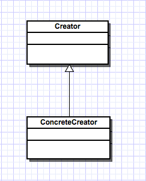

`Participants:`

-    `Creator:` Declares object interface. Returns object.

-    `ConcreteCreator:` Implements object's interface.


## Examples of Creational Design Patterns

There are some 10 examples of creational design patterns exist may be exist more than that as these are patterns for common occuring problems in software engineering:


- `Multiton:` Ensure a class has only named instances, and provide a global point of access to them.

- `Builder pattern:` Separate the construction of a complex object from its representation, allowing the same construction process to create various representations. 

- `Prototype pattern:` Specify the kinds of objects to create using a prototypical instance, and create new objects from the 'skeleton' of an existing object, thus boosting performance and keeping memory footprints to a minimum. 

- `Singleton pattern:` Ensure a class has only one instance, and provide a global point of access to it. 

- `Object pool pattern:` Avoid expensive acquisition and release of resources by recycling objects that are no longer in use. Can be considered a generalisation of connection pool and thread pool patterns. 

- `Factory method pattern:` Define an interface for creating a single object, but let subclasses decide which class to instantiate. Factory Method lets a class defer instantiation to subclasses.

- `Abstract Factory pattern:` Provide an interface for creating families of related or dependent objects without specifying their concrete classes. 

- `Lazy initialization pattern:` Tactic of delaying the creation of an object, the calculation of a value, or some other expensive process until the first time it is needed. This pattern appears in the GoF catalog as "virtual proxy", an implementation strategy for the Proxy pattern.

- `Dependency Injection pattern:` A class accepts the objects it requires from an injector instead of creating the objects directly. 

- `Resource acquisition is initialization (RAII):` Ensure that resources are properly released by tying them to the lifespan of suitable objects. 


## Factory Method Pattern

Factory Method is a creational design pattern that `provides an interface or abstract class` for creating objects in a superclass, `but allows subclasses to alter the type of objects that will be created [IMP.]`. In other words  `subclasses are responsible to create the instance of the class.`

The Factory Method Pattern is also known as `Virtual Constructor`.

Factory method pattern is a design pattern that uses factory methods to deal with the problem of creating objects without having to specify their exact class. Rather than by calling a constructor, this is done by calling a factory method to create an object.


Factory methods can either be specified in an interface and implemented by child classes, or implemented in a base class and optionally overridden by derived classes.

Factory Method Pattern "Define an interface for creating an object, but let subclasses decide which class to instantiate. The Factory method lets a class defer instantiation it uses to subclasses."

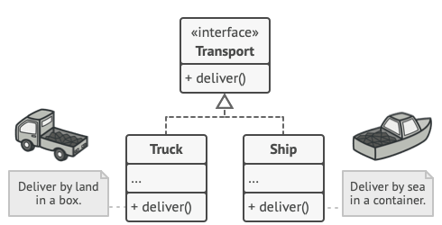


Creating an object often requires complex processes not appropriate to include within a composing object. The object's creation may lead to a significant duplication of code, may require information not accessible to the composing object, may not provide a sufficient level of abstraction, or may otherwise not be part of the composing object's concerns. The factory method design pattern handles these problems by defining a separate method for creating the objects, which subclasses can then override to specify the derived type of product that will be created. 


The factory method pattern relies on inheritance, as object creation is delegated to subclasses that implement the factory method to create objects.


### Which Problems Factory Method Pattern Solves ?

The Factory Method design pattern solves problems like:

- How can an object be created so that subclasses can redefine its subsequent and distinct implementation?
- How can an object's instantiation be deferred to a subclass?

### How Such Problems Factory Method Pattern Solves ?

The Factory Method design pattern describes how to solve such problems: 

- Define a factory method within the superclass that defers the object's creation to a subclass's factory method.
- Create an object by calling a factory method instead of directly calling a constructor.

This enables the writing of subclasses that can change the way an object is created (e.g. by redefining which class to instantiate).


### Structure of Factory Method

A sample UML class diagram for the Factory Method design pattern.

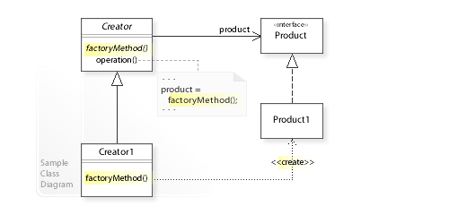

In the above UML class diagram, the Creator class that requires a Product object does not instantiate the Product1 class directly. Instead, the Creator refers to a separate factoryMethod() to create a product object, which makes the Creator independent of which concrete class is instantiated. Subclasses of Creator can redefine which class to instantiate. In this example, the Creator1 subclass implements the abstract factoryMethod() by instantiating the Product1 class. 


### Why Factory Method Pattern ?

The factory method pattern can improve performance by reducing the number of object creations and dependencies, and by enabling lazy initialization and caching of objects. It can also enhance maintainability by decoupling the client code from the concrete classes, and by allowing you to add new types of objects without modifying the existing code. The factory method pattern can also support the principle of open-closed design, which states that software entities should be open for extension but closed for modification.


Factory Method Pattern allows the sub-classes to choose the type of objects to create.

It promotes the `loose-coupling` by eliminating the need to bind application-specific classes into the code. That means the code interacts solely with the resultant interface or abstract class, so that it will work with any classes that implement that interface or that extends that abstract class.


### Why not Factory Method Pattern ?

The factory method pattern can also introduce some drawbacks that can affect performance and maintainability. For example, it can increase the complexity and size of the code, as you need to create a separate factory class or method for each type of object. It can also introduce an extra level of abstraction and indirection, which can make the code harder to understand and debug. Moreover, it can create tight coupling between the factory and the concrete classes, which can make the code less flexible and testable.


### C++ Example

```C++ 
#include <iostream>
#include <memory>

enum ProductId {MINE, YOURS};

// defines the interface of objects the factory method creates.
class Product {
public:
  virtual void print() = 0;
  virtual ~Product() = default;
};

// implements the Product interface.
class ConcreteProductMINE: public Product {
public:
  void print() {
    std::cout << "this=" << this << " print MINE\n";
  }
};

// implements the Product interface.
class ConcreteProductYOURS: public Product {
public:
  void print() {
    std::cout << "this=" << this << " print YOURS\n";
  }
};

// declares the factory method, which returns an object of type Product.
class Creator {
public:
  virtual std::unique_ptr<Product> create(ProductId id) {
    if (ProductId::MINE == id) return std::make_unique<ConcreteProductMINE>();
    if (ProductId::YOURS == id) return std::make_unique<ConcreteProductYOURS>();
    // repeat for remaining products...

    return nullptr;
  }
  virtual ~Creator() = default;
};

int main() {
  // The unique_ptr prevent memory leaks.
  std::unique_ptr<Creator> creator = std::make_unique<Creator>();
  std::unique_ptr<Product> product = creator->create(ProductId::MINE);
  product->print();

  product = creator->create(ProductId::YOURS);
  product->print();
}
```

// The program output is like 

```bash
this=0x6e5e90 print MINE
this=0x6e62c0 print YOURS
```


### JAVA Example

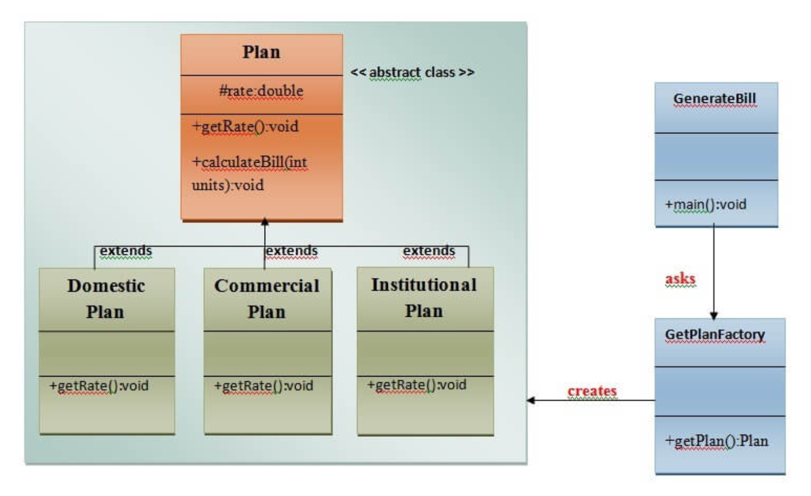

#1 Create a Plan abstract class.

```JAVA
import java.io.*;      
    abstract class Plan{  
             protected double rate;  
             abstract void getRate();  
       
             public void calculateBill(int units){  
                  System.out.println(units*rate);  
              }  
    }//end of Plan class.    
```  

#2 Create the concrete classes that extends Plan abstract class. 

```JAVA
class  DomesticPlan extends Plan{  
        @override  
         public void getRate(){  
             rate=3.50;              
        }  
   }//end of DomesticPlan class.


class  CommercialPlan extends Plan{  
    @override   
    public void getRate(){   
        rate=7.50;  
   }
}   
//end of CommercialPlan class. 

class  InstitutionalPlan extends Plan{  
    @override  
    public void getRate(){   
        rate=5.50;  
   }
}   
//end of InstitutionalPlan class.

```
#3 Create a GetPlanFactory `to generate object of concrete classes based on given information`.

```JAVA
class GetPlanFactory{     
   //use getPlan method to get object of type Plan   
       public Plan getPlan(String planType){  
            if(planType == null){  
             return null;  
            }  
          if(planType.equalsIgnoreCase("DOMESTICPLAN")) {  
                 return new DomesticPlan();  
               }   
           else if(planType.equalsIgnoreCase("COMMERCIALPLAN")){  
                return new CommercialPlan();  
            }   
          else if(planType.equalsIgnoreCase("INSTITUTIONALPLAN")) {  
                return new InstitutionalPlan();  
          }  
      return null;  
   }  
}//end of GetPlanFactory class.
```
#4 Generate Bill by using the GetPlanFactory to get the object of concrete classes by passing an information such as type of plan DOMESTICPLAN or COMMERCIALPLAN or INSTITUTIONALPLAN.

```JAVA
import java.io.*;    
class GenerateBill{  
    public static void main(String args[])throws IOException{  
      GetPlanFactory planFactory = new GetPlanFactory();  
        
      System.out.print("Enter the name of plan for which the bill will be generated: ");  
      BufferedReader br=new BufferedReader(new InputStreamReader(System.in));  
  
      String planName=br.readLine();  
      System.out.print("Enter the number of units for bill will be calculated: ");  
      int units=Integer.parseInt(br.readLine());  
  
      Plan p = planFactory.getPlan(planName);  
      //call getRate() method and calculateBill()method of DomesticPaln.  
  
       System.out.print("Bill amount for "+planName+" of  "+units+" units is: ");  
           p.getRate();  
           p.calculateBill(units);  
            }  
    }//end of GenerateBill class.
```

similar example :: https://www.tutorialspoint.com/design_pattern/factory_pattern.htm


## Abstract Factory Pattern

The Abstract factory pattern in software engineering is a creational design pattern that provides a way to create families of related objects without imposing their concrete classes, by encapsulating a group of individual factories that have a common theme without specifying their concrete classes.

`Abstract factory pattern define as "an interface for creating families of related or dependent objects without specifying their concrete classes."`

That means Abstract Factory lets a class returns a factory of classes. So, this is the reason that Abstract Factory Pattern is one level higher than the Factory Pattern.

An Abstract Factory Pattern is also known as `Kit`. 

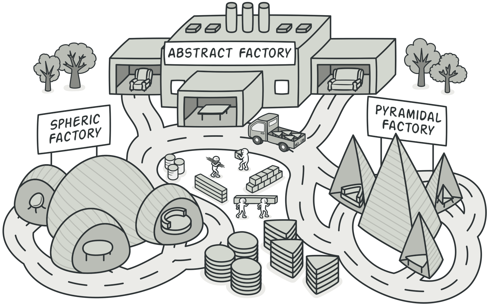

According to this pattern, a client software component creates a concrete implementation of the abstract factory and then uses the generic interface of the factory to create the concrete objects that are part of the family.

The client does not know which concrete objects it receives from each of these internal factories, as it uses only the generic interfaces of their products.

This pattern separates the details of implementation of a set of objects from their general usage and relies on object composition, as object creation is implemented in methods exposed in the factory interface.


### When Abstract Factory Pattern can be apply ?

- When the system needs to be independent of how its object are created, composed, and represented.
- When the family of related objects has to be used together, then this constraint needs to be enforced.
- When you want to provide a library of objects that does not show implementations and only reveals interfaces.
- When the system needs to be configured with one of a multiple family of objects.


### Which Problems Abstract Factory Pattern Solves ?

Creating objects directly within the class that requires the objects is inflexible. Doing so commits the class to particular objects and makes it impossible to change the instantiation later without changing the class. It prevents the class from being reusable if other objects are required, and it makes the class difficult to test because real objects cannot be replaced with mock objects. 

A factory is the location of a concrete class in the code at which objects are constructed. Implementation of the pattern intends to insulate the creation of objects from their usage and to create families of related objects without depending on their concrete classes. This allows for new derived types to be introduced with no change to the code that uses the base class. 

It may be used to solve problems such as:

- How can an application be independent of how its objects are created?
- How can a class be independent of how the objects that it requires are created?
- How can families of related or dependent objects be created?

### How Such Problems Abstract Factory Pattern Solves ?

This makes a class independent of how its objects are created. A class may be configured with a factory object, which it uses to create objects, and the factory object can be exchanged at runtime.

- Encapsulate object creation in a separate (factory) object by defining and implementing an interface for creating objects.
- Delegate object creation to a factory object instead of creating objects directly. 


### Why Abstract Factory Pattern ?

Abstract Factory is a very central design pattern for `Dependency Injection (DI)`.

Here's a list of Stack Overflow questions where application of Abstract Factory has been accepted as the solution.

https://stackoverflow.com/questions/2280170/why-do-we-need-abstract-factory-design-pattern


### Why not Abstract Factory Pattern ?

Use of this pattern enables interchangeable concrete implementations without changing the code that uses them, even at runtime. However, employment of this pattern, as with similar design patterns, may result in `unnecessary complexity` and `extra work in the initial writing of code`. Additionally, higher levels of separation and abstraction can result in systems that are more `difficult to debug and maintain`. 


### Structure of Abstract Factory Pattern

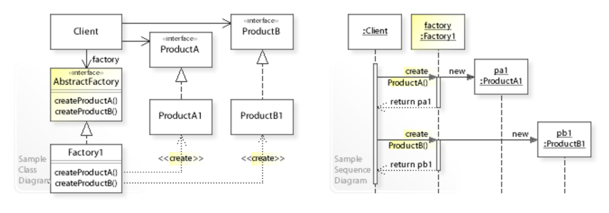


In the above UML class diagram, the Client class that requires ProductA and ProductB objects does not instantiate the ProductA1 and ProductB1 classes directly. Instead, the Client refers to the AbstractFactory interface for creating objects, which makes the Client independent of how the objects are created (which concrete classes are instantiated). The Factory1 class implements the AbstractFactory interface by instantiating the ProductA1 and ProductB1 classes.

The UML sequence diagram shows the runtime interactions. The Client object calls createProductA() on the Factory1 object, which creates and returns a ProductA1 object. Thereafter, the Client calls createProductB() on Factory1, which creates and returns a ProductB1 object. 

- `Variants of Abstract Factory Pattern` 

The original structure of the abstract factory pattern, as defined in 1994 in Design Patterns, is based on abstract classes for the abstract factory and the abstract products to be created. The concrete factories and products are classes that specialize the abstract classes using inheritance.

A more recent structure of the pattern is based on interfaces that define the abstract factory and the abstract products to be created. This design uses native support for interfaces or protocols in mainstream programming languages to avoid inheritance. In this case, the concrete factories and products are classes that realize the interface by implementing it.


### C++ Example

```C++ 
#include <iostream>

enum Direction {North, South, East, West};

class MapSite {
public:
  virtual void enter() = 0;
  virtual ~MapSite() = default;
};

class Room : public MapSite {
public:
  Room() :roomNumber(0) {}
  Room(int n) :roomNumber(n) {}
  void setSide(Direction d, MapSite* ms) {
    std::cout << "Room::setSide " << d << ' ' << ms << '\n';
  }
  virtual void enter() {}
  Room(const Room&) = delete; // rule of three
  Room& operator=(const Room&) = delete;
private:
  int roomNumber;
};

class Wall : public MapSite {
public:
  Wall() {}
  virtual void enter() {}
};

class Door : public MapSite {
public:
  Door(Room* r1 = nullptr, Room* r2 = nullptr)
    :room1(r1), room2(r2) {}
  virtual void enter() {}
  Door(const Door&) = delete; // rule of three
  Door& operator=(const Door&) = delete;
private:
  Room* room1;
  Room* room2;
};

class Maze {
public:
  void addRoom(Room* r) {
    std::cout << "Maze::addRoom " << r << '\n';
  }
  Room* roomNo(int) const {
    return nullptr;
  }
};

class MazeFactory {
public:
  MazeFactory() = default;
  virtual ~MazeFactory() = default;

  virtual Maze* makeMaze() const {
    return new Maze;
  }
  virtual Wall* makeWall() const {
    return new Wall;
  }
  virtual Room* makeRoom(int n) const {
    return new Room(n);
  }
  virtual Door* makeDoor(Room* r1, Room* r2) const {
    return new Door(r1, r2);
  }
};

// If createMaze is passed an object as a parameter to use to create rooms, walls, and doors, then you can change the classes of rooms, walls, and doors by passing a different parameter. This is an example of the Abstract Factory (99) pattern.

class MazeGame {
public:
  Maze* createMaze(MazeFactory& factory) {
    Maze* aMaze = factory.makeMaze();
    Room* r1 = factory.makeRoom(1);
    Room* r2 = factory.makeRoom(2);
    Door* aDoor = factory.makeDoor(r1, r2);
    aMaze->addRoom(r1);
    aMaze->addRoom(r2);
    r1->setSide(North, factory.makeWall());
    r1->setSide(East, aDoor);
    r1->setSide(South, factory.makeWall());
    r1->setSide(West, factory.makeWall());
    r2->setSide(North, factory.makeWall());
    r2->setSide(East, factory.makeWall());
    r2->setSide(South, factory.makeWall());
    r2->setSide(West, aDoor);
    return aMaze;
  }
};

int main() {
  MazeGame game;
  MazeFactory factory;
  game.createMaze(factory);
}
```
//The program output is:

```bash
Maze::addRoom 0x1317ed0
Maze::addRoom 0x1317ef0
Room::setSide 0 0x1318340
Room::setSide 2 0x1317f10
Room::setSide 1 0x1318360
Room::setSide 3 0x1318380
Room::setSide 0 0x13183a0
Room::setSide 2 0x13183c0
Room::setSide 1 0x13183e0
Room::setSide 3 0x1317f10
```

### Java Example

We are going to create a `Bank interface` and a `Loan abstract class` as well as their sub-classes.
Then we will create `AbstractFactory` class as next step.
Then after we will create concrete classes, `BankFactory`, and `LoanFactory` that will extends `AbstractFactory` class
After that, `AbstractFactoryPatternExample` (main function) class uses the `FactoryCreator` to get an object of `AbstractFactory` class. 

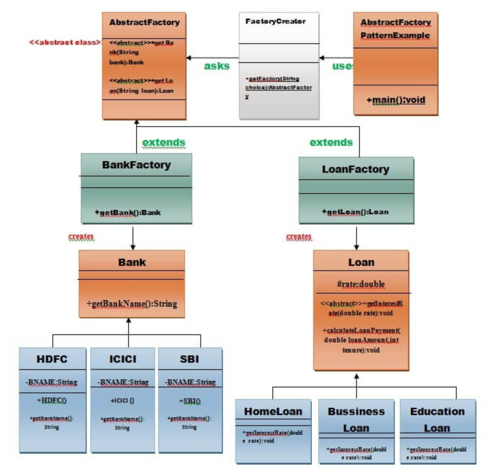

#1 Create a Bank interface

```java
import java.io.*;     
interface Bank{  
        String getBankName();  
}
```

#2 Create concrete classes that implement the Bank interface. 

```java

class HDFC implements Bank{  
             private final String BNAME;  
             public HDFC(){  
                    BNAME="HDFC BANK";  
            }  
            public String getBankName() {  
                      return BNAME;  
            }  
}

class ICICI implements Bank{  
           private final String BNAME;  
           ICICI(){  
                    BNAME="ICICI BANK";  
            }  
            public String getBankName() {  
                      return BNAME;  
           }  
}

class SBI implements Bank{  
      private final String BNAME;  
      public SBI(){  
                BNAME="SBI BANK";  
        }  
       public String getBankName(){  
                  return BNAME;  
       }  
}

```

#3 Create the Loan abstract class.

```java
abstract class Loan{  
   protected double rate;  
   abstract void getInterestRate(double rate);  
   public void calculateLoanPayment(double loanamount, int years)  
   {  
        /* 
              to calculate the monthly loan payment i.e. EMI   
                            
              rate=annual interest rate/12*100; 
              n=number of monthly installments;            
              1year=12 months. 
              so, n=years*12; 
 
            */  
                
         double EMI;  
         int n;  
  
         n=years*12;  
         rate=rate/1200;  
         EMI=((rate*Math.pow((1+rate),n))/((Math.pow((1+rate),n))-1))*loanamount;  
  
System.out.println("your monthly EMI is "+ EMI +" for the amount"+loanamount+" you have borrowed");     
 }  
}// end of the Loan abstract class.
```

#4 Create concrete classes that extend the Loan abstract class.

```java
class HomeLoan extends Loan{  
         public void getInterestRate(double r){  
             rate=r;  
        }  
}//End of the HomeLoan class.  

class BussinessLoan extends Loan{  
    public void getInterestRate(double r){  
          rate=r;  
     }  
  
}//End of the BusssinessLoan class.

class EducationLoan extends Loan{  
     public void getInterestRate(double r){  
       rate=r;  
 }  
}//End of the EducationLoan class.
```

#5 Create an abstract class (i.e AbstractFactory) to get the factories for Bank and Loan Objects.

```java
abstract class AbstractFactory{  
  public abstract Bank getBank(String bank);  
  public abstract Loan getLoan(String loan);  
}
```

#6 Create the factory classes that inherit AbstractFactory class to generate the object of concrete class based on given information.

```java
class BankFactory extends AbstractFactory{  
   public Bank getBank(String bank){  
      if(bank == null){  
         return null;  
      }  
      if(bank.equalsIgnoreCase("HDFC")){  
         return new HDFC();  
      } else if(bank.equalsIgnoreCase("ICICI")){  
         return new ICICI();  
      } else if(bank.equalsIgnoreCase("SBI")){  
         return new SBI();  
      }  
      return null;  
   }  
  public Loan getLoan(String loan) {  
      return null;  
   }  
}//End of the BankFactory class.

class LoanFactory extends AbstractFactory{  
           public Bank getBank(String bank){  
                return null;  
          }  
        
     public Loan getLoan(String loan){  
      if(loan == null){  
         return null;  
      }  
      if(loan.equalsIgnoreCase("Home")){  
         return new HomeLoan();  
      } else if(loan.equalsIgnoreCase("Business")){  
         return new BussinessLoan();  
      } else if(loan.equalsIgnoreCase("Education")){  
         return new EducationLoan();  
      }  
      return null;  
   }  
     
}
```

#7 Create a FactoryCreator class to get the factories by passing an information such as Bank or Loan.

```java
class FactoryCreator {  
     public static AbstractFactory getFactory(String choice){  
      if(choice.equalsIgnoreCase("Bank")){  
         return new BankFactory();  
      } else if(choice.equalsIgnoreCase("Loan")){  
         return new LoanFactory();  
      }  
      return null;  
   }  
}//End of the FactoryCreator.
```
#8 Use the FactoryCreator to get AbstractFactory in order to get factories of concrete classes by passing an information such as type.

```java
import java.io.*;  
class AbstractFactoryPatternExample {  
          public static void main(String args[])throws IOException {  
           
          BufferedReader br=new BufferedReader(new InputStreamReader(System.in));  
      
          System.out.print("Enter the name of Bank from where you want to take loan amount: ");  
          String bankName=br.readLine();  
      
    System.out.print("\n");  
    System.out.print("Enter the type of loan e.g. home loan or business loan or education loan : ");  
      
    String loanName=br.readLine();  
    AbstractFactory bankFactory = FactoryCreator.getFactory("Bank");  
    Bank b=bankFactory.getBank(bankName);  
      
    System.out.print("\n");  
    System.out.print("Enter the interest rate for "+b.getBankName()+ ": ");  
      
    double rate=Double.parseDouble(br.readLine());  
    System.out.print("\n");  
    System.out.print("Enter the loan amount you want to take: ");  
      
    double loanAmount=Double.parseDouble(br.readLine());  
    System.out.print("\n");  
    System.out.print("Enter the number of years to pay your entire loan amount: ");  
    int years=Integer.parseInt(br.readLine());  
      
    System.out.print("\n");  
    System.out.println("you are taking the loan from "+ b.getBankName());  
      
    AbstractFactory loanFactory = FactoryCreator.getFactory("Loan");  
               Loan l=loanFactory.getLoan(loanName);  
               l.getInterestRate(rate);  
               l.calculateLoanPayment(loanAmount,years);  
      }  
}//End of the  AbstractFactoryPatternExample
```   


## Builder Pattern

Builder Pattern allows us to `"construct a complex object from simple objects using step-by-step approach".`

It is mostly used `when object can't be created in single step` like in the `de-serialization of a complex object.`

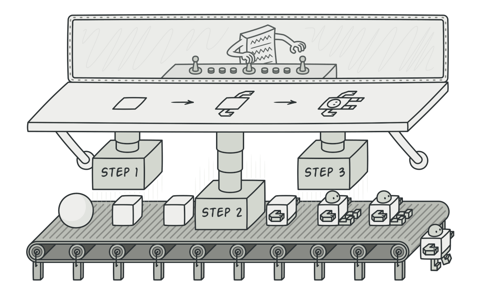

The intent of the Builder design pattern is `to separate the construction of a complex object from its representation`. By doing so, `the same construction process can create different representations.`


### Why Builder Pattern ?

- Allows you to vary a product's internal representation.
- Encapsulates code for construction and representation.
- Provides control over the steps of the construction process.

### Why not Builder Pattern ?

- A distinct ConcreteBuilder must be created for each type of product.
- Builder classes must be mutable.
- May hamper/complicate dependency injection.


### Which Problems Builder Pattern Solves ?

The Builder design pattern solves problems like:

- How can a class (the same construction process) create different representations of a complex object?
- How can a class that includes creating a complex object be simplified?

Creating and assembling the parts of a complex object directly within a class is inflexible. It commits the class to creating a particular representation of the complex object and makes it impossible to change the representation later independently from (without having to change) the class. 

### How Such Problems Builder Pattern Solves ?

The Builder design pattern describes how to solve such problems:

- Encapsulate creating and assembling the parts of a complex object in a separate Builder object.
- A class delegates object creation to a Builder object instead of creating the objects directly.

A class (the same construction process) can delegate to different Builder objects to create different representations of a complex object. 


### When Builder Pattern can be apply ?

Use the Builder pattern when:

- the algorithm for creating a complex object should be
independent of the parts that make up the object and how
they are assembled.

- the construction process must allow different
representations for the object that is constructed.


### Structure of Builder Pattern

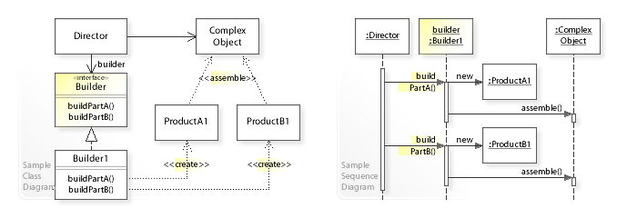

In the above UML class diagram, the `Director` class doesn't create and assemble the `ProductA1` and `ProductB1` objects directly. Instead, the `Director` refers to the `Builder interface` for building (creating and assembling) the parts of a complex object, which makes the `Director` independent of which concrete classes are instantiated (which representation is created). The `Builder1` class implements the `Builder` interface by creating and assembling the `ProductA1` and `ProductB1` objects. 

The UML sequence diagram shows the run-time interactions: The `Director` object calls `buildPartA()` on the `Builder1` object, which creates and assembles the `ProductA1` object. Thereafter, the `Director` calls `buildPartB()` on `Builder1`, which creates and assembles the `ProductB1` object. 

- Class diagram


`Builder :` Abstract interface for creating objects (product).

`ConcreteBuilder :` Provides implementation for Builder. It is an object able to construct other objects. Constructs and assembles parts to build the objects.


### C++ Example

```C++
#include <iostream>
#include <memory>
#include <string>

class Product {
public:
    void set_part_a(std::string const& part_a) {
        part_a_ = part_a;
    }

    void set_part_b(std::string const& part_b) {
        part_b_ = part_b;
    }

    void set_part_c(std::string const& part_c) {
        part_c_ = part_c;
    }

    void show() const {
        std::cout << "Part A: " << part_a_ << "\n";
        std::cout << "Part B: " << part_b_ << "\n";
        std::cout << "Part C: " << part_c_ << "\n";
    }

private:
    std::string part_a_;
    std::string part_b_;
    std::string part_c_;
};

class Builder {
public:
    virtual ~Builder() = default;

    virtual void build_part_a() = 0;
    virtual void build_part_b() = 0;
    virtual void build_part_c() = 0;
    virtual std::unique_ptr<Product> get_product() = 0;
};

class ConcreteBuilder: public Builder {
public:
    ConcreteBuilder(): product_{std::make_unique<Product>()} {}

    void build_part_a() override {
        product_->set_part_a("Part A");
    }

    void build_part_b() override {
        product_->set_part_b("Part B");
    }

    void build_part_c() override {
        product_->set_part_c("Part C");
    }

    std::unique_ptr<Product> get_product() override {
        return std::move(product_);
    }

private:
    std::unique_ptr<Product> product_;
};

class Director {
public:
    void set_builder(std::shared_ptr<Builder> const& builder) {
        builder_ = builder;
    }

    void construct() {
        builder_->build_part_a();
        builder_->build_part_b();
        builder_->build_part_c();
    }

private:
    std::shared_ptr<Builder> builder_;
};

int main() {
    std::shared_ptr<ConcreteBuilder> builder = std::make_shared<ConcreteBuilder>();
    std::shared_ptr<Director> director = std::make_shared<Director>();

    director->set_builder(builder);
   director->construct();

    std::unique_ptr<Product> product = builder->get_product();
    product->show();

    return 0;
}
```

### Java Example

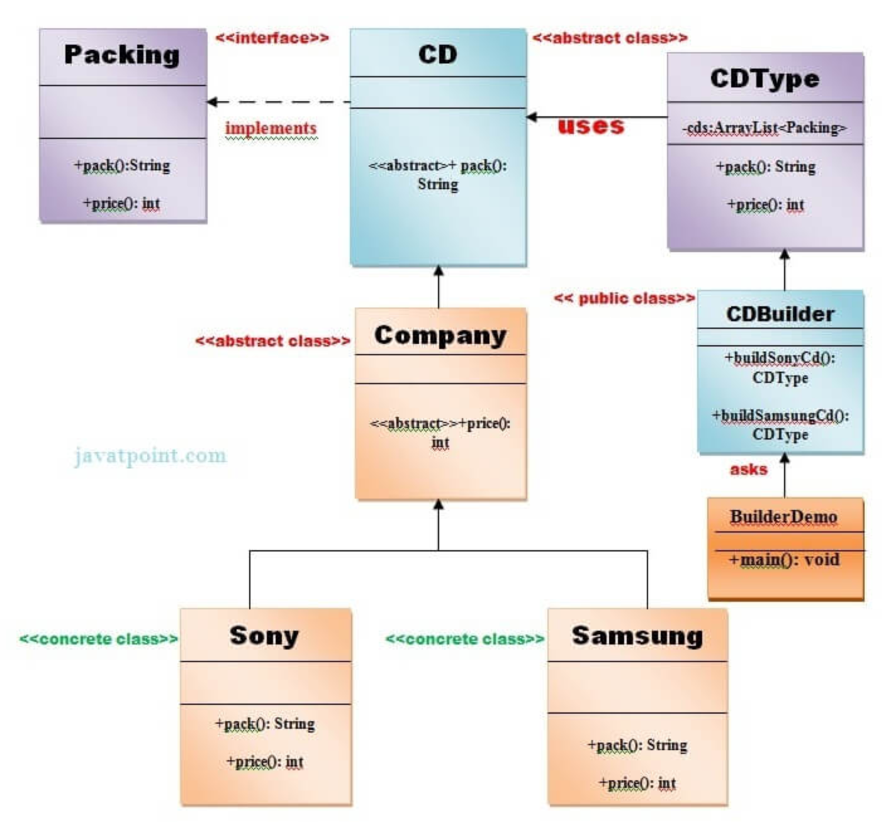


```java

public interface Packing {  
  public String pack();  
  public int price();  
}  

public abstract class CD implements Packing{  
  public abstract String pack();  
} 

public abstract class Company extends CD{  
  public abstract int price();  
} 

public class Sony extends Company{  
    @Override  
        public int price(){   
                        return 20;  
      }  
    @Override  
    public String pack(){  
             return "Sony CD";  
        }         
}//End of the Sony class.


public class Samsung extends Company {  
        @Override  
            public int price(){   
                            return 15;  
        }  
        @Override  
        public String pack(){  
                 return "Samsung CD";  
            }         
}//End of the Samsung class.  


import java.util.ArrayList;  
import java.util.List;  
public class CDType {  
                 private List<Packing> items=new ArrayList<Packing>();  
                 public void addItem(Packing packs) {    
                        items.add(packs);  
                 }  
                 public void getCost(){  
                  for (Packing packs : items) {  
                            packs.price();  
                  }   
                 }  
                 public void showItems(){  
                  for (Packing packing : items){  
                 System.out.print("CD name : "+packing.pack());  
                 System.out.println(", Price : "+packing.price());  
              }       
              }     
}//End of the CDType class.  


public class CDBuilder {  
                      public CDType buildSonyCD(){   
                         CDType cds=new CDType();  
                         cds.addItem(new Sony());  
                         return cds;  
                  }  
                  public CDType buildSamsungCD(){  
                 CDType cds=new CDType();  
                 cds.addItem(new Samsung());  
                 return cds;  
                  }  
}// End of the CDBuilder class.  

public class BuilderDemo{  
     public static void main(String args[]){  
       CDBuilder cdBuilder=new CDBuilder();  
       CDType cdType1=cdBuilder.buildSonyCD();  
       cdType1.showItems();  
      
       CDType cdType2=cdBuilder.buildSamsungCD();  
       cdType2.showItems();  
     }  
}
```  

## Prototype Pattern

`Meaning of Prototype` ::: Prototype is an early sample, model, or release of a product built to test a concept or process.It is a term used in a variety of contexts, including semantics, design, electronics, and software programming.

A prototype is generally used to evaluate a new design to enhance precision by system analysts and users.

Prototyping serves to provide specifications for a real, working system rather than a theoretical one.


`Prototype pattern` is a creational design pattern in software development. It is used when the types of objects to create is determined by a `prototypical instance`, which is cloned to produce new objects.

OR we can say, `cloning of an existing object instead of creating new one and can also be customized as per the requirement.`

`As Copying an object “from the outside” isn’t always possible.`

So, Prototype Pattern `lets us to copy existing objects without making your code dependent on their classes.`

Prototype does not require subclassing, but it does require an "initialize" operation. Factory method requires subclassing, but does not require initialization

This pattern is used to avoid subclasses of an object creator in the client application, like the factory method pattern does, and to avoid the inherent cost of creating a new object in the standard way (e.g., using the 'new' keyword) when it is prohibitively expensive for a given application.

To implement the pattern, the client declares an abstract base class that specifies a pure virtual clone() method. Any class that needs a "polymorphic constructor" capability derives itself from the abstract base class, and implements the clone() operation.

The client, instead of writing code that invokes the "new" operator on a hard-coded class name, calls the clone() method on the prototype, calls a factory method with a parameter designating the particular concrete derived class desired, or invokes the clone() method through some mechanism provided by another design pattern.


The mitotic division of a cell — resulting in two identical cells — is an example of a prototype that plays an active role in copying itself and thus, demonstrates the Prototype pattern. When a cell splits, two cells of identical genotype result. In other words, the cell clones itself.

### Why Prototype Pattern ?

The pattern is useful to remove a bunch of boilerplate code, when the configuration required would be onerous. I think of Prototypes as a preset object, where you save a bunch of state as a new starting point.

- It reduces the need of sub-classing.
- It hides complexities of creating objects.
- The clients can get new objects without knowing which type of object it will be.
- It lets you add or remove objects at runtime.

### Why not Prototype Pattern ?

- Cloning complex objects that have circular references might be very tricky.

i will let you know more once i get some more experince with this pattern...

### Which Problems Prototype Pattern Solves ?

Creating objects directly within the class that requires (uses) the objects is inflexible because it commits the class to particular objects at compile-time and makes it impossible to specify which objects to create at run-time.

- How can objects be created so that which objects to create can be specified at run-time?
- How can dynamically loaded classes be instantiated?

### How Such Problems Prototype Pattern Solves ?

- Define a `Prototype` object that returns a copy of itself.
- Create new objects by copying a `Prototype` object.

This enables configuration of a class with different `Prototype` objects, which are copied to create new objects, and even more, `Prototype` objects can be added and removed at run-time.

### When Prototype Pattern can be apply ?

- When the classes are instantiated at runtime.
- When the cost of creating an object is expensive or complicated.
- When you want to keep the number of classes in an application minimum.
- When the client application needs to be unaware of object creation and representation.

### Structure of Prototype Pattern

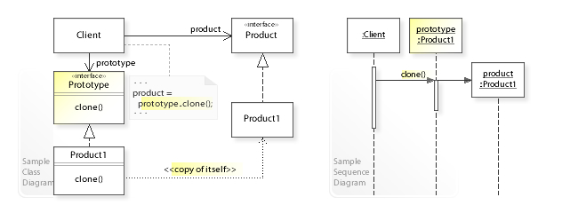

In the above `UML class diagram (LEFT)`, the `Client` class refers to the `Prototype` interface for cloning a `Product`. The `Product1` class implements the `Prototype` interface by creating a copy of itself.

The `UML sequence diagram (RIGHT)` shows the run-time interactions: The `Client` object calls `clone()` on a prototype:`Product1` object, which creates and returns a copy of itself (a product:`Product1` object).

### C++ Example

```C++
#include <iostream>

enum Direction {North, South, East, West};

class MapSite {
public:
  virtual void enter() = 0;
  virtual MapSite* clone() const = 0;
  virtual ~MapSite() = default;
};

class Room : public MapSite {
public:
  Room() :roomNumber(0) {}
  Room(int n) :roomNumber(n) {}
  void setSide(Direction d, MapSite* ms) {
    std::cout << "Room::setSide " << d << ' ' << ms << '\n';
  }
  virtual void enter() {}
  virtual Room* clone() const { // implements an operation for cloning itself.
    return new Room(*this);
  }
  Room& operator=(const Room&) = delete;
private:
  int roomNumber;
};

class Wall : public MapSite {
public:
  Wall() {}
  virtual void enter() {}
  virtual Wall* clone() const {
    return new Wall(*this);
  }
};

class Door : public MapSite {
public:
  Door(Room* r1 = nullptr, Room* r2 = nullptr)
    :room1(r1), room2(r2) {}
  Door(const Door& other)
    :room1(other.room1), room2(other.room2) {}
  virtual void enter() {}
  virtual Door* clone() const {
    return new Door(*this);
  }
  virtual void initialize(Room* r1, Room* r2) {
    room1 = r1;
    room2 = r2;
  }
  Door& operator=(const Door&) = delete;
private:
  Room* room1;
  Room* room2;
};

class Maze {
public:
  void addRoom(Room* r) {
    std::cout << "Maze::addRoom " << r << '\n';
  }
  Room* roomNo(int) const {
    return nullptr;
  }
  virtual Maze* clone() const {
    return new Maze(*this);
  }
  virtual ~Maze() = default;
};

class MazeFactory {
public:
  MazeFactory() = default;
  virtual ~MazeFactory() = default;

  virtual Maze* makeMaze() const {
    return new Maze;
  }
  virtual Wall* makeWall() const {
    return new Wall;
  }
  virtual Room* makeRoom(int n) const {
    return new Room(n);
  }
  virtual Door* makeDoor(Room* r1, Room* r2) const {
    return new Door(r1, r2);
  }
};

class MazePrototypeFactory : public MazeFactory {
public:
  MazePrototypeFactory(Maze* m, Wall* w, Room* r, Door* d)
    :prototypeMaze(m), prototypeRoom(r),
     prototypeWall(w), prototypeDoor(d) {}
  virtual Maze* makeMaze() const {
    // creates a new object by asking a prototype to clone itself.
    return prototypeMaze->clone();
  }
  virtual Room* makeRoom(int) const {
    return prototypeRoom->clone();
  }
  virtual Wall* makeWall() const {
    return prototypeWall->clone();
  }
  virtual Door* makeDoor(Room* r1, Room* r2) const {
    Door* door = prototypeDoor->clone();
    door->initialize(r1, r2);
    return door;
  }
  MazePrototypeFactory(const MazePrototypeFactory&) = delete;
  MazePrototypeFactory& operator=(const MazePrototypeFactory&) = delete;
private:
  Maze* prototypeMaze;
  Room* prototypeRoom;
  Wall* prototypeWall;
  Door* prototypeDoor;
};

// If createMaze is parameterized by various prototypical room, door, and wall objects, which it then copies and adds to the maze, then you can change the maze's composition by replacing these prototypical objects with different ones. This is an example of the Prototype (133) pattern.

class MazeGame {
public:
  Maze* createMaze(MazePrototypeFactory& m) {
    Maze* aMaze = m.makeMaze();
    Room* r1 = m.makeRoom(1);
    Room* r2 = m.makeRoom(2);
    Door* theDoor = m.makeDoor(r1, r2);
    aMaze->addRoom(r1);
    aMaze->addRoom(r2);
    r1->setSide(North, m.makeWall());
    r1->setSide(East, theDoor);
    r1->setSide(South, m.makeWall());
    r1->setSide(West, m.makeWall());
    r2->setSide(North, m.makeWall());
    r2->setSide(East, m.makeWall());
    r2->setSide(South, m.makeWall());
    r2->setSide(West, theDoor);
    return aMaze;
  }
};

int main() {
  MazeGame game;
  MazePrototypeFactory simpleMazeFactory(new Maze, new Wall, new Room, new Door);
  game.createMaze(simpleMazeFactory);
}
```
//Output 

```bash
Maze::addRoom 0x1160f50
Maze::addRoom 0x1160f70
Room::setSide 0 0x11613c0
Room::setSide 2 0x1160f90
Room::setSide 1 0x11613e0
Room::setSide 3 0x1161400
Room::setSide 0 0x1161420
Room::setSide 2 0x1161440
Room::setSide 1 0x1161460
Room::setSide 3 0x1160f90
```

### Java Example

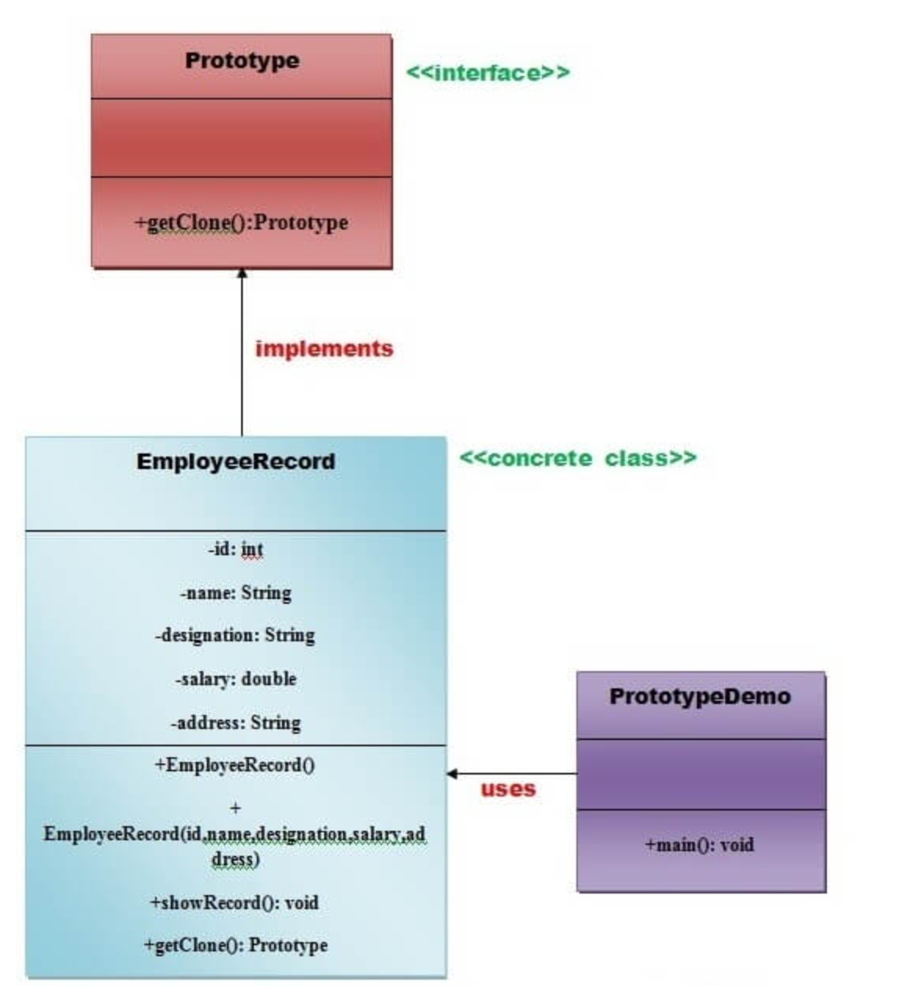

- We are going to create an interface `Prototype` that contains a method `getClone()` of `Prototype` type.

- Then, we create a concrete class `EmployeeRecord` which implements `Prototype` interface that does the cloning of `EmployeeRecord` object.

- `PrototypeDemo` class will uses this concrete class `EmployeeRecord`.


```java
interface Prototype {  
  
     public Prototype getClone();  
      
}//End of Prototype interface.  

class EmployeeRecord implements Prototype{  
      
   private int id;  
   private String name, designation;  
   private double salary;  
   private String address;  
      
   public EmployeeRecord(){  
            System.out.println("   Employee Records of Oracle Corporation ");  
            System.out.println("---------------------------------------------");  
            System.out.println("Eid"+"\t"+"Ename"+"\t"+"Edesignation"+"\t"+"Esalary"+"\t\t"+"Eaddress");  
      
} 

public  EmployeeRecord(int id, String name, String designation, double salary, String address) {  
          
        this();  
        this.id = id;  
        this.name = name;  
        this.designation = designation;  
        this.salary = salary;  
        this.address = address;  
    }  
      
  public void showRecord(){  
          
        System.out.println(id+"\t"+name+"\t"+designation+"\t"+salary+"\t"+address);  
   }  
  
    @Override  
    public Prototype getClone() {  
          
        return new EmployeeRecord(id,name,designation,salary,address);  
    }  
}//End of EmployeeRecord class.  

import java.io.BufferedReader;  
import java.io.IOException;  
import java.io.InputStreamReader;  

class PrototypeDemo{  
     public static void main(String[] args) throws IOException {  
          
        BufferedReader br =new BufferedReader(new InputStreamReader(System.in));  
        System.out.print("Enter Employee Id: ");  
        int eid=Integer.parseInt(br.readLine());  
        System.out.print("\n");  
          
        System.out.print("Enter Employee Name: ");  
        String ename=br.readLine();  
        System.out.print("\n");  
          
        System.out.print("Enter Employee Designation: ");  
        String edesignation=br.readLine();  
        System.out.print("\n");  
          
        System.out.print("Enter Employee Address: ");  
        String eaddress=br.readLine();  
        System.out.print("\n");  
        System.out.print("Enter Employee Salary: ");  
        double esalary= Double.parseDouble(br.readLine());  
        System.out.print("\n");  
           
        EmployeeRecord e1=new EmployeeRecord(eid,ename,edesignation,esalary,eaddress);  
          
        e1.showRecord();  
        System.out.println("\n");  
        EmployeeRecord e2=(EmployeeRecord) e1.getClone();  
        e2.showRecord();  
    }     
}//End of the ProtoypeDemo class.
```  

## Singleton Pattern

Singleton is a creational design pattern that lets us ensure that `a class has only one instance, while providing a global access point to this instance.`

This pattern is useful when exactly one object is needed to coordinate actions across a system.
Clients may not even realize that they’re working with the same object all the time.

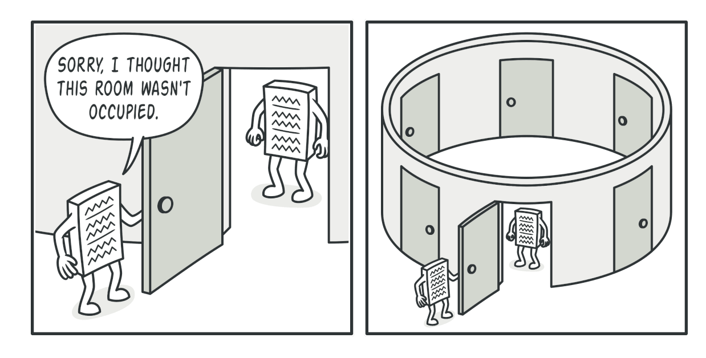

More specifically, the singleton pattern allows objects to:

- Ensure they only have one instance.
- Provide easy access to that instance.
- Control their instantiation (for example, hiding the constructors of a class).


In other words, a class must ensure that only single instance should be created and single object can be used by all other classes.

There are two forms of singleton design pattern

- `Early Instantiation`: creation of instance at load time.Lazy Instantiation
- `Lazy Instantiation`: creation of instance when required.


### Why Singleton Pattern ?

- Saves memory because object is not created at each request. Only single instance is reused again and again.

- Singletons are often preferred to global variables because they do not pollute the global namespace (or their containing namespace). Additionally, they permit lazy allocation and initialization, whereas global variables in many languages will always consume resources.

- The singleton pattern can also be used as a basis for other design patterns, such as the abstract factory, factory method, builder and prototype patterns. Facade objects are also often singletons because only one facade object is required. 

- Logging is a common real-world use case for singletons, because all objects that wish to log messages require a uniform point of access and conceptually write to a single source.

### Why not Singleton Pattern ?

- How many times a class is instantiated shouldn't be dictated by the class itself, but from an infrastructure that provides the single instance. Singleton makes it impossible to leave this decision to the infrastructure. It is a reusability issue, which shows up for instance in the unit tests, but also when the infrastructure tries to provide another instance for a certain purpose.

(E.g. there is only one database connection. But for importing data from another database, it needs another connection. If the database access service would be a singleton, it is impossible to open another connection.)

-  The pattern requires special treatment in a multithreaded environment so that multiple threads won’t create a singleton object several times.

- Singletons are misused and abused by less capable programmers and so everything becomes a singleton and you see code littered with Class::get_instance() references. Generally speaking there are only one or two resources (like a database connection for example) that qualify for use of the Singleton pattern.

- Singletons are essentially static classes, relying on one or more static methods and properties. All things static present real, tangible problems when you try to do Unit Testing because they represent dead ends in your code that cannot be mocked or stubbed. As a result, when you test a class that relies on a Singleton (or any other static method or class) you are not only testing that class but also the static method or class.

- Singleton to be an anti-pattern that introduces global state into an application, often unnecessarily. This introduces a potential dependency on the singleton by other objects, requiring analysis of implementation details to determine whether a dependency actually exists.This increased coupling can introduce difficulties with unit testing. In turn, this places restrictions on any abstraction that uses the singleton, such as preventing concurrent use of multiple instances.

- Singletons also violate the `single-responsibility principle` because they are responsible for enforcing their own uniqueness along with performing their normal functions.


### Which Problems Singleton Pattern Solves ?

### How Such Problems Singleton Pattern Solves ?

### When Singleton Pattern can be apply ?

Singleton pattern is mostly used in `multi-threaded` and `database applications`. It is used in `logging`, `caching`, `thread pools`, `configuration settings` etc.

### Structure of Singleton Pattern


The `Singleton` class declares the static method `getInstance` that returns the same instance of its own class.

The Singleton’s constructor should be hidden from the client code. Calling the getInstance method should be the only way of getting the Singleton object.


Implementations of the singleton pattern ensure that only one instance of the singleton class ever exists and typically provide global access to that instance. 

Typically, this is accomplished by:

- Declaring all constructors of the class to be private, which prevents it from being instantiated by other objects.
- Providing a static method that returns a reference to the instance.

The instance is usually stored as a private static variable; the instance is created when the variable is initialized, at some point before when the static method is first called. 


### C++ Example

```C++
#include <iostream>

class Singleton {
public:
  // defines an class operation that lets clients access its unique instance.
  static Singleton& get() {
    // may be responsible for creating its own unique instance.
    if (nullptr == instance) instance = new Singleton;
    return *instance;
  }
  Singleton(const Singleton&) = delete; // rule of three
  Singleton& operator=(const Singleton&) = delete;
  static void destruct() {
    delete instance;
    instance = nullptr;
  }
  // existing interface goes here
  int getValue() {
    return value;
  }
  void setValue(int value_) {
    value = value_;
  }
private:
  Singleton() = default; // no public constructor
  ~Singleton() = default; // no public destructor
  static Singleton* instance; // declaration class variable
  int value;
};

Singleton* Singleton::instance = nullptr; // definition class variable

int main() {
  Singleton::get().setValue(42);
  std::cout << "value=" << Singleton::get().getValue() << '\n';
  Singleton::destruct();
}
```
// Output

```bash 
value=42
```

### Early Instantiation of Singleton Pattern

In Early Instantiation of Singleton Pattern, we create the instance of the class at the time of declaring the static data member, so instance of the class is created at the time of classloading. 

```java
class A{  
 private static A obj=new A();//Early, instance will be created at load time  
 private A(){}  
   
 public static A getA(){  
  return obj;  
 }  
  
 public void doSomething(){  
 //write your code  
 }  
}
```

### Lazy Instantiation of Singleton Pattern

A singleton implementation may use lazy initialization in which the instance is created when the static method is first invoked. In `multithreaded programs`, this can cause race conditions that result in the creation of multiple instances. The following Java 5+ example is a thread-safe implementation, using lazy initialization with double-checked locking.

In such case, we create the instance of the class in synchronized method or synchronized block, so instance of the class is created when required.

```java
public class Singleton {

    private static volatile Singleton instance = null;

    private Singleton() {}

    public static Singleton getInstance() {
        if (instance == null) {
            synchronized(Singleton.class) {
                if (instance == null) {
                    instance = new Singleton();
                }
            }
        }
        return instance;
    }
}
```

### Java Example

- We are going to create a JDBCSingleton class. This JDBCSingleton class contains its constructor as private and a private static instance jdbc of itself.
- JDBCSingleton class provides a static method to get its static instance to the outside world. Now, JDBCSingletonDemo class will use JDBCSingleton class to get the JDBCSingleton object.

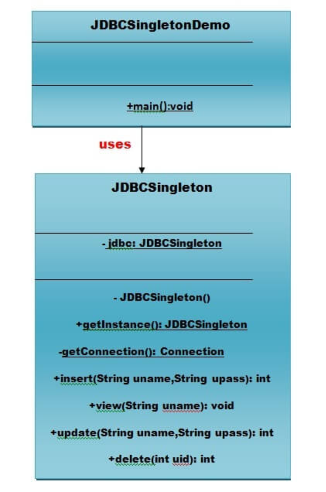

`Assumption`: you have created a table userdata that has three fields uid, uname and upassword in mysql database. Database name is ashwinirajput, username is root, password is ashwini.

- File: `JDBCSingleton.java`

```java
    import java.io.BufferedReader;  
    import java.io.IOException;  
    import java.io.InputStreamReader;  
    import java.sql.Connection;  
    import java.sql.DriverManager;  
    import java.sql.PreparedStatement;  
    import java.sql.ResultSet;  
    import java.sql.SQLException;  
      
    class JDBCSingleton {  
         //Step 1  
          // create a JDBCSingleton class.  
         //static member holds only one instance of the JDBCSingleton class.  
                 
             private static JDBCSingleton jdbc;  
               
         //JDBCSingleton prevents the instantiation from any other class.  
           private JDBCSingleton() {  }  
            
        //Now we are providing gloabal point of access.  
             public static JDBCSingleton getInstance() {    
                                         if (jdbc==null)  
                                       {  
                                                jdbc=new  JDBCSingleton();  
                                       }  
                             return jdbc;  
                 }  
                
       // to get the connection from methods like insert, view etc.   
              private static Connection getConnection()throws ClassNotFoundException, SQLException  
              {  
                    
                  Connection con=null;  
                  Class.forName("com.mysql.jdbc.Driver");  
                  con= DriverManager.getConnection("jdbc:mysql://localhost:3306/ashwanirajput", "root", "ashwani");  
                  return con;  
                    
              }  
                
     //to insert the record into the database   
              public int insert(String name, String pass) throws SQLException  
              {  
                  Connection c=null;  
                    
                  PreparedStatement ps=null;  
                    
                  int recordCounter=0;  
                    
                  try {  
                        
                          c=this.getConnection();  
                          ps=c.prepareStatement("insert into userdata(uname,upassword)values(?,?)");  
                          ps.setString(1, name);  
                          ps.setString(2, pass);  
                          recordCounter=ps.executeUpdate();  
                            
                  } catch (Exception e) { e.printStackTrace(); } finally{  
                        if (ps!=null){  
                          ps.close();  
                      }if(c!=null){  
                          c.close();  
                      }   
                  }  
                 return recordCounter;  
              }  
      
    //to view the data from the database        
          public  void view(String name) throws SQLException  
          {  
                    Connection con = null;  
            PreparedStatement ps = null;  
            ResultSet rs = null;  
                      
                    try {  
                          
                            con=this.getConnection();  
                            ps=con.prepareStatement("select * from userdata where uname=?");  
                            ps.setString(1, name);  
                            rs=ps.executeQuery();  
                            while (rs.next()) {  
                                      System.out.println("Name= "+rs.getString(2)+"\t"+"Paasword= "+rs.getString(3));      
                             
                            }  
                    
              } catch (Exception e) { System.out.println(e);}  
              finally{  
                        if(rs!=null){  
                            rs.close();  
                        }if (ps!=null){  
                          ps.close();  
                      }if(con!=null){  
                          con.close();  
                      }   
                    }  
          }  
            
         // to update the password for the given username  
          public int update(String name, String password) throws SQLException  {  
                  Connection c=null;  
                  PreparedStatement ps=null;  
                    
                  int recordCounter=0;  
                  try {  
                          c=this.getConnection();  
                          ps=c.prepareStatement(" update userdata set upassword=? where uname='"+name+"' ");  
                          ps.setString(1, password);  
                          recordCounter=ps.executeUpdate();  
                  } catch (Exception e) {  e.printStackTrace(); } finally{  
                          
                      if (ps!=null){  
                          ps.close();  
                      }if(c!=null){  
                          c.close();  
                      }   
                   }  
                 return recordCounter;  
              }  
                
    // to delete the data from the database   
             public int delete(int userid) throws SQLException{  
                  Connection c=null;  
                  PreparedStatement ps=null;  
                  int recordCounter=0;  
                  try {  
                           c=this.getConnection();  
                          ps=c.prepareStatement(" delete from userdata where uid='"+userid+"' ");  
                          recordCounter=ps.executeUpdate();  
                  } catch (Exception e) { e.printStackTrace(); }   
                  finally{  
                  if (ps!=null){  
                          ps.close();  
                 }if(c!=null){  
                          c.close();  
                  }   
               }  
                 return recordCounter;  
              }  
     }// End of JDBCSingleton class 
     
``` 
- File: `JDBCSingletonDemo.java`

 ```java
    import java.io.BufferedReader;  
    import java.io.IOException;  
    import java.io.InputStreamReader;  
    import java.sql.Connection;  
    import java.sql.DriverManager;  
    import java.sql.PreparedStatement;  
    import java.sql.ResultSet;  
    import java.sql.SQLException;  

    class JDBCSingletonDemo{  
        static int count=1;  
        static int  choice;  
        public static void main(String[] args) throws IOException {  
              
            JDBCSingleton jdbc= JDBCSingleton.getInstance();  
              
              
            BufferedReader br=new BufferedReader(new InputStreamReader(System.in));  
       do{   
            System.out.println("DATABASE OPERATIONS");  
            System.out.println(" --------------------- ");  
            System.out.println(" 1. Insertion ");  
            System.out.println(" 2. View      ");  
            System.out.println(" 3. Delete    ");  
            System.out.println(" 4. Update    ");  
            System.out.println(" 5. Exit      ");  
              
            System.out.print("\n");  
            System.out.print("Please enter the choice what you want to perform in the database: ");  
              
            choice=Integer.parseInt(br.readLine());  
            switch(choice) {  
                  
               case 1:{  
                        System.out.print("Enter the username you want to insert data into the database: ");  
                        String username=br.readLine();  
                        System.out.print("Enter the password you want to insert data into the database: ");  
                        String password=br.readLine();  
                          
                        try {  
                                int i= jdbc.insert(username, password);  
                                if (i>0) {  
                                System.out.println((count++) + " Data has been inserted successfully");  
                                }else{  
                                    System.out.println("Data has not been inserted ");      
                                }  
                              
                            } catch (Exception e) {  
                              System.out.println(e);  
                            }  
                          
                         System.out.println("Press Enter key to continue...");  
                         System.in.read();  
                           
                       }//End of case 1  
                       break;  
                case 2:{  
                        System.out.print("Enter the username : ");  
                        String username=br.readLine();  
                   
                        try  {  
                                jdbc.view(username);  
                             } catch (Exception e) {  
                              System.out.println(e);  
                            }  
                         System.out.println("Press Enter key to continue...");  
                         System.in.read();  
                           
                       }//End of case 2  
                      break;  
                 case 3:{  
                         System.out.print("Enter the userid,  you want to delete: ");  
                         int userid=Integer.parseInt(br.readLine());  
                 
                         try {  
                                int i= jdbc.delete(userid);  
                                if (i>0) {  
                                System.out.println((count++) + " Data has been deleted successfully");  
                                }else{  
                                    System.out.println("Data has not been deleted");      
                                }  
                              
                             } catch (Exception e) {  
                              System.out.println(e);  
                             }  
                         System.out.println("Press Enter key to continue...");  
                         System.in.read();  
                           
                        }//End of case 3  
                       break;  
                 case 4:{  
                        System.out.print("Enter the username,  you want to update: ");  
                        String username=br.readLine();  
                        System.out.print("Enter the new password ");  
                        String password=br.readLine();  
                          
                        try {  
                                int i= jdbc.update(username, password);  
                                if (i>0) {  
                                System.out.println((count++) + " Data has been updated successfully");  
                                }  
                              
                            } catch (Exception e) {  
                              System.out.println(e);  
                            }  
                         System.out.println("Press Enter key to continue...");  
                         System.in.read();  
                          
                       }// end of case 4  
                     break;  
                       
                 default:  
                         return;  
            }  
              
           } while (choice!=4);   
       }  
    }    
```  

## Object Pool Pattern

Object pool pattern is a creational design pattern that uses a set of initialized objects kept ready to use – a "pool" – rather than allocating and destroying them on demand. A client of the pool will request an object from the pool and perform operations on the returned object. When the client has finished, it returns the object to the pool rather than destroying it; this can be done manually or automatically. 

`The Pooling pattern describes how expensive acquisition and release of resources can be avoided by recycling the resources no longer needed.`


Object pools are primarily used for performance: in some circumstances, object pools significantly improve performance. Object pools complicate object lifetime, as objects obtained from and returned to a pool are not actually created or destroyed at this time, and thus require care in implementation. 

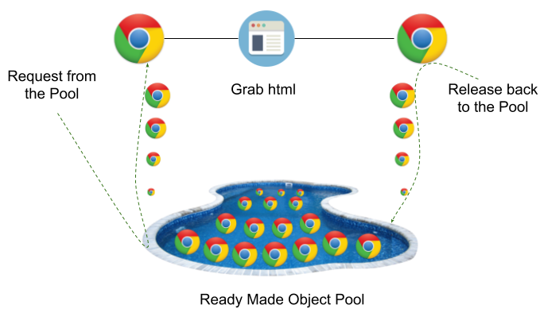

The object pool design pattern creates a set of objects that may be reused. When a new object is needed, it is requested from the pool. If a previously prepared object is available, it is returned immediately, avoiding the instantiation cost. If no objects are present in the pool, a new item is created and returned. When the object has been used and is no longer needed, it is returned to the pool, allowing it to be used again in the future without repeating the computationally expensive instantiation process. It is important to note that once an object has been used and returned, existing references will become invalid. 

In some object pools the resources are limited, so a maximum number of objects is specified. If this number is reached and a new item is requested, an exception may be thrown, or the thread will be blocked until an object is released back into the pool. 

The object pool design pattern is used in several places in the standard classes of the .NET Framework. One example is the .NET Framework Data Provider for SQL Server. As SQL Server database connections can be slow to create, a pool of connections is maintained. Closing a connection does not actually relinquish the link to SQL Server. Instead, the connection is held in a pool, from which it can be retrieved when requesting a new connection. This substantially increases the speed of making connections. 

// To know more about pooling visit

http://www.kircher-schwanninger.de/michael/publications/Pooling.pdf


### Why Object Pool Pattern ?

- Object pooling can offer a significant performance boost in situations where the cost of initializing a class instance is high and the rate of instantiation and destruction of a class is high – in this case objects can frequently be reused, and each reuse saves a significant amount of time. Object pooling requires resources – memory and possibly other resources, such as network sockets, and thus it is preferable that the number of instances in use at any one time is low, but this is not required. 

- The pooled object is obtained in predictable time when creation of the new objects (especially over network) may take variable time. These benefits are mostly true for objects that are expensive with respect to time, such as database connections, socket connections, threads and large graphic objects like fonts or bitmaps. 

- In other situations, simple object pooling (that hold no external resources, but only occupy memory) may not be efficient and could decrease performance. In case of simple memory pooling, the slab allocation memory management technique is more suited, as the only goal is to minimize the cost of memory allocation and deallocation by reducing fragmentation. 

### Why not Object Pool Pattern ?

- `Shared resource = locking; potential bottleneck` ::: If the pool is used by multiple threads, it may need the means to prevent parallel threads from trying to reuse the same object in parallel. This is not necessary if the pooled objects are immutable or otherwise thread-safe. 

- `Data Leaks` ::: Inadequate resetting of objects can cause information leaks. Objects containing confidential data (e.g. a user's credit card numbers) must be cleared before being passed to new clients, otherwise, the data may be disclosed to an unauthorized party. 

- `Violates GC(garbage collector)'s expectations of object lifetimes (most objects will be shortlived).` ::: Some publications do not recommend using object pooling with certain languages, such as Java, especially for objects that only use memory and hold no external resources (such as connections to database). Opponents usually say that object allocation is relatively fast in modern languages with garbage collectors; while the operator `new` needs only ten instructions, the classic `new` - `delete` pair found in pooling designs requires hundreds of them as it does more complex work. Also, most garbage collectors scan "live" object references, and not the memory that these objects use for their content. This means that any number of "dead" objects without references can be discarded with little cost. In contrast, keeping a large number of "live" but unused objects increases the duration of garbage collection.

- `Stale state` ::: may not always be an issue; it becomes dangerous when it causes the object to behave unexpectedly. For example, an object representing authentication details may fail if the "successfully authenticated" flag is not reset before it is reused, since it indicates that a user is authenticated (possibly as someone else) when they are not. However, failing to reset a value used only for debugging, such as the identity of the last authentication server used, may pose no issues.

Care must be taken to ensure the state of the objects returned to the pool is reset back to a sensible state for the next use of the object, otherwise the object may be in a state unexpected by the client, which may cause it to fail. The pool is responsible for resetting the objects, not the clients. Object pools full of objects with dangerously stale state are sometimes called object cesspools and regarded as an `anti-pattern`.

// About Stale state

Stale state is information in an object that does not reflect reality.

Example: an object's members are filled with information from a database, but the underlying data in the database has changed since the object was filled.

Dangerously stale state is stale state that might adversely affect the operation of a program, i.e. causing it to perform incorrectly due to invalid assumptions about the data's integrity.


### Which Problems Object Pool Pattern Solves ?

- `Network Connections` ::: Network connections may be managed using the Object Pool Design Pattern. It is preferable to reuse existing connections from a pool rather than having to create new ones every time one is required. This may enhance the application's functionality while lightening the burden on the network server.

- `Database Connections` ::: Database connections using the Object Pool Design Pattern. It is preferable to reuse existing connections from a pool rather than having to create new ones every time a database connection is required. This can enhance application performance while lightening the burden on the database server.

- `Thread Pools` ::: Developers working with Java programs should embrace the object pool design pattern as a means of managing thread pools efficiently. Rather than recreating each required thread as needed well-strategized usage relies on reusing pre-existing ones available in a designated work group. As a result, it encourages optimal application performance by keeping overheads low for threading creation and termination processes driven by this structure's efficiencies.

- `Image Processing` ::: When tackling intensive image processing tasks in a Java based program implementing the Object Pool Design Pattern is worth considering. By utilizing pre-existing objects from a dedicated pool you can speed up your apps performance while reducing overall computing requirements for photo editing tasks.

- `File System Operations` ::: If you're confronted with demanding image processing duties in a Java application, it's worthwhile to take into account applying the Object Pool Design Pattern. This technique makes use of existing items from a specific pool to enhance your program's output speed, and lessens the overall computational resources required for editing photographs.

### How Such Problems Object Pool Pattern Solves ?

...

### When Object Pool Pattern can be apply ?

- When it is necessary to work with numerous objects that are particularly expensive to instantiate and each object is only needed for a short period of time, the performance of an entire application may be adversely affected. An object pool design pattern may be deemed desirable in cases such as these.
- The frequency of creating further objects is also high.
- The number of objects in use is small.

### Structure of Object Pool Pattern

The UML diagram clearly shows that Object pool class is the singleton, because there is a `getInstance()` method that creates an object in the class. The method `acquireReusable()`, that is responsible for creating the object and saving it to the pool as a used object. The method `releaseReusable()`, which is responsible for releasing the object from the client, and inserting it into the objects available for use in Pula, but already unused, in practical examples this will be better explained.

And the last method that is responsible for the maximum number of available objects in the pool.
And of course, the client that calls the getInstance() method to create an Object Pool instance. Then, using the `acquireReusable()` method, it creates an object and writes it to the pool.

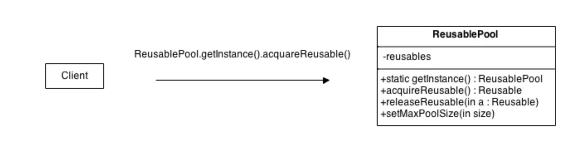


### Go Example

The following Go code initializes a resource pool of a specified size (concurrent initialization) to avoid resource race issues through channels, and in the case of an empty pool, sets timeout processing to prevent clients from waiting too long. 

```go
// package pool
package pool

import (
	"errors"
	"log"
	"math/rand"
	"sync"
	"time"
)

const getResMaxTime = 3 * time.Second

var (
	ErrPoolNotExist  = errors.New("pool not exist")
	ErrGetResTimeout = errors.New("get resource time out")
)

//Resource
type Resource struct {
	resId int
}

//NewResource Simulate slow resource initialization creation
// (e.g., TCP connection, SSL symmetric key acquisition, auth authentication are time-consuming)
func NewResource(id int) *Resource {
	time.Sleep(500 * time.Millisecond)
	return &Resource{resId: id}
}

//Do Simulation resources are time consuming and random consumption is 0~400ms
func (r *Resource) Do(workId int) {
	time.Sleep(time.Duration(rand.Intn(5)) * 100 * time.Millisecond)
	log.Printf("using resource #%d finished work %d finish\n", r.resId, workId)
}

//Pool based on Go channel implementation, to avoid resource race state problem
type Pool chan *Resource

//New a resource pool of the specified size
// Resources are created concurrently to save resource initialization time
func New(size int) Pool {
	p := make(Pool, size)
	wg := new(sync.WaitGroup)
	wg.Add(size)
	for i := 0; i < size; i++ {
		go func(resId int) {
			p <- NewResource(resId)
			wg.Done()
		}(i)
	}
	wg.Wait()
	return p
}

//GetResource based on channel, resource race state is avoided and resource acquisition timeout is set for empty pool
func (p Pool) GetResource() (r *Resource, err error) {
	select {
	case r := <-p:
		return r, nil
	case <-time.After(getResMaxTime):
		return nil, ErrGetResTimeout
	}
}

//GiveBackResource returns resources to the resource pool
func (p Pool) GiveBackResource(r *Resource) error {
	if p == nil {
		return ErrPoolNotExist
	}
	p <- r
	return nil
}

// package main
package main

import (
	"github.com/tkstorm/go-design/creational/object-pool/pool"
	"log"
	"sync"
)

func main() {
	// Initialize a pool of five resources,
	// which can be adjusted to 1 or 10 to see the difference
	size := 5
	p := pool.New(size)

	// Invokes a resource to do the id job
	doWork := func(workId int, wg *sync.WaitGroup) {
		defer wg.Done()
		// Get the resource from the resource pool
		res, err := p.GetResource()
		if err != nil {
			log.Println(err)
			return
		}
		// Resources to return
		defer p.GiveBackResource(res)
		// Use resources to handle work
		res.Do(workId)
	}

	// Simulate 100 concurrent processes to get resources from the asset pool
	num := 100
	wg := new(sync.WaitGroup)
	wg.Add(num)
	for i := 0; i < num; i++ {
		go doWork(i, wg)
	}
	wg.Wait()
}
```

### Java Example

There are Different Algorithms of Object Pool Design.

Using a list as its foundation, this technique facilitates building of a standard object pool that stores objects until they have been completely produced before inclusion in the collection. Whenever access to an item becomes necessary, the system peruses the pool in search possible options that can be used. If an option proves accessible then it will suffice; but if none do, then creating another new item becomes imperative.


```java
import java.util.ArrayList;
import java.util.List;

public class ObjectPool<T> {
   private List<T> pool;
    
   public ObjectPool(List<T> pool) {
      this.pool = pool;
   }
    
   public synchronized T getObject() {
      if (pool.size() > 0) {
         return pool.remove(0);
      } else {
         return createObject();
      }
   }
    
   public synchronized void releaseObject(T obj) {
      pool.add(obj);
   }
    
   private T createObject() {
      T obj = null;
      // create object code here
      return obj;
   }
    
   public static void main(String[] args) {
      List<String> pool = new ArrayList<String>();
      pool.add("Object 1");
      pool.add("Object 2");
        
      ObjectPool<String> objectPool = new ObjectPool<String>(pool);
        
      String obj1 = objectPool.getObject();
      String obj2 = objectPool.getObject();
        
      System.out.println("Object 1: " + obj1);
      System.out.println("Object 2: " + obj2);
        
      objectPool.releaseObject(obj1);
      objectPool.releaseObject(obj2);
        
      String obj3 = objectPool.getObject();
      String obj4 = objectPool.getObject();
        
      System.out.println("Object 3: " + obj3);
      System.out.println("Object 4: " + obj4);
   }
}
```
// Output
```bash
Object 1: Object 1
Object 2: Object 2
Object 3: Object 1
Object 4: Object 2
```

## Dependency Injection

Dependency injection is a programming technique in which an object or function receives other objects or functions that it requires, as opposed to creating them internally. 

Dependency injection aims to separate the concerns of constructing objects and using them, leading to `loosely coupled programs`.

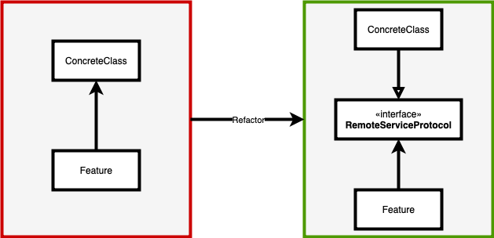

The pattern ensures that an object or function that wants to use a given service should not have to know how to construct those services. Instead, the receiving 'client' (object or function) is provided with its dependencies by external code (an 'injector'), which it is not aware of.

Dependency injection is often used to keep code in-line with the `dependency inversion principle`.

In statically typed languages using dependency injection means a client only needs to declare the interfaces of the services it uses, rather than their concrete implementations, making it easier to change which services are used at runtime without recompiling. 


### Types of Dependency Injection

There are three main ways in which a client can receive injected services:

- `Constructor injection`, where dependencies are provided through a client's class constructor.

The most common form of dependency injection is for a class to request its dependencies through its constructor. This ensures the client is always in a valid state, since it cannot be instantiated without its necessary dependencies. 

```java
public class Client {
    private Service service;

    // The dependency is injected through a constructor.
    Client(Service service) {
        if (service == null) {
            throw new IllegalArgumentException("service must not be null");
        }
        this.service = service;
    }
}
```

- `Setter injection`, where the client exposes a setter method which accepts the dependency.

By accepting dependencies through a setter method, rather than a constructor, clients can allow injectors to manipulate their dependencies at any time. This offers flexibility, but makes it difficult to ensure that all dependencies are injected and valid before the client is used. 

```java
public class Client {
    private Service service;

    // The dependency is injected through a setter method.
    public void setService(Service service) {
        if (service == null) {
            throw new IllegalArgumentException("service must not be null");
        }
        this.service = service;
    }
}
```

- `Interface injection`, where the dependency's interface provides an injector method that will inject the dependency into any client passed to it.

With interface injection, dependencies are completely ignorant of their clients, yet still send and receive references to new clients. 

In this way, the dependencies become injectors. The key is that the injecting method is provided through an interface. 

An assembler is still needed to introduce the client and its dependencies. The assembler takes a reference to the client, casts it to the setter interface that sets that dependency, and passes it to that dependency object which in turn passes a reference to itself back to the client. 

For interface injection to have value, the dependency must do something in addition to simply passing back a reference to itself. This could be acting as a factory or sub-assembler to resolve other dependencies, thus abstracting some details from the main assembler. It could be reference-counting so that the dependency knows how many clients are using it. If the dependency maintains a collection of clients, it could later inject them all with a different instance of itself. 


```java
public interface ServiceSetter {
    void setService(Service service);
}

public class Client implements ServiceSetter {
    private Service service;

    @Override
    public void setService(Service service) {
        if (service == null) {
            throw new IllegalArgumentException("service must not be null");
        }
        this.service = service;
    }
}

public class ServiceInjector {
	private final Set<ServiceSetter> clients = new HashSet<>();

	public void inject(ServiceSetter client) {
		this.clients.add(client);
		client.setService(new ExampleService());
	}

	public void switch() {
		for (Client client : this.clients) {
			client.setService(new AnotherExampleService());
		}
	}
}

public class ExampleService implements Service {}

public class AnotherExampleService implements Service {}
```

The simplest way of implementing dependency injection is to manually arrange services and clients, typically done at the program's root, where execution begins. 

```java
public class Program {

    public static void main(String[] args) {
        // Build the service.
        Service service = new ExampleService();

        // Inject the service into the client.
        Client client = new Client(service);

        // Use the objects.
        System.out.println(client.greet());
    }	
}
```


### Without Dependency Injection

Dependency injections are useful to create loosely coupled programs. If Dependency Injection not exists in a class it will lead Hard coupling of software. so any changes made on one software peice of code will reflect on anyother hard coupled software. 

In the following Java example, the `Client` class contains a `Service` member variable initialized in the constructor. The client directly constructs and controls which service it uses, creating a hard-coded dependency. 

```java
public class Client {
    private Service service;

    Client() {
        // The dependency is hard-coded.
        this.service = new ExampleService();
    }
}
```


### Why Dependency Injection Pattern ?

- A basic benefit of dependency injection is `decreased coupling between classes and their dependencies`. By removing a client's knowledge of how its dependencies are implemented, programs become more reusable, testable and maintainable.

This also results in `increased flexibility`: a client may act on anything that supports the intrinsic interface the client expects.

More generally, dependency injection `reduces boilerplate code`, since all dependency creation is handled by a singular component.


- Dependency injection allows `concurrent development`. Two developers can independently develop classes that use each other, while only needing to know the interface the classes will communicate through. Plugins are often developed by third-parties that never even talk to developers of the original product.


- Many of dependency injection's benefits are particularly relevant to `unit-testing`.
For example, dependency injection can be used to externalize a system's configuration details into configuration files, allowing the system to be reconfigured without recompilation. Separate configurations can be written for different situations that require different implementations of components.

Similarly, because dependency injection does not require any change in code behavior, it can be applied to legacy code as a refactoring. This makes clients more independent and are easier to unit test in isolation, using stubs or mock objects, that simulate other objects not under test. 

This ease of testing is often the first benefit noticed when using dependency injection.


### Why not Dependency Injection Pattern ?

Critics of dependency injection argue that it: 

- Creates clients that demand configuration details, which can be onerous when obvious defaults are available.

- Makes code difficult to trace because it separates behavior from construction.

- Typically implemented with reflection or dynamic programming, hindering IDE automation.

- Typically requires more upfront development effort.

- Encourages dependence on a framework.

### Which Problems Dependency Injection Pattern Solves ?

Dependency injection makes implicit dependencies explicit and helps solve the following problems:

- How can a class be independent from the creation of the objects it depends on?

- How can an application, and the objects it uses support different configurations?


### Go Example

Go does not support classes and usually dependency injection is either abstracted by a dedicated library that utilizes reflection or generics (the latter being supported since Go 1.18 . A simpler example without using dependency injection libraries is illustrated by the following example of an MVC web application. 

First, pass the necessary dependencies to a router and then from the router to the controllers: 

```go
package router

import (
	"database/sql"
	"net/http"

	"example/controllers/users"

	"github.com/go-chi/chi/v5"
	"github.com/go-chi/chi/v5/middleware"

	"github.com/redis/go-redis/v9"
	"github.com/rs/zerolog"
)

type RoutingHandler struct {
	// passing the values by pointer further down the call stack
	// means we won't create a new copy, saving memory
	log    *zerolog.Logger
	db     *sql.DB
	cache  *redis.Client
	router chi.Router
}

// connection, logger and cache initialized usually in the main function
func NewRouter(
	log *zerolog.Logger,
	db *sql.DB,
	cache *redis.Client,
) (r *RoutingHandler) {
	rtr := chi.NewRouter()

	return &RoutingHandler{
		log:    log,
		db:     db,
		cache:  cache,
		router: rtr,
	}
}

func (r *RoutingHandler) SetupUsersRoutes() {
	uc := users.NewController(r.log, r.db, r.cache)

	r.router.Get("/users/:name", func(w http.ResponseWriter, r *http.Request) {
		uc.Get(w, r)
	})
}
```

Then, you can access the private fields of the struct in any method that is it's pointer receiver, without violating encapsulation. 

```go
package users

import (
	"database/sql"
	"net/http"

	"example/models"

	"github.com/go-chi/chi/v5"
	"github.com/redis/go-redis/v9"
	"github.com/rs/zerolog"
)

type Controller struct {
	log     *zerolog.Logger
	storage models.UserStorage
	cache   *redis.Client
}

func NewController(log *zerolog.Logger, db *sql.DB, cache *redis.Client) *Controller {
	return &Controller{
		log:     log,
		storage: models.NewUserStorage(db),
		cache:   cache,
	}
}

func (uc *Controller) Get(w http.ResponseWriter, r *http.Request) {
	// note that we can also wrap logging in a middleware, this is for demonstration purposes
	uc.log.Info().Msg("Getting user")

	userParam := chi.URLParam(r, "name")

	var user *models.User
	// get the user from the cache
	err := uc.cache.Get(r.Context(), userParam).Scan(&user)
	if err != nil {
		uc.log.Error().Err(err).Msg("Error getting user from cache. Retrieving from SQL storage")
	}

	user, err = uc.storage.Get(r.Context(), "johndoe")
	if err != nil {
		uc.log.Error().Err(err).Msg("Error getting user from SQL storage")
		http.Error(w, "Internal server error", http.StatusInternalServerError)
		return
	}
}
```

Finally you can use the database connection initialized in your main function at the data access layer: 

```go
package models

import (
"database/sql"
"time"
)

type (
	UserStorage struct {
		conn *sql.DB
	}

	User struct {
		Name     string `json:"name" db:"name,primarykey"`
		JoinedAt time.Time `json:"joined_at" db:"joined_at"`
		Email    string `json:"email" db:"email"`
	}
)

func NewUserStorage(conn *sql.DB) *UserStorage {
	return &UserStorage{
		conn: conn,
	}
}

func (us *UserStorage) Get(name string) (user *User, err error) {
	// assuming 'name' is a unique key
	query := "SELECT * FROM users WHERE name = $1"

	if err := us.conn.QueryRow(query, name).Scan(&user); err != nil {
		return nil, err
	}

	return user, nil
}
```

## Lazy initialization Pattern

Lazy initialization is the tactic of `delaying the creation of an object`, the calculation of a value, or some other expensive process until the first time it is needed. It is a kind of lazy evaluation that refers specifically to the instantiation of objects or other resources.

This is typically accomplished by augmenting an accessor method (or property getter) to check whether a private member, acting as a cache, has already been initialized. If it has, it is returned straight away. If not, a new instance is created, placed into the member variable, and returned to the caller just-in-time for its first use. 

If objects have properties that are rarely used, this can improve startup speed. Mean average program performance may be slightly worse in terms of memory (for the condition variables) and execution cycles (to check them), but the impact of object instantiation is spread in time ("amortized") rather than concentrated in the startup phase of a system, and thus median response times can be greatly improved. 

In multithreaded code, access to lazy-initialized objects/state must be synchronized to guard against race conditions. 

lazy initialization is often used together with a `factory method pattern`. This combines three ideas: 

- Using a factory method to create instances of a class (factory method pattern).

- Storing the instances in a map, and returning the same instance to each request for an instance with same parameters (multiton pattern).

- Using lazy initialization to instantiate the object the first time it is requested (lazy initialization pattern).


### When Lazy initialization Pattern can be apply ?

Lazy Initialization is a performance optimization where you defer (potentially expensive) object creation until just before you actually need it.

One good example is to not create a database connection up front, but only just before you need to get data from the database.

The key reason for doing this is that (often) you can avoid creating the object completely if you never need it.


### C++ Example

```C++
#include <iostream>
#include <map>
#include <string>

class Fruit {
 public:
  static Fruit* GetFruit(const std::string& type);
  static void PrintCurrentTypes();

 private:
  // Note: constructor private forcing one to use static |GetFruit|.
  Fruit(const std::string& type) : type_(type) {}

  static std::map<std::string, Fruit*> types;

  std::string type_;
};

// static
std::map<std::string, Fruit*> Fruit::types;

// Lazy Factory method, gets the |Fruit| instance associated with a certain
// |type|.  Creates new ones as needed.
Fruit* Fruit::GetFruit(const std::string& type) {
  auto [it, inserted] = types.emplace(type, nullptr);
  if (inserted) {
    it->second = new Fruit(type);
  }
  return it->second;
}

// For example purposes to see pattern in action.
void Fruit::PrintCurrentTypes() {
  std::cout << "Number of instances made = " << types.size() << std::endl;
  for (const auto& [type, fruit] : types) {
    std::cout << type << std::endl;
  }
  std::cout << std::endl;
}

int main() {
  Fruit::GetFruit("Banana");
  Fruit::PrintCurrentTypes();

  Fruit::GetFruit("Apple");
  Fruit::PrintCurrentTypes();

  // Returns pre-existing instance from first time |Fruit| with "Banana" was
  // created.
  Fruit::GetFruit("Banana");
  Fruit::PrintCurrentTypes();
}
```

// OUTPUT:

```bash
Number of instances made = 1
Banana

Number of instances made = 2
Apple
Banana

Number of instances made = 2
Apple
Banana
```


### Java Example

```java
import java.util.HashMap;
import java.util.Map;
import java.util.Map.Entry;

public class Program {

    /**
     * @param args
     */
    public static void main(String[] args) {
        Fruit.getFruitByTypeName(FruitType.banana);
        Fruit.showAll();
        Fruit.getFruitByTypeName(FruitType.apple);
        Fruit.showAll();
        Fruit.getFruitByTypeName(FruitType.banana);
        Fruit.showAll();
    }
}

enum FruitType {
    none,
    apple,
    banana,
}

class Fruit {

    private static Map<FruitType, Fruit> types = new HashMap<>();
    
    /**
     * Using a private constructor to force the use of the factory method.
     * @param type
     */
    private Fruit(FruitType type) {
    }
    
    /**
     * Lazy Factory method, gets the Fruit instance associated with a certain
     * type. Instantiates new ones as needed.
     * @param type Any allowed fruit type, e.g. APPLE
     * @return The Fruit instance associated with that type.
     */
    public static Fruit getFruitByTypeName(FruitType type) {
        Fruit fruit;
                // This has concurrency issues.  Here the read to types is not synchronized, 
                // so types.put and types.containsKey might be called at the same time.
                // Don't be surprised if the data is corrupted.
        if (!types.containsKey(type)) {
            // Lazy initialisation
            fruit = new Fruit(type);
            types.put(type, fruit);
        } else {
            // OK, it's available currently
            fruit = types.get(type);
        }
        
        return fruit;
    }
    
    /**
     * Lazy Factory method, gets the Fruit instance associated with a certain
     * type. Instantiates new ones as needed. Uses double-checked locking 
     * pattern for using in highly concurrent environments.
     * @param type Any allowed fruit type, e.g. APPLE
     * @return The Fruit instance associated with that type.
     */
    public static Fruit getFruitByTypeNameHighConcurrentVersion(FruitType type) {
        if (!types.containsKey(type)) {
            synchronized (types) {
                // Check again, after having acquired the lock to make sure
                // the instance was not created meanwhile by another thread
                if (!types.containsKey(type)) {
                    // Lazy initialisation
                    types.put(type, new Fruit(type));
                }
            }
        }
        
        return types.get(type);
    }
    
    /**
     * Displays all entered fruits.
     */
    public static void showAll() {
        if (types.size() > 0) {
 
           System.out.println("Number of instances made = " + types.size());
            
            for (Entry<FruitType, Fruit> entry : types.entrySet()) {
                String fruit = entry.getKey().toString();
                fruit = Character.toUpperCase(fruit.charAt(0)) + fruit.substring(1);
                System.out.println(fruit);
            }
            
            System.out.println();
        }
    }
}
```
//Output

```bash
Number of instances made = 1
Banana

Number of instances made = 2
Banana
Apple

Number of instances made = 2
Banana
Apple
```


## Resource acquisition is initialization (RAII) Pattern

Resource acquisition is initialization (RAII) is a `programming idiom` used in several object-oriented, statically typed programming languages to describe a particular language behavior.

`"Resource acquisition is initialization" literally means is that when an object is constructed (initialized), it acquires some resource (such as a memory allocation or a lock). In other words, it says you should only ever acquire a resource, by initializing some object whose destructor will release it.`

This is important to stress because it's a departure from C coding style, where you acquire resources by whatever means a particular API provides (for example `malloc()`, `accept()`, or `pthread_mutex_lock()`), and release them by explicitly calling the corresponding function (for example `free()`, `close()`, `pthread_mutex_unlock()`). The presence of exceptions in C++ makes this approach fairly unworkable. Even in C it results in some tedious code that every use of the API has to write out, and every user has to ensure that control always passes through that code after they're finished using the resource.

But the important part of the pattern is that when the object is destroyed, it releases that resource. It doesn't actually matter whether you acquire the resource by initializing the object, or by doing something else with the object after it has been initialized. And people will still refer to an object as a "RAII object" when there are operations other than initialization that generate the resource(s) managed by the RAII object.

So, don't worry too much about the "acquisition is initialization" in "RAII", because anyway it's slightly misleading.

In RAII, holding a resource is a class invariant, and is tied to object lifetime. 

Ensure efficient Java resource management by tying the resource lifecycle to object lifetime, utilizing the RAII pattern.

`The principle that objects own resources is also known as "resource acquisition is initialization," or RAII.`

Resource allocation (or acquisition) is done during object creation (specifically initialization), by the constructor, while resource deallocation (release) is done during object destruction (specifically finalization), by the destructor.

In other words, resource acquisition must succeed for initialization to succeed. 

Thus the resource is guaranteed to be held between when initialization finishes and finalization starts (holding the resources is a class invariant), and to be held only when the object is alive. 

Thus if there are no object leaks, there are no resource leaks. 

For example :::     In a car rental service, each car represents a resource. Using the RAII pattern, when a customer rents a car (acquires the resource), the car is marked as rented. When the customer returns the car (the object goes out of scope), the car is automatically made available for the next customer. This ensures that cars are properly managed and available without manual intervention for checking availability or returns.

The RAII pattern allows for exception-safe resource management, ensuring robust handling of critical resources.

### Why Resource acquisition is initialization (RAII) Pattern ?

The advantages of RAII as a resource management technique are that it provides `encapsulation`, `exception safety (for stack resources)`, and `locality (it allows acquisition and release logic to be written next to each other)`.

- `Encapsulation` is provided because resource management logic is defined once in the class, not at each call site.

- `Exception safety` is provided for stack resources (resources that are released in the same scope as they are acquired) by tying the resource to the lifetime of a stack variable (a local variable declared in a given scope): if an exception is thrown, and proper exception handling is in place, the only code that will be executed when exiting the current scope are the destructors of objects declared in that scope.

- `Locality of definition` is provided by writing the constructor and destructor definitions next to each other in the class definition. 


Resource management therefore needs to be tied to the lifespan of suitable objects in order to gain automatic allocation and reclamation.

Resources are acquired during initialization, when there is no chance of them being used before they are available, and released with the destruction of the same objects, which is guaranteed to take place even in case of errors.


// RAII Comparasion with Java `finally` clause

Comparing RAII with the `finally` construct used in Java, Stroustrup wrote that “In realistic systems, there are far more resource acquisitions than kinds of resources, so the 'resource acquisition is initialization' technique leads to less code than use of a 'finally' construct.”

The `finally` clause is used in C#/Java `to handle resource disposal` in case of scope exit (either through a return or a thrown exception).


### Why not Resource acquisition is initialization (RAII) Pattern ?

RAII only works for resources acquired and released (directly or indirectly) by stack-allocated objects, where there is a well-defined static object lifetime.

Heap-allocated objects which themselves acquire and release resources are common in many languages, including C++. RAII depends on heap-based objects to be implicitly or explicitly deleted along all possible execution paths, in order to trigger its resource-releasing destructor (or equivalent).

This can be achieved by using `smart pointers` to manage all heap objects, with weak pointers for cyclically referenced objects. 

- Jonathan Blow explained how use of RAII can cause `memory fragmentation` which in turn can cause cache misses and a 100 times or worse hit on performance.

- In C++, `stack unwinding` is only guaranteed to occur if the exception is caught somewhere. This is because "If no matching handler is found in a program, the function terminate() is called; whether or not the stack is unwound before this call to terminate() is implementation-defined (15.5.1)." (C++03 standard, §15.3/9). This behavior is usually acceptable, since the operating system releases remaining resources like memory, files, sockets, etc. at program termination.


### Usages of Resource acquisition is initialization (RAII) Pattern

- The RAII design is often used for controlling mutex locks in `multi-threaded applications`. In that use, the object releases the lock when destroyed.

// Without RAII 

In this scenario the potential for deadlock would be high and the logic to lock the mutex would be far from the logic to unlock it. 

// With RAII

the code that locks the mutex essentially includes the logic that the lock will be released when execution leaves the scope of the RAII object. 


- `Interacting with files :`  We could have an object that represents a file that is open for writing, wherein the file is opened in the constructor and closed when execution leaves the object's scope.

In both cases, RAII ensures only that the resource in question is released appropriately; care must still be taken to maintain exception safety. 

If the code modifying the data structure or file is not exception-safe, the mutex could be unlocked or the file closed with the data structure or file corrupted. 


- `Ownership of dynamically allocated objects (memory allocated with new in C++)` can also be controlled with RAII, such that the object is released when the RAII (stack-based) object is destroyed. 

For this purpose, the C++11 standard library defines the smart pointer classes `std::unique_ptr` for single-owned objects and `std::shared_ptr` for objects with shared ownership. 

Similar classes are also available through `std::auto_ptr` in C++98, and `boost::shared_ptr` in the `Boost libraries`. 

-  `Network resources using RAII ` In this case, the RAII object would send a message to a socket at the end of the constructor, when its initialization is completed. it would also send a message at the beginning of the destructor, when the object is about to be destroyed.

Such a construct might be used in a client object to establish a connection with a server running in another process. 


### C++ Example

Unlike managed languages, C++ doesn't have automatic garbage collection, an internal process that releases heap memory and other resources as a program runs. 

A C++ program is responsible for returning all acquired resources to the operating system. Failure to release an unused resource is called a leak. 

Leaked resources are unavailable to other programs until the process exits. Memory leaks in particular are a common cause of bugs in C-style programming.

Modern C++ avoids using heap memory as much as possible by declaring objects on the stack.
When a resource is too large for the stack, then it should be owned by an object. As the object gets initialized, it acquires the resource it owns.

The object is then responsible for releasing the resource in its destructor. The owning object itself is declared on the stack. 

When a resource-owning stack object goes out of scope, its destructor is automatically invoked. In this way, garbage collection in C++ is closely related to object lifetime, and is deterministic.

A resource is always released at a known point in the program, which you can control. Only deterministic destructors like those in C++ can handle memory and non-memory resources equally.

There are 3 ways in C++ exists Creation & Deallocation of Memories.

#### When Object Owns No Resourses

The following example shows a simple object `w`. It's declared on the stack at function scope, and is destroyed at the end of the function block. The object `w` owns no resources (such as heap-allocated memory). Its only member `g` is itself declared on the stack, and simply goes out of scope along with `w`. No special code is needed in the widget destructor.

```C++
class widget {
private:
    gadget g;   // lifetime automatically tied to enclosing object
public:
    void draw();
};

void functionUsingWidget () {
    widget w;   // lifetime automatically tied to enclosing scope
                // constructs w, including the w.g gadget member
    // ...
    w.draw();
    // ...
} // automatic destruction and deallocation for w and w.g
  // automatic exception safety,
  // as if "finally { w.dispose(); w.g.dispose(); }"
```

#### When Object Owns Resourses (Destructor)

In the following example, `w` owns a memory resource and so must have code in its `destructor` to delete the memory.

```C++
class widget
{
private:
    int* data;
public:
    widget(const int size) { data = new int[size]; } // acquire
    ~widget() { delete[] data; } // release
    void do_something() {}
};

void functionUsingWidget() {
    widget w(1000000);  // lifetime automatically tied to enclosing scope
                        // constructs w, including the w.data member
    w.do_something();

} // automatic destruction and deallocation for w and w.data
```

#### When Object Owns Resourses (Smart Pointer) 

Since C++ 11, there's a better way to Resourses Management: by using a `smart pointer` from the standard library. 
The smart pointer handles the allocation and deletion of the memory it owns.

Using a smart pointer eliminates the need for an explicit destructor in the `widget` class.

```C++
#include <memory>
class widget
{
private:
    std::unique_ptr<int[]> data;
public:
    widget(const int size) { data = std::make_unique<int[]>(size); }
    void do_something() {}
};

void functionUsingWidget() {
    widget w(1000000);  // lifetime automatically tied to enclosing scope
                        // constructs w, including the w.data gadget member
    // ...
    w.do_something();
    // ...
} // automatic destruction and deallocation for w and w.data
```
By using smart pointers for memory allocation, you may eliminate the potential for memory leaks.
This model works for other resources, such as file handles or sockets.

You can manage your own resources in a similar way in your classes. For more information About Smart Pointer visit ::: https://learn.microsoft.com/en-us/cpp/cpp/smart-pointers-modern-cpp?view=msvc-170

### When Resource acquisition is initialization (RAII) Pattern can be apply ?

- Implement RAII in applications to manage essential resources such as file handles, network connections, and memory seamlessly.

- Suitable in environments where deterministic resource management is crucial, such as real-time systems or applications with strict resource constraints.


## Multiton Pattern

Multiton pattern is a design pattern which generalizes the `singleton pattern`. 

Multiton also known as  `Registry of Singletons`.

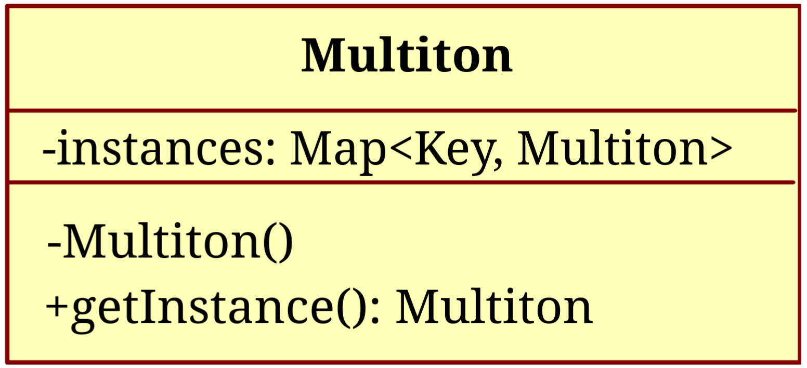

Whereas the singleton allows only one instance of a class to be created, the multiton pattern `allows for the controlled creation of multiple instances`, which it manages through the use of a map. 

Rather than having a single instance per application (e.g. the `java.lang.Runtime` object in the Java programming language) the multiton pattern instead ensures a `single instance per key`.


### Structure of Multiton Pattern 

Multiton is a `hash table` with `synchronized` access there are two important distinctions.

- First, the multiton does not allow clients to add mappings.

- Secondly, the multiton never returns a null or empty reference; instead, it creates and stores a multiton instance on the first request with the associated key. 

Subsequent requests with the same key return the original instance.

A hash table is merely an implementation detail and not the only possible approach.
The pattern simplifies retrieval of shared objects in an application. 

Since the object pool is created only once, being a member associated with the class (instead of the instance), the multiton retains its flat behavior rather than evolving into a tree structure. 


### Why Multiton Pattern ?

- The multiton is unique in that it provides `centralized access` to a single directory (i.e. all keys are in the same namespace, per se) of multitons, where each multiton instance in the pool may exist having its own state. In this manner, the pattern advocates indexed storage of essential objects for the system (such as would be provided by an LDAP system, for example).

- A multiton is limited to wide use by a single system rather than a myriad of distributed systems.


### Why not Multiton Pattern ?
 
- This pattern, like the Singleton pattern, makes `unit testing` far more difficult, as it introduces global state into an application. 

- With garbage collected languages it may become a source of `memory leaks` as it introduces global strong references to the objects. 


### C++ Example

```C++
#ifndef INCLUDED_MULTITON_HPP
#define INCLUDED_MULTITON_HPP

#include <map>
#include <string>

/*
    Multiton pattern template. It's similar to the singleton pattern, but
    enables multiple instances through the use of keys.
    NOTE: Manual destruction must be done before program exit. Not thread-safe.
    
    class Foo : public Multiton<Foo> {};
    Foo &foo = Foo::getRef("foobar");
    foo.bar();
    Foo::destroyAll();
 */

template <typename T, typename Key = std::string>
class Multiton
{
public:
    static void destroyAll()
    {
        for (auto it = instances.begin(); it != instances.end(); ++it)
            delete (*it).second;
        instances.clear();
    }
    
    static void destroy(const Key &key)
    {
        auto it = instances.find(key);
        
        if (it != instances.end()) {
            delete (*it).second;
            instances.erase(it);
        }
    }

    static T* getPtr(const Key &key)
    {
        const auto it = instances.find(key);
        
        if (it != instances.end())
            return (T*)(it->second);
        
        T* instance = new T;
        instances[key] = instance;
        return instance;
    }
    
    static T& getRef(const Key &key)
    {
        return *getPtr(key);
    }
    
protected:
    Multiton();
    ~Multiton();
    
private:
    Multiton(const Multiton&);
    Multiton& operator=(const Multiton&);
    
    static std::map<Key, T*> instances;
};

template <typename T, typename Key>
std::map<Key, T*> Multiton<T, Key>::instances;

#endif
```


### Java Example


```Java
public enum NazgulName {

    KHAMUL, MURAZOR, DWAR, JI_INDUR, AKHORAHIL, HOARMURATH, ADUNAPHEL, REN, UVATHA
}

public final class Nazgul {

    private static final Map<NazgulName, Nazgul> nazguls;

    @Getter
    private final NazgulName name;

    static {
        nazguls = new ConcurrentHashMap<>();
        nazguls.put(NazgulName.KHAMUL, new Nazgul(NazgulName.KHAMUL));
        nazguls.put(NazgulName.MURAZOR, new Nazgul(NazgulName.MURAZOR));
        nazguls.put(NazgulName.DWAR, new Nazgul(NazgulName.DWAR));
        nazguls.put(NazgulName.JI_INDUR, new Nazgul(NazgulName.JI_INDUR));
        nazguls.put(NazgulName.AKHORAHIL, new Nazgul(NazgulName.AKHORAHIL));
        nazguls.put(NazgulName.HOARMURATH, new Nazgul(NazgulName.HOARMURATH));
        nazguls.put(NazgulName.ADUNAPHEL, new Nazgul(NazgulName.ADUNAPHEL));
        nazguls.put(NazgulName.REN, new Nazgul(NazgulName.REN));
        nazguls.put(NazgulName.UVATHA, new Nazgul(NazgulName.UVATHA));
    }

    private Nazgul(NazgulName name) {
        this.name = name;
    }

    public static Nazgul getInstance(NazgulName name) {
        return nazguls.get(name);
    }
}

public static void main(String[] args) {
    // eagerly initialized multiton
    LOGGER.info("Printing out eagerly initialized multiton contents");
    LOGGER.info("KHAMUL={}", Nazgul.getInstance(NazgulName.KHAMUL));
    LOGGER.info("MURAZOR={}", Nazgul.getInstance(NazgulName.MURAZOR));
    LOGGER.info("DWAR={}", Nazgul.getInstance(NazgulName.DWAR));
    LOGGER.info("JI_INDUR={}", Nazgul.getInstance(NazgulName.JI_INDUR));
    LOGGER.info("AKHORAHIL={}", Nazgul.getInstance(NazgulName.AKHORAHIL));
    LOGGER.info("HOARMURATH={}", Nazgul.getInstance(NazgulName.HOARMURATH));
    LOGGER.info("ADUNAPHEL={}", Nazgul.getInstance(NazgulName.ADUNAPHEL));
    LOGGER.info("REN={}", Nazgul.getInstance(NazgulName.REN));
    LOGGER.info("UVATHA={}", Nazgul.getInstance(NazgulName.UVATHA));

    // enum multiton
    LOGGER.info("Printing out enum-based multiton contents");
    LOGGER.info("KHAMUL={}", NazgulEnum.KHAMUL);
    LOGGER.info("MURAZOR={}", NazgulEnum.MURAZOR);
    LOGGER.info("DWAR={}", NazgulEnum.DWAR);
    LOGGER.info("JI_INDUR={}", NazgulEnum.JI_INDUR);
    LOGGER.info("AKHORAHIL={}", NazgulEnum.AKHORAHIL);
    LOGGER.info("HOARMURATH={}", NazgulEnum.HOARMURATH);
    LOGGER.info("ADUNAPHEL={}", NazgulEnum.ADUNAPHEL);
    LOGGER.info("REN={}", NazgulEnum.REN);
    LOGGER.info("UVATHA={}", NazgulEnum.UVATHA);
}
```
//Output

```bash
15:16:10.597 [main] INFO com.iluwatar.multiton.App -- Printing out eagerly initialized multiton contents
15:16:10.600 [main] INFO com.iluwatar.multiton.App -- KHAMUL=com.iluwatar.multiton.Nazgul@4141d797
15:16:10.600 [main] INFO com.iluwatar.multiton.App -- MURAZOR=com.iluwatar.multiton.Nazgul@38cccef
15:16:10.600 [main] INFO com.iluwatar.multiton.App -- DWAR=com.iluwatar.multiton.Nazgul@5679c6c6
15:16:10.600 [main] INFO com.iluwatar.multiton.App -- JI_INDUR=com.iluwatar.multiton.Nazgul@27ddd392
15:16:10.600 [main] INFO com.iluwatar.multiton.App -- AKHORAHIL=com.iluwatar.multiton.Nazgul@19e1023e
15:16:10.600 [main] INFO com.iluwatar.multiton.App -- HOARMURATH=com.iluwatar.multiton.Nazgul@7cef4e59
15:16:10.600 [main] INFO com.iluwatar.multiton.App -- ADUNAPHEL=com.iluwatar.multiton.Nazgul@64b8f8f4
15:16:10.600 [main] INFO com.iluwatar.multiton.App -- REN=com.iluwatar.multiton.Nazgul@2db0f6b2
15:16:10.600 [main] INFO com.iluwatar.multiton.App -- UVATHA=com.iluwatar.multiton.Nazgul@3cd1f1c8
15:16:10.600 [main] INFO com.iluwatar.multiton.App -- Printing out enum-based multiton contents
15:16:10.601 [main] INFO com.iluwatar.multiton.App -- KHAMUL=KHAMUL
15:16:10.601 [main] INFO com.iluwatar.multiton.App -- MURAZOR=MURAZOR
15:16:10.601 [main] INFO com.iluwatar.multiton.App -- DWAR=DWAR
15:16:10.601 [main] INFO com.iluwatar.multiton.App -- JI_INDUR=JI_INDUR
15:16:10.601 [main] INFO com.iluwatar.multiton.App -- AKHORAHIL=AKHORAHIL
15:16:10.601 [main] INFO com.iluwatar.multiton.App -- HOARMURATH=HOARMURATH
15:16:10.601 [main] INFO com.iluwatar.multiton.App -- ADUNAPHEL=ADUNAPHEL
15:16:10.601 [main] INFO com.iluwatar.multiton.App -- REN=REN
15:16:10.601 [main] INFO com.iluwatar.multiton.App -- UVATHA=UVATHA
```


### C# Example

```c#
using System;
using System.Collections.Generic;

public enum MultitonType
{
    Zero,
    One,
    Two
}

public class Multiton
{
    private static readonly Dictionary<MultitonType, Multiton> instances =
        new Dictionary<MultitonType, Multiton>();

    private MultitonType type;

    private Multiton(MultitonType type)
    {
        this.type = type;
    }

    public static Multiton GetInstance(MultitonType type)
    {
        // Lazy init (not thread safe as written)
        // Recommend using Double Check Locking if needdil ka haal sune dilwalaing thread safety
        if (!instances.TryGetValue(type, out var instance))
        {
            instance = new Multiton(type);

            instances.Add(type, instance);
        }

        return instance;
    }

    public override string ToString()
    {
        return "My type is " + this.type;
    }

    // Sample usage
    public static void Main()
    {
        var m0 = Multiton.GetInstance(MultitonType.Zero);
        var m1 = Multiton.GetInstance(MultitonType.One);
        var m2 = Multiton.GetInstance(MultitonType.Two);

        Console.WriteLine(m0);
        Console.WriteLine(m1);
        Console.WriteLine(m2);
    }
}
```


# Structural Design Patterns

Structural design patterns are concerned with how classes and objects can be composed, to form larger structures.

The structural design patterns `simplifies the structure by identifying the relationships`.

It concerned with how classes and objects are composed to form larger structures.

These patterns focus on, how the classes inherit from each other and how they are composed from other classes.

Structural class patterns use inheritance to compose interfaces or implementations.

As a simple example, consider how multiple inheritance mixes two or more classes into one. The result is a class that combines the properties of its parent classes. This pattern is particularly useful for making independently developed class libraries work together.

So,structural design patterns ease the design `by identifying a simple way to realize relationships among entities`.


## Examples of Structural Design Patterns

- `Adapter pattern`: 'adapts' one interface for a class into one that a client expects.
      - Adapter pipeline: Use multiple adapters for debugging purposes.
      - Retrofit Interface Pattern: An adapter used as a new interface for multiple classes at the same time.

- `Aggregate pattern`: a version of the Composite pattern with methods for aggregation of children.

- `Bridge pattern`: decouple an abstraction from its implementation so that the two can vary independently.
      - Tombstone: An intermediate "lookup" object contains the real location of an object.

- `Composite pattern`: a tree structure of objects where every object has the same interface

- `Decorator pattern`: add additional functionality to an object at runtime where subclassing would result in an exponential rise of new classes.

- `Delegation pattern` : Extend a class by composition instead of subclassing. The object handles a request by delegating to a second object (the delegate). 

- `Extensibility pattern`: a.k.a. Framework - hide complex code behind a simple interface

- `Facade pattern`: create a simplified interface of an existing interface to ease usage for common tasks.

- `Flyweight pattern`: a large quantity of objects share a common properties object to save space.

- `Marker pattern`: an empty interface to associate metadata with a class.

- `Module pattern` : Group several related elements, such as classes, singletons, methods, globally used, into a single conceptual entity. 

- `Front controller pattern` : The pattern relates to the design of Web applications. It provides a centralized entry point for handling requests. 

- `Pipes and filters`: a chain of processes where the output of each process is the input of the next.

- `Opaque pointer`: a pointer to an undeclared or private type, to hide implementation details.

- `Twin pattern` : Twin allows modeling of multiple inheritance in programming languages that do not support this feature.  

- `Proxy pattern`: a class functioning as an interface to another thing.


## Adapter Design Pattern 

Adapter is a structural design pattern that allows objects with incompatible interfaces to collaborate.


Also known as `wrapper`, an alternative naming shared with the decorator pattern that allows the interface of an existing class to be used as another interface.

It is often used to make existing classes work with others without modifying their source code. 

In other words, to provide the interface according to client requirement while using the services of a class with a different interface.

Adapter Pattern. In general, an adapter makes one interface (the adaptee's) conform to another, thereby providing a uniform abstraction of different interfaces. 

A class adapter accomplishes this by inheriting privately from an adaptee class. The adapter then expresses its interface in terms of the adaptee's.

An example is an adapter that converts the interface of a Document Object Model of an XML document into a tree structure that can be displayed.


### Why Adapter Design Pattern ?

Adapter pattern is used when you want to adapt an existing class's interface to another interface that a client expects to work with. It usually just involves delegation or translation from a method of one interface to the corresponding method of the other.

- It allows two or more previously incompatible objects to interact.
- It allows reusability of existing functionality.


### Which Problems Adapter Design Pattern Solves ?

The adapter design pattern solves problems like:

- How can a class be reused that does not have an interface that a client requires?
- How can classes that have incompatible interfaces work together?
- How can an alternative interface be provided for a class?

### How Such Problems Adapter Design Pattern Solves ?

The adapter design pattern describes how to solve such problems: 

- Define a separate `adapter` class that converts the (incompatible) interface of a class (`adaptee`) into another interface (`target`) clients require.

- Work through an `adapter` to work with (reuse) classes that do not have the required interface.

The key idea in this pattern is to work through a separate `adapter` that adapts the interface of an (already existing) class without changing it.

Clients don't know whether they work with a target class directly or through an `adapter` with a class that does not have the `target` interface. 


### When Adapter Design Pattern can be apply ?

- When an object needs to utilize an existing class with an incompatible interface.

- When you want to create a reusable class that cooperates with classes which don't have compatible interfaces.

- When you want to create a reusable class that cooperates with classes which don't have compatible interfaces.


### Real World Example of Adapter Design Pattern

For the most part, all DVRs have the same basic functionality: start recording from a certain video source; stop recording; start playback from a certain time; stop playback, etc.

Every DVR manufacturer provided a software library, allowing us to write code to control their device (for sake of this discussion, I'll refer to it as the SDK). Even though every SDK provided APIs for all the basic functionality, none of them were quite the same. Here's a very rough example, but you get the idea:

- `BeginPlayback(DateTime startTime);`
- `StartPlayback(long startTimeTicks);`
- `Playback(string startDate, string startTime);`

Our software needed to be able to interact with all DVRs. So instead of writing horrible switch/cases for each different SDK, we created our own common IDVRController interface, and wrote all of our system code to that interface:

`Playback(DateTime startTime);`

We then wrote a different adapter implementation for each SDK, all of which implemented our IDVRController interface. We used a config file to specify the type of DVR the system would connect to, and a Factory pattern to instantiate the correct implementer of IDVRController for that DVR.

In that way, the adapter pattern made our system code simpler: we always coded to IDVRController. And it allowed us to roll out adapters for new SDKs post-deployment (our Factory used reflection to instantiate the correct IDVRController instance).


### Structure of Adapter Design Pattern 


In the above UML class diagram, the client class that requires a target interface cannot reuse the adaptee class directly because its interface doesn't conform to the target interface. 

Instead, the client works through an adapter class that implements the target interface in terms of adaptee:

- The `object adapter` way implements the target interface by delegating to an `adaptee` object at `run-time` (`adaptee.specificOperation()`).


In this adapter pattern, the adapter contains an instance of the class it wraps. In this situation, the adapter makes calls to the instance of the wrapped object. 


- The `class adapter` way implements the target interface by inheriting from an `adaptee` class at `compile-time` (`specificOperation()`).

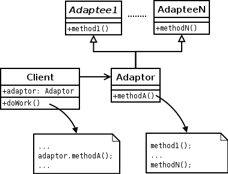

This adapter pattern uses multiple polymorphic interfaces implementing or inheriting both the interface that is expected and the interface that is pre-existing. It is typical for the expected interface to be created as a pure interface class, especially in languages such as Java (before JDK 1.8) that do not support multiple inheritance of classes.


### C++ Example
```C++
/*
 * Example of `adapter' design pattern
 * Copyright (C) 2011 Radek Pazdera
 * This program is free software: you can redistribute it and/or modify
 * it under the terms of the GNU General Public License as published by
 * the Free Software Foundation, either version 3 of the License, or
 * (at your option) any later version.
 * This program is distributed in the hope that it will be useful,
 * but WITHOUT ANY WARRANTY; without even the implied warranty of
 * MERCHANTABILITY or FITNESS FOR A PARTICULAR PURPOSE. See the
 * GNU General Public License for more details.
 * You should have received a copy of the GNU General Public License
 * along with this program. If not, see <http://www.gnu.org/licenses/>.
 */

#include <iostream>
#include <string>

typedef int Cable; // wire with electrons :-)

/* Adaptee (source) interface */
class EuropeanSocketInterface
{
    public:
        virtual int voltage() = 0;

        virtual Cable live() = 0;
        virtual Cable neutral() = 0; 
        virtual Cable earth() = 0;
};

/* Adaptee */
class Socket : public EuropeanSocketInterface
{
    public:
        int voltage() { return 230; }

        Cable live() { return 1; }
        Cable neutral() { return -1; }
        Cable earth() { return 0; }
};

/* Target interface */
class USASocketInterface
{
    public:
        virtual int voltage() = 0;

        virtual Cable live() = 0;
        virtual Cable neutral() = 0;
};

/* The Adapter */
class Adapter : public USASocketInterface
{
    EuropeanSocketInterface* socket;

    public:
        void plugIn(EuropeanSocketInterface* outlet)
        {
            socket = outlet;
        }

        int voltage() { return 110; }
        Cable live() { return socket->live(); }
        Cable neutral() { return socket->neutral(); }
};

/* Client */
class ElectricKettle
{
    USASocketInterface* power;

    public:
        void plugIn(USASocketInterface* supply)
        {
            power = supply;
        }

        void boil()
        {
            if (power->voltage() > 110)
            {
                std::cout << "Kettle is on fire!" << std::endl;
                return;
            }

            if (power->live() == 1 && power->neutral() == -1)
            {
                std::cout << "Coffee time!" << std::endl;
            }
        }
};


int main()
{
    Socket* socket = new Socket;
    Adapter* adapter = new Adapter;
    ElectricKettle* kettle = new ElectricKettle;

    /* Pluging in. */
    adapter->plugIn(socket);
    kettle->plugIn(adapter);

    /* Having coffee */
    kettle->boil();

    return 0;
}
```

### Java Example

When implementing the adapter pattern, for clarity, one can apply the class name [ClassName]To[Interface]Adapter to the provider implementation; for example ::  `DAOToProviderAdapter`.

It should have a constructor method with an adaptee class variable as a parameter. This parameter will be passed to an instance member of [ClassName]To[Interface]Adapter. 

When the clientMethod is called, it will have access to the adaptee instance that allows for accessing the required data of the adaptee and performing operations on that data that generates the desired output. 


```java
interface ILightningPhone {
    void recharge();
    void useLightning();
}

interface IMicroUsbPhone {
    void recharge();
    void useMicroUsb();
}

class Iphone implements ILightningPhone {
    private boolean connector;

    @Override
    public void useLightning() {
        connector = true;
        System.out.println("Lightning connected");
    }

    @Override
    public void recharge() {
        if (connector) {
            System.out.println("Recharge started");
            System.out.println("Recharge finished");
        } else {
            System.out.println("Connect Lightning first");
        }
    }
}

class Android implements IMicroUsbPhone {
    private boolean connector;

    @Override
    public void useMicroUsb() {
        connector = true;
        System.out.println("MicroUsb connected");
    }

    @Override
    public void recharge() {
        if (connector) {
            System.out.println("Recharge started");
            System.out.println("Recharge finished");
        } else {
            System.out.println("Connect MicroUsb first");
        }
    }
}
/* exposing the target interface while wrapping source object */
class LightningToMicroUsbAdapter implements IMicroUsbPhone {
    private final ILightningPhone lightningPhone;

    public LightningToMicroUsbAdapter(ILightningPhone lightningPhone) {
        this.lightningPhone = lightningPhone;
    }

    @Override
    public void useMicroUsb() {
        System.out.println("MicroUsb connected");
        lightningPhone.useLightning();
    }

    @Override
    public void recharge() {
        lightningPhone.recharge();
    }
}

public class AdapterDemo {
    static void rechargeMicroUsbPhone(IMicroUsbPhone phone) {
        phone.useMicroUsb();
        phone.recharge();
    }

    static void rechargeLightningPhone(ILightningPhone phone) {
        phone.useLightning();
        phone.recharge();
    }

    public static void main(String[] args) {
        Android android = new Android();
        Iphone iPhone = new Iphone();

        System.out.println("Recharging android with MicroUsb");
        rechargeMicroUsbPhone(android);

        System.out.println("Recharging iPhone with Lightning");
        rechargeLightningPhone(iPhone);

        System.out.println("Recharging iPhone with MicroUsb");
        rechargeMicroUsbPhone(new LightningToMicroUsbAdapter (iPhone));
    }
}
```
// Output

```bash
Recharging android with MicroUsb
MicroUsb connected
Recharge started
Recharge finished
Recharging iPhone with Lightning
Lightning connected
Recharge started
Recharge finished
Recharging iPhone with MicroUsb
MicroUsb connected
Lightning connected
Recharge started
Recharge finished
```

### Another Java Example

There are the following specifications for the adapter pattern:

- `Target Interface`: This is the desired interface class which will be used by the clients.

- `Adapter class`: This class is a wrapper class which implements the desired target interface and modifies the specific request available from the Adaptee class.

- `Adaptee class`: This is the class which is used by the Adapter class to reuse the existing functionality and modify them for desired use.

- `Client`: This class will interact with the Adapter class.


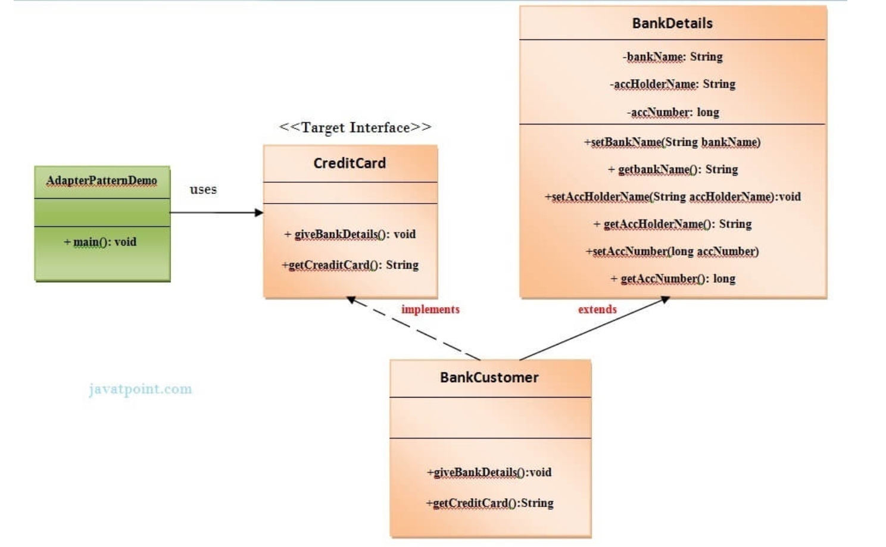


- Step 1  ::: Create a `CreditCard` interface (Target interface).

```java
public interface CreditCard {  
    public void giveBankDetails();  
    public String getCreditCard();  
}// End of the CreditCard interface.
```

- Step 2 ::: Create a `BankDetails` class (Adaptee class).

```java
    // This is the adapter class.  
    public class BankDetails{  
        private String bankName;  
        private String accHolderName;  
        private long accNumber;  
          
        public String getBankName() {  
            return bankName;  
        }  
        public void setBankName(String bankName) {  
            this.bankName = bankName;  
        }  
        public String getAccHolderName() {  
            return accHolderName;  
        }  
        public void setAccHolderName(String accHolderName) {  
            this.accHolderName = accHolderName;  
        }  
        public long getAccNumber() {  
            return accNumber;  
        }  
        public void setAccNumber(long accNumber) {  
            this.accNumber = accNumber;  
        }  
    }// End of the BankDetails class.
```  

- Step 3 ::: Create a `BankCustomer` class (Adapter class).

  
```java  

// This is the adapter class

import java.io.BufferedReader;  
import java.io.InputStreamReader;  
public class BankCustomer extends BankDetails implements CreditCard {  
 public void giveBankDetails(){  
  try{  
   BufferedReader br=new BufferedReader(new InputStreamReader(System.in));  
      
   System.out.print("Enter the account holder name :");  
   String customername=br.readLine();  
   System.out.print("\n");  
      
   System.out.print("Enter the account number:");  
   long accno=Long.parseLong(br.readLine());  
   System.out.print("\n");  
      
   System.out.print("Enter the bank name :");  
   String bankname=br.readLine();  
      
   setAccHolderName(customername);  
   setAccNumber(accno);  
   setBankName(bankname);  
   }catch(Exception e){  
        e.printStackTrace();  
   }  
  }  
  @Override  
  public String getCreditCard() {  
   long accno=getAccNumber();  
   String accholdername=getAccHolderName();  
   String bname=getBankName();  
          
   return ("The Account number "+accno+" of "+accholdername+" in "+bname+ "  
                        bank is valid and authenticated for issuing the credit card. ");  
  }  
}//End of the BankCustomer class.
```

- Step 4 ::: Create a `AdapterPatternDemo` class (client class).

```java
//This is the client class.  
public class AdapterPatternDemo {  
 public static void main(String args[]){  
  CreditCard targetInterface=new BankCustomer();  
  targetInterface.giveBankDetails();  
  System.out.print(targetInterface.getCreditCard());  
 }   
}//End of the BankCustomer class.
```

// Output

```bash    
Enter the account holder name : Sonoo Jaiswal  
      
Enter the account number: 10001  
      
Enter the bank name : State Bank of India  
      
The Account number 10001 of Sonoo Jaiswal in State Bank of India bank is valid and authenticated for issuing the credit card. 
``` 

## Bridge Design Pattern 

Bridge is a structural design pattern that lets you split a large class or a set of closely related classes into two separate hierarchies—abstraction and implementation—which can be developed independently of each other.

The Bridge pattern separates an object's abstraction from its implementation so that you can vary them independently.

Simply means, `Decouple an abstraction from its implementation allowing the two to vary independently. `


The bridge uses encapsulation, aggregation, and can use inheritance to separate responsibilities into different classes. 

When a class varies often, the features of object-oriented programming become very useful because changes to a program's code can be made easily with minimal prior knowledge about the program.

The bridge pattern is useful when both the class and what it does vary often. The class itself can be thought of as the abstraction and what the class can do as the implementation. The bridge pattern can also be thought of as two layers of abstraction. 

When there is only one fixed implementation, this pattern is known as the Pimpl idiom in the C++ world. 

The Bridge Pattern is also known as `Handle or Body`.

visit for more info. ::: https://www.pentalog.com/blog/design-patterns/bridge-design-patterns/


### Why Bridge Design Pattern ?

- It enables the separation of implementation from the interface.

- It improves the extensibility.

- It allows the hiding of implementation details from the client.


### Why not Bridge Design Pattern ?

- Increased complexity due to over use of HAS-A principle.
    
- Interfaces with only single implementation.
    
- Multiple indirection.


### Which Problems Bridge Design Pattern Solves ?

When using subclassing, different subclasses implement an abstract class in different ways. But an implementation is bound to the abstraction at compile-time and cannot be changed at run-time. 

- An abstraction and its implementation should be defined and extended independently from each other.

- A compile-time binding between an abstraction and its implementation should be avoided so that an implementation can be selected at run-time.

### How Such Problems Bridge Design Pattern Solves ?

- Separate an abstraction (`Abstraction`) from its implementation (`Implementor`) by putting them in separate class hierarchies.

- Implement the `Abstraction` in terms of (by delegating to) an `Implementor` object.

This enables to configure an `Abstraction` with an `Implementor` object at run-time. 

### When Bridge Design Pattern can be apply ?

- When you don't want a permanent binding between the functional abstraction and its implementation.

- When both the functional abstraction and its implementation need to extended using sub-classes.

- It is mostly used in those places where changes are made in the implementation does not affect the clients.


### Structure of Bridge Design Pattern

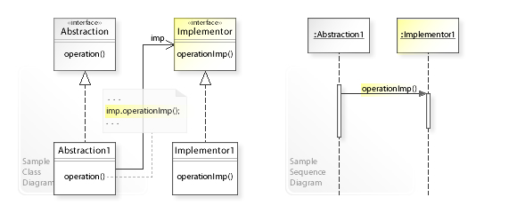

In the above Unified Modeling Language class diagram, an abstraction (`Abstraction`) is not implemented as usual in a single inheritance hierarchy.

Instead, there is one hierarchy for an abstraction (`Abstraction`) and a separate hierarchy for its implementation (`Implementor`), which makes the two independent from each other.

The `Abstraction` interface (`operation()`) is implemented in terms of (by delegating to) the `Implementor` interface (`imp.operationImp()`).

The UML sequence diagram shows the run-time interactions: The `Abstraction1` object delegates implementation to the `Implementor1` object (by calling `operationImp()` on `Implementor1`), which performs the operation and returns to `Abstraction1`.

- Class Diagram


`Abstraction (abstract class)` ::: defines the abstract interface and maintains the Implementor reference.

`RefinedAbstraction (normal class)` ::: extends the interface defined by Abstraction.

`Implementor (interface)` ::: defines the interface for implementation classes.

`ConcreteImplementor (normal class)` ::: implements the Implementor interface.


### C++ Example

A more concrete example why this is useful will make it clearer. Suppose DrawingAPI1 encapsulates your graphics driver, while DrawingAPI2 does the same thing for your printer driver. Then DrawingAPI is the generic API for your graphics system. It lets you draw a CircleShape to your monitor and print it on a piece of paper using the same code, you only have to pass in the different DrawingAPI implementations. However, if you pass DrawingAPI into Shape.draw() instead of passing it into the constructor it would be more flexible because then you can use the same object graph for the monitor and the printer.


```c++
#include <iostream>
#include <string>
#include <vector>


class DrawingAPI {
  public:
    virtual ~DrawingAPI() = default;
    virtual std::string DrawCircle(float x, float y, float radius) const = 0;
};

class DrawingAPI01 : public DrawingAPI {
  public:
    std::string DrawCircle(float x, float y, float radius) const override {
      return "API01.circle at " + std::to_string(x) + ":" + std::to_string(y) +
        " - radius: " + std::to_string(radius); 
    }
};

class DrawingAPI02 : public DrawingAPI {
  public:
    std::string DrawCircle(float x, float y, float radius) const override {
      return "API02.circle at " + std::to_string(x) + ":" + std::to_string(y) +
        " - radius: " + std::to_string(radius); 
    }
};

class Shape {
  public:
    Shape(const DrawingAPI& drawing_api) : drawing_api_(drawing_api) {}
    virtual ~Shape() = default;

    virtual std::string Draw() const = 0;
    virtual float ResizeByPercentage(const float percent) = 0;

  protected:
    const DrawingAPI& drawing_api_;
};

class CircleShape: public Shape {
  public:    
    CircleShape(float x, float y, float radius, const DrawingAPI& drawing_api)
      : Shape(drawing_api), x_(x), y_(y), radius_(radius) {}

    std::string Draw() const override {
        return drawing_api_.DrawCircle(x_, y_, radius_);
    }

    float ResizeByPercentage(const float percent) override {
      return radius_ *= (1.0f + percent/100.0f);
    }
  
  private:
    float x_, y_, radius_;
};

int main(int argc, char** argv) {
  const DrawingAPI01 api1{};
  const DrawingAPI02 api2{};
  std::vector<CircleShape> shapes {
    CircleShape{1.0f, 2.0f, 3.0f, api1},
    CircleShape{5.0f, 7.0f, 11.0f, api2}
  }; 

  for (auto& shape: shapes) {
    shape.ResizeByPercentage(2.5);
    std::cout << shape.Draw() << std::endl;
  }

  return 0;
}
```

//Output

```bash
API01.circle at 1.000000:2.000000 - radius: 3.075000
API02.circle at 5.000000:7.000000 - radius: 11.275000
```

### Java Example

The following Java program defines a bank account that separates the account operations from the logging of these operations. 

```java
// Logger has two implementations: info and warning
@FunctionalInterface
interface Logger {
    void log(String message);
    
    static Logger info() {
        return message -> System.out.println("info: " + message);
    }
    static Logger warning() {
        return message -> System.out.println("warning: " + message);
    }
}

abstract class AbstractAccount {
    private Logger logger = Logger.info();
    
    public void setLogger(Logger logger) {
        this.logger = logger;
    }
    
    // the logging part is delegated to the Logger implementation
    protected void operate(String message, boolean result) {
        logger.log(message + " result " + result);
    }
}

class SimpleAccount extends AbstractAccount {
    private int balance;
    
    public SimpleAccount(int balance) {
        this.balance = balance;
    }
    
    public boolean isBalanceLow() {
        return balance < 50;
    }
    
    public void withdraw(int amount) {
        boolean shouldPerform = balance >= amount;
        if (shouldPerform) {
            balance -= amount;
        }
        operate("withdraw " + amount, shouldPerform);
    }
}

public class BridgeDemo {
    public static void main(String[] args) {
        SimpleAccount account = new SimpleAccount(100);
        account.withdraw(75);
        
        if (account.isBalanceLow()) {
            // you can also change the Logger implementation at runtime
            account.setLogger(Logger.warning());
        }
        
        account.withdraw(10);
        account.withdraw(100);
    }
}
```

//Output

```bash
info: withdraw 75 result true
warning: withdraw 10 result true
warning: withdraw 100 result false
```

## Composite Design Pattern 

Composite pattern is a partitioning design pattern. 

The composite pattern describes a group of objects that are treated the same way as a single instance of the same type of object.

`The intent of a composite is to "compose" objects into tree structures to represent part-whole hierarchies. `

Implementing the composite pattern lets clients treat individual objects and compositions uniformly.

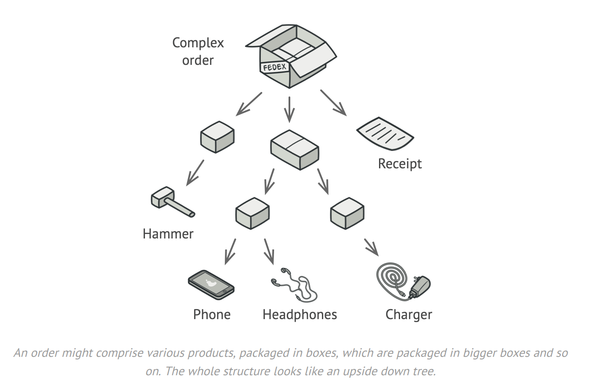

It describes how to build a class hierarchy made up of classes for two kinds of objects: primitive and composite. The composite objects let you compose primitive and other composite objects into arbitrarily complex structures.


### Why Composite Design Pattern ?

When dealing with Tree-structured data, programmers often have to discriminate between a leaf-node and a branch.

This makes code more complex, and therefore, more error prone. 

The solution is an interface that allows treating complex and primitive objects uniformly.

In object-oriented programming, a composite is an object designed as a composition of one-or-more similar objects, all exhibiting similar functionality. This is known as a "has-a" relationship between objects.

The key concept is that you can manipulate a single instance of the object just as you would manipulate a group of them.

The operations you can perform on all the composite objects often have a least common denominator relationship. For example, if defining a system to portray grouped shapes on a screen, it would be useful to define resizing a group of shapes to have the same effect (in some sense) as resizing a single shape. 

- It defines class hierarchies that contain primitive and complex objects.

- It makes easier to you to add new kinds of components. 

- It provides flexibility of structure with manageable class or interface.


### Which Problems Composite Design Pattern Solves ?

- A part-whole hierarchy should be represented so that clients can treat part and whole objects uniformly.

- A part-whole hierarchy should be represented as tree structure.

When defining (1) `Part` objects and (2) `Whole` objects that act as containers for Part objects, clients must treat them separately, which complicates client code.


### How Such Problems Composite Design Pattern Solves ?

- Define a unified `Component` interface for both part (`Leaf`) objects and whole (`Composite`) objects.
    
- Individual Leaf objects implement the `Component` interface directly, and `Composite` objects forward requests to their child components.

This enables clients to work through the `Component` interface to treat `Leaf` and `Composite` objects uniformly: 

`Leaf` objects perform a request directly, and `Composite` objects forward the request to their child components recursively downwards the tree structure. This makes client classes easier to implement, change, test, and reuse. 

### When Composite Design Pattern can be apply ?

Composite should be used when clients ignore the difference between compositions of objects and individual objects.

If programmers find that they are using multiple objects in the same way, and often have nearly identical code to handle each of them, then composite is a good choice; 

it is less complex in this situation to treat primitives and composites as homogeneous. 

- When you want to represent a full or partial hierarchy of objects.

- When the responsibilities are needed to be added dynamically to the individual objects without affecting other objects. Where the responsibility of object may vary from time to time.

### Structure of Composite Design Pattern

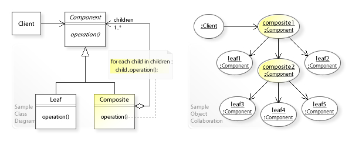

In the above UML class diagram, the `Client` class doesn't refer to the `Leaf` and `Composite` classes directly (separately). Instead, the `Client` refers to the common `Component` interface and can treat `Leaf` and `Composite` uniformly.

The `Leaf` class has no children and implements the `Component` interface directly. 

The `Composite` class maintains a container of child `Component` objects (children) and forwards requests to these `children (for each child in children: child.operation())`. 

The object collaboration diagram shows the run-time interactions: In this example, the `Client` object sends a request to the top-level `Composite object`(of type Component) in the tree structure.

The request is forwarded to (performed on) all child Component objects (`Leaf` and `Composite` objects) downwards the tree structure.


`Defining Child-Related Operations`

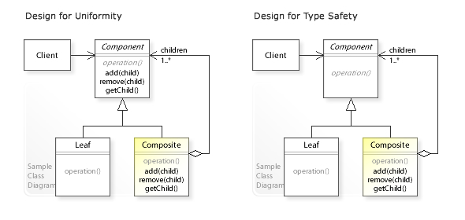

There are two design variants for defining and implementing child-related operations like adding/removing a child component to/from the container (`add(child)`/`remove(child)`) and accessing a child component (`getChild()`): 

- Design for uniformity: Child-related operations are defined in the `Component` interface. This enables clients to treat `Leaf` and `Composite` objects uniformly. But type safety is lost because clients can perform child-related operations on `Leaf` objects.

- Design for type safety: Child-related operations are defined only in the `Composite` class. Clients must treat `Leaf` and Composite objects differently. But type safety is gained because clients cannot perform child-related operations on `Leaf` objects.

The Composite design pattern emphasizes uniformity over type safety. 


`Component`

- is the abstraction for all components, including composite ones.

- declares the interface for objects in the composition.

- (optional) defines an interface for accessing a component's parent in the recursive structure, and implements it if that's appropriate.

`Leaf`

- represents leaf objects in the composition.

- implements all Component methods.

`Composite`

- represents a composite Component (component having children).

- implements methods to manipulate children.

- implements all Component methods, generally by delegating them to its children.


Client uses the component class interface to interact with objects in the composition structure. If recipient is the leaf then request will be handled directly. If recipient is a composite, then it usually forwards the request to its child for performing the additional operations.

### C++ Example

```C++
#include <iostream>
#include <string>
#include <list>
#include <memory>
#include <stdexcept>

typedef double Currency;

// declares the interface for objects in the composition.
class Equipment { // Component
public:
  // implements default behavior for the interface common to all classes, as appropriate.
  virtual const std::string& getName() {
    return name;
  }
  virtual void setName(const std::string& name_) {
    name = name_;
  }
  virtual Currency getNetPrice() {
    return netPrice;
  }
  virtual void setNetPrice(Currency netPrice_) {
    netPrice = netPrice_;
  }
  // declares an interface for accessing and managing its child components.
  virtual void add(std::shared_ptr<Equipment>) = 0;
  virtual void remove(std::shared_ptr<Equipment>) = 0;
  virtual ~Equipment() = default;
protected:
  Equipment() :name(""), netPrice(0) {}
  Equipment(const std::string& name_) :name(name_), netPrice(0) {}
private:
  std::string name;
  Currency netPrice;
};

// defines behavior for components having children.
class CompositeEquipment : public Equipment { // Composite
public:
  // implements child-related operations in the Component interface.
  virtual Currency getNetPrice() override {
    Currency total = Equipment::getNetPrice();
    for (const auto& i:equipment) {
      total += i->getNetPrice();
    }
    return total;
  }
  virtual void add(std::shared_ptr<Equipment> equipment_) override {
    equipment.push_front(equipment_.get());
  }
  virtual void remove(std::shared_ptr<Equipment> equipment_) override {
    equipment.remove(equipment_.get());
  }
protected:
  CompositeEquipment() :equipment() {}
  CompositeEquipment(const std::string& name_) :equipment() {
    setName(name_);
  }
private:
  // stores child components.
  std::list<Equipment*> equipment;
};

// represents leaf objects in the composition.
class FloppyDisk : public Equipment { // Leaf
public:
  FloppyDisk(const std::string& name_) {
    setName(name_);
  }
  // A leaf has no children.
  void add(std::shared_ptr<Equipment>) override {
    throw std::runtime_error("FloppyDisk::add");
  }
  void remove(std::shared_ptr<Equipment>) override {
    throw std::runtime_error("FloppyDisk::remove");
  }
};

class Chassis : public CompositeEquipment {
public:
  Chassis(const std::string& name_) {
    setName(name_);
  }
};

int main() {
  // The smart pointers prevent memory leaks.
  std::shared_ptr<FloppyDisk> fd1 = std::make_shared<FloppyDisk>("3.5in Floppy");
  fd1->setNetPrice(19.99);
  std::cout << fd1->getName() << ": netPrice=" << fd1->getNetPrice() << '\n';

  std::shared_ptr<FloppyDisk> fd2 = std::make_shared<FloppyDisk>("5.25in Floppy");
  fd2->setNetPrice(29.99);
  std::cout << fd2->getName() << ": netPrice=" << fd2->getNetPrice() << '\n';

  std::unique_ptr<Chassis> ch = std::make_unique<Chassis>("PC Chassis");
  ch->setNetPrice(39.99);
  ch->add(fd1);
  ch->add(fd2);
  std::cout << ch->getName() << ": netPrice=" << ch->getNetPrice() << '\n';

  fd2->add(fd1);
}
```
// Output

```bash
3.5in Floppy: netPrice=19.99
5.25in Floppy: netPrice=29.99
PC Chassis: netPrice=89.97
terminate called after throwing an instance of 'std::runtime_error'
  what():  FloppyDisk::add
```

### Java Example


- Step 1 ::: Create an `Employee` interface that will be treated as a component.

```java
    // this is the Employee interface i.e. Component.  
    public interface Employee {  
        public  int getId();  
        public String getName();  
        public double getSalary();  
        public void print();  
        public void add(Employee employee);  
        public void remove(Employee employee);  
        public Employee getChild(int i);  
    }// End of the Employee interface.
```  
- Step 2 ::: Create a `BankManager` class that will be treated as a `Composite` and implements Employee interface.

```java
    // this is the BankManager class i.e. Composite.  
    import java.util.ArrayList;  
    import java.util.Iterator;  
    import java.util.List;  
    public class BankManager implements Employee {  
         private int id;  
         private String name;  
         private double salary;  
      
         public BankManager(int id,String name,double salary) {  
          this.id=id;      
          this.name = name;  
          this.salary = salary;  
         }  
             List<Employee> employees = new ArrayList<Employee>();  
         @Override  
         public void add(Employee employee) {  
            employees.add(employee);  
         }  
            @Override  
         public Employee getChild(int i) {  
          return employees.get(i);  
         }  
         @Override  
         public void remove(Employee employee) {  
          employees.remove(employee);  
         }    
         @Override  
         public int getId()  {  
          return id;  
         }  
         @Override  
         public String getName() {  
          return name;  
         }  
        @Override  
         public double getSalary() {  
          return salary;  
         }  
         @Override  
         public void print() {  
          System.out.println("==========================");  
          System.out.println("Id ="+getId());  
          System.out.println("Name ="+getName());  
          System.out.println("Salary ="+getSalary());  
          System.out.println("==========================");  
            
          Iterator<Employee> it = employees.iterator();  
            
              while(it.hasNext())  {  
                Employee employee = it.next();  
                employee.print();  
             }  
         }  
    }// End of the BankManager class. 
``` 

- Step 3 ::: Create a `Cashier` class that will be treated as a `leaf` and it will implement to the `Employee` interface.

```java
public  class Cashier implements Employee{  
    /* 
         In this class,there are many methods which are not applicable to cashier because 
         it is a leaf node. 
     */  
        private int id;  
            private String name;  
        private double salary;  
        public Cashier(int id,String name,double salary)  {  
            this.id=id;  
            this.name = name;  
            this.salary = salary;  
        }  
        @Override  
        public void add(Employee employee) {  
            //this is leaf node so this method is not applicable to this class.  
        }  
        @Override  
        public Employee getChild(int i) {  
            //this is leaf node so this method is not applicable to this class.  
            return null;  
        }  
        @Override  
        public int getId() {  
            // TODO Auto-generated method stub  
            return id;  
        }  
        @Override  
        public String getName() {  
            return name;  
        }  
        @Override  
        public double getSalary() {  
            return salary;  
        }  
        @Override  
        public void print() {  
            System.out.println("==========================");  
            System.out.println("Id ="+getId());  
            System.out.println("Name ="+getName());  
            System.out.println("Salary ="+getSalary());  
            System.out.println("==========================");  
        }  
        @Override  
        public void remove(Employee employee) {  
            //this is leaf node so this method is not applicable to this class.  
        }  
}
```

- Step 4 ::: Create a `Accountant` class that will also be treated as a `leaf` and it will implement to the `Employee` interface.

```java
public class Accountant implements Employee{  
/* 
    In this class,there are many methods which are not applicable to cashier because 
    it is a leaf node. 
*/  
    private int id;  
    private String name;  
    private double salary;  
   public Accountant(int id,String name,double salary)  {  
       this.id=id;  
       this.name = name;  
       this.salary = salary;  
   }  
   @Override  
   public void add(Employee employee) {  
       //this is leaf node so this method is not applicable to this class.  
   }  
   @Override  
   public Employee getChild(int i) {  
       //this is leaf node so this method is not applicable to this class.  
       return null;  
   }  
   @Override  
    public int getId() {  
        // TODO Auto-generated method stub  
        return id;  
   }  
   @Override  
   public String getName() {  
       return name;  
   }  
   @Override  
   public double getSalary() {  
       return salary;  
   }  
   @Override  
   public void print() {  
       System.out.println("=========================");  
       System.out.println("Id ="+getId());  
       System.out.println("Name ="+getName());  
       System.out.println("Salary ="+getSalary());  
       System.out.println("=========================");  
   }  
  @Override  
   public void remove(Employee employee) {  
       //this is leaf node so this method is not applicable to this class.  
   }  
}
```

- Step 5 ::: Create a `CompositePatternDemo` class that will also be treated as a `Client` and we will use the `Employee` interface.

```java
public class CompositePatternDemo {  
    public static void main(String args[]){  
         Employee emp1=new Cashier(101,"Sohan Kumar", 20000.0);  
         Employee emp2=new Cashier(102,"Mohan Kumar", 25000.0);  
         Employee emp3=new Accountant(103,"Seema Mahiwal", 30000.0);   
         Employee manager1=new BankManager(100,"Ashwani Rajput",100000.0);  
            
          manager1.add(emp1);  
          manager1.add(emp2);  
          manager1.add(emp3);  
          manager1.print();  
        }  
}
```

// Output

```bash
    ==========================  
    Id =100  
    Name =Ashwani Rajput  
    Salary =100000.0  
    ==========================  
    ==========================  
    Id =101  
    Name =Sohan Kumar  
    Salary =20000.0  
    ==========================  
    ==========================  
    Id =102  
    Name =Mohan Kumar  
    Salary =25000.0  
    ==========================  
    =========================  
    Id =103  
    Name =Seema Mahiwal  
    Salary =30000.0  
    ========================= 
```

## Decorator Design Pattern 

Decorator pattern is a design pattern that allows behavior to be added to an individual object, dynamically, without affecting the behavior of other instances of the same class.

`It describes how to add responsibilities to objects dynamically.`

It composes objects recursively to allow an open-ended number of additional responsibilities. 

For example, a Decorator object containing a user interface component can add a decoration like a border or shadow to the component, or it can add functionality like scrolling and zooming.

We can add two decorations simply by nesting one Decorator object within another, and so on for additional decorations.To accomplish this, each Decorator object must conform to the interface of its component and must forward messages to it. 

The Decorator can do its job (such as drawing a border around the component) either before or after forwarding a message.


The decorator pattern is often useful for adhering (stick) to the Single Responsibility Principle, as it allows functionality to be divided between classes with unique areas of concern as well as to the Open-Closed Principle, by allowing the functionality of a class to be extended without being modified.

Decorator use can be more efficient than subclassing, because an object's behavior can be augmented without defining an entirely new object. 

### Why Decorator Design Pattern ?

- It provides greater flexibility than static inheritance.

- It enhances the extensibility of the object, because changes are made by coding new classes.

- It simplifies the coding by allowing you to develop a series of functionality from targeted classes instead of coding all of the behavior into the object.


### Which Problems Decorator Design Pattern Solves ?

When using subclassing, different subclasses extend a class in different ways. But an extension is bound to the class at compile-time and can't be changed at run-time.

- Responsibilities should be added to (and removed from) an object dynamically at run-time.

- A flexible alternative to subclassing for extending functionality should be provided.

### How Such Problems Decorator Design Pattern Solves ?

Define `Decorator` objects that 

- implement the interface of the extended (decorated) object (`Component`) transparently by forwarding all requests to it.

- perform additional functionality before/after forwarding a request.

This allows working with different `Decorator` objects to extend the functionality of an object dynamically at run-time. 


### When Decorator Design Pattern can be apply ?

- When you want to transparently and dynamically add responsibilities to objects without affecting other objects.

- When you want to add responsibilities to an object that you may want to change in future.
    
- Extending functionality by sub-classing is no longer practical.


### Structure of Decorator Design Pattern


In the above UML class diagram, the abstract `Decorator` class maintains a reference (`component`) to the decorated object (`Component`) and forwards all requests to it (`component.operation()`). 

This makes `Decorator` transparent (invisible) to clients of `Component`. 

Subclasses (`Decorator1`,`Decorator2`) implement additional behavior (`addBehavior()`) that should be added to the `Component` (before/after forwarding a request to it).

:::: The sequence diagram shows the run-time interactions :::: 

The `Client` object works through `Decorator1` and `Decorator2` objects to extend the functionality of a `Component1` object. 

The `Client` calls `operation()` on `Decorator1`, which forwards the request to `Decorator2`. 

`Decorator2` performs `addBehavior()` after forwarding the request to `Component1` and returns to `Decorator1`, which performs `addBehavior()` and returns to the `Client`. 


- `More Depth Decorator Design Pattern Structure Explanation`

The decorator pattern can be used to extend (decorate) the functionality of a certain object statically, or in some cases at run-time, independently of other instances of the same class, provided some groundwork is done at design time.

This is achieved by designing a new `Decorator` class that wraps the original class.


This wrapping could be achieved by the following sequence of steps: 

- Subclass the original Component class into a `Decorator` class (see UML diagram);

- In the Decorator class, add a Component pointer as a field;

- In the Decorator class, pass a Component to the Decorator constructor to initialize the Component pointer;

- In the Decorator class, forward all Component methods to the Component pointer;

- In the ConcreteDecorator class, override any Component method(s) whose behavior needs to be modified.

This pattern is designed so that `multiple decorators can be stacked on top of each other`, each time adding a new functionality to the overridden method(s). 

Note that decorators and the original class object share a common set of features. In the previous diagram, the operation() method was available in both the decorated and undecorated versions. 

The decoration features (e.g., methods, properties, or other members) are usually defined by an interface, mixin (a.k.a. trait) or class inheritance which is shared by the decorators and the decorated object.

In the previous example, the class Component is inherited by both the ConcreteComponent and the subclasses that descend from Decorator. 

`The decorator pattern is an alternative to subclassing.` 

`Subclassing adds behavior at compile time`, and the change affects all instances of the original class.

But, `Decorating can provide new behavior at run-time for selected objects.`


### Common Usecases

- `Applying decorators`

Adding or removing decorators on command (like a button press) is a common UI pattern, often implemented along with the `Command design pattern`.

For example, a text editing application might have a button to highlight text.

On button press, the individual text glyphs currently selected will all be wrapped in decorators that modify their draw() function, causing them to be drawn in a highlighted manner (a real implementation would probably also use a demarcation system to maximize efficiency). 

Applying or removing decorators based on changes in state is another common use case.

Depending on the scope of the state, decorators can be applied or removed in bulk. 

Similarly, the State design pattern can be implemented using decorators instead of subclassed objects encapsulating the changing functionality. The use of decorators in this manner makes the State object's internal state and functionality more compositional and capable of handling arbitrary complexity. 

- `Usage in Flyweight objects`

Decoration is also often used in the Flyweight design pattern. Flyweight objects are divided into two components:

An invariant component that is shared between all flyweight objects; 

A variant, decorated component that may be partially shared or completely unshared.

This partitioning of the flyweight object is intended to reduce memory consumption. 

The decorators are typically cached and reused as well. 

The decorators will all contain a common reference to the shared, invariant object. If the decorated state is only partially variant, then the decorators can also be shared to some degree - though care must be taken not to alter their state while they're being used. 

`iOS's UITableView` implements the flyweight pattern in this manner - a tableview's reusable cells are decorators that contains a references to a common tableview row object, and the cells are cached / reused. 

- `Architectural relevance`

Decorators support a compositional rather than a top-down, hierarchical approach to extending functionality.

A decorator makes it possible to add or alter behavior of an interface at run-time. 

They can be used to wrap objects in a multilayered, arbitrary combination of ways.

Doing the same with subclasses means implementing complex networks of multiple inheritance, which is memory-inefficient and at a certain point just cannot scale. Likewise, attempting to implement the same functionality with properties bloats each instance of the object with unnecessary properties. 

For the above reasons decorators are often considered a memory-efficient alternative to subclassing. 

Decorators can also be used to specialize objects which are not subclassable, whose characteristics need to be altered at runtime (as mentioned elsewhere), or generally objects that are lacking in some needed functionality. 


- `Usage in enhancing APIs`

The decorator pattern also can augment the `Facade pattern`. 

A facade is designed to simply interface with the complex system it encapsulates, but it does not add functionality to the system.

However, the wrapping of a complex system provides a space that may be used to introduce new functionality based on the coordination of subcomponents in the system. 

For example, a facade pattern may unify many different languages dictionaries under one multi-language dictionary interface. The new interface may also provide new functions for translating words between languages. 

This is a hybrid pattern - the unified interface provides a space for augmentation. 

Think of decorators as not being limited to wrapping individual objects, but capable of wrapping clusters of objects in this hybrid approach as well. 

### C++ Example

Two options are presented here: first, a `dynamic, runtime-composable decorator` (has issues with calling decorated functions unless proxied explicitly) and a `Static Decorator that uses mixin inheritance`. 

- `Dynamic Decorator`

// Example 1

```C++
#include <iostream>
#include <string>

struct Shape {
  virtual ~Shape() = default;

  virtual std::string GetName() const = 0;
};

struct Circle : Shape {
  void Resize(float factor) { radius *= factor; }

  std::string GetName() const override {
    return std::string("A circle of radius ") + std::to_string(radius);
  }

  float radius = 10.0f;
};

struct ColoredShape : Shape {
  ColoredShape(const std::string& color, Shape* shape)
      : color(color), shape(shape) {}

  std::string GetName() const override {
    return shape->GetName() + " which is colored " + color;
  }

  std::string color;
  Shape* shape;
};

int main() {
  Circle circle;
  ColoredShape colored_shape("red", &circle);
  std::cout << colored_shape.GetName() << std::endl;

}
```

// Example 2

```c++
#include <memory>
#include <iostream>
#include <string>

struct WebPage
{
    virtual void display()=0;
    virtual ~WebPage() = default;
};

struct BasicWebPage : WebPage
{
    std::string html;
    void display() override
    {
        std::cout << "Basic WEB page" << std::endl;
    }
};

struct WebPageDecorator : WebPage
{
    WebPageDecorator(std::unique_ptr<WebPage> webPage): _webPage(std::move(webPage))
    {
    }
    void display() override
    {
        _webPage->display();
    }
private:
    std::unique_ptr<WebPage> _webPage;
};

struct AuthenticatedWebPage : WebPageDecorator
{
    AuthenticatedWebPage(std::unique_ptr<WebPage> webPage): 
    WebPageDecorator(std::move(webPage))
    {}

    void authenticateUser()
    {
        std::cout << "authentification done" << std::endl;
    }
    void display() override
    {
        authenticateUser();
        WebPageDecorator::display();
    }
};

struct AuthorizedWebPage : WebPageDecorator
{
    AuthorizedWebPage(std::unique_ptr<WebPage> webPage): 
    WebPageDecorator(std::move(webPage))
    {}

    void authorizedUser()
    {
        std::cout << "authorized done" << std::endl;
    }
    void display() override
    {
        authorizedUser();
        WebPageDecorator::display();
    }
};

int main(int argc, char* argv[])
{
    std::unique_ptr<WebPage> myPage = std::make_unique<BasicWebPage>();

    myPage = std::make_unique<AuthorizedWebPage>(std::move(myPage));
    myPage = std::make_unique<AuthenticatedWebPage>(std::move(myPage));
    myPage->display();
    std::cout << std::endl;
    return 0;
}
```

- `Static Decorator (Mixin Inheritance)`

This example demonstrates a static Decorator implementation, which is possible due to C++ ability to inherit from the template argument. 

```C++
#include <iostream>
#include <string>

struct Circle {
  void Resize(float factor) { radius *= factor; }

  std::string GetName() const {
    return std::string("A circle of radius ") + std::to_string(radius);
  }

  float radius = 10.0f;
};

template <typename T>
struct ColoredShape : public T {
  ColoredShape(const std::string& color) : color(color) {}

  std::string GetName() const {
    return T::GetName() + " which is colored " + color;
  }

  std::string color;
};

int main() {
  ColoredShape<Circle> red_circle("red");
  std::cout << red_circle.GetName() << std::endl;
  red_circle.Resize(1.5f);
  std::cout << red_circle.GetName() << std::endl;
}
```

### Another C++ Example

```C++
#include <iostream>
#include <memory>

// Beverage interface.
class Beverage {
public:
  virtual void drink() = 0;
  virtual ~Beverage() = default;
};

// Drinks which can be decorated.
class Coffee : public Beverage {
public:
  virtual void drink() override {
    std::cout << "Drinking Coffee";
  }
};

class Soda : public Beverage {
public:
  virtual void drink() override {
    std::cout << "Drinking Soda";
  }
};

class BeverageDecorator : public Beverage {
public:
  BeverageDecorator() = delete;
  BeverageDecorator(std::unique_ptr<Beverage> component_) 
    : component(std::move(component_)) 
  {}
  
  virtual void drink() = 0;

protected:
  void callComponentDrink() {
    if (component) {
      component->drink();
    }
  }

private:
  std::unique_ptr<Beverage> component;
};

class Milk : public BeverageDecorator {
public:
  Milk(std::unique_ptr<Beverage> component_, float percentage_) 
    : BeverageDecorator(std::move(component_))
    , percentage(percentage_) 
  { 
  }

  virtual void drink() override {
    callComponentDrink();
    std::cout << ", with milk of richness " << percentage << "%";
  }

private:

  float percentage;
};

class IceCubes : public BeverageDecorator {
public:
  IceCubes(std::unique_ptr<Beverage> component_, int count_) 
    : BeverageDecorator(std::move(component_))
    , count(count_) 
  { 
  }

  virtual void drink() override {
    callComponentDrink();
    std::cout << ", with " << count << " ice cubes";
  }

private:

  int count;
};

class Sugar : public BeverageDecorator {
public:
  Sugar(std::unique_ptr<Beverage> component_, int spoons_) 
    : BeverageDecorator(std::move(component_))
    , spoons(spoons_) 
  { 
  }

  virtual void drink() override {
    callComponentDrink();
    std::cout << ", with " << spoons << " spoons of sugar";
  }

private:

  int spoons = 1;
};

int main() {
  
  std::unique_ptr<Beverage> soda = std::make_unique<Soda>();
  soda = std::make_unique<IceCubes>(std::move(soda), 3);
  soda = std::make_unique<Sugar>(std::move(soda), 1);

  soda->drink();
  std::cout << std::endl;
  
  std::unique_ptr<Beverage> coffee = std::make_unique<Coffee>();
  coffee = std::make_unique<IceCubes>(std::move(coffee), 16);
  coffee = std::make_unique<Milk>(std::move(coffee), 3.);
  coffee = std::make_unique<Sugar>(std::move(coffee), 2);

  coffee->drink();

  return 0;
}
```
// Output

```bash
Drinking Soda, with 3 ice cubes, with 1 spoons of sugar
Drinking Coffee, with 16 ice cubes, with milk of richness 3%, with 2 spoons of sugar
```

### Java Example

First example (`window/scrolling scenario`)

The following Java example illustrates the use of decorators using the window/scrolling scenario. 

```java
// The Window interface class
public interface Window {
    void draw(); // Draws the Window
    String getDescription(); // Returns a description of the Window
}

// Implementation of a simple Window without any scrollbars
class SimpleWindow implements Window {
    @Override
    public void draw() {
        // Draw window
    }
    @Override
    public String getDescription() {
        return "simple window";
    }
}
```

The following classes contain the decorators for all `Window` classes, including the decorator classes themselves. 

```java
// abstract decorator class - note that it implements Window
abstract class WindowDecorator implements Window {
    private final Window windowToBeDecorated; // the Window being decorated

    public WindowDecorator (Window windowToBeDecorated) {
        this.windowToBeDecorated = windowToBeDecorated;
    }
    @Override
    public void draw() {
        windowToBeDecorated.draw(); //Delegation
    }
    @Override
    public String getDescription() {
        return windowToBeDecorated.getDescription(); //Delegation
    }
}

// The first concrete decorator which adds vertical scrollbar functionality
class VerticalScrollBarDecorator extends WindowDecorator {
    public VerticalScrollBarDecorator (Window windowToBeDecorated) {
        super(windowToBeDecorated);
    }

    @Override
    public void draw() {
        super.draw();
        drawVerticalScrollBar();
    }

    private void drawVerticalScrollBar() {
        // Draw the vertical scrollbar
    }

    @Override
    public String getDescription() {
        return super.getDescription() + ", including vertical scrollbars";
    }
}

// The second concrete decorator which adds horizontal scrollbar functionality
class HorizontalScrollBarDecorator extends WindowDecorator {
    public HorizontalScrollBarDecorator (Window windowToBeDecorated) {
        super(windowToBeDecorated);
    }

    @Override
    public void draw() {
        super.draw();
        drawHorizontalScrollBar();
    }

    private void drawHorizontalScrollBar() {
        // Draw the horizontal scrollbar
    }

    @Override
    public String getDescription() {
        return super.getDescription() + ", including horizontal scrollbars";
    }
}
```

Here's a test program that creates a `Window` instance which is fully decorated (i.e., with vertical and horizontal scrollbars), and prints its description: 

```java
public class DecoratedWindowTest {
    public static void main(String[] args) {
        // Create a decorated Window with horizontal and vertical scrollbars
        Window decoratedWindow = new HorizontalScrollBarDecorator (
                new VerticalScrollBarDecorator (new SimpleWindow()));

        // Print the Window's description
        System.out.println(decoratedWindow.getDescription());
    }
}
```

// Output

```bash 
"simple window, including vertical scrollbars, including horizontal scrollbars" 
```
`Notice` ::: how the `getDescription` method of the two decorators first retrieve the decorated Window's description and decorates it with a suffix.

### Another Java Example

`Coffee making scenario`

The next Java example illustrates the use of decorators using coffee making scenario. In this example, the scenario only includes cost and ingredients. 

```java
// The interface Coffee defines the functionality of Coffee implemented by decorator
public interface Coffee {
    public double getCost(); // Returns the cost of the coffee
    public String getIngredients(); // Returns the ingredients of the coffee
}

// Extension of a simple coffee without any extra ingredients
public class SimpleCoffee implements Coffee {
    @Override
    public double getCost() {
        return 1;
    }

    @Override
    public String getIngredients() {
        return "Coffee";
    }
}
```
The following classes contain the decorators for all `Coffee` classes, including the decorator classes themselves. 

```java
// Abstract decorator class - note that it implements Coffee interface
public abstract class CoffeeDecorator implements Coffee {
    private final Coffee decoratedCoffee;

    public CoffeeDecorator(Coffee c) {
        this.decoratedCoffee = c;
    }

    @Override
    public double getCost() { // Implementing methods of the interface
        return decoratedCoffee.getCost();
    }

    @Override
    public String getIngredients() {
        return decoratedCoffee.getIngredients();
    }
}

// Decorator WithMilk mixes milk into coffee.
// Note it extends CoffeeDecorator.
class WithMilk extends CoffeeDecorator {
    public WithMilk(Coffee c) {
        super(c);
    }

    @Override
    public double getCost() { // Overriding methods defined in the abstract superclass
        return super.getCost() + 0.5;
    }

    @Override
    public String getIngredients() {
        return super.getIngredients() + ", Milk";
    }
}

// Decorator WithSprinkles mixes sprinkles onto coffee.
// Note it extends CoffeeDecorator.
class WithSprinkles extends CoffeeDecorator {
    public WithSprinkles(Coffee c) {
        super(c);
    }

    @Override
    public double getCost() {
        return super.getCost() + 0.2;
    }

    @Override
    public String getIngredients() {
        return super.getIngredients() + ", Sprinkles";
    }
}
```
Here's a test program that creates a `Coffee` instance which is fully decorated (with milk and sprinkles), and calculate cost of coffee and prints its ingredients: 

```java
public class Main {
    public static void printInfo(Coffee c) {
        System.out.println("Cost: " + c.getCost() + "; Ingredients: " + c.getIngredients());
    }

    public static void main(String[] args) {
        Coffee c = new SimpleCoffee();
        printInfo(c);

        c = new WithMilk(c);
        printInfo(c);

        c = new WithSprinkles(c);
        printInfo(c);
    }
}
```
// Output

```bash
Cost: 1.0; Ingredients: Coffee
Cost: 1.5; Ingredients: Coffee, Milk
Cost: 1.7; Ingredients: Coffee, Milk, Sprinkles
```

## Facade Design Pattern 

Disctonary Meaning ::: the principal front of a building, that faces on to a street or open space.

Facade is a structural design pattern that provides a simplified interface to a library, a framework, or any other complex set of classes.

Analogous to a façade in architecture, it is an object that serves as a front-facing interface masking more complex underlying or structural code.

Facade shows how to make a single object represent an entire subsystem.

A facade is a representative for a set of objects.

The facade carries out its responsibilities by forwarding messages to the objects it represents.


`"just provide a unified and simplified interface to a set of interfaces in a subsystem, therefore it hides the complexities of the subsystem from the client".`

In other words, Facade Pattern describes a higher-level interface that makes the sub-system easier to use.

### Why Facade Design Pattern ?

Developers often use the facade design pattern when a system is very complex or difficult to understand because the system has many interdependent classes or because its source code is unavailable. 

This pattern hides the complexities of the larger system and provides a simpler interface to the client.

It typically involves a single wrapper class that contains a set of members required by the client.

These members access the system on behalf of the facade client and hide the implementation details. 

- improve the readability and usability of a software library by masking interaction with more complex components behind a single (and often simplified) application programming interface (API).

- provide a context-specific interface to more generic functionality (complete with context-specific input validation).

- serve as a launching point for a broader refactor of monolithic or tightly-coupled systems in favor of more loosely-coupled code

- It shields the clients from the complexities of the sub-system components.

- It promotes loose coupling between subsystems and its clients.


### Which Problems Facade Design Pattern Solves ?

- To make a complex subsystem easier to use, a simple interface should be provided for a set of interfaces in the subsystem.

- The dependencies on a subsystem should be minimized.

Clients that access a complex subsystem directly refer to (depend on) many different objects having different interfaces (tight coupling), which makes the clients hard to implement, change, test, and reuse. 

### How Such Problems Facade Design Pattern Solves ?

Define a `Facade` object that 

- implements a simple interface in terms of (by delegating to) the interfaces in the subsystem and may perform additional functionality before/after forwarding a request.

This enables to work through a `Facade` object to minimize the dependencies on a subsystem. 

### When Facade Design Pattern can be apply ?

- When a simple interface is required to access a complex system.

- When a system is very complex or difficult to understand.

- When an entry point is needed to each level of layered software.

- When the abstractions and implementations of a subsystem are tightly coupled.

### Structure of Facade Design Pattern


In this UML class diagram, the `Client` class doesn't access the subsystem classes directly.

Instead, the `Client` works through a `Facade` class that implements a simple interface in terms of (by delegating to) the subsystem classes (`Class1`, `Class2`, and `Class3`).

The `Client` depends only on the simple `Facade` interface and is independent of the complex subsystem.


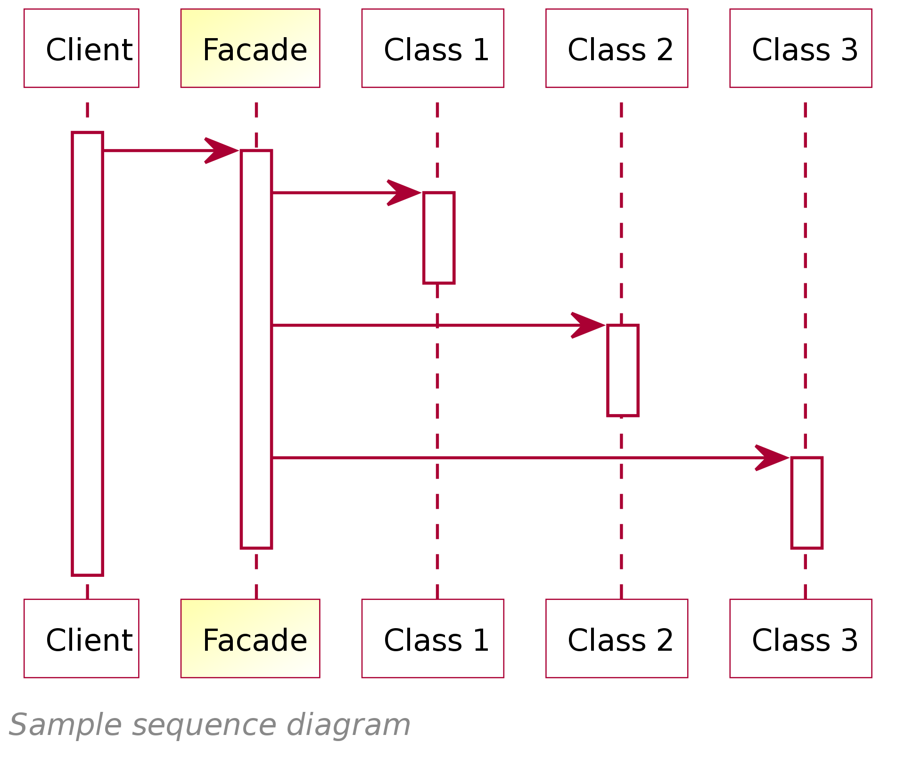

The sequence diagram shows the run-time interactions: The `Client` object works through a `Facade` object that delegates the request to the `Class1`, `Class2`, and `Class3` instances that perform the request. 


### C++ Example

This is an abstract example of how a client ("you") interacts with a facade (the "computer") to a complex system (internal computer parts, like CPU and HardDrive). 

```c++
struct CPU {
  void Freeze();
  void Jump(long position);
  void Execute();
};

struct HardDrive {
  char* Read(long lba, int size);
};

struct Memory {
  void Load(long position, char* data);
};

class ComputerFacade {
 public:
  void Start() {
    cpu_.Freeze();
    memory_.Load(kBootAddress, hard_drive_.Read(kBootSector, kSectorSize));
    cpu_.Jump(kBootAddress);
    cpu_.Execute();
  }

 private:
  CPU cpu_;
  Memory memory_;
  HardDrive hard_drive_;
};

int main() {
  ComputerFacade computer;
  computer.Start();
}
```

### Java Example

`Facade` hides the complexities of the system and provides an interface to the client from where the client can access the system. 

```java
public class Inventory {
public String checkInventory(String OrderId) {
    return "Inventory checked";
}
}

public class Payment {
public String deductPayment(String orderID) {
    return "Payment deducted successfully";
}
}


public class OrderFacade {
private Payment pymt = new Payment();
private Inventory inventry = new Inventory();

public void placeOrder(String orderId) {
    String step1 = inventry.checkInventory(orderId);
    String step2 = pymt.deductPayment(orderId);
    System.out
            .println("Following steps completed:" + step1
                    + " & " + step2);
   }
}

public class Client {
       public static void main(String args[]){
         OrderFacade orderFacade = new OrderFacade();
         orderFacade.placeOrder("OR123456");
         System.out.println("Order processing completed");
       }
  }
```

## Flyweight Design Pattern 

Flyweight software design pattern refers to an object that minimizes memory usage by sharing some of its data with other similar objects. 

Use sharing to support large numbers of similar objects efficiently. 

In simple words it says that just "to reuse already existing similar kind of objects by storing them and create new object when no matching object is found".

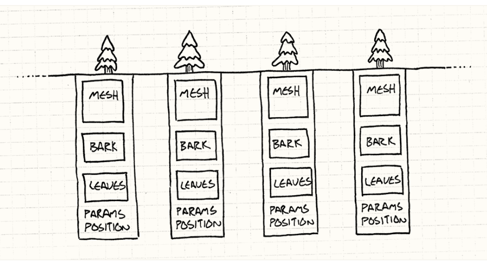      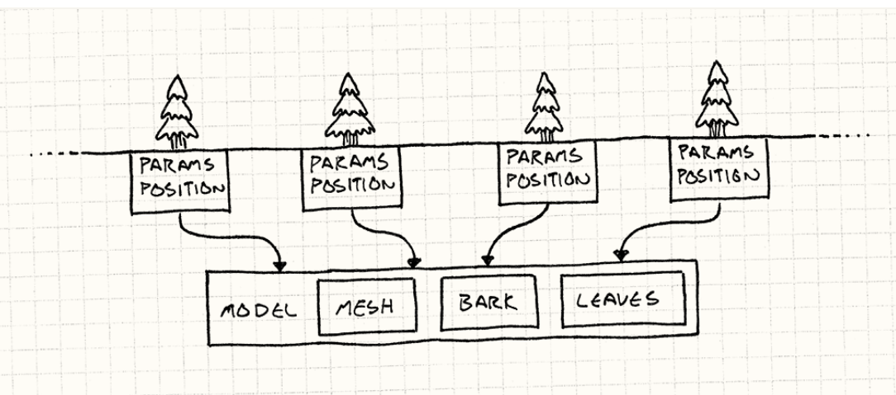

The Flyweight pattern defines a structure for sharing objects.

Objects are shared for at least two reasons: efficiency and consistency.

Flyweight focuses on sharing for space efficiency.

Applications that use lots of objects must pay careful attention to the cost of each object. 

Substantial savings can be had by sharing objects instead of replicating them.

But objects can be shared only if they don't define context-dependent state. 

Flyweight objects have no such state. Any additional information they need to perform their task is passed to them when needed. With no context-dependent state, Flyweight objects may be shared freely.

Flyweight shows how to make lots of little objects.

### Why Flyweight Design Pattern ?

The flyweight pattern is useful when dealing with a large number of objects that share simple repeated elements which would use a large amount of memory if they were individually embedded.

It is common to hold shared data in external data structures and pass it to the objects temporarily when they are used. 

For example ::: A classic example are the data structures used representing characters in a word processor. Naively, each character in a document might have a glyph object containing its font outline, font metrics, and other formatting data. However, this would use hundreds or thousands of bytes of memory for each character. Instead, each character can have a reference to a glyph object shared by every instance of the same character in the document. This way, only the position of each character needs to be stored internally. 


As a result, flyweight objects can :::

- store intrinsic state that is invariant, context-independent and shareable (for example, the code of character 'A' in a given character set)

- provide an interface for passing in extrinsic state that is variant, context-dependent and can't be shared (for example, the position of character 'A' in a text document)

`Clients` can reuse `Flyweight` objects and pass in extrinsic state as necessary, reducing the number of physically created objects. 

- It reduces the number of objects.

- It reduces the amount of memory and storage devices required if the objects are persisted.


### When Flyweight Design Pattern can be apply ?

- When an application uses number of objects.

- When the storage cost is high because of the quantity of objects.
    
- When the application does not depend on object identity.


### Structure of Flyweight Design Pattern 


The above UML class diagram shows: 

- the `Client` class, which uses the flyweight pattern.

- the `FlyweightFactory` class, which creates and shares `Flyweight` objects.

- the `Flyweight` interface, which takes in extrinsic state and performs an operation.

- the `Flyweight1` class, which implements `Flyweight` and stores intrinsic state.


The sequence diagram shows the following run-time interactions: 

- The `Client` object calls `getFlyweight(key)` on the `FlyweightFactory`, which returns a `Flyweight1` object.

- After calling `operation(extrinsicState)` on the returned `Flyweight1` object, the `Client` again calls `getFlyweight(key)` on the `FlyweightFactory`.

- The `FlyweightFactory` returns the already-existing `Flyweight1` object.


### Implementation of Flyweight Design Pattern 

A flyweight objects essentially has two kind of attributes – intrinsic and extrinsic.

An `intrinsic` state attribute is stored/shared in the flyweight object, and it is independent of flyweight’s context. As the best practice, we should make intrinsic states immutable.

An `extrinsic` state varies with flyweight’s context, which is why they cannot be shared. Client objects maintain the extrinsic state, and they need to pass this to a flyweight object during object creation.

There are multiple ways to implement the flyweight pattern. 

One example is `mutability` ::: whether the objects storing extrinsic flyweight state can change.

Another example is `Immutable` ::: objects are easily shared, but require creating new extrinsic objects whenever a change in state occurs.

In contrast, mutable objects can share state. Mutability allows better object reuse via the caching and re-initialization of old, unused objects. Sharing is usually nonviable when state is highly variable.

Other primary concerns include `retrieval` (how the end-client accesses the flyweight), `caching` and `concurrency`. 

- `Retrieval` The factory interface for creating or reusing flyweight objects is often a facade for a complex underlying system. 

For example, the factory interface is commonly implemented as a singleton to provide global access for creating flyweights. 

Generally speaking, the retrieval algorithm begins with a request for a new object via the factory interface. 

The request is typically forwarded to an appropriate cache based on what kind of object it is. If the request is fulfilled by an object in the cache, it may be reinitialized and returned. Otherwise, a new object is instantiated. If the object is partitioned into multiple extrinsic sub-components, they will be pieced together before the object is returned. 

- `Caching` There are two ways to cache flyweight objects: maintained and unmaintained caches. 

Objects with highly variable state can be cached with a FIFO structure. This structure maintains unused objects in the cache, with no need to search the cache. 

In contrast, unmaintained caches have less upfront overhead: objects for the caches are initialized in bulk at compile time or startup. Once objects populate the cache, the object retrieval algorithm might have more overhead associated than the push/pop operations of a maintained cache. 

When retrieving extrinsic objects with immutable state one must simply search the cache for an object with the state one desires. If no such object is found, one with that state must be initialized. When retrieving extrinsic objects with mutable state, the cache must be searched for an unused object to reinitialize if no used object is found. If there is no unused object available, a new object must be instantiated and added to the cache. 

Separate caches can be used for each unique subclass of extrinsic object. Multiple caches can be optimized separately, associating a unique search algorithm with each cache. This object caching system can be encapsulated with the chain of responsibility pattern, which promotes loose coupling between components. 


- `Concurrency` Special consideration must be taken into account where flyweight objects are created on multiple threads.

If the list of values is finite and known in advance, the flyweights can be instantiated ahead of time and retrieved from a container on multiple threads with no contention. If flyweights are instantiated on multiple threads, there are two options: 

- Make flyweight instantiation single-threaded, thus introducing contention and ensuring one instance per value.

- Allow concurrent threads to create multiple flyweight instances, thus eliminating contention and allowing multiple instances per value.


To enable safe sharing between clients and threads, flyweight objects can be made into immutable value objects, where two instances are considered equal if their values are equal. 


### C++ Example

The C++ Standard Template Library provides several containers that allow unique objects to be mapped to a key. The use of containers helps further reduce memory usage by removing the need for temporary objects to be created. 

```c++
#include <iostream>
#include <map>
#include <string>

// Instances of Tenant will be the Flyweights
class Tenant {
public:
    Tenant(const std::string& name = "") : m_name(name) {}

    std::string name() const {
        return m_name;
    }
private:
    std::string m_name;
};

// Registry acts as a factory and cache for Tenant flyweight objects
class Registry {
public:
    Registry() : tenants() {}

    Tenant& findByName(const std::string& name) {
        if (!tenants.contains(name)) {
            tenants[name] = Tenant{name};
        }
        return tenants[name];
    }
private:
    std::map<std::string, Tenant> tenants;
};

// Apartment maps a unique tenant to their room number.
class Apartment {
public:
    Apartment() : m_occupants(), m_registry() {}

    void addOccupant(const std::string& name, int room) {
        m_occupants[room] = &m_registry.findByName(name);
    }

    void tenants() {
        for (const auto &i : m_occupants) {
            const int& room = i.first;
            const auto& tenant = i.second;
            std::cout << tenant->name() << " occupies room " << room << std::endl;
        }
    }
private:
    std::map<int, Tenant*> m_occupants;
    Registry m_registry;
};

int main() {
    Apartment apartment;
    apartment.addOccupant("David", 1);
    apartment.addOccupant("Sarah", 3);
    apartment.addOccupant("George", 2);
    apartment.addOccupant("Lisa", 12);
    apartment.addOccupant("Michael", 10);
    apartment.tenants();

    return 0;
}
```


### Java Example

In given example, we are building a Paint Brush application where client can use brushes on three types – THICK, THIN and MEDIUM. All the thick (thin or medium) brush will draw the content in exact similar fashion – only the content color will be different.

```java
public interface Pen 
{	
	public void setColor(String color);
	public void draw(String content); 
}

public enum BrushSize {
	THIN, MEDIUM, THICK
}

public class ThickPen implements Pen {
	
	final BrushSize brushSize = BrushSize.THICK;	//intrinsic state - shareable
	private String color = null; 					//extrinsic state - supplied by client
	
	public void setColor(String color) {
		this.color = color;
	}

	@Override
	public void draw(String content) {
		System.out.println("Drawing THICK content in color : " + color);
	}
}

public class ThinPen implements Pen {
	
	final BrushSize brushSize = BrushSize.THIN;
	private String color = null; 
	
	public void setColor(String color) {
		this.color = color;
	}

	@Override
	public void draw(String content) {
		System.out.println("Drawing THIN content in color : " + color);
	}
}

public class MediumPen implements Pen {
	
	final BrushSize brushSize = BrushSize.MEDIUM;
	private String color = null; 
	
	public void setColor(String color) {
		this.color = color;
	}

	@Override
	public void draw(String content) {
		System.out.println("Drawing MEDIUM content in color : " + color);
	}
}
```

Here brush color is extrinsic attribute which will be supplied by client, else everything will remain same for the Pen. So essentially, we will create a pen of certain size only when the color is different. Once another client or context need that pen size and color, we will reuse it.

```java
import java.util.HashMap;

public class PenFactory 
{
	private static final HashMap<String, Pen> pensMap = new HashMap<>();

	public static Pen getThickPen(String color) 
	{
		String key = color + "-THICK";
		
		Pen pen = pensMap.get(key);
		
		if(pen != null) {
			return pen;
		} else {
			pen = new ThickPen();
			pen.setColor(color);
			pensMap.put(key, pen);
		}
		
		return pen;
	}
	
	public static Pen getThinPen(String color) 
	{
		String key = color + "-THIN";
		
		Pen pen = pensMap.get(key);
		
		if(pen != null) {
			return pen;
		} else {
			pen = new ThinPen();
			pen.setColor(color);
			pensMap.put(key, pen);
		}
		
		return pen;
	}
	
	public static Pen getMediumPen(String color) 
	{
		String key = color + "-MEDIUM";
		
		Pen pen = pensMap.get(key);
		
		if(pen != null) {
			return pen;
		} else {
			pen = new MediumPen();
			pen.setColor(color);
			pensMap.put(key, pen);
		}
		
		return pen;
	}
}
```

Let’s test the flyweight pen objects using a client. The client here creates three THIN pens, but in runtime their is only one pen object of thin type and it’s shared with all three invocations.

```java
public class PaintBrushClient 
{
	public static void main(String[] args) 
	{
		Pen yellowThinPen1 = PenFactory.getThickPen("YELLOW");	//created new pen
		yellowThinPen1.draw("Hello World !!");
		
		Pen yellowThinPen2 = PenFactory.getThickPen("YELLOW");	//pen is shared
		yellowThinPen2.draw("Hello World !!");
		
		Pen blueThinPen = PenFactory.getThickPen("BLUE");		//created new pen
		blueThinPen.draw("Hello World !!");
		
		System.out.println(yellowThinPen1.hashCode());
		System.out.println(yellowThinPen2.hashCode());
		
		System.out.println(blueThinPen.hashCode());
	}
}
```

// Output

```bash
Drawing THICK content in color : YELLOW
Drawing THICK content in color : YELLOW
Drawing THICK content in color : BLUE

2018699554		//same object
2018699554		//same object
1311053135
```

## Proxy Design Pattern 

Proxy means ‘in place of’, representing’ or the authority to represent someone else, or a figure that can be used to represent the value of something. Proxy design pattern is also called surrogate, handle, and wrapper.

Proxy is a structural design pattern that lets you provide a substitute or placeholder for another object. A proxy controls access to the original object, allowing you to perform something either before or after the request gets through to the original object.

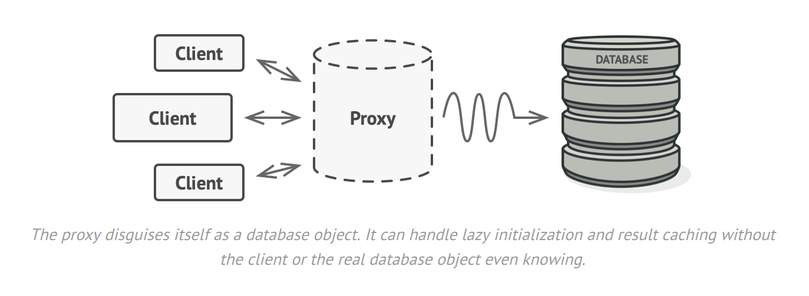

A proxy, in its most general form, is a class functioning as an interface to something else. 

The proxy could interface to anything : a network connection, a large object in memory, a file, or some other resource that is expensive or impossible to duplicate. 

In short, a proxy is a wrapper or agent object that is being called by the client to access the real serving object behind the scenes.

Use of the proxy can simply be forwarding to the real object, or can provide additional logic. 

In the proxy, extra functionality can be provided, for example caching when operations on the real object are resource intensive, or checking preconditions before operations on the real object are invoked. For the client, usage of a proxy object is similar to using the real object, because both implement the same interface. 

A proxy can be used in many ways. It can act as a local representative for an object in a remote address space.

It can represent a large object that should be loaded on demand. It might protect access to a sensitive object.

Proxies provide a level of indirection to specific properties of objects. Hence they can restrict, enhance, or alter these properties.

### Why Proxy Design Pattern ?

- It provides the protection to the original object from the outside world. as it "provides the control for accessing the original object".


### Which Problems Proxy Design Pattern Solves ?

- The access to an object should be controlled.

- Additional functionality should be provided when accessing an object.

When accessing sensitive objects, for example, it should be possible to check that clients have the needed access rights. 

### How Such Problems Proxy Design Pattern Solves ?

Define a separate `Proxy` object that 

- can be used as substitute for another object (`Subject`) and

- implements additional functionality to control the access to this subject.

This makes it possible to work through a `Proxy` object to perform additional functionality when accessing a subject.  For example, to check the access rights of clients accessing a sensitive object. 

To act as substitute for a subject, a proxy must implement the `Subject` interface. `Clients` can't tell whether they work with a subject or its proxy. 


### Real World Usecase Senario

- `Virtual Proxy` scenario ::: Consider a situation where there is multiple database call to extract huge size image. Since this is an expensive operation so here we can use the proxy pattern which would create multiple proxies and point to the huge size memory consuming object for further processing. The real object gets created only when a client first requests/accesses the object and after that we can just refer to the proxy to reuse the object. This avoids duplication of the object and hence saving memory.

- `Protective Proxy` scenario ::: It acts as an authorization layer to verify that whether the actual user has access the appropriate content or not. For example, a proxy server which provides restriction on internet access in office. Only the websites and contents which are valid will be allowed and the remaining ones will be blocked.

- `Remote Proxy` scenario ::: A remote proxy can be thought about the stub in the RPC call. The remote proxy provides a local representation of the object which is present in the different address location. Another example can be providing interface for remote resources such as web service or REST resources.

- `Smart Proxy` scenario ::: A smart proxy provides additional layer of security by interposing specific actions when the object is accessed. For example, to check whether the real object is locked or not before accessing it so that no other objects can change it.


### Structure of Proxy Design Pattern

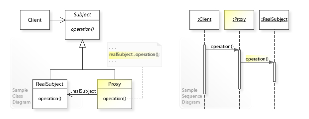

In the above UML class diagram, the `Proxy` class implements the `Subject` interface so that it can act as substitute for `Subject` objects.

It maintains a reference (`realSubject`) to the substituted object (`RealSubject`) so that it can forward requests to it (`realSubject.operation()`). 

The sequence diagram shows the run-time interactions: 

The `Client` object works through a `Proxy` object that controls the access to a `RealSubject` object. 

In this example, the `Proxy` forwards the request to the `RealSubject`, which performs the request. 


### C++ Example

Before C++ example read this ::: https://www.tutorialspoint.com/cplusplus/subscripting_operator_overloading.htm

As we know, a proxy is a class that provides a modified interface to another class. 

Here is an example - suppose we have an array class that we only want to contain binary digits (1 or 0). Here is a first try:

```c++
struct array1 {
    int mArray[10];
    int & operator[](int i) {
      /// what to put here
    }
}; 
```

We want `operator[]` to throw if we say something like `a[1] = 42`, but that isn't possible because that `operator only sees the index` of the array, not the value being stored.

We can solve this using a proxy:

```C++
#include <iostream>
using namespace std;

struct aproxy {
    aproxy(int& r) : mPtr(&r) {}
    void operator = (int n) {
        if (n > 1 || n < 0) {
            throw "not binary digit";
        }
        *mPtr = n;
    }
    int * mPtr;
};

struct array {
    int mArray[10];
    aproxy operator[](int i) {
        return aproxy(mArray[i]);
    }
};

int main() {
    try {
        array a;
        a[0] = 1;   // ok
        a[0] = 42;  // throws exception
    }
    catch (const char * e) {
        cout << e << endl;
    }
}
```

The proxy class now does our checking for a binary digit and we make the array's `operator[]` return an instance of the proxy which has limited access to the array's internals.


### Java Example


- Step 1 ::: Create an OfficeInternetAccess interface.

```java
    public interface OfficeInternetAccess {  
        public void grantInternetAccess();  
}
```  
- Step 2 ::: Create a `RealInternetAccess` class that will implement `OfficeInternetAccess` interface for granting the permission to the specific employee.

```java
public class RealInternetAccess implements OfficeInternetAccess {  
    private String employeeName;  
    public RealInternetAccess(String empName) {  
        this.employeeName = empName;  
    }  
    @Override  
    public void grantInternetAccess() {  
        System.out.println("Internet Access granted for employee: "+ employeeName);  
    }  
}
```

- Step 3 ::: Create a `ProxyInternetAccess` class that will implement `OfficeInternetAccess` interface for providing the object of `RealInternetAccess` class.

```java
public class ProxyInternetAccess implements OfficeInternetAccess {  
           private String employeeName;  
           private RealInternetAccess  realaccess;  
               public ProxyInternetAccess(String employeeName) {  
            this.employeeName = employeeName;  
        }  
        @Override  
        public void grantInternetAccess()   
        {  
            if (getRole(employeeName) > 4)   
            {  
                realaccess = new RealInternetAccess(employeeName);  
                realaccess.grantInternetAccess();  
            }   
            else   
            {  
                System.out.println("No Internet access granted. Your job level is below 5");  
            }  
        }  
        public int getRole(String emplName) {  
            // Check role from the database based on Name and designation  
            // return job level or job designation.  
            return 9;  
        }  
}
```

- Step 4 ::: Now, Create a `ProxyPatternClient` class that can access the internet actually.

```java
    public class ProxyPatternClient {  
        public static void main(String[] args)   
        {  
            OfficeInternetAccess access = new ProxyInternetAccess("Ashwani Rajput");  
            access.grantInternetAccess();  
        }  
    }
```  

// Output

```bash    
No Internet access granted. Your job level is below 5  
```

## Aggregate Design Pattern

## Delegation Design Pattern

## Extensibility Design Pattern

## Marker Design Pattern

## Module Design Pattern

## Pipes and Filters Design Pattern

## Opaque Pointer Design Pattern

## Twin Design Pattern

## Front Controller Design Pattern


# Behavioral Design Patterns

Behavioral design patterns are design patterns that identify `common communication patterns among objects`. By doing so, these patterns increase flexibility in carrying out communication. 

`Behavioral design patterns are concerned with algorithms and the assignment of responsibilities between objects.`

Behavioral patterns describe not just patterns of objects or classes but also the patterns of communication between them. 

These patterns characterize complex control flow that's difficult to follow at run-time. They shift your focus away from flow of control to let you concentrate just on the way objects are interconnected. 

`Behavioral class patterns use inheritance to distribute behavior between classes. `

In these design patterns, the interaction between the objects should be in such a way that they can easily talk to each other and still should be loosely coupled. 

That means the implementation and the client should be loosely coupled in order to avoid hard coding and dependencies.


# Examples of Behavioral Design Patterns

- `Blackboard design pattern` ::: Provides a computational framework for the design and implementation of systems that integrate large and diverse specialized modules, and implement complex, non-deterministic control strategies

- `Chain-of-responsibility pattern` ::: Command objects are handled or passed on to other objects by logic-containing processing objects

- `Command pattern`::: Command objects encapsulate an action and its parameters.
"Externalize the stack" : Turn a recursive function into an iterative function that uses a stack.

- `Interpreter pattern` ::: Implement a specialized computer language to rapidly solve a specific set of problems.

- `Iterator pattern` ::: Iterators are used to access the elements of an aggregate object sequentially without exposing its underlying representation.

- `Mediator pattern` ::: Provides a unified interface to a set of interfaces in a subsystem.

- `Memento pattern` ::: Provides the ability to restore an object to its previous state (rollback).

- `Null object pattern` ::: Designed to act as a default value of an object.

- `Observer pattern` ::: a.k.a. Publish/Subscribe or Event Listener. Objects register to observe an event that may be raised by another object.
"Weak reference pattern" : De-couple an observer from an observable.

- `Protocol stack` ::: Communications are handled by multiple layers, which form an encapsulation hierarchy.

- `Servant` :::  Define common functionality for a group of classes. The servant pattern is also frequently called helper class or utility class implementation for a given set of classes. The helper classes generally have no objects hence they have all static methods that act upon different kinds of class objects.     

- `Scheduled-task pattern` ::: A task is scheduled to be performed at a particular interval or clock time (used in real-time computing).

- `Single-serving visitor pattern` ::: Optimise the implementation of a visitor that is allocated, used only once, and then deleted.

- `Specification pattern` ::: Recombinable business logic in a boolean fashion.

- `Fluent interface` ::: Design an API to be method chained so that it reads like a DSL. Each method call returns a context through which the next logical method call(s) are made available.     

- `State pattern` ::: A clean way for an object to partially change its type at runtime.

- `Strategy pattern` ::: Algorithms can be selected on the fly, using composition.

- `Template method pattern` ::: Describes the skeleton of a program; algorithms can be selected on the fly, using inheritance.

- `Visitor pattern` ::: A way to separate an algorithm from an object.


## Chain of Responsibility Design Pattern

Chain-of-responsibility pattern is a behavioral design pattern consisting of a source of command objects and a series of processing objects.

Each processing object contains logic that defines the types of command objects that it can handle;

the rest are passed to the next processing object in the chain. A mechanism also exists for adding new processing objects to the end of this chain. 

Chain of Responsibility provides even looser coupling.

Avoid coupling the sender of a request to its receiver by giving more than one object a chance to handle the request. Chain the receiving objects and pass the request along the chain until an object handles it. So, This pattern promotes the idea of `loose coupling`. 

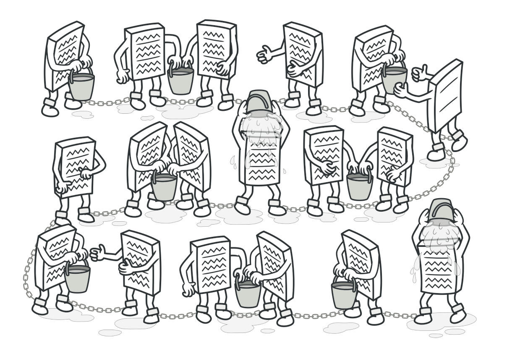

It lets you send requests to an object implicitly through a chain of candidate objects.

Any candidate may fulfill the request depending on run-time conditions. The number of candidates is open-ended, and you can select which candidates participate in the chain at run-time. 

In other words, we can say that normally each receiver contains reference of another receiver. If one object cannot handle the request then it passes the same to the next receiver and so on.

In a variation of the standard chain-of-responsibility model, some handlers may act as `dispatchers`, capable of sending commands out in a variety of directions, forming a tree of responsibility. 

In some cases, this can occur recursively, with processing objects calling higher-up processing objects with commands that attempt to solve some smaller part of the problem; in this case recursion continues until the command is processed, or the entire tree has been explored. 

The chain-of-responsibility pattern is structurally nearly identical to the decorator pattern, the difference being that for the decorator, all classes handle the request, while for the chain of responsibility, exactly one of the classes in the chain handles the request.

However, many implementations (such as loggers below, or UI event handling, or servlet filters in Java, etc.) allow several elements in the chain to take responsibility. 


### Why Chain of Responsibility Design Pattern ?

- It reduces the coupling.

- It adds flexibility while assigning the responsibilities to objects.

- It allows a set of classes to act as one; events produced in one class can be sent to other handler classes with the help of composition.


### Why not Chain of Responsibility Design Pattern ?

- execution of the request isn't garanteed, it may fall off the chain if no object handles it.

- runtime characteristics can be hard to observe and debug.

### Which Problems Chain of Responsibility Design Pattern Solves ?

Implementing a request directly within the class that sends the request is inflexible because it couples the class to a particular receiver and makes it impossible to support multiple receivers.

- Coupling the sender of a request to its receiver should be avoided.

- It should be possible that more than one receiver can handle a request.

### How Such Problems Chain of Responsibility Design Pattern Solves ?

Define a chain of receiver objects having the responsibility, depending on run-time conditions, to either handle a request or forward it to the next receiver on the chain (if any).

This enables us to send a request to a chain of receivers without having to know which one handles the request. The request gets passed along the chain until a receiver handles the request. The sender of a request is no longer coupled to a particular receiver. 

### When Chain of Responsibility Design Pattern can be apply ?

- When more than one object can handle a request and the handler is unknown.
    
- When the group of objects that can handle the request must be specified in dynamic way.


### Real World Implementations of Chain of Responsibility Design Pattern

//MacOS Example

The [Cocoa](https://en.wikipedia.org/wiki/Cocoa_(API)) and [Cocoa Touch](https://en.wikipedia.org/wiki/Cocoa_Touch) frameworks, used for OS X and iOS applications respectively, actively use the chain-of-responsibility pattern for handling events. 

Objects that participate in the chain are called `responder` objects, inheriting from the `NSResponder` (OS X)/`UIResponder` (iOS) class.

All view objects (`NSView`/`UIView`), view controller objects (`NSViewController`/`UIViewController`), window objects (`NSWindow`/`UIWindow`), and the application object (`NSApplication`/`UIApplication`) are responder objects. 

Typically, when a view receives an event which it can't handle, it dispatches it to its superview until it reaches the view controller or window object.

If the window can't handle the event, the event is dispatched to the application object, which is the last object in the chain.  For example :::

- On OS X, moving a textured window with the mouse can be done from any location (not just the title bar), unless on that location there's a view which handles dragging events, like slider controls. If no such view (or superview) is there, dragging events are sent up the chain to the window which does handle the dragging event.

- On iOS, it's typical to handle view events in the view controller which manages the view hierarchy, instead of subclassing the view itself. Since a view controller lies in the responder chain after all of its managed subviews, it can intercept any view events and handle them.


// Java Servlet Example

A very good example are [java servlet filters](http://www.oracle.com/technetwork/java/filters-137243.html) - pieces of code that are executed before the HTTP request arrives at its target.

- the chain contains multiple instances, and each of them performs a different action.

- each instance in the chain can choose to propagate to the next instance, or stop the flow

So, with servlet filters, you can have ::: 

- a filter that checks if the user is authenticated. If he is, the filter propagates to the next filter.

- the next filter checks if the user has permissions to the current resource. If it does, it propagate to the next.

- the next logs the current request URL and the username, and always propagate to the next.

- there is nothing else in the chain, so the target object is finally invoked.


### Structure of Chain of Responsibility Design Pattern

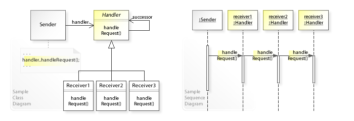

In the above UML class diagram, the `Sender` class doesn't refer to a particular receiver class directly.

Instead, `Sender` refers to the `Handler` interface for handling a request (`handler.handleRequest()`), which makes the `Sender` independent of which receiver handles the request. 

The `Receiver1`, `Receiver2`, and `Receiver3` classes implement the `Handler` interface by either handling or forwarding a request (depending on run-time conditions). 


The UML sequence diagram shows the run-time interactions:

In this example, the `Sender` object calls `handleRequest()` on the `receiver1` object (of type `Handler`). 

The `receiver1` forwards the request to `receiver2`, which in turn forwards the request to `receiver3`, which handles (performs) the request.

### C++ Example

```C++
#include <iostream>
#include <memory>

typedef int Topic;
constexpr Topic NO_HELP_TOPIC = -1;

// defines an interface for handling requests.
class HelpHandler { // Handler
public:
  HelpHandler(HelpHandler* h = nullptr, Topic t = NO_HELP_TOPIC)
    : successor(h), topic(t) {}
  virtual bool hasHelp() {
    return topic != NO_HELP_TOPIC;
  }
  virtual void setHandler(HelpHandler*, Topic) {}
  virtual void handleHelp() {
      std::cout << "HelpHandler::handleHelp\n";
      // (optional) implements the successor link.
      if (successor != nullptr) {
          successor->handleHelp();
      }
  }
  virtual ~HelpHandler() = default;
  HelpHandler(const HelpHandler&) = delete; // rule of three
  HelpHandler& operator=(const HelpHandler&) = delete;
private:
  HelpHandler* successor;
  Topic topic;
};


class Widget : public HelpHandler {
public:
  Widget(const Widget&) = delete; // rule of three
  Widget& operator=(const Widget&) = delete;
protected:
  Widget(Widget* w, Topic t = NO_HELP_TOPIC) 
    : HelpHandler(w, t), parent(nullptr) {
    parent = w;
  }
private:
  Widget* parent;
};

// handles requests it is responsible for.
class Button : public Widget { // ConcreteHandler
public:
  Button(std::shared_ptr<Widget> h, Topic t = NO_HELP_TOPIC) : Widget(h.get(), t) {}
  virtual void handleHelp() {
    // if the ConcreteHandler can handle the request, it does so; otherwise it forwards the request to its successor.
    std::cout << "Button::handleHelp\n";
    if (hasHelp()) {
      // handles requests it is responsible for.
    } else {      
      // can access its successor.
      HelpHandler::handleHelp();
    }
  }
};

class Dialog : public Widget { // ConcreteHandler
public:
  Dialog(std::shared_ptr<HelpHandler> h, Topic t = NO_HELP_TOPIC) : Widget(nullptr) {
    setHandler(h.get(), t);
  }
  virtual void handleHelp() {
    std::cout << "Dialog::handleHelp\n";
    // Widget operations that Dialog overrides...
    if(hasHelp()) {
      // offer help on the dialog
    } else {
      HelpHandler::handleHelp();
    }
  }
};

class Application : public HelpHandler {
public:
  Application(Topic t) : HelpHandler(nullptr, t) {}
  virtual void handleHelp() {
    std::cout << "Application::handleHelp\n";
    // show a list of help topics
  }
};

int main() {
  constexpr Topic PRINT_TOPIC = 1;
  constexpr Topic PAPER_ORIENTATION_TOPIC = 2;
  constexpr Topic APPLICATION_TOPIC = 3;
  // The smart pointers prevent memory leaks.
  std::shared_ptr<Application> application = std::make_shared<Application>(APPLICATION_TOPIC);
  std::shared_ptr<Dialog> dialog = std::make_shared<Dialog>(application, PRINT_TOPIC);
  std::shared_ptr<Button> button = std::make_shared<Button>(dialog, PAPER_ORIENTATION_TOPIC);

  button->handleHelp();
}
```


### Java Example

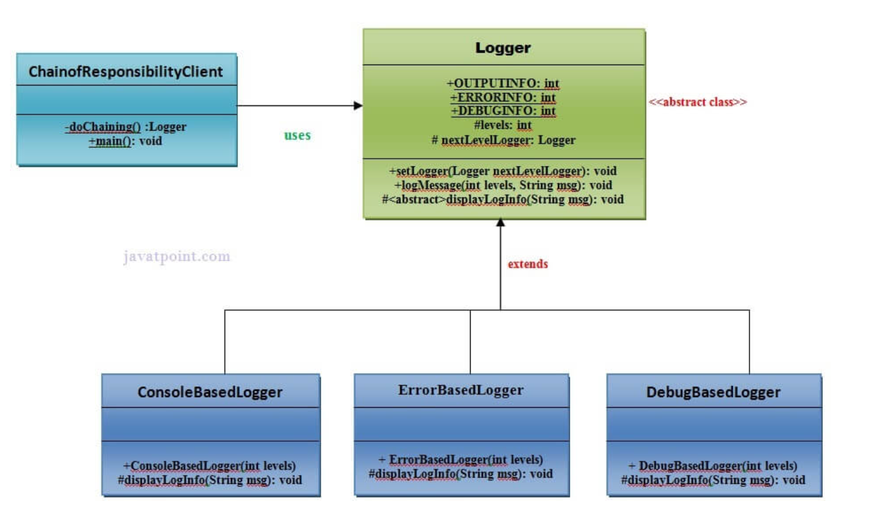


- Step 1 ::: Create a `Logger` abstract class.
```java
    public abstract class Logger {  
        public static int OUTPUTINFO=1;  
        public static int ERRORINFO=2;  
        public static int DEBUGINFO=3;  
        protected int levels;  
        protected Logger nextLevelLogger;  
        public void setNextLevelLogger(Logger nextLevelLogger) {  
            this.nextLevelLogger = nextLevelLogger;  
        }  
            public void logMessage(int levels, String msg){  
            if(this.levels<=levels){  
                displayLogInfo(msg);  
            }  
            if (nextLevelLogger!=null) {  
                nextLevelLogger.logMessage(levels, msg);  
            }  
        }  
        protected abstract void displayLogInfo(String msg);  
    }
```  

- Step 2 :::  Create a `ConsoleBasedLogger` class.

```java
    public class ConsoleBasedLogger extends Logger {  
        public ConsoleBasedLogger(int levels) {  
            this.levels=levels;  
        }  
        @Override  
        protected void displayLogInfo(String msg) {  
            System.out.println("CONSOLE LOGGER INFO: "+msg);  
        }  
    } 
``` 

- Step 3 ::: Create a `DebugBasedLogger` class.

```java
public class DebugBasedLogger extends Logger {  
    public DebugBasedLogger(int levels) {  
        this.levels=levels;  
    }  
    @Override  
    protected void displayLogInfo(String msg) {  
        System.out.println("DEBUG LOGGER INFO: "+msg);  
    }  
}// End of the DebugBasedLogger class.
```

- Step 4 ::: Create a `ErrorBasedLogger` class.

```java
    public class ErrorBasedLogger extends Logger {  
        public ErrorBasedLogger(int levels) {  
            this.levels=levels;  
        }  
        @Override  
        protected void displayLogInfo(String msg) {  
            System.out.println("ERROR LOGGER INFO: "+msg);  
        }  
    }// End of the ErrorBasedLogger class.     
``` 

- Step 5 ::: Create a `ChainOfResponsibilityClient` class.

```java
    public class ChainofResponsibilityClient {  
        private static Logger doChaining(){  
              Logger consoleLogger = new ConsoleBasedLogger(Logger.OUTPUTINFO);  
                
              Logger errorLogger = new ErrorBasedLogger(Logger.ERRORINFO);  
              consoleLogger.setNextLevelLogger(errorLogger);  
                
              Logger debugLogger = new DebugBasedLogger(Logger.DEBUGINFO);  
              errorLogger.setNextLevelLogger(debugLogger);  
                
              return consoleLogger;   
              }  
              public static void main(String args[]){  
              Logger chainLogger= doChaining();  
      
                  chainLogger.logMessage(Logger.OUTPUTINFO, "Enter the sequence of values ");  
                  chainLogger.logMessage(Logger.ERRORINFO, "An error is occured now");  
                  chainLogger.logMessage(Logger.DEBUGINFO, "This was the error now debugging is compeled");  
                  }  
    }
```  

// Output

```bash    
    bilityClient  
    CONSOLE LOGGER INFO: Enter the sequence of values  
    CONSOLE LOGGER INFO: An error is occured now  
    ERROR LOGGER INFO: An error is occured now  
    CONSOLE LOGGER INFO: This was the error now debugging is compeled  
    ERROR LOGGER INFO: This was the error now debugging is compeled  
    DEBUG LOGGER INFO: This was the error now debugging is compeled  
```

## Command Design Pattern

Command pattern is a behavioral design pattern in which an object is used to encapsulate all information needed to perform an action or trigger an event at a later time.

This information includes the method name, the object that owns the method and values for the method parameters. 

It is also known as `Action or Transaction`.

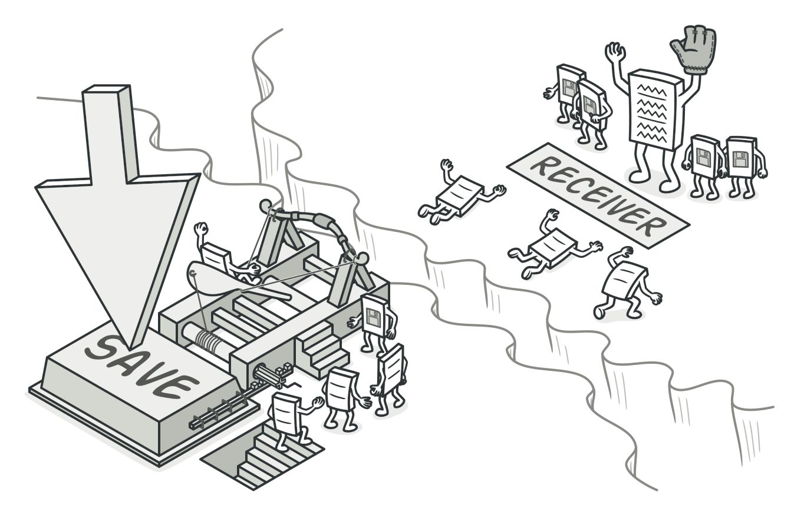

Four terms always associated with the command pattern are `command`, `receiver`, `invoker` and `client`.

A command object knows about receiver and invokes a method of the receiver. 

Values for parameters of the receiver method are stored in the command.

The receiver object to execute these methods is also stored in the command object by aggregation.

The receiver then does the work when the `execute()` method in command is called. 

An invoker object knows how to execute a command, and optionally does bookkeeping about the command execution. 

The invoker does not know anything about a concrete command, it knows only about the command interface. 

Invoker object(s), command objects and receiver objects are held by a client object, the client decides which receiver objects it assigns to the command objects, and which commands it assigns to the invoker. 

The client decides which commands to execute at which points. To execute a command, it passes the command object to the invoker object. 

Using command objects makes it easier to construct general components that need to delegate, sequence or execute method calls at a time of their choosing without the need to know the class of the method or the method parameters.

Using an invoker object allows bookkeeping about command executions to be conveniently performed, as well as implementing different modes for commands, which are managed by the invoker object, without the need for the client to be aware of the existence of bookkeeping or modes. 

The central ideas of this design pattern closely mirror the semantics of first-class functions and higher-order functions in functional programming languages. Specifically, the invoker object is a higher-order function of which the command object is a first-class argument. 

### Why Command Design Pattern ?

- It separates the object that invokes the operation from the object that actually performs the operation.

- It makes easy to add new commands, because existing classes remain unchanged.


### Which Problems Command Design Pattern Solves ?

Implementing (hard-wiring) a request directly into a class is inflexible because it couples the class to a particular request at compile-time, which makes it impossible to specify a request at run-time. 

- Coupling the invoker of a request to a particular request should be avoided. That is, hard-wired requests should be avoided.

- It should be possible to configure an object (that invokes a request) with a request.


### How Such Problems Command Design Pattern Solves ?

- Define separate (command) objects that encapsulate a request.
    
- A class delegates a request to a command object instead of implementing a particular request directly.

This enables one to configure a class with a command object that is used to perform a request. The class is no longer coupled to a particular request and has no knowledge (is independent) of how the request is carried out. 

### When Command Design Pattern can be apply ?

- When you need parameterize objects according to an action perform.
    
- When you need to create and execute requests at different times.
    
- When you need to support rollback, logging or transaction functionality.


### Real World Usecases

- `GUI buttons and menu items` ::: In Swing and Borland Delphi programming, an Action is a command object. In addition to the ability to perform the desired command, an Action may have an associated icon, keyboard shortcut, tooltip text, and so on. A toolbar button or menu item component may be completely initialized using only the Action object.

- `Macro recording`::: If all user actions are represented by command objects, a program can record a sequence of actions simply by keeping a list of the command objects as they are executed. It can then "play back" the same actions by executing the same command objects again in sequence. If the program embeds a scripting engine, each command object can implement a toScript() method, and user actions can then be easily recorded as scripts.

- `Mobile code` ::: Using languages such as Java where code can be streamed/slurped from one location to another via URLClassloaders and Codebases the commands can enable new behavior to be delivered to remote locations (EJB Command, Master Worker).

- `Multi-level undo` ::: If all user actions in a program are implemented as command objects, the program can keep a stack of the most recently executed commands. When the user wants to undo a command, the program simply pops the most recent command object and executes its undo() method.

- `Networking` ::: It is possible to send whole command objects across the network to be executed on the other machines, for example player actions in computer games.

- `Parallel processing` ::: Where the commands are written as tasks to a shared resource and executed by many threads in parallel (possibly on remote machines; this variant is often referred to as the Master/Worker pattern).

- `Progress bars` ::: Suppose a program has a sequence of commands that it executes in order. If each command object has a getEstimatedDuration() method, the program can easily estimate the total duration. It can show a progress bar that meaningfully reflects how close the program is to completing all the tasks.

- `Thread pools` ::: A typical, general-purpose thread pool class might have a public addTask() method that adds a work item to an internal queue of tasks waiting to be done. It maintains a pool of threads that execute commands from the queue. The items in the queue are command objects. Typically these objects implement a common interface such as java.lang.Runnable that allows the thread pool to execute the command even though the thread pool class itself was written without any knowledge of the specific tasks for which it would be used.

- `Transactional behavior`  ::: Similar to undo, a database engine or software installer may keep a list of operations that have been or will be performed. Should one of them fail, all others can be reversed or discarded (usually called rollback). For example, if two database tables that refer to each other must be updated, and the second update fails, the transaction can be rolled back, so that the first table does not now contain an invalid reference.

- `Wizards`  ::: Often a wizard presents several pages of configuration for a single action that happens only when the user clicks the "Finish" button on the last page. In these cases, a natural way to separate user interface code from application code is to implement the wizard using a command object. The command object is created when the wizard is first displayed. Each wizard page stores its GUI changes in the command object, so the object is populated as the user progresses. "Finish" simply triggers a call to execute(). This way, the command class will work.

### Structure of Command Design Pattern

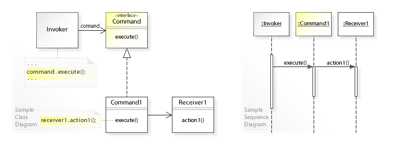

- In the above UML class diagram, the `Invoker` class doesn't implement a request directly. Instead, `Invoker` refers to the `Command` interface to perform a request (`command.execute()`), which makes the `Invoker` independent of how the request is performed.

The `Command1` class implements the `Command` interface by performing an action on a receiver (`receiver1.action1()`). 

- The UML sequence diagram shows the run-time interactions: The `Invoker` object calls `execute()` on a `Command1` object. `Command1` calls `action1()` on a `Receiver1` object, which performs the request. 

### C++ Example

```C++
#include <iostream>
#include <memory>

class Command {
public:
  // declares an interface for executing an operation.
  virtual void execute() = 0;
  virtual ~Command() = default;
protected:
  Command() = default;
};

template <typename Receiver>
class SimpleCommand : public Command { // ConcreteCommand
public:
  typedef void (Receiver::* Action)();
  // defines a binding between a Receiver object and an action.
  SimpleCommand(std::shared_ptr<Receiver> receiver_, Action action_) :
    receiver(receiver_.get()), action(action_) { }
  SimpleCommand(const SimpleCommand&) = delete; // rule of three
  const SimpleCommand& operator=(const SimpleCommand&) = delete;
  // implements execute by invoking the corresponding operation(s) on Receiver.
  virtual void execute() {
    (receiver->*action)();
  }
private:
  Receiver* receiver;
  Action action;
};

class MyClass { // Receiver
public:
  // knows how to perform the operations associated with carrying out a request. Any class may serve as a Receiver.
  void action() {
    std::cout << "MyClass::action\n";
  }
};

int main() {
  // The smart pointers prevent memory leaks.
  std::shared_ptr<MyClass> receiver = std::make_shared<MyClass>();
  // ...
  std::unique_ptr<Command> command = std::make_unique<SimpleCommand<MyClass> >(receiver, &MyClass::action);
  // ...
  command->execute();
}
```

// Output 

```bash 
MyClass::action
```

### Java Example

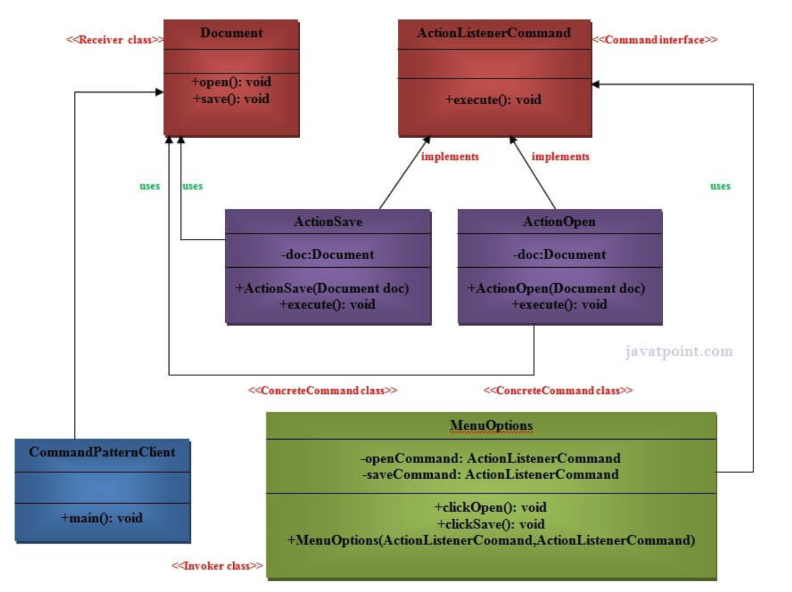

These are the following participants of the Command Design pattern:

- `Command` :::  This is an interface for executing an operation.
    
- `ConcreteCommand` ::: This class extends the `Command` interface and implements the execute method. This class creates a binding between the action and the receiver.
    
- `Client` ::: This class creates the `ConcreteCommand` class and associates it with the receiver.
    
- `Invoker` ::: This class asks the command to carry out the request.
    
- `Receiver` ::: This class knows to perform the operation.


// Step 1 ::: Create a `ActionListernerCommand` interface that will act as a Command.

```java
public interface ActionListenerCommand {  
    public void execute();  
} 
```

// Step 2 ::: Create a `Document` class that will act as a Receiver.

```java
public class Document {  
          public void open(){  
           System.out.println("Document Opened");  
       }  
       public void save(){  
           System.out.println("Document Saved");  
       }  
}
```

// Step 3 ::: Create a `ActionOpen` class that will act as an ConcreteCommand.

```java
    public class ActionOpen implements ActionListenerCommand{  
        private Document doc;  
        public ActionOpen(Document doc) {  
            this.doc = doc;  
        }  
        @Override  
        public void execute() {  
            doc.open();  
        }  
    }
```

// Step 4 ::: Create a `ActionSave` class that will act as an ConcreteCommand.

```java
public class ActionSave implements ActionListenerCommand{  
   private Document doc;  
   public ActionSave(Document doc) {  
        this.doc = doc;  
    }  
    @Override  
    public void execute() {  
        doc.save();  
    }  
}
```

// Step 5 ::: Create a `MenuOptions` class that will act as an Invoker.

```java
public class ActionSave implements ActionListenerCommand{  
   private Document doc;  
    public ActionSave(Document doc) {  
        this.doc = doc;  
    }  
    @Override  
    public void execute() {  
        doc.save();  
    }  
}
```

// Step 6 ::: Create a `CommanPatternClient` class that will act as a Client.

```java
    public class CommandPatternClient {  
        public static void main(String[] args) {  
            Document doc = new Document();  
              
            ActionListenerCommand clickOpen = new ActionOpen(doc);  
            ActionListenerCommand clickSave = new ActionSave(doc);  
              
            MenuOptions menu = new MenuOptions(clickOpen, clickSave);  
              
            menu.clickOpen();  
            menu.clickSave();  
       }  
    } 
```

// Output

```bash
Document Opened  
Document Saved 
```

## Interpreter Design Pattern

Dictionary Meaning ::: a program that can analyse and execute a program line by line.

Interpreter pattern is a design pattern that specifies how to evaluate sentences in a language.

Means It defines grammar of a language.

It represents a grammar as a class hierarchy and implements an interpreter as an operation on instances of these classes.

The basic idea is to have a class for each symbol (terminal or nonterminal) in a specialized computer language.

The syntax tree of a sentence in the language is an instance of the composite pattern and is used to evaluate (interpret) the sentence for a client.


### Why Interpreter Design Pattern ?

- It is easier to change and extend the grammar.
    
- Implementing the grammar is straightforward.


### Which Problems Interpreter Design Pattern Solves ?

When a problem occurs very often, it could be considered to represent it as a sentence in a simple language (Domain Specific Languages) so that an interpreter can solve the problem by interpreting the sentence. 

For example, when many different or complex search expressions must be specified. Implementing (hard-wiring) them directly into a class is inflexible because it commits the class to particular expressions and makes it impossible to specify new expressions or change existing ones independently from (without having to change) the class. 

- A grammar for a simple language should be defined.

- so that sentences in the language can be interpreted.

### How Such Problems Interpreter Design Pattern Solves ?

- Define a grammar for a simple language by defining an `Expression` class hierarchy and implementing an `interpret()` operation.

- Represent a sentence in the language by an abstract syntax tree (AST) made up of `Expression` instances.

- Interpret a sentence by calling `interpret()` on the AST.

The expression objects are composed recursively into a composite/tree structure that is called abstract syntax tree (see Composite pattern). 

The Interpreter pattern doesn't describe how to build an abstract syntax tree. This can be done either manually by a client or automatically by a parser. 


### When Interpreter Design Pattern can be apply ?

The interpreter pattern can be used on domain problems which can be expressed in simple language/sentences. Then the problems can be solved by interpreting these sentences. So we get an input, we can understand (interpret) it and then implement certain behaviour based on the interpretation/categorization of the input. 

In interpreter the driver of the behaviour is based on what the input is, the interpretation/categorization of the input.

Basically the Interpreter pattern has limited area where it can be applied. We can discuss the Interpreter pattern only in terms of formal grammars but in this area there are better solutions that is why it is not frequently used.

This pattern can applied for `parsing` the expressions defined in simple grammars and sometimes in simple rule engines.


### Real World Usecases

- Specialized database query languages such as `SQL`.

- Specialized computer languages that are often used to describe `communication protocols`.

- Most general-purpose computer languages actually incorporate several specialized languages

### Structure of Interpreter Design Pattern

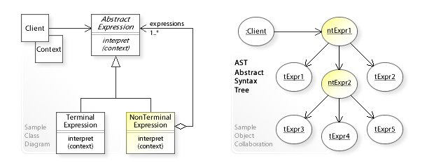

In the above UML class diagram, the `Client` class refers to the common `AbstractExpression` interface for interpreting an expression `interpret(context)`. 

The `TerminalExpression` class has no children and interprets an expression directly. 

The `NonTerminalExpression` class maintains a container of child expressions (`expressions`) and forwards interpret requests to these `expressions`.

The object collaboration diagram shows the run-time interactions: The `Client` object sends an interpret request to the abstract syntax tree. The request is forwarded to (performed on) all objects downwards the tree structure.

The `NonTerminalExpression` objects (`ntExpr1`,`ntExpr2`) forward the request to their child expressions. 

The `TerminalExpression` objects (`tExpr1`,`tExpr2`,…) perform the interpretation directly. 


### C++ Example

```C++
#include <iostream>
#include <map>
#include <cstring>

class Context;

class BooleanExp {
public:
  BooleanExp() = default;
  virtual ~BooleanExp() = default;
  virtual bool evaluate(Context&) = 0;
  virtual BooleanExp* replace(const char*, BooleanExp&) = 0;
  virtual BooleanExp* copy() const = 0;
};

class VariableExp;

class Context {
public:
  Context() :m() {}
  bool lookup(const VariableExp* key) { return m.at(key); }
  void assign(VariableExp* key, bool value) { m[key] = value; }
private:
  std::map<const VariableExp*, bool> m;
};

class VariableExp : public BooleanExp {
public:
  VariableExp(const char* name_) :name(nullptr) {
    name = strdup(name_);
  }
  virtual ~VariableExp() = default;
  virtual bool evaluate(Context& aContext) {
    return aContext.lookup(this);
  }
  virtual BooleanExp* replace( const char* name_, BooleanExp& exp ) {
    if (0 == strcmp(name_, name)) {
      return exp.copy();
    } else {
      return new VariableExp(name);
    }
  }
  virtual BooleanExp* copy() const {
    return new VariableExp(name);
  }
  VariableExp(const VariableExp&) = delete; // rule of three
  VariableExp& operator=(const VariableExp&) = delete;
private:
  char* name;
};

class AndExp : public BooleanExp {
public:
  AndExp(BooleanExp* op1, BooleanExp* op2)
    :operand1(nullptr), operand2(nullptr) {
    operand1 = op1;
    operand2 = op2;
  }
  virtual ~AndExp() = default;
  virtual bool evaluate(Context& aContext) {
    return operand1->evaluate(aContext) && operand2->evaluate(aContext);
  }
  virtual BooleanExp* replace(const char* name_, BooleanExp& exp) {
    return new AndExp(
        operand1->replace(name_, exp),
        operand2->replace(name_, exp)
      );
  }
  virtual BooleanExp* copy() const {
    return new AndExp(operand1->copy(), operand2->copy());
  }
  AndExp(const AndExp&) = delete; // rule of three
  AndExp& operator=(const AndExp&) = delete;
private:
  BooleanExp* operand1;
  BooleanExp* operand2;
};

int main() {
  BooleanExp* expression;
  Context context;
  VariableExp* x = new VariableExp("X");
  VariableExp* y = new VariableExp("Y");
  expression = new AndExp(x, y);

  context.assign(x, false);
  context.assign(y, true);
  bool result = expression->evaluate(context);
  std::cout << result << '\n';

  context.assign(x, true);
  context.assign(y, true);
  result = expression->evaluate(context);
  std::cout << result << '\n';
}
```

// Output 

```bash
0
1
```

### Java Example

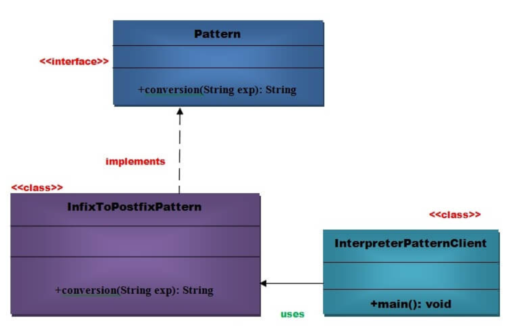

- Step 1 ::: Create a `Pattern` interface.

```java
public interface Pattern {  
    public String conversion(String exp);  
}
```

- Step 2 ::: Create a `InfixToPostfixPattern` class that will allow what kind of pattern you want to convert.
```java
import java.util.Stack;  
public class InfixToPostfixPattern implements Pattern{  
    @Override  
    public String conversion(String exp) {  
       int priority = 0;// for the priority of operators.  
       String postfix = "";  
        Stack<Character> s1 = new Stack<Character>();  
       for (int i = 0; i < exp.length(); i++)  
        {  
           char ch = exp.charAt(i);  
           if (ch == '+' || ch == '-' || ch == '*' || ch == '/'||ch=='%')  
           {  
              // check the precedence  
              if (s1.size() <= 0)  
                 s1.push(ch);  
           }  
           else  
              {  
                 Character chTop = (Character) s1.peek();  
                 if (chTop == '*' || chTop == '/')  
                    priority = 1;  
                 else  
                    priority = 0;  
                 if (priority == 1)  
                 {  
                    if (ch == '*' || ch == '/'||ch=='%')  
                    {  
                       postfix += s1.pop();  
                                                  i--;  
                    }  
                    else  
                    { // Same  
                       postfix += s1.pop();  
                       i--;  
                    }  
                 }  
                 else  
                 {  
                    if (ch == '+' || ch == '-')  
                    {  
                       postfix += s1.pop();  
                       s1.push(ch);  
                    }  
                    else  
                       s1.push(ch);  
                 }  
              }  
           }  
           else  
           {               
              postfix += ch;  
           }  
        }  
        int len = s1.size();  
        for (int j = 0; j < len; j++)  
           postfix += s1.pop();  
        return postfix;  
          
    } // End of the InfixToPostfixPattern class.
```

- Step 3 ::: Create a `InterpreterPatternClient` class that will use `InfixToPostfix` Conversion.

```java
public class InterpreterPatternClient {  
     public static void main(String[] args)  
        {  
            String infix = "a+b*c";  
              
            InfixToPostfixPattern ip=new InfixToPostfixPattern();  
              
            String postfix = ip.conversion(infix);  
            System.out.println("Infix:   " + infix);  
            System.out.println("Postfix: " + postfix);  
       }  
}
```

// Output

```bash
Infix:   a+b*c  
Postfix: abc*+ 
```

## Iterator Design Pattern

Iterator is a behavioral design pattern that lets you traverse elements of a collection without exposing its underlying representation (list, stack, tree, etc.).

Provide a way to access the elements of an aggregate object sequentially without exposing its underlying representation. 

So, Iterator abstracts the way you access and traverse objects in an aggregate. 

an iterator is used to traverse a container and access the container's elements.

The Iterator pattern is also known as `Cursor`. // so try to relate it as ietrator given by STL in c++ for any Data structure.

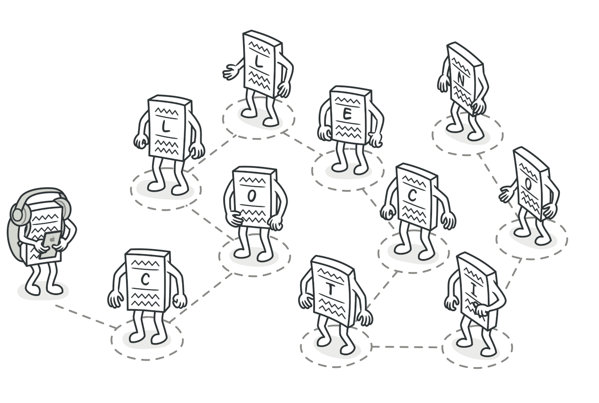

The iterator pattern decouples algorithms from containers; in some cases, algorithms are necessarily container-specific and thus cannot be decoupled. 

For example, the hypothetical algorithm SearchForElement can be implemented generally using a specified type of iterator rather than implementing it as a container-specific algorithm. This allows SearchForElement to be used on any container that supports the required type of iterator.

### Why Iterator Design Pattern ?

- It supports variations in the traversal of a collection.
    
- It simplifies the interface to the collection.


### Which Problems Iterator Design Pattern Solves ?

- The elements of an aggregate object should be accessed and traversed without exposing its representation (`data structures`).

- New traversal operations should be defined for an aggregate object without changing its interface.

Defining access and traversal operations in the aggregate interface is inflexible because it commits the aggregate to particular access and traversal operations and makes it impossible to add new operations later without having to change the aggregate interface. 

### How Such Problems Iterator Design Pattern Solves ?

- Define a separate (iterator) object that encapsulates accessing and traversing an aggregate object.

- Clients use an iterator to access and traverse an aggregate without knowing its representation (data structures).

Different iterators can be used to access and traverse an aggregate in different ways. 

New access and traversal operations can be defined independently by defining new iterators. 

### When Iterator Design Pattern can be apply ?

- When you want to access a collection of objects without exposing its internal representation.
    
- When there are multiple traversals of objects need to be supported in the collection.


### Structure of Iterator Design Pattern

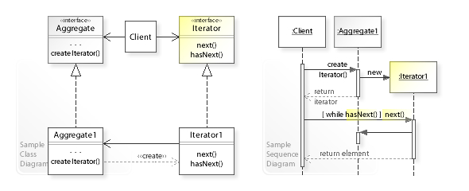

In the above UML class diagram, the `Client` class refers (1) to the `Aggregate` interface for creating an `Iterator` object (`createIterator()`) and (2) to the `Iterator` interface for traversing an `Aggregate` object (`next()`,`hasNext()`). 

The `Iterator1` class implements the `Iterator` interface by accessing the `Aggregate1` class. 

The UML sequence diagram shows the run-time interactions: The `Client` object calls `createIterator()` on an `Aggregate1` object, which creates an `Iterator1` object and returns it to the `Client`. The `Client` uses then `Iterator1` to traverse the elements of the `Aggregate1` object. 


### C++ Example

C++ implements iterators with the semantics of pointers in that language. 

In C++, a class can overload all of the pointer operations, so an iterator can be implemented that acts more or less like a pointer, complete with dereference, increment, and decrement.

This has the advantage that C++ algorithms such as `std::sort` can immediately be applied to plain old memory buffers, and that there is no new syntax to learn.

However, it requires an "end" iterator to test for equality, rather than allowing an iterator to know that it has reached the end.

In C++ language, we say that an iterator models the iterator concept. 

```C++
#include <iostream>
#include <stdexcept>
#include <initializer_list>
		
class Vector {
public:
  using iterator = double*;
  iterator begin() { return elem; }
  iterator end() { return elem + sz; }
  
  Vector(std::initializer_list<double> lst) :elem(nullptr), sz(0) {
    sz = lst.size();
    elem = new double[sz];
    double* p = elem;
    for (auto i = lst.begin(); i != lst.end(); ++i, ++p) {
      *p = *i;
    }
  }  
  ~Vector() { delete[] elem; }
  int size() const { return sz; }
  double& operator[](int n) {
    if (n < 0 || n >= sz) throw std::out_of_range("Vector::operator[]");
    return elem[n];
  }
  Vector(const Vector&) = delete; // rule of three
  Vector& operator=(const Vector&) = delete;
private:
  double* elem;
  int sz;
};

int main() {
  Vector v = {1.1*1.1, 2.2*2.2};
  
  for (const auto& x : v) {
    std::cout << x << '\n';
  }
  for (auto i = v.begin(); i != v.end(); ++i) {
    std::cout << *i << '\n';
  }
  for (auto i = 0; i <= v.size(); ++i) {
    std::cout << v[i] << '\n';
  } 
}
```

// Output

```bash
1.21
4.84
1.21
4.84
1.21
4.84
terminate called after throwing an instance of 'std::out_of_range'
  what():  Vector::operator[]
```

### Java Example

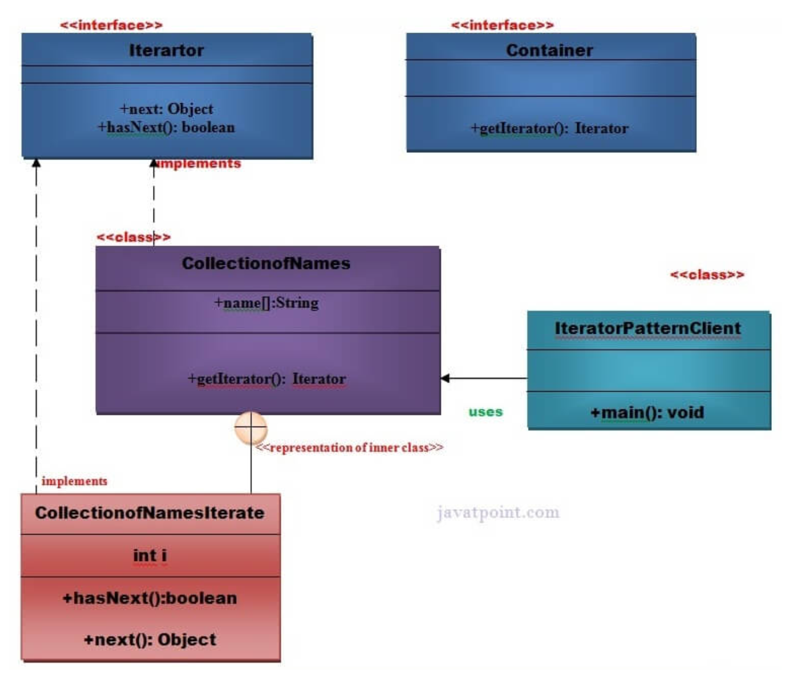

- Step 1 ::: Create a `Iterartor` interface.

```java
    public interface Iterator {  
        public boolean hasNext();  
        public Object next();  
    }
```  

- Step 2 ::: Create a `Container` interface.

```java
    public interface Container {  
        public Iterator getIterator();  
    }// End of the Iterator interface.
```  

- Step 3 ::: Create a `CollectionofNames` class that will implement `Container` interface.

```java

    public class CollectionofNames implements Container {  
    public String name[]={"Ashwani Rajput", "Soono Jaiswal","Rishi Kumar","Rahul Mehta","Hemant Mishra"};   
          
    @Override  
        public Iterator getIterator() {  
            return new CollectionofNamesIterate() ;  
        }  
        private class CollectionofNamesIterate implements Iterator{  
            int i;  
            @Override  
            public boolean hasNext() {  
                if (i<name.length){  
                    return true;  
                }  
                return false;  
            }  
            @Override  
            public Object next() {  
                if(this.hasNext()){  
                    return name[i++];  
                }  
                return null;      
            }  
        }  
    }  
```

- Step 4 ::: Create a `IteratorPatternDemo` class.

```java
    public class IteratorPatternDemo {  
        public static void main(String[] args) {  
              CollectionofNames cmpnyRepository = new CollectionofNames();  
                
              for(Iterator iter = cmpnyRepository.getIterator(); iter.hasNext();){  
                  String name = (String)iter.next();  
                  System.out.println("Name : " + name);  
               }      
        }  
    }
```  

// Output

```bash
Name : Ashwani Rajput  
Name : Soono Jaiswal  
Name : Rishi Kumar  
Name : Rahul Mehta  
Name : Hemant Mishra
```

## Mediator Design Pattern

Mediator pattern defines an object that encapsulates how a set of objects interact. 

This pattern is considered to be a behavioral pattern due to the way it can alter the program's running behavior.

The mediator provides the indirection needed for `loose coupling`. 

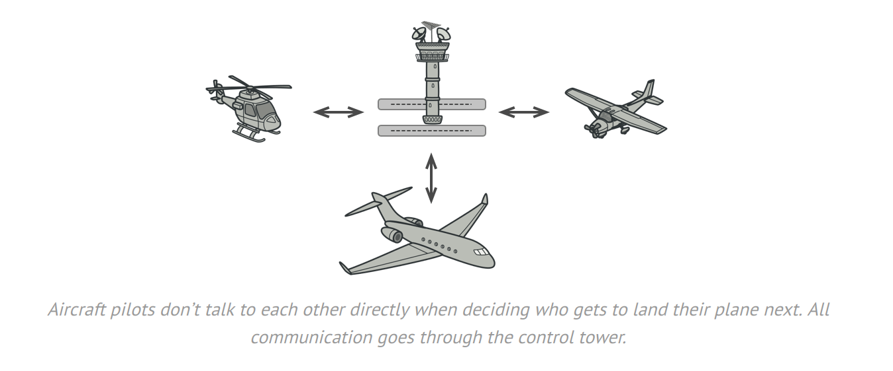

Mediator promotes loose coupling by keeping objects from referring to each other explicitly, and it allows their interaction to vary independently. 

In object-oriented programming, programs often consist of many classes. Business logic and computation are distributed among these classes. However, as more classes are added to a program, especially during maintenance and/or refactoring, the problem of communication between these classes may become more complex. This makes the program harder to read and maintain. Furthermore, it can become difficult to change the program, since any change may affect code in several other classes. 

With the mediator pattern, communication between objects is encapsulated within a mediator object.

Objects no longer communicate directly with each other, but instead communicate through the mediator. This reduces the dependencies between communicating objects, thereby reducing coupling. 

The essence of the mediator pattern is to "define an object that encapsulates how a set of objects interact". It promotes loose coupling by keeping objects from referring to each other explicitly, and it allows their interaction to be varied independently.Client classes can use the mediator to send messages to other clients, and can receive messages from other clients via an event on the mediator class. 

### Why Mediator Design Pattern ?

- It decouples the number of classes.

- It simplifies object protocols.

- It centralizes the control.

- The individual components become simpler and much easier to deal with because they don't need to pass messages to one another.

- The components don't need to contain logic to deal with their intercommunication and therefore, they are more generic. 

### Which Problems Mediator Design Pattern Solves ?

Tightly coupled objects are hard to implement, change, test, and reuse because they refer to and know about many different objects. 

- Tight coupling between a set of interacting objects should be avoided.
    
- It should be possible to change the interaction between a set of objects independently.

Defining a set of interacting objects by accessing and updating each other directly is inflexible because it tightly couples the objects to each other and makes it impossible to change the interaction independently from (without having to change) the objects. And it stops the objects from being reusable and makes them hard to test. 

### How Such Problems Mediator Design Pattern Solves ?

- Define a separate (mediator) object that encapsulates the interaction between a set of objects.
    
- Objects delegate their interaction to a mediator object instead of interacting with each other directly.

The objects interact with each other indirectly through a mediator object that controls and coordinates the interaction. 

This makes the objects loosely coupled. They only refer to and know about their mediator object and have no explicit knowledge of each other. 

### When Mediator Design Pattern can be apply ?

- It is commonly used in message-based systems likewise chat applications.
    
- When the set of objects communicate in complex but in well-defined ways.

### Structure of Mediator Design Pattern

::: Participants :::

- `Mediator` :::  defines the interface for communication between Colleague objects

- `ConcreteMediator` ::: implements the mediator interface and coordinates communication between Colleague objects. It is aware of all of the Colleagues and their purposes with regards to inter-communication.

- `Colleague` ::: defines the interface for communication with other Colleagues through its Mediator

- `ConcreteColleague` ::: implements the Colleague interface and communicates with other Colleagues through its Mediator 

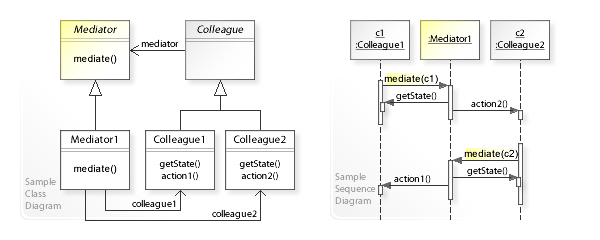

In the above UML class diagram, the `Colleague1` and `Colleague2` classes do not refer to (and update) each other directly. Instead, they refer to the common `Mediator` interface for controlling and coordinating interaction (`mediate()`), which makes them independent from one another with respect to how the interaction is carried out. 

The `Mediator1` class implements the interaction between `Colleague1` and `Colleague2`. 

The UML sequence diagram shows the run-time interactions. In this example, a `Mediator1` object mediates (controls and coordinates) the interaction between `Colleague1` and `Colleague2` objects. 

Assuming that Colleague1 wants to interact with `Colleague2` (to update/synchronize its state, for example), `Colleague1` calls mediate(this) on the `Mediator1` object, which gets the changed data from `Colleague1` and performs an `action2()` on `Colleague2`.

Thereafter, `Colleague2` calls mediate(this) on the `Mediator1` object, which gets the changed data from `Colleague2` and performs an `action1()` on `Colleague1`. 


### C++ Example

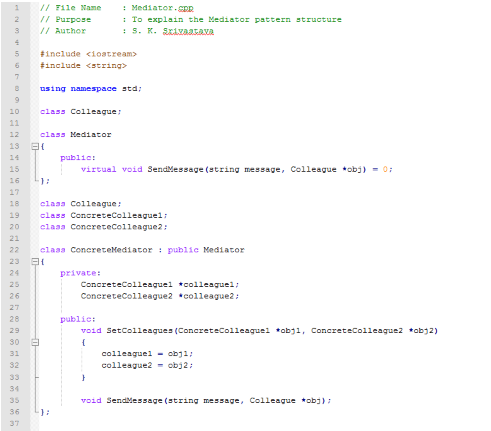

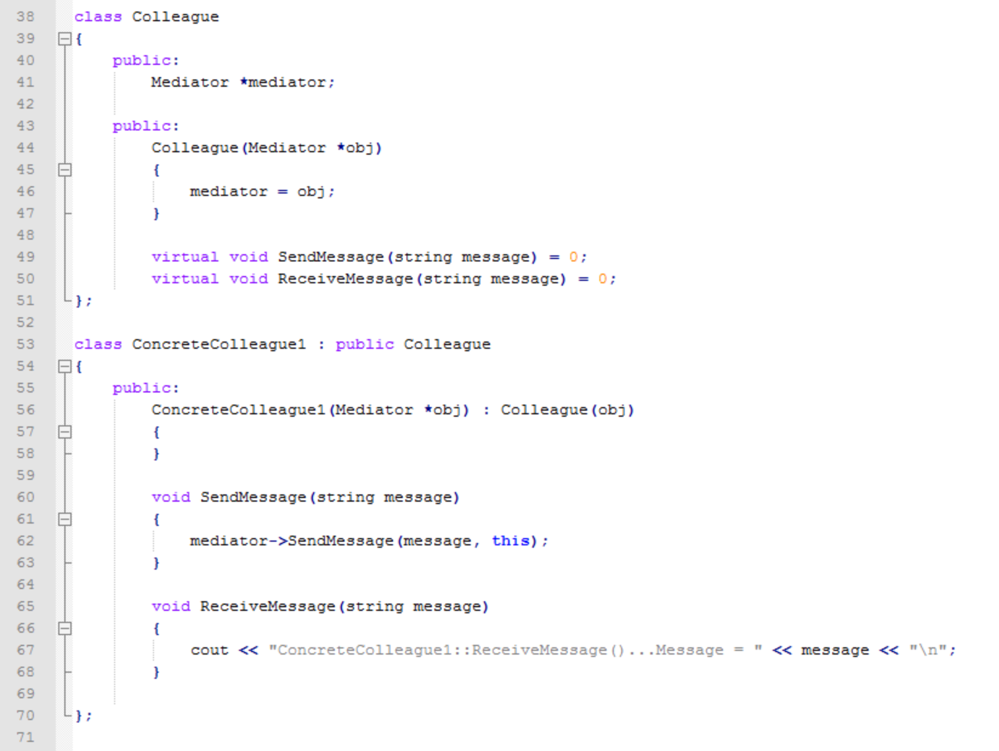

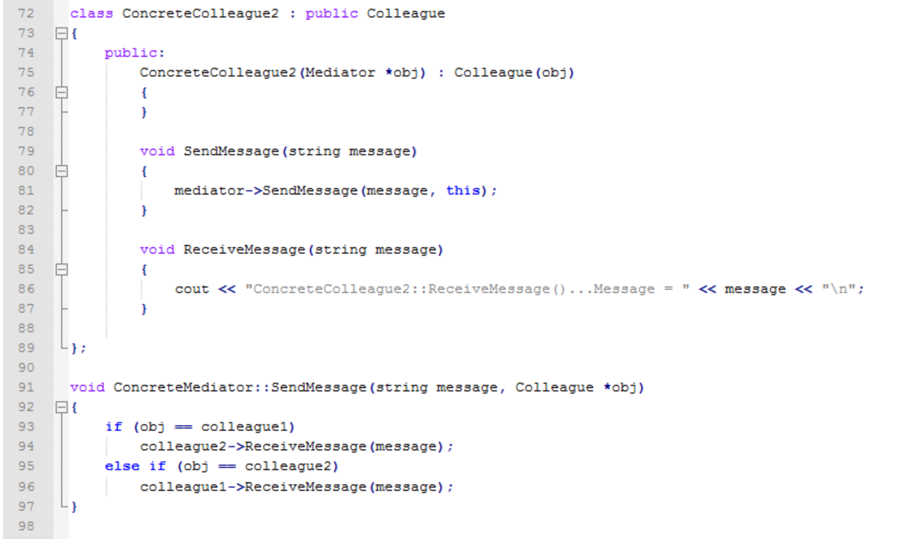

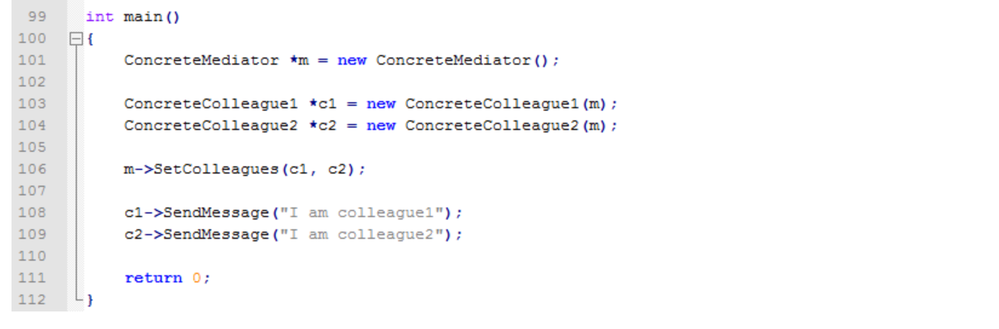

// Output

```bash
ConcreteColleague2::ReceiveMessage()...Message = I am colleague1
ConcreteColleague1::ReceiveMessage()...Message = I am colleague2
```

### Java Example

In the following example, a Mediator object controls the values of several Storage objects, forcing the user code to access the stored values through the mediator. When a storage object wants to emit an event indicating that its value has changed, it also goes back to the mediator object (via the method notifyObservers) that controls the list of the observers (implemented using the observer pattern). 

```java
import java.util.HashMap;
import java.util.Optional;
import java.util.concurrent.CopyOnWriteArrayList;
import java.util.function.Consumer;

class Storage<T> {
    T value;
    
    T getValue() {
        return value;
    }
    void setValue(Mediator<T> mediator, String storageName, T value) {
        this.value = value;
        mediator.notifyObservers(storageName);
    }
}

class Mediator<T> {
    private final HashMap<String, Storage<T>> storageMap = new HashMap<>();
    private final CopyOnWriteArrayList<Consumer<String>> observers = new CopyOnWriteArrayList<>();
    
    public void setValue(String storageName, T value) {
        Storage storage = storageMap.computeIfAbsent(storageName, name -> new Storage<>());
        storage.setValue(this, storageName, value);
    }
    
    public Optional<T> getValue(String storageName) {
        return Optional.ofNullable(storageMap.get(storageName)).map(Storage::getValue);
    }
    
    public void addObserver(String storageName, Runnable observer) {
        observers.add(eventName -> {
            if (eventName.equals(storageName)) {
                observer.run();
            }
        });
    }
    
    void notifyObservers(String eventName) {
        observers.forEach(observer -> observer.accept(eventName));
    }
}

public class MediatorDemo {
    public static void main(String[] args) {
        Mediator<Integer> mediator = new Mediator<>();
        mediator.setValue("bob", 20);
        mediator.setValue("alice", 24);
        mediator.getValue("alice").ifPresent(age -> System.out.println("age for alice: " + age));
        
        mediator.addObserver("bob", () -> {
            System.out.println("new age for bob: " + mediator.getValue("bob").orElseThrow(RuntimeException::new));
        });
        mediator.setValue("bob", 21);
    }
}
```


### Another Java Example

::: Participants :::

- `ApnaChatroom` :- defines the interface for interacting with participants.

- `ApnaChatroomImpl` :- implements the operations defined by the Chatroom interface. The operations are managing the interactions between the objects: when one participant sends a message, the message is sent to the other participants.

- `Participant` :- defines an interface for the users involved in chatting.

- `User1`, `User2`, ...`UserN` :- implements Participant interface; the participant can be a number of users involved in chatting. But each Participant will keep only a reference to the ApnaChatRoom.

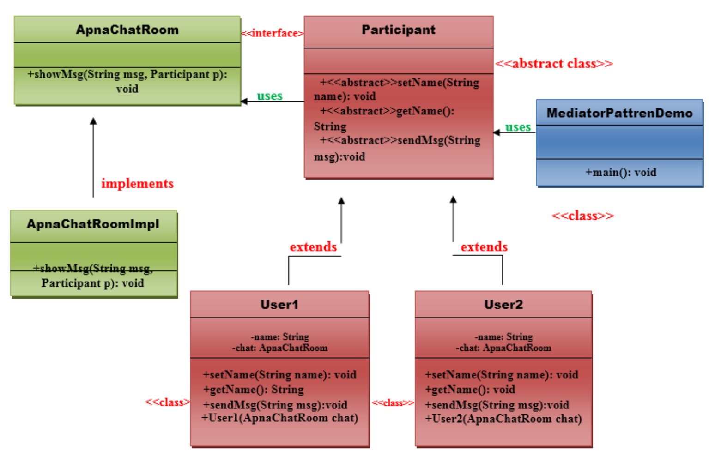


- Step 1 ::: Create a `ApnaChatRoom` interface.

```java
    //This is an interface.  
    public interface ApnaChatRoom {  
          
        public void showMsg(String msg, Participant p);  
      
    }// End of the ApnaChatRoom interface. 
``` 

- Step 2 ::: Create a `ApnaChatRoomIml` class that will implement `ApnaChatRoom` interface and will also use the number of participants involved in chatting through `Participant` interface. 

```java
//This is a class.  
import java.text.DateFormat;  
import java.text.SimpleDateFormat;  
import java.util.Date;  
  
public class ApnaChatRoomImpl implements ApnaChatRoom{  
    //get current date time   
    DateFormat dateFormat = new SimpleDateFormat("E dd-MM-yyyy hh:mm a");  
    Date date = new Date();  
    @Override  
    public void showMsg(String msg, Participant p) {  
          
        System.out.println(p.getName()+"'gets message: "+msg);  
        System.out.println("\t\t\t\t"+"["+dateFormat.format(date).toString()+"]");    
    }     
}// End of the ApnaChatRoomImpl class.
```

- Step 3 ::: Create a `Participant` abstract class.

```java
    //This is an abstract class.  
    public abstract class Participant {  
          public abstract void sendMsg(String msg);  
          public abstract void setname(String name);  
          public abstract String getName();  
    }// End of the Participant abstract class.
``` 

- Step 4 ::: Create a `User1` class that will extend `Participant` abstract class and will use the `ApnaChatRoom` interface.

```java
public class User1 extends Participant {  
      
    private String name;  
    private ApnaChatRoom chat;  
      
    @Override  
    public void sendMsg(String msg) {  
    chat.showMsg(msg,this);  
          
    }  
  
    @Override  
    public void setname(String name) {  
        this.name=name;  
    }  
  
    @Override  
    public String getName() {  
        return name;  
    }  
      
    public User1(ApnaChatRoom chat){  
        this.chat=chat;  
    }     
      
}// End of the User1 class.
public class User1 extends Participant {  
      
    private String name;  
    private ApnaChatRoom chat;  
      
    @Override  
    public void sendMsg(String msg) {  
    chat.showMsg(msg,this);  
          
    }  
  
    @Override  
    public void setname(String name) {  
        this.name=name;  
    }  
  
    @Override  
    public String getName() {  
        return name;  
    }  
      
    public User1(ApnaChatRoom chat){  
        this.chat=chat;  
    }     
      
}// End of the User1 class. 
```

- Step 5 ::: Create a `User2` class that will extend `Participant` abstract class and will use the `ApnaChatRoom` interface.

```java  
public class User2 extends Participant {  
  
    private String name;  
    private ApnaChatRoom chat;  
      
    @Override  
    public void sendMsg(String msg) {  
    this.chat.showMsg(msg,this);  
          
    }  
  
    @Override  
    public void setname(String name) {  
        this.name=name;  
    }  
  
    @Override  
    public String getName() {  
        return name;  
    }  
      
    public User2(ApnaChatRoom chat){  
        this.chat=chat;  
    }  
  
      
      
}  
// End of the User2 class. 
``` 

- Step 6 ::: Create a `MediatorPatternDemo` class that will use participants involved in chatting.

```java
public class MediatorPatternDemo {  
      
    public static void main(String args[])  
    {  
          
          ApnaChatRoom chat = new ApnaChatRoomImpl();  
      
          User1 u1=new User1(chat);  
          u1.setname("Ashwani Rajput");  
          u1.sendMsg("Hi Ashwani! how are you?");  
        
                
          User2 u2=new User2(chat);  
          u2.setname("Soono Jaiswal");  
          u2.sendMsg("I am Fine ! You tell?");  
    }  
  
}// End of the MediatorPatternDemo class. 
```

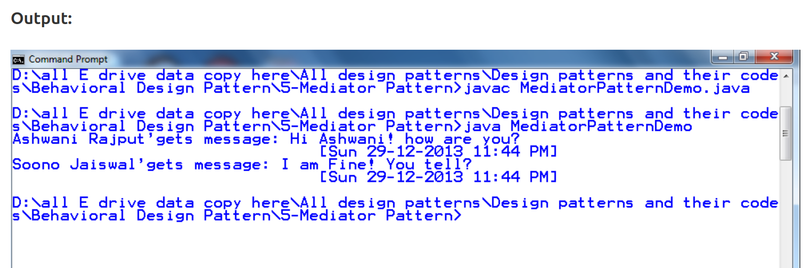

## Memento Design Pattern

Memento pattern is a software design pattern that exposes the `private internal state` of an object.

One example of how this can be used is to restore an object to its previous state (undo via rollback), another is versioning, another is custom serialization. 

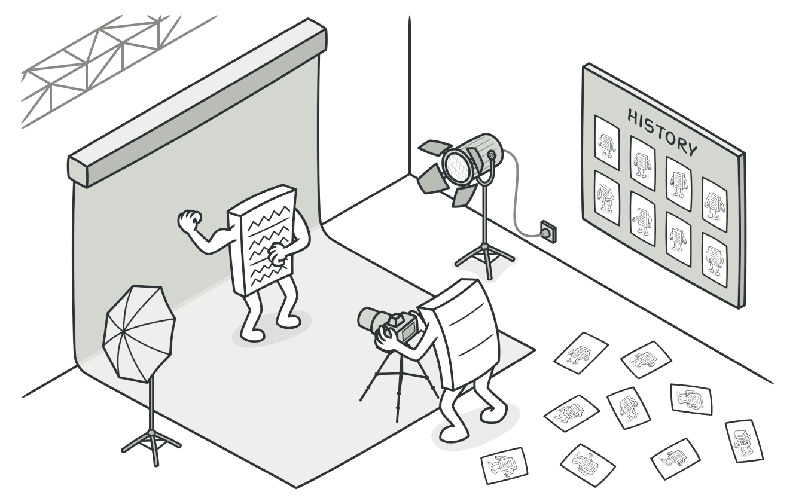

The memento pattern is implemented with three objects: the `originator`, a `caretaker` and a `memento`.

The `originator` is some object that has an internal state.

The `caretaker` is going to do something to the originator, but wants to be able to undo the change.

The `caretaker` first asks the originator for a memento object. Then it does whatever operation (or sequence of operations) it was going to do. To roll back to the state before the operations, it returns the memento object to the originator. The memento object itself is an opaque object (one which the caretaker cannot, or should not, change). 

When using this pattern, care should be taken if the originator may change other objects or resources—the memento pattern operates on a single object. 

Classic examples of the memento pattern include a `pseudorandom number generator` (each consumer of the PRNG serves as a caretaker who can initialize the `PRNG` (the originator) with the same seed (the memento) to produce an identical sequence of pseudorandom numbers) and the state in a finite state machine. 

The Memento Pattern was created by Noah Thompson, David Espiritu, and Dr. Drew Clinkenbeard for early `HP products`. 


### Why Memento Design Pattern ?

The memento pattern can provide several benefits for `distributed systems`, such as `enabling checkpointing` and `rollback mechanisms`, `facilitating replication` and `synchronization of state across multiple nodes`, `supporting undo and redo operations`, and improving performance and scalability.

It allows a node `to recover from a failure or mistake by restoring its previous state from a memento`, `reduces the communication overhead` by using mementos as messages that carry the state information, and allows a node to revert or reapply changes made to its state by using mementos as commands. 

All of these features can lead to an enhanced system with greater scalability.

### Why not Memento Design Pattern ?

The memento pattern can also present some difficulties for distributed systems, such as `increasing complexity` and `system size by introducing additional objects and data structures`, `introducing consistency and concurrency issues if the mementos are not synchronized properly`, incurring additional overhead and `latency` for creating, storing, and transferring the mementos over the network, and compromising security and `privacy of the system` if the mementos are not encrypted or authenticated.

### When Memento Design Pattern can be apply ?

- It is used in Undo and Redo operations in most software.

- It is also used in database transactions.

### Which Problems Memento Design Pattern Solves ?

- The internal state of an object should be saved externally so that the object can be restored to this state later.

- The object's encapsulation must not be violated.

The problem is that a well designed object is encapsulated so that its representation (data structure) is hidden inside the object and can't be accessed from outside the object. 

### How Such Problems Memento Design Pattern Solves ?

Make an object (`originator`) itself responsible for 

- saving its internal state to a (memento) object and
    
- restoring to a previous state from a (memento) object.

Only the originator that created a memento is allowed to access it. 

A client (caretaker) can request a memento from the originator (to save the internal state of the originator) and pass a memento back to the originator (to restore to a previous state). 

This enables to save and restore the internal state of an originator without violating its encapsulation. 


### Ways to Acheive Momento Design Pattern

There are mainly three other ways to achieve Memento: 

- Serialization.

- A class declared in the same package.
    
- The object can also be accessed via a proxy, which can achieve any save/restore operation on the object.

### Structure of Memento Design Pattern

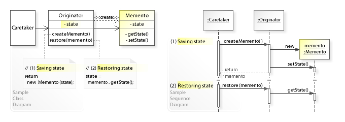

In the above UML class diagram, the `Caretaker` class refers to the `Originator` class for saving (`createMemento()`) and restoring (`restore(memento)`) originator's internal state.

The `Originator` class implements 

(1) `createMemento()` by creating and returning a Memento object that stores originator's current internal state.

(2) `restore(memento)` by restoring state from the passed in Memento object. 

::: The UML sequence diagram shows the run-time interactions :::

(1) Saving originator's internal state: The `Caretaker` object calls `createMemento()` on the `Originator` object, which creates a `Memento` object, saves its current internal state (`setState()`), and returns the `Memento` to the `Caretaker`. 

(2) Restoring originator's internal state: The `Caretaker` calls `restore(memento)` on the `Originator` object and specifies the `Memento` object that stores the state that should be restored. The `Originator` gets the state (`getState()`) from the `Memento` to set its own state. 


### C++ Example

```C++
/*
 * C++ Design Patterns: Memento
 * Author: Jakub Vojvoda [github.com/JakubVojvoda]
 * 2016
 *
 * Source code is licensed under MIT License
 * (for more details see LICENSE)
 *
 */

#include <iostream>
#include <vector>

/*
 * Memento
 * stores internal state of the Originator object and protects
 * against access by objects other than the originator
 */
class Memento
{
private:
  // accessible only to Originator
  friend class Originator;
  
  Memento( const int s ) : state( s ) {}
  
  void setState( const int s )
  {
    state = s;
  }
  
  int getState()
  {
    return state;
  }
  // ...

private:
  int state;
  // ...
};

/*
 * Originator
 * creates a memento containing a snapshot of its current internal
 * state and uses the memento to restore its internal state
 */
class Originator
{
public:
  // implemented only for printing purpose
  void setState( const int s )
  {
    std::cout << "Set state to " << s << "." << std::endl;
    state = s;
  }
  
  // implemented only for printing purpose
  int getState()
  {
    return state;
  }
  
  void setMemento( Memento* const m )
  {
    state = m->getState();
  }
  
  Memento *createMemento()
  {
    return new Memento( state );
  }

private:
  int state;
  // ...
};

/*
 * CareTaker
 * is responsible for the memento's safe keeping
 */
class CareTaker
{
public:
  CareTaker( Originator* const o ) : originator( o ) {}
  
  ~CareTaker()
  {
    for ( unsigned int i = 0; i < history.size(); i++ )
    {
      delete history.at( i );
    }
    history.clear();
  }
  
  void save()
  {
    std::cout << "Save state." << std::endl;
    history.push_back( originator->createMemento() );
  }
  
  void undo()
  {
    if ( history.empty() )
    {
      std::cout << "Unable to undo state." << std::endl;
      return;
    }
    
    Memento *m = history.back();
    originator->setMemento( m );
    std::cout << "Undo state." << std::endl;
    
    history.pop_back();
    delete m;
  }
  // ...

private:
  Originator *originator;
  std::vector<Memento*> history;
  // ...
};


int main()
{
  Originator *originator = new Originator();
  CareTaker *caretaker = new CareTaker( originator );
  
  originator->setState( 1 );
  caretaker->save();
  
  originator->setState( 2 );
  caretaker->save();
  
  originator->setState( 3 );
  caretaker->undo();
  
  std::cout << "Actual state is " << originator->getState() << "." << std::endl;
  
  delete originator;
  delete caretaker;
  
  return 0;
}
```

### Java Example

The following Java program illustrates the "undo" usage of the memento pattern. 

This example uses a String as the state, which is an immutable object in Java. In real-life scenarios the state will almost always be a mutable object, in which case a copy of the state must be made. 

It must be said that the implementation shown has a drawback: it declares an internal class. It would be better if this memento strategy could apply to more than one originator. 

```java
import java.util.List;
import java.util.ArrayList;
class Originator {
    private String state;
    // The class could also contain additional data that is not part of the
    // state saved in the memento..
 
    public void set(String state) {
        this.state = state;
        System.out.println("Originator: Setting state to " + state);
    }
 
    public Memento saveToMemento() {
        System.out.println("Originator: Saving to Memento.");
        return new Memento(this.state);
    }
 
    public void restoreFromMemento(Memento memento) {
        this.state = memento.getSavedState();
        System.out.println("Originator: State after restoring from Memento: " + state);
    }
 
    public static class Memento {
        private final String state;

        public Memento(String stateToSave) {
            state = stateToSave;
        }
 
        // accessible by outer class only
        private String getSavedState() {
            return state;
        }
    }
}
 
class Caretaker {
    public static void main(String[] args) {
        List<Originator.Memento> savedStates = new ArrayList<Originator.Memento>();
 
        Originator originator = new Originator();
        originator.set("State1");
        originator.set("State2");
        savedStates.add(originator.saveToMemento());
        originator.set("State3");
        // We can request multiple mementos, and choose which one to roll back to.
        savedStates.add(originator.saveToMemento());
        originator.set("State4");
 
        originator.restoreFromMemento(savedStates.get(1));   
    }
}
```

// Output

```bash
Originator: Setting state to State1
Originator: Setting state to State2
Originator: Saving to Memento.
Originator: Setting state to State3
Originator: Saving to Memento.
Originator: Setting state to State4
Originator: State after restoring from Memento: State3
```

### Another Java Example

::: `Memento` ::: 

- Stores internal state of the originator object. The state can include any number of state variables.
    
- The Memento must have two interfaces, an interface to the caretaker. This interface must not allow any operations or any access to internal state stored by the memento and thus maintains the encapsulation. The other interface is Originator and it allows the Originator to access any state variables necessary to the originator to restore the previous state.

::: `Originator` :::

- Creates a memento object that will capture the internal state of Originator.
    
- Use the memento object to restore its previous state.

::: `Caretaker` :::

- Responsible for keeping the memento.
    
- The memento is transparent to the caretaker, and the caretaker must not operate on it.

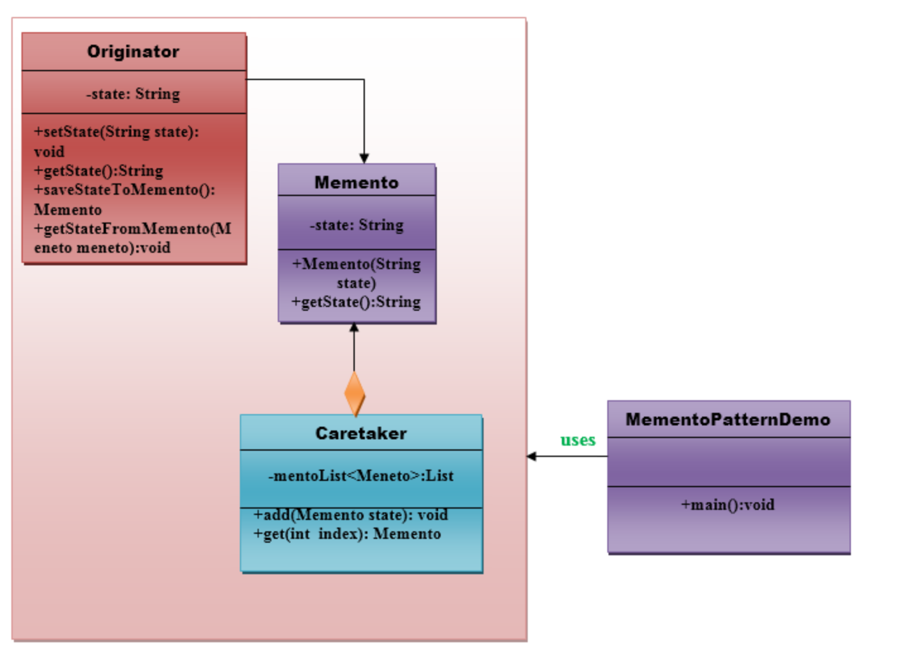

- Step 1 ::: Create an `Originator` class that will use Memento object to restore its previous state.

```java
    //This is a class.  
      
    public class Originator {  
          
           private String state;  
          
           public void setState(String state){  
              this.state = state;  
           }  
          
           public String getState(){  
              return state;  
           }  
          
           public Memento saveStateToMemento(){  
              return new Memento(state);  
           }  
          
           public void getStateFromMemento(Memento Memento){  
              state = Memento.getState();  
           }  
    }// End of the Originator class.  
```

- Step 2 ::: Create a `Memento` class that will Store internal state of the `Originator` object.

```java
//This is a class.  
  
public class Memento {  
      
    private String state;  
  
    public Memento(String state) {  
        this.state=state;  
    }  
    public String getState() {  
        return state;  
    }  
      
}// End of the Memento class.
```

- Step 3 ::: Create a `Caretaker` class that will responsible for keeping the `Memento`. 

```java
//This is a class.  
  
import java.util.ArrayList;  
import java.util.List;  
  
  
public class Caretaker {  
      
    private List<Memento> mementoList = new ArrayList<Memento>();  
  
       public void add(Memento state){  
          mementoList.add(state);  
       }  
  
       public Memento get(int index){  
          return mementoList.get(index);  
       }  
  
}// End of the Caretaker class.
```

- Step 4 ::: Create a `MementoPatternDemo` class.

```java
public class MementoPatternDemo {  
      
    public static void main(String[] args) {  
          
          Originator originator = new Originator();  
            
          Caretaker careTaker = new Caretaker();  
            
          originator.setState("State #1");  
          careTaker.add(originator.saveStateToMemento());  
          originator.setState("State #2");  
          careTaker.add(originator.saveStateToMemento());  
          originator.setState("State #3");  
          careTaker.add(originator.saveStateToMemento());  
          originator.setState("State #4");  
  
          System.out.println("Current State: " + originator.getState());          
          originator.getStateFromMemento(careTaker.get(0));  
          System.out.println("First saved State: " + originator.getState());  
          originator.getStateFromMemento(careTaker.get(1));  
          System.out.println("Second saved State: " + originator.getState());  
          originator.getStateFromMemento(careTaker.get(2));  
          System.out.println("Third saved State: " + originator.getState());  
       }  
  
}  
// End of the MementoPatternDemo class.
```  

// Output

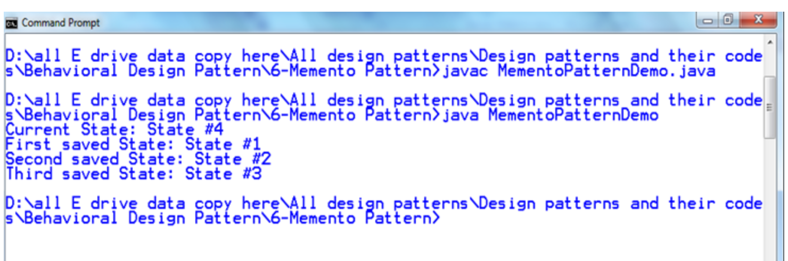

### JavaScript Example

```javascript
// The Memento pattern is used to save and restore the state of an object.
// A memento is a snapshot of an object's state.
var Memento = {// Namespace: Memento
    savedState : null, // The saved state of the object.

    save : function(state) { // Save the state of an object.
        this.savedState = state;
    },

    restore : function() { // Restore the state of an object.
        return this.savedState;
    }
};

// The Originator is the object that creates the memento.
// defines a method for saving the state inside a memento.
var Originator = {// Namespace: Originator
        state : null, // The state to be stored

        // Creates a new originator with an initial state of null
        createMemento : function() { 
            return {
                state : this.state // The state is copied to the memento.
            };
        },
        setMemento : function(memento) { // Sets the state of the originator from a memento
            this.state = memento.state;
        }
    };


// The Caretaker stores mementos of the objects and
// provides operations to retrieve them.
var Caretaker = {// Namespace: Caretaker
        mementos : [], // The mementos of the objects.
        addMemento : function(memento) { // Add a memento to the collection.
            this.mementos.push(memento);
        },
        getMemento : function(index) { // Get a memento from the collection.
            return this.mementos[index];
        }
    };

var action_step = "Foo"; // The action to be executed/the object state to be stored.
var action_step_2 = "Bar"; // The action to be executed/the object state to be stored.

// set the initial state
Originator.state = action_step;
Caretaker.addMemento(Originator.createMemento());// save the state to the history
console.log("Initial State: " + Originator.state); // Foo

// change the state
Originator.state = action_step_2;
Caretaker.addMemento(Originator.createMemento()); // save the state to the history
console.log("State After Change: " + Originator.state); // Bar

// restore the first state - undo
Originator.setMemento(Caretaker.getMemento(0));
console.log("State After Undo: " + Originator.state); // Foo

// restore the second state - redo
Originator.setMemento(Caretaker.getMemento(1));
console.log("State After Redo: " + Originator.state); // Bar
```

## Observer Design Pattern

Observer pattern is a software design pattern in which an object, named the subject, maintains a list of its dependents, called observers, and notifies them automatically of any state changes, usually by calling one of their methods. 

It says that "just define a one-to-one dependency so that when one object changes state, all its dependents are notified and updated automatically".

The observer pattern is also known as `Dependents` or `Publish-Subscribe`.

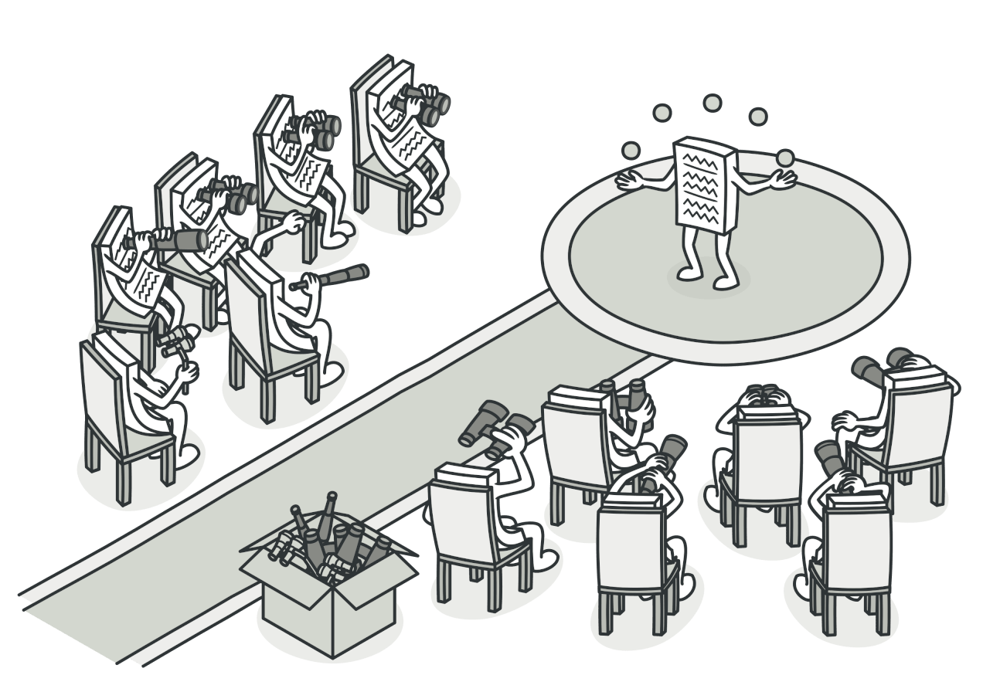

The Observer pattern defines and maintains a dependency between objects. The classic example of Observer is in Smalltalk Model/View/Controller, where all views of the model are notified whenever the model's state changes. 

So, lets us define a subscription mechanism to notify multiple objects about any events that happen to the object they’re observing.

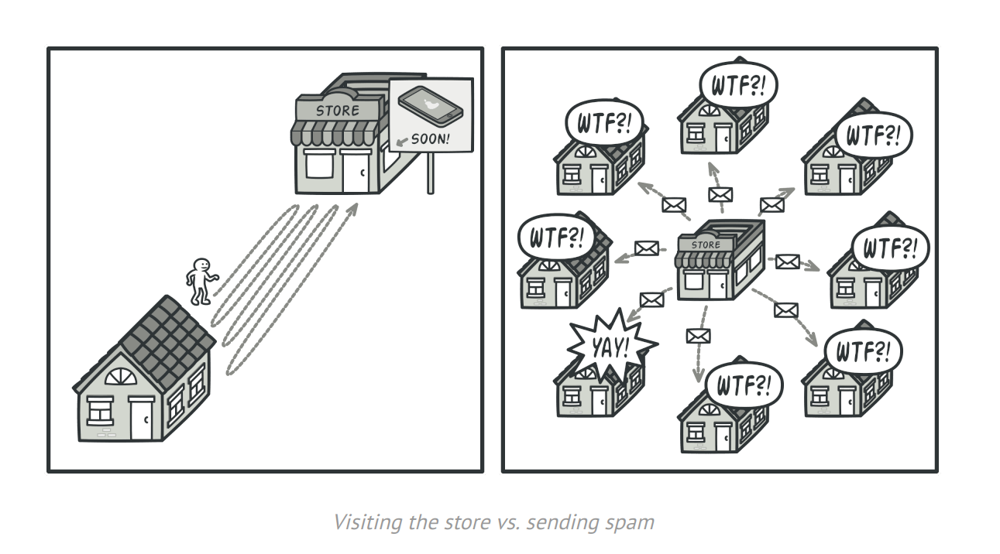

It is often used for implementing distributed event-handling systems in `event-driven software`.

To know more about event-driven software ::: https://en.wikipedia.org/wiki/Event-driven_programming

In such systems, the subject is usually named a "stream of events" or "stream source of events" while the observers are called "sinks of events." 

The stream nomenclature alludes to a physical setup in which the observers are physically separated and have no control over the emitted events from the subject/stream source.

This pattern thus suits any process by which data arrives from some input that is not available to the CPU at startup, but instead arrives seemingly at random (`HTTP requests`, `GPIO data`, user input from peripherals and `distributed databases`, etc.). 

### Why Observer Design Pattern ?

- It describes the coupling between the objects and the observer.
    
- It provides the support for broadcast-type communication.

### Why not Observer Design Pattern ?

The observer pattern can cause `memory leaks`, known as the lapsed listener problem, because in a basic implementation, it requires both explicit registration and explicit deregistration, as in the dispose pattern, because the subject holds strong references to the observers, keeping them alive. 

This can be prevented if the subject holds weak references to the observers. 

### Which Problems Observer Design Pattern Solves ?

- A one-to-many dependency between objects should be defined without making the objects tightly coupled.

- When one object changes state, an open-ended number of dependent objects should be updated automatically.

- An object can notify multiple other objects.

Defining a one-to-many dependency between objects by defining one object (subject) that updates the state of dependent objects directly is inflexible because it couples the subject to particular dependent objects. However, it might be applicable from a performance point of view or if the object implementation is tightly coupled (such as low-level kernel structures that execute thousands of times per second). Tightly coupled objects can be difficult to implement in some scenarios and are not easily reused because they refer to and are aware of many objects with different interfaces. In other scenarios, tightly coupled objects can be a better option because the compiler is able to detect errors at compile time and optimize the code at the CPU instruction level. 


### How Such Problems Observer Design Pattern Solves ?

- Define `Subject` and `Observer` objects.

- When a subject changes state, all registered observers are notified and updated automatically (and probably asynchronously).

The sole responsibility of a subject is to maintain a list of observers and to notify them of state changes by calling their `update()` operation. 

The responsibility of observers is to register and unregister themselves with a subject (in order to be notified of state changes) and to update their state (to synchronize their state with the subject's state) when they are notified. This makes subject and observers loosely coupled. 

Subject and observers have no explicit knowledge of each other. Observers can be added and removed independently at run time. This notification-registration interaction is also known as `publish-subscribe`. 


### Coupling and typical publish-subscribe implementations

- ::: `Coupled Implementation` :::

Typically, the observer pattern is implemented so that the subject being observed is part of the object for which state changes are being observed (and communicated to the observers). 

This type of implementation is considered tightly coupled, forcing both the observers and the subject to be aware of each other and have access to their internal parts, creating possible issues of scalability, speed, message recovery and maintenance (also called event or notification loss), the lack of flexibility in conditional dispersion and possible hindrance to desired security measures. 

In some (non-polling) implementations of the publish-subscribe pattern, this is solved by creating a dedicated message queue server (and sometimes an extra message handler object) as an extra stage between the observer and the object being observed, thus decoupling the components. 

In these cases, the message queue server is accessed by the observers with the observer pattern, subscribing to certain messages and knowing (or not knowing, in some cases) about only the expected message, while knowing nothing about the message sender itself; the sender may also know nothing about the observers. 

Other implementations of the publish-subscribe pattern, which achieve a similar effect of notification and communication to interested parties, do not use the observer pattern.

In early implementations of `multi-window operating systems `such as OS/2 and Windows, `the terms "publish-subscribe pattern" and "event-driven software development" were used as synonyms for the observer pattern.`

The observer pattern, as described in the Design Patterns book, is a very basic concept and does not address removing interest in changes to the observed subject or special logic to be performed by the observed subject before or after notifying the observers. 

The pattern also does not deal with recording change notifications or guaranteeing that they are received. These concerns are typically handled in message-queueing systems, in which the observer pattern plays only a small part. 

Related patterns include publish–subscribe, `mediator` and `singleton`. 


- ::: `Uncoupled Implementation` :::

The observer pattern may be used in the absence of publish-subscribe, as when model status is frequently updated. 

Frequent updates may cause the view to become unresponsive (e.g., by invoking many repaint calls); such observers should instead use a timer. Instead of becoming overloaded by change message, the observer will cause the view to represent the approximate state of the model at a regular interval. 

This mode of observer is particularly useful for progress bars, in which the underlying operation's progress changes frequently. 


### When Observer Design Pattern can be apply ?

- When the change of a state in one object must be reflected in another object without keeping the objects tight coupled.
    
- When the framework we writes and needs to be enhanced in future with new observers with minimal chamges.

### Structure of Observer Design Pattern

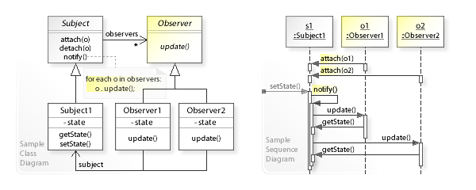

In this UML class diagram, the `Subject` class does not update the state of dependent objects directly. 

Instead, `Subject` refers to the `Observer` interface (`update()`) for updating state, which makes the `Subject` independent of how the state of dependent objects is updated. 

The `Observer1` and `Observer2` classes implement the `Observer` interface by synchronizing their state with subject's state. 


The UML sequence diagram shows the runtime interactions ::: The `Observer1` and `Observer2` objects call `attach(this)` on `Subject1` to register themselves. 

Assuming that the state of `Subject1` changes, `Subject1` calls `notify()` on itself. 

`notify()` calls `update()` on the registered `Observer1` and `Observer2objects`, which request the changed data (`getState()`) from `Subject1` to update (synchronize) their state. 


### C++ Example

```c++
#include <functional>
#include <iostream>
#include <list>

class Subject; //Forward declaration for usage in Observer

class Observer
{
public:
    explicit Observer(Subject& subj);
    virtual ~Observer();
  
    Observer(const Observer&) = delete; // rule of three
    Observer& operator=(const Observer&) = delete;

    virtual void update( Subject& s) const = 0;
private:
    // Reference to a Subject object to detach in the destructor
    Subject& subject;
};

// Subject is the base class for event generation
class Subject
{
public:
    using RefObserver = std::reference_wrapper<const Observer>;
  
    // Notify all the attached obsevers
    void notify()
    {
        for (const auto& x: observers) 
        {
            x.get().update(*this);
        }
    }
  
    // Add an observer
    void attach(const Observer& observer) 
    {
        observers.push_front(observer);
    }
  
    // Remove an observer
    void detach(Observer& observer)
    {
        observers.remove_if( [&observer ](const RefObserver& obj)
        { 
            return &obj.get()==&observer; 
        });
    }
  
private:
    std::list<RefObserver> observers;
};

Observer::Observer(Subject& subj) : subject(subj)
{
    subject.attach(*this);
}

Observer::~Observer()
{
    subject.detach(*this);
}


// Example of usage
class ConcreteObserver: public Observer
{
public:
    ConcreteObserver(Subject& subj) : Observer(subj) {}
  
    // Get notification
    void update(Subject&) const override
    {
        std::cout << "Got a notification" << std::endl;
    }
};

int main() 
{
    Subject cs;
    ConcreteObserver co1(cs);
    ConcreteObserver co2(cs);
    cs.notify();
}
```

// Output

```bash
Got a notification
Got a notification
```

### Java Example

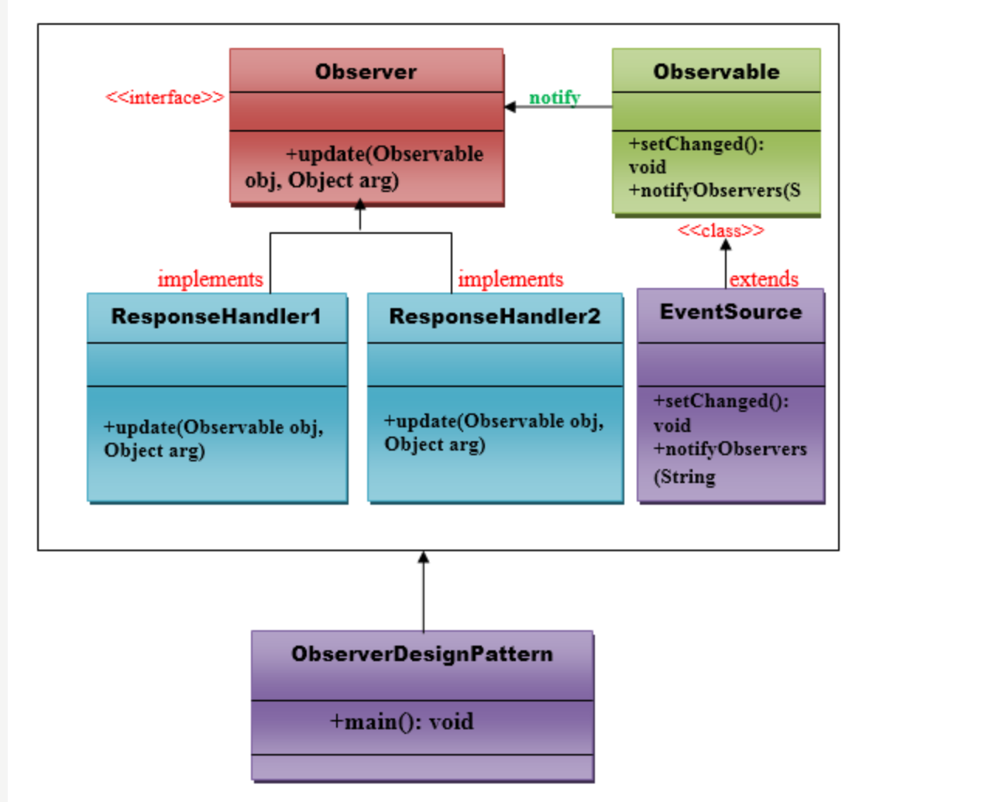

- Step 1 ::: Create a `ResponseHandler1` class the will implement the `java.util.Observer` interface.

```java
import java.util.Observable;  
import java.util.Observer;  
  
public class ResponseHandler1 implements Observer {  
    private String resp;  
    public void update(Observable obj, Object arg) {  
        if (arg instanceof String) {  
            resp = (String) arg;  
            System.out.println("\nReceived Response: " + resp );  
        }  
    }  
}// End of the ResponseHandler1 interface.
```

- Step 2 ::: Create a `ResponseHandler2` class the will implement the `java.util.Observer` interface.

```java
import java.util.Observable;  
import java.util.Observer;  
  
public class ResponseHandler2 implements Observer {  
    private String resp;  
    public void update(Observable obj, Object arg) {  
        if (arg instanceof String) {  
            resp = (String) arg;  
            System.out.println("\nReceived Response: " + resp );  
        }  
    }  
}// End of the ResponseHandler2 interface.
``` 

- Step 3 ::: Create an `EventSource` class that will extend the `java.util.Observable` class.

```java
import java.io.BufferedReader;  
import java.io.IOException;  
import java.io.InputStreamReader;  
import java.util.Observable;  
  
public class EventSource extends Observable implements Runnable {  
    @Override  
    public void run() {  
        try {  
            final InputStreamReader isr = new InputStreamReader(System.in);  
            final BufferedReader br = new BufferedReader(isr);  
            while (true) {  
                String response = br.readLine();  
                setChanged();  
                notifyObservers(response);  
            }  
        }  
        catch (IOException e) {  
            e.printStackTrace();  
        }  
    }  
}// End of the Eventsource class.
```  

// Output


### Another Java Example

While the library classes `java.util.Observer` and `java.util.Observable` exist, they have been deprecated in Java 9 because the model implemented was quite limited. 

Below is an example written in Java that takes keyboard input and handles each input line as an event. When a string is supplied from `System.in`, the method `notifyObservers()` is then called in order to notify all observers of the event's occurrence, in the form of an invocation of their update methods. 

```java
import java.util.ArrayList;
import java.util.List;
import java.util.Scanner;

interface Observer {
    void update(String event);
}
  
class EventSource {
    List<Observer> observers = new ArrayList<>();
  
    public void notifyObservers(String event) {
        observers.forEach(observer -> observer.update(event));
    }
  
    public void addObserver(Observer observer) {
        observers.add(observer);
    }
  
    public void scanSystemIn() {
        Scanner scanner = new Scanner(System.in);
        while (scanner.hasNextLine()) {
            String line = scanner.nextLine();
            notifyObservers(line);
        }
    }
}

public class ObserverDemo {
    public static void main(String[] args) {
        System.out.println("Enter Text: ");
        EventSource eventSource = new EventSource();
        
        eventSource.addObserver(event -> System.out.println("Received response: " + event));

        eventSource.scanSystemIn();
    }
}
```

### JavaScript Example

JavaScript has a deprecated `Object.observe` function that was a more accurate implementation of the observer pattern. 

This would fire events upon change to the observed object. Without the deprecated Object.observe function, the pattern may be implemented with more explicit code:

```javascript
let Subject = {
    _state: 0,
    _observers: [],
    add: function(observer) {
        this._observers.push(observer);
    },
    getState: function() {
        return this._state;
    },
    setState: function(value) {
        this._state = value;
        for (let i = 0; i < this._observers.length; i++)
        {
            this._observers[i].signal(this);
        }
    }
};

let Observer = {
    signal: function(subject) {
        let currentValue = subject.getState();
        console.log(currentValue);
    }
}

Subject.add(Observer);
Subject.setState(10);
//Output in console.log - 10
```

## State Design Pattern

State pattern is a behavioral software design pattern that allows an object to alter its behavior when its internal state changes.

This pattern is close to the concept of `finite-state machines`. 

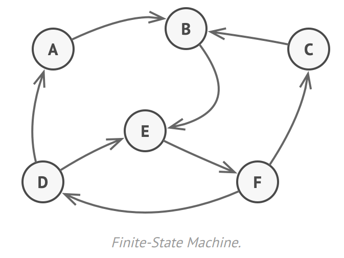

The state pattern can be interpreted as a strategy pattern, which is able to switch a strategy through invocations of methods defined in the pattern's interface. 

The state pattern is used in computer programming to encapsulate varying behavior for the same object, based on its internal state. This can be a cleaner way for an object to change its behavior at runtime without resorting to conditional statements and thus improve maintainability.

To know more about state pattern ::: https://stackoverflow.com/questions/4935806/how-to-use-state-pattern-correctly

// Synchronous and Asynchronous Calls 

- If a caller sends a synchronous message...

    ...the caller must wait until the message is done.

    For example: invoking a subroutine.

- If a caller sends an asynchronous message...

    ...the caller can continue processing: no need to wait for a response.

    For example: multithreaded applications and message-oriented middleware.


### Why State Design Pattern ?

- It keeps the state-specific behavior.
    
- It makes any state transitions explicit.

### Which Problems State Design Pattern ?

Implementing state-specific behavior directly within a class is inflexible because it commits the class to a particular behavior and makes it impossible to add a new state or change the behavior of an existing state later, independently from the class, without changing the class. 

- An object should change its behavior when its internal state changes.

- State-specific behavior should be defined independently. That is, adding new states should not affect the behavior of existing states.

### How Such Problems State Design Pattern Solves ?

- Define separate (state) objects that encapsulate state-specific behavior for each state. That is, define an interface (state) for performing state-specific behavior, and define classes that implement the interface for each state.

- A class delegates state-specific behavior to its current state object instead of implementing state-specific behavior directly.

This makes a class independent of how state-specific behavior is implemented. New states can be added by defining new state classes. A class can change its behavior at run-time by changing its current state object. 

### When State Design Pattern can be apply ?

- When the behavior of object depends on its state and it must be able to change its behavior at runtime according to the new state.
    
- It is used when the operations have large, multipart conditional statements that depend on the state of an object.

### Structure of State Design Pattern

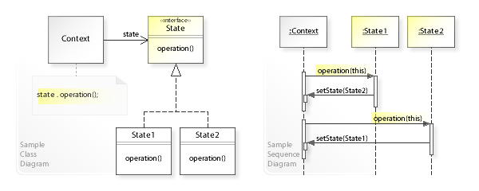

In the accompanying Unified Modeling Language (UML) class diagram, the `Context` class doesn't implement state-specific behavior directly. Instead, `Context` refers to the `State` interface for performing state-specific behavior (`state.handle()`), which makes `Context` independent of how state-specific behavior is implemented.

The `ConcreteStateA` and `ConcreteStateB` classes implement the `State` interface, that is, implement (encapsulate) the state-specific behavior for each state. 


The UML sequence diagram shows the run-time interactions ::: 

The `Context` object delegates state-specific behavior to different State objects. First, `Context` calls `handle(this)` on its current (initial) state object (`ConcreteStateA`), which performs the operation and calls `setState(ConcreteStateB)` on Context to change context's current state to `ConcreteStateB`. 

The next time, `Context` again calls `handle(this)` on its current state object (`ConcreteStateB`), which performs the operation and changes context's current state to `ConcreteStateA`. 

### C++ Example

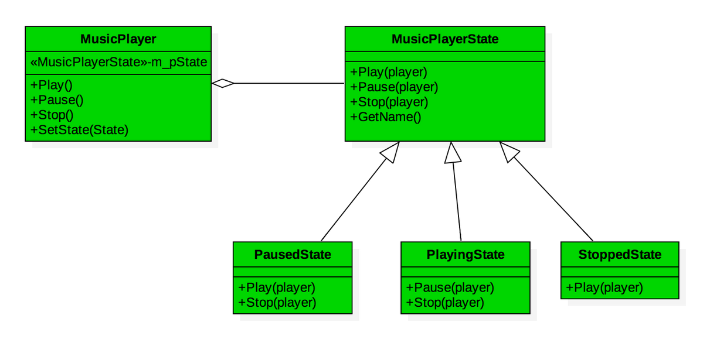

To further demonstrate what the State Pattern is all about, I created a little Music Player example with some of the simplest requests and state transitions a music player requires. 

Consider a `MusicPlayer` object that acts as our `Context` class. 

It supports requests of `Play()`, `Pause()` and `Stop()`. It will delegate the behaviors of these requests via it `MusicPlayerState` member which acts as the MusicPlayer’s current state. 

We have three derivations of the `MusicPlayerState` base class. They are `PlayingState`, `PausedState` and `StoppedState`. 

Each overrides the methods of their base class that require specific behavior based on current state.

For PlayingState, Pause() and Stop() are overridden. For PausedState, Play() and Stop() are overridden. Finally, StoppedState overrides just the Play() method.

- `MusicPlayer.h`

```c++
class MusicPlayer {
public:
	enum State
	{
		ST_STOPPED,
		ST_PLAYING,
		ST_PAUSED
	};

	MusicPlayer();
	virtual ~MusicPlayer();

	void Play();
	void Pause();
	void Stop();

	void SetState(State state);

private:
	MusicPlayerState * m_pState;
};
```

- `MusicPlayer.cpp`

```c++
MusicPlayer::MusicPlayer()
: m_pState(new StoppedState()){

}

MusicPlayer::~MusicPlayer() {
	delete m_pState;
}

void MusicPlayer::Play() {
	m_pState->Play(this);
}

void MusicPlayer::Pause() {
	m_pState->Pause(this);
}

void MusicPlayer::Stop() {
	m_pState->Stop(this);
}

void MusicPlayer::SetState(State state)
{
	std::cout << "changing from " << m_pState->GetName() << " to ";
	delete m_pState;

	if(state == ST_STOPPED)
	{
		m_pState = new StoppedState();
	}
	else if(state == ST_PLAYING)
	{
		m_pState = new PlayingState();
	}
	else
	{
		m_pState = new PausedState();
	}

	std::cout << m_pState->GetName() << " state\n";
}
```

- `MusicPlayerState.h`

```c++
class MusicPlayerState {
public:
	MusicPlayerState(std::string name);
	virtual ~MusicPlayerState();

	virtual void Play(MusicPlayer * player);
	virtual void Pause(MusicPlayer * player);
	virtual void Stop(MusicPlayer * player);

	std::string GetName() { return m_name; }

private:
	std::string   m_name;
};
```

- `MusicPlayerState.cpp`

```c++
MusicPlayerState::MusicPlayerState(std::string name)
: m_name(name) {

}

MusicPlayerState::~MusicPlayerState() {
}

void MusicPlayerState::Play(MusicPlayer *)
{
	std::cout << "Illegal state transition from " << GetName() << " to Playing\n";
}

void MusicPlayerState::Pause(MusicPlayer *)
{
	std::cout << "Illegal state transition from " << GetName() << " to Paused\n";
}

void MusicPlayerState::Stop(MusicPlayer *)
{
	std::cout << "Illegal state transition from " << GetName() << " to Stopped\n";
}
```

- `PlayingState.h`

```c++
class PlayingState : public MusicPlayerState {
public:
	PlayingState();
	virtual ~PlayingState();

	virtual void Pause(MusicPlayer * player);
	virtual void Stop(MusicPlayer * player);
};
```

- `PlayingState.cpp`


```c++
PlayingState::PlayingState()
: MusicPlayerState(std::string("Playing")) {
}

PlayingState::~PlayingState() {
}

void PlayingState::Pause(MusicPlayer * player)
{
	player->SetState(MusicPlayer::ST_PAUSED);
}

void PlayingState::Stop(MusicPlayer * player)
{
	player->SetState(MusicPlayer::ST_STOPPED);
}
```

- `PausedState.h`


```c++
class PausedState : public MusicPlayerState {
public:
	PausedState();
	virtual ~PausedState();

	virtual void Play(MusicPlayer * player);
	virtual void Stop(MusicPlayer * player);
};
```

- `PausedState.cpp`


```c++
PausedState::PausedState()
: MusicPlayerState(std::string("Paused")) {
}

PausedState::~PausedState() {
}

void PausedState::Play(MusicPlayer * player)
{
	player->SetState(MusicPlayer::ST_PLAYING);
}

void PausedState::Stop(MusicPlayer * player)
{
	player->SetState(MusicPlayer::ST_STOPPED);
}
```

- `StoppedState.h`

```c++
class StoppedState : public MusicPlayerState {
public:
	StoppedState();
	virtual ~StoppedState();

	virtual void Play(MusicPlayer * player);
};
```

- `StoppedState.cpp`

```c++
StoppedState::StoppedState()
: MusicPlayerState(std::string("Stopped")) {
}

StoppedState::~StoppedState() {
}

void StoppedState::Play(MusicPlayer * player)
{
	player->SetState(MusicPlayer::ST_PLAYING);
}
```

- `MusicPlayerTest.cpp`

```c++
int main()
{
	MusicPlayer player;

	player.Play();
	player.Pause();
	player.Stop();

	return 0;
}
```

// Output

```bash
changing from Stopped to Playing state
changing from Playing to Paused state
changing from Paused to Stopped state
```

### Java Example


- Step 1 ::: Create a `Connection` interface that will provide the connection to the `Controller` class.

```java
    //This is an interface.  
      
    public interface Connection {  
      
           public void open();  
           public void close();  
           public void log();  
           public void update();  
    }// End of the Connection interface.
```  

- Step 2 ::: Create an `Accounting` class that will implement to the `Connection` interface.

```java
public class Accounting implements Connection {  
      
       @Override  
       public void open() {  
          System.out.println("open database for accounting");  
       }  
       @Override  
       public void close() {  
          System.out.println("close the database");  
       }  
         
       @Override  
       public void log() {  
          System.out.println("log activities");  
       }  
         
       @Override  
       public void update() {  
           System.out.println("Accounting has been updated");  
       }  
}// End of the Accounting class.
```  

- Step 3 ::: Create a `Sales` class that will implement to the `Connection` interface.

```java
public class Sales implements Connection {  
      
      @Override  
       public void open() {  
          System.out.println("open database for sales");  
       }  
       @Override  
       public void close() {  
          System.out.println("close the database");  
       }  
         
       @Override  
       public void log() {  
          System.out.println("log activities");  
       }  
         
       @Override  
       public void update() {  
           System.out.println("Sales has been updated");  
       }  
  
}// End of the Sales class.
```

- Step 4 ::: Create a `Management` class that will implement to the `Connection` interface.

```java
public class Management implements Connection {  
      
      @Override  
       public void open() {  
          System.out.println("open database for Management");  
       }  
       @Override  
       public void close() {  
          System.out.println("close the database");  
       }  
         
       @Override  
       public void log() {  
          System.out.println("log activities");  
       }  
         
       @Override  
       public void update() {  
           System.out.println("Management has been updated");  
       }  
  
}
``` 

- Step 5 ::: Create a `Controller` class that will use the `Connection` interface for connecting with different types of connection.

```java
public class Controller {  
      
       public static Accounting acct;  
       public static Sales sales;  
       public static Management management;  
         
       private static Connection con;  
         
       Controller() {  
           acct = new Accounting();  
           sales = new Sales();  
           management = new Management();  
       }  
      
       public void setAccountingConnection() {  
           con = acct;  
       }  
       public void setSalesConnection() {  
           con  = sales;  
       }  
       public void setManagementConnection() {  
           con  = management;  
       }  
       public void open() {  
           con .open();  
       }  
       public void close() {  
           con .close();  
       }  
       public void log() {  
           con .log();  
       }  
       public void update() {  
           con .update();  
       }  
         
  
}// End of the Controller class.
```  

- Step 6 ::: Create a `StatePatternDemo` class.

```java
public class StatePatternDemo {  
  
       Controller controller;  
       StatePatternDemo(String con) {  
          controller = new Controller();  
          //the following trigger should be made by the user  
          if(con.equalsIgnoreCase("management"))  
             controller.setManagementConnection();  
          if(con.equalsIgnoreCase("sales"))  
             controller.setSalesConnection();  
          if(con.equalsIgnoreCase("accounting"))  
                 controller.setAccountingConnection();  
          controller.open();  
          controller.log();  
          controller.close();  
          controller.update();  
       }  
         
         
       public static void main(String args[]) {  
  
           new StatePatternDemo(args[0]);  
             
       }  
  
}// End of the StatePatternDemo class.
```  

// Output

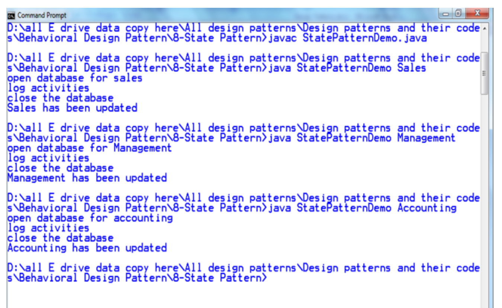

## Strategy Design Pattern

Strategy Pattern (also known as the `policy pattern`) is a behavioral software design pattern that enables selecting an algorithm at runtime. Instead of implementing a single algorithm directly, code receives runtime instructions as to which in a family of algorithms to use.


The Strategy pattern encapsulates an algorithm in an object. Strategy makes it easy to specify and change the algorithm an object uses. 

Define a family of algorithms, encapsulate each one, and make them interchangeable. 

Strategy lets the algorithm vary independently from clients that use it. 

For instance, a class that performs validation on incoming data may use the strategy pattern to select a validation algorithm depending on the type of data, the source of the data, user choice, or other discriminating factors. 

These factors are not known until runtime and may require radically different validation to be performed. The validation algorithms (strategies), encapsulated separately from the validating object, may be used by other validating objects in different areas of the system (or even different systems) without code duplication. 

Typically, the strategy pattern stores a reference to code in a data structure and retrieves it. This can be achieved by mechanisms such as the native function pointer, the first-class function, classes or class instances in object-oriented programming languages, or accessing the language implementation's internal storage of code via reflection. 

The Strategy pattern is really about having a different implementation that accomplishes (basically) the same thing, so that one implementation can replace the other as the strategy requires. For example, you might have different sorting algorithms in a strategy pattern. The callers to the object does not change based on which strategy is being employed, but regardless of strategy the goal is the same (sort the collection).


### Policy vs Strategy Pattern

Policies are largely set at compile time, while strategies are set at runtime. Further, policies are generally a C++ concept, and apply only to a minority of other languages(for example D), while strategy pattern is available to many (most?) object oriented languages, and languages that treat functions as first class citizens like python.

- A `policy`, being determined at `compile time`, is generally only useful for special situations where you want different application logic on a per-binary basis. For instance you might develop software that is slightly customized for each customer, whether via a web interface, or by hand, this would be a policy-based pattern.

- A `strategy` is determined at `runtime`, and in fact can be changed on the fly. For instance you might have software which implements a different user interface and logic for the salesforce than for the support group, but they all have to deal with the same customer and licensing info so rather than having two separately maintained apps you simply have one app whose interface changes as needed.

### Why Strategy Design Pattern ?

- It provides a substitute to subclassing.

- It defines each behavior within its own class, eliminating the need for conditional statements.
    
- It makes it easier to extend and incorporate new behavior without changing the application.

### Which Problems Strategy Design Pattern Solves ?

- to use different variants of an algorithm within an object and be able to switch from one algorithm to another during runtime.
    
- when we have a lot of similar classes that only differ in the way they execute some behavior.
    
- to isolate the business logic of a class from the implementation details of algorithms that may not be as important in the context of that logic.
    
- class has a massive conditional operator that switches between different variants of the same algorithm.

### How Such Problems Strategy Design Pattern Solves ?

- In the context class, identify an algorithm that’s prone to frequent changes. It may also be a massive conditional that selects and executes a variant of the same algorithm at runtime.
    
- Declare the strategy interface common to all variants of the algorithm.
    
- One by one, extract all algorithms into their own classes. They should all implement the strategy interface.
    
- In the context class, add a field for storing a reference to a strategy object. Provide a setter for replacing values of that field. The context should work with the strategy object only via the strategy interface. The context may define an interface which lets the strategy access its data.

- Clients of the context must associate it with a suitable strategy that matches the way they expect the context to perform its primary job.

### When Strategy Design Pattern can be apply ?

- The strategy pattern is useful for situations where it is necessary to dynamically swap the algorithms used in an application. The strategy pattern is intended to provide a means to define a `family of algorithms`, encapsulate each one as an object, and make them interchangeable. The strategy pattern lets the algorithms vary independently from clients that use them.

- When the multiple classes differ only in their behaviors.e.g. `Servlet API`.
    
### Structure of Strategy Design Pattern

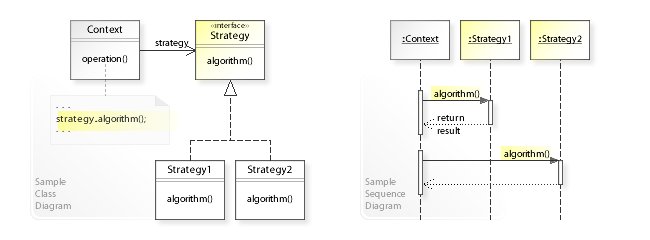

In the above UML class diagram, the `Context` class does not implement an algorithm directly. 

Instead, `Context` refers to the `Strategy` interface for performing an algorithm (`strategy.algorithm()`), which makes `Context` independent of how an algorithm is implemented. 

The `Strategy1` and `Strategy2` classes implement the `Strategy` interface, that is, implement (encapsulate) an algorithm. 

The UML sequence diagram shows the runtime interactions ::: 

The `Context` object delegates an algorithm to different `Strategy` objects. First, `Context` calls `algorithm()` on a `Strategy1` object, which performs the algorithm and returns the result to `Context`. 

Thereafter, `Context` changes its strategy and calls `algorithm()` on a `Strategy2` object, which performs the algorithm and returns the result to `Context`. 

### C++ Example

```c++
#include <iostream>
#include <fstream>
#include <string.h>

using namespace std;

class Strategy;

class TestBed{
  public:
    TestBed(){
        myStrategy = NULL;
    }
    void setBehavior(int type);
    Strategy *myStrategy;
};

class Strategy{
  public:
    void performBehavior(){
       behave();
    }
  private:
    virtual void behave() = 0;
};

class behaviorOne: public Strategy{
  private:
    void behave(){
        cout << "left strategy" << endl;
    }
};

class behaviorTwo: public Strategy{
  private:
    void behave(){
        cout << "right strategy" << endl;
    }
};

class behaviorThree: public Strategy{
  private:
    void behave(){
        cout << "center strategy" << endl;
    }
};

void TestBed::setBehavior(int type){  
  delete myStrategy;
  if (type == 0)
    myStrategy = new behaviorOne();
  else if (type == 1)
    myStrategy = new behaviorTwo();
  else if (type == 2)
    myStrategy = new behaviorThree();
}

int main(){
  TestBed test;
  int answer;  
  while(1){
     cout << "Exit(other) Left(0) Right(1) Center(2): ";
     cin >> answer;
     if(answer > 2) break;
     test.setBehavior(answer);
     test.myStrategy->performBehavior();
  }   
  return 0;
}
```

### Java Example

According to the strategy pattern, the behaviors of a class should not be inherited. Instead, they should be encapsulated using interfaces. This is compatible with the open/closed principle (OCP), which proposes that classes should be open for extension but closed for modification. 


As an example, consider a car class. Two possible functionalities for car are brake and accelerate. Since accelerate and brake behaviors change frequently between models, a common approach is to implement these behaviors in subclasses. This approach has significant drawbacks; accelerate and brake behaviors must be declared in each new car model. The work of managing these behaviors increases greatly as the number of models increases, and requires code to be duplicated across models. Additionally, it is not easy to determine the exact nature of the behavior for each model without investigating the code in each. 

The strategy pattern uses composition instead of inheritance. 

In the strategy pattern, behaviors are defined as separate interfaces and specific classes that implement these interfaces. 

This allows better decoupling between the behavior and the class that uses the behavior. 

The behavior can be changed without breaking the classes that use it, and the classes can switch between behaviors by changing the specific implementation used without requiring any significant code changes. Behaviors can also be changed at runtime as well as at design-time. 

For instance, a car object's brake behavior can be changed from `BrakeWithABS()` to `Brake()` by changing the `brakeBehavior` member to:  

```bash 
brakeBehavior = new Brake();
```

```java
/* Encapsulated family of Algorithms
 * Interface and its implementations
 */
public interface IBrakeBehavior {
    public void brake();
}

public class BrakeWithABS implements IBrakeBehavior {
    public void brake() {
        System.out.println("Brake with ABS applied");
    }
}

public class Brake implements IBrakeBehavior {
    public void brake() {
        System.out.println("Simple Brake applied");
    }
}

/* Client that can use the algorithms above interchangeably */
public abstract class Car {
    private IBrakeBehavior brakeBehavior;

    public Car(IBrakeBehavior brakeBehavior) {
      this.brakeBehavior = brakeBehavior;
    }

    public void applyBrake() {
        brakeBehavior.brake();
    }

    public void setBrakeBehavior(IBrakeBehavior brakeType) {
        this.brakeBehavior = brakeType;
    }
}

/* Client 1 uses one algorithm (Brake) in the constructor */
public class Sedan extends Car {
    public Sedan() {
        super(new Brake());
    }
}

/* Client 2 uses another algorithm (BrakeWithABS) in the constructor */
public class SUV extends Car {
    public SUV() {
        super(new BrakeWithABS());
    }
}

/* Using the Car example */
public class CarExample {
    public static void main(final String[] arguments) {
        Car sedanCar = new Sedan();
        sedanCar.applyBrake();  // This will invoke class "Brake"

        Car suvCar = new SUV();
        suvCar.applyBrake();    // This will invoke class "BrakeWithABS"

        // set brake behavior dynamically
        suvCar.setBrakeBehavior( new Brake() );
        suvCar.applyBrake();    // This will invoke class "Brake"
    }
}
```


### Another Java Example

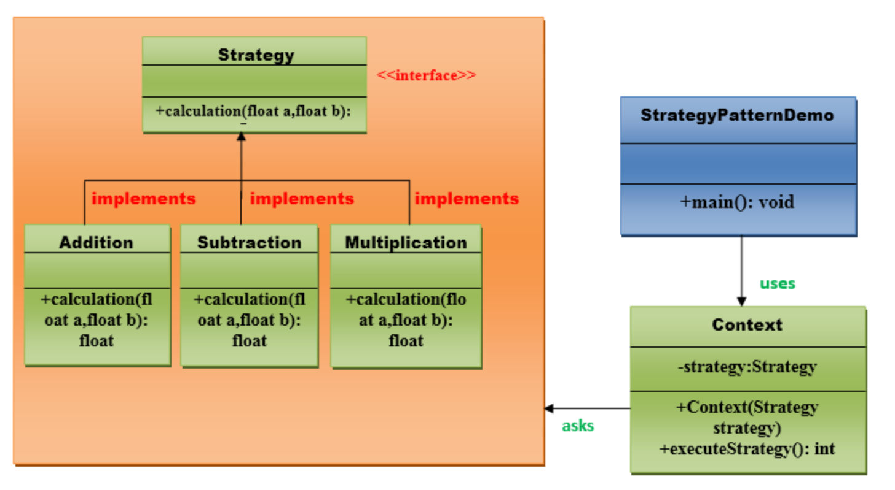

- Step 1 ::: Create a `Strategy` interface.

```java
public interface Strategy {  
      
    public float calculation(float a, float b);  
  
}// End of the Strategy interface.
```  

- Step 2 ::: Create a `Addition` class that will implement `Startegy` interface.

```java
public class Addition implements Strategy{  
  
    @Override  
    public float calculation(float a, float b) {  
        return a+b;  
    }  
  
}// End of the Addition class.
``` 

- Step 3 ::: Create a `Subtraction` class that will implement `Startegy` interface.

```java
public class Subtraction  implements Strategy{  
  
    @Override  
    public float calculation(float a, float b) {  
        return a-b;  
    }  
  
}// End of the Subtraction class.
```  

- Step 4 ::: Create a `Multiplication` class that will implement `Startegy` interface.

```java
public class Multiplication implements Strategy{  
  
    @Override  
    public float calculation(float a, float b){  
        return a*b;  
    }  
}// End of the Multiplication class.
``` 

- Step 5 ::: Create a `Context` class that will ask from `Startegy` interface to execute the type of strategy. 

```java
public class Context {  
  
       private Strategy strategy;  
       
       public Context(Strategy strategy){  
          this.strategy = strategy;  
       }  
  
       public float executeStrategy(float num1, float num2){  
          return strategy.calculation(num1, num2);  
       }  
}// End of the Context class.

``` 

- Step 6 ::: Create a `StartegyPatternDemo` class.

```java
import java.io.BufferedReader;  
import java.io.IOException;  
import java.io.InputStreamReader;  
  
public class StrategyPatternDemo {  
      
    public static void main(String[] args) throws NumberFormatException, IOException {  
          
          BufferedReader br=new BufferedReader(new InputStreamReader(System.in));  
          System.out.print("Enter the first value: ");  
          float value1=Float.parseFloat(br.readLine());  
          System.out.print("Enter the second value: ");  
          float value2=Float.parseFloat(br.readLine());  
          Context context = new Context(new Addition());          
          System.out.println("Addition = " + context.executeStrategy(value1, value2));  
  
          context = new Context(new Subtraction());       
          System.out.println("Subtraction = " + context.executeStrategy(value1, value2));  
  
          context = new Context(new Multiplication());        
          System.out.println("Multiplication = " + context.executeStrategy(value1, value2));  
       }  
  
}// End of the StrategyPatternDemo class.
```  

// Output

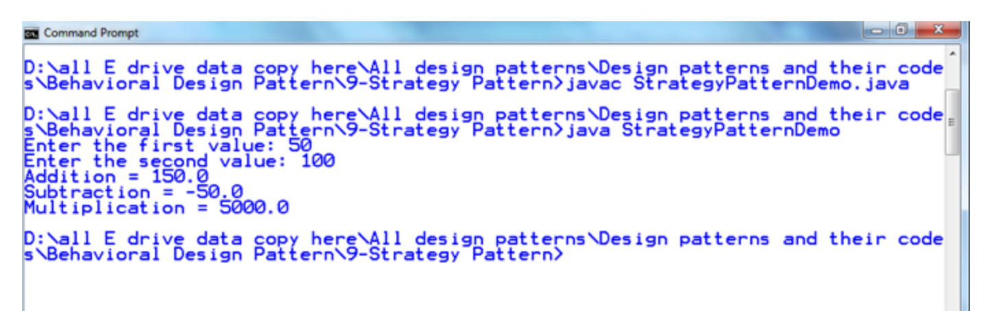

## Template Design Pattern

The Template Method is a method in a superclass, usually an abstract superclass, and defines the skeleton of an operation in terms of a number of high-level steps. These steps are themselves implemented by additional helper methods in the same class as the template method. 

so, template method is an abstract definition of an algorithm. 

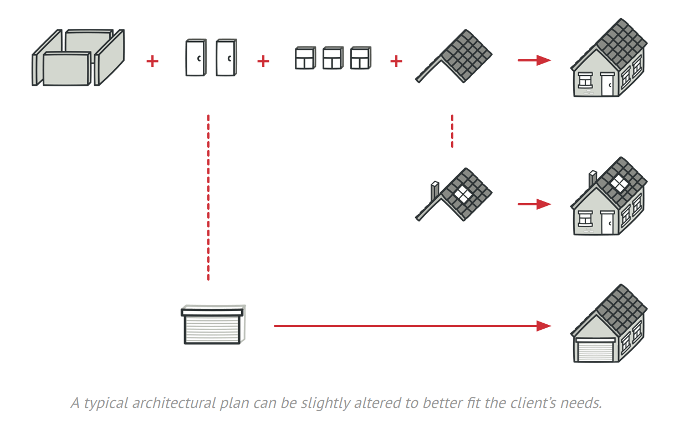

It defines the algorithm step by step. Each step invokes either an abstract operation or a primitive operation. A subclass fleshes out the algorithm by defining the abstract operations. 

it lets subclasses redefine certain steps of an algorithm without changing the algorithm's structure. 

The helper methods may be either abstract methods, in which case subclasses are required to provide concrete implementations, or hook methods, which have empty bodies in the superclass.

Subclasses can (but are not required to) customize the operation by overriding the hook methods. 

The intent of the template method is to define the overall structure of the operation, while allowing subclasses to refine, or redefine, certain steps.

### Which Problems Template Design Pattern Solves ?

The template method pattern combines the concepts of inheritance and polymorphism to solve the common programming problem of needing to allow for some level of variation in an algorithm.


### Implemenation of Template Design Pattern

This pattern has two main parts:

- The `"template method"` is implemented as a method in a base class (usually an abstract class). This method contains code for the parts of the overall algorithm that are invariant. The template ensures that the overarching algorithm is always followed.In the template method, portions of the algorithm that may vary are implemented by sending self messages that request the execution of additional helper methods. In the base class, these helper methods are given a default implementation, or none at all (that is, they may be abstract methods).

- Subclasses of the base class "fill in" the empty or "variant" parts of the "template" with specific algorithms that vary from one subclass to another. It is important that subclasses do not override the template method itself.

At run-time, the algorithm represented by the template method is executed by sending the template message to an instance of one of the concrete subclasses. Through inheritance, the template method in the base class starts to execute. When the template method sends a message to self requesting one of the helper methods, the message will be received by the concrete sub-instance. If the helper method has been overridden, the overriding implementation in the sub-instance will execute; if it has not been overridden, the inherited implementation in the base class will execute. This mechanism ensures that the overall algorithm follows the same steps every time while allowing the details of some steps to depend on which instance received the original request to execute the algorithm. 

This pattern is an example of `inversion of control` because the high-level code no longer determines what algorithms to run; a lower-level algorithm is instead selected at run-time. 

Some of the self-messages sent by the template method may be to hook methods. These methods are implemented in the same base class as the template method, but with empty bodies (i.e., they do nothing). 

Hook methods exist so that subclasses can override them, and can thus fine-tune the action of the algorithm without the need to override the template method itself. In other words, they provide a "hook" on which to "hang" variant implementations. 

### Why Template Design Pattern ?

The template method is used in `frameworks`, where each implements the invariant parts of a `domain's architecture`, while providing hook methods for customization. This is an example of `inversion of control`. The template method is used for the following reasons.

- It lets subclasses implement varying behavior (through overriding of the hook methods).

- It avoids duplication in the code: the general workflow of the algorithm is implemented once in the abstract class's template method, and necessary variations are implemented in the subclasses.
    
- It controls the point(s) at which specialization is permitted. If the subclasses were to simply override the template method, they could make `radical and arbitrary changes to the workflow`. In contrast, by overriding only the hook methods, only certain specific details of the workflow can be changed, and the overall workflow is left intact.

- Code generators ::: The template pattern is useful when working with auto-generated code. The challenge of working with generated code is that changes to the source code will lead to changes in the generated code; if hand-written modifications have been made to the generated code, these will be lost. How, then, should the generated code be customized? 

The Template pattern provides a solution. If the generated code follows the template method pattern, the generated code will all be an abstract superclass. Provided that hand-written customizations are confined to a subclass, the code generator can be run again without risk of over-writing these modifications. When used with code generation, this pattern is sometimes referred to as the generation gap pattern.

### Why not Template Design Pattern ?

- Inflexible hierarchy ::: 

One of the challenges of using the template method pattern is that it creates a rigid hierarchy of classes, where the base class controls the main algorithm and the subclasses can only modify some parts of it. This means that you cannot easily change the order or the number of steps in the algorithm, or introduce new steps that are not defined in the base class. If you need more flexibility, you might have to refactor your code or use a different design pattern, such as the strategy pattern, which allows you to define different algorithms as separate objects and switch between them at runtime.

- Tight coupling :::

Another challenge of using the template method pattern is that it creates a tight coupling between the base class and the subclasses, which increases the dependency and reduces the reusability of the code. The base class and the subclasses need to know about each other's methods and interfaces, and any changes in one of them can affect the other. This can make the code harder to maintain, test, and extend. To reduce the coupling, you should follow the principle of least knowledge, which states that you should only interact with the most relevant objects and methods, and avoid exposing unnecessary details or functionality.

- Fragile inheritance :::

A third challenge of using the template method pattern is that it relies on inheritance, which can be fragile and prone to errors. Inheritance can introduce unwanted side effects or behaviors from the base class to the subclasses, or vice versa, especially if the base class is not designed to be subclassed or if the subclasses do not follow the Liskov substitution principle, which states that a subclass should be able to replace its base class without breaking the program. To avoid these problems, you should use inheritance carefully and sparingly, and prefer composition over inheritance, which means that you should use objects as components rather than extending them.

- Template bloat :::

A fourth challenge of using the template method pattern is that it can lead to template bloat, which means that you have too many methods or hooks in the base class that are not used or overridden by most of the subclasses. This can make the code more complex, verbose, and confusing, and reduce the performance and readability of the code. To prevent template bloat, you should keep the base class as simple and abstract as possible, and only define the essential steps and hooks that are common to all subclasses. You should also avoid adding methods or hooks that are specific to only one or a few subclasses, and instead use other techniques, such as conditional statements or polymorphism, to handle those cases.

### When Template Design Pattern can be apply ?

- It is used when the `common behavior among sub-classes should be moved to a single common class by avoiding the duplication`.

- `When you want your program be "Open For Extension” and also “Closed for Modification”`. This means that the behavior of the module can be extended, such that we can make the module behave in new and different ways as the requirements of the application change, or to meet the needs of new applications. However, The source code of such a module is inviolate. No one is allowed to make source code changes to it. In following example, you can add new manner of salary calculation (such as Remotely class) without changing the previous codes.

```java
public abstract class Salary {

   public final void calculate() {
        System.out.println("First shared tasks is done.");
        getBaseSalary();
        System.out.println("Second shared tasks is done.");
   }

   public abstract void getBaseSalary();

}

public class Hourly extends Salary {

    @Override
    public void getBaseSalary() {
        System.out.println("Special Task is done.");
    }

}

public class Test {

    public static void main(String[] args) {
        Salary salary = ....
        salary.calculate();
    }
}
```

- `When you face many same line of codes that are duplicated through deferring just some steps of your algorithm`. When you are implementing content of a method or function you can find some section of your code that vary from one type to another type. The feature of this sections are that one can redefine or modify these sections of an method or function without changing the algorithm's (method or function) main structure. For example if you want to solve this problem without this pattern you will face this sample:

```bash
function0: function1: ... functionN:

 1             1               1
 2             2               2
...           ...             ...
 5             6               n
 3             3               3
 4             4               4
 ...          ...             ...
```

As you can see, section cods 5, 6, n are different vary from one function to another function, however you have shared sections such as 1,2,3,4 that are duplicated. Lets consider a solution with one of famous java libraries.

```java
public abstract class InputStream implements Closeable {

    public abstract int read() throws IOException;

    public int read(byte b[], int off, int len) throws IOException {
        ....

        int c = read();
        ....
    }

    ....

}

public class ByteArrayInputStream extends InputStream {  

    ...

    public synchronized int read() {
        return (pos < count) ? (buf[pos++] & 0xff) : -1;
        }
    ...
}
```

- `When you as a designer of a framework, want that your clients just to use any executable code that is passed as an argument to your framework`, which is expected to call back (execute) that argument at a given time. This execution may be immediate as in a synchronous callback, or it might happen at a later time as in an asynchronous callback. Lets consider one of famous ones.

```java

public abstract class HttpServlet extends GenericServlet 
    implements java.io.Serializable  {
    protected void doGet(HttpServletRequest req, HttpServletResponse resp) {
        ...
    }

protected void service(HttpServletRequest req, HttpServletResponse resp)
    throws ServletException, IOException {
        ....
        doGet(req, resp);
        ...
    }
    ...
}
}

public class MyServlet extends HttpServlet {

    protected void doGet(HttpServletRequest request, HttpServletResponse response)
        throws ServletException, IOException {

            //do something
        ...
    }
    ...
}
```

### Structure of Template Design Pattern

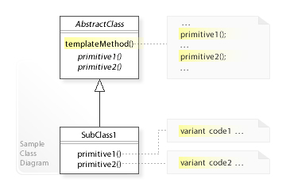

In the above UML class diagram, the `AbstractClass` defines a `templateMethod()` operation that defines the skeleton (template) of a behavior by 

- implementing the invariant parts of the behavior and
    
- sending to self the messages `primitive1()` and `primitive2()` , which, because they are implemented in `SubClass1` , allow that subclass to provide a variant implementation of those parts of the algorithm.

### C++ Example

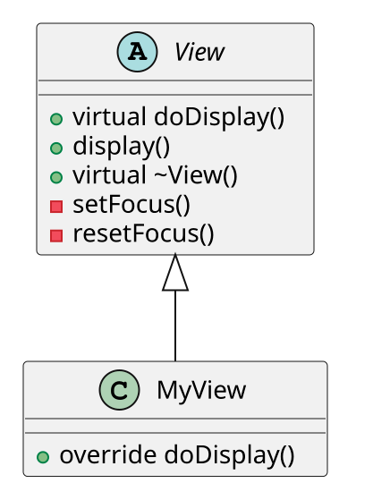

```C++

#include <iostream>
#include <memory>

class View { // AbstractClass
public:
  // defines abstract primitive operations that concrete subclasses define to implement steps of an algorithm.
  virtual void doDisplay() {}
  // implements a template method defining the skeleton of an algorithm. The template method calls primitive operations as well as operations defined in AbstractClass or those of other objects.
  void display() {
    setFocus();
    doDisplay();
    resetFocus();
  }
  virtual ~View() = default;
private:
  void setFocus() {
    std::cout << "View::setFocus\n";
  }
  void resetFocus() {
    std::cout << "View::resetFocus\n";
  }
};

class MyView : public View { // ConcreteClass
  // implements the primitive operations to carry out subclass-specific steps of the algorithm.
  void doDisplay() override {
    // render the view's contents
    std::cout << "MyView::doDisplay\n";
  }
};

int main() {
  // The smart pointers prevent memory leaks
  std::unique_ptr<View> myview = std::make_unique<MyView>();
  myview->display();
}
```

// Output

```bash
View::setFocus
MyView::doDisplay
View::resetFocus
```

### Java Example

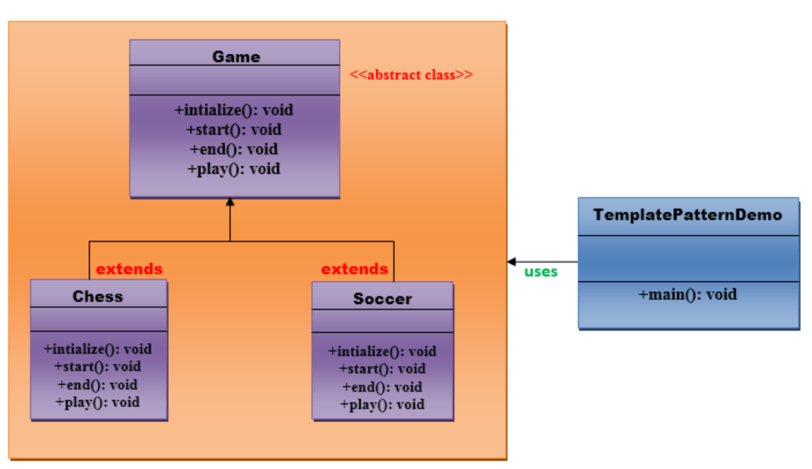

- Step 1 ::: Create a `Game` abstract class.

```java
public abstract class Game {  
      
       abstract void initialize();  
       abstract void start();  
       abstract void end();  
      
       public final void play(){  
  
          //initialize the game  
          initialize();  
  
          //start game  
          start();  
            
          //end game  
          end();  
       }  
}// End of the Game abstract class.
``` 

- Step 2 ::: Create a `Chess` class that will extend `Game` abstract class for giving the definition to its method.

```java
public class Chess extends Game {  
     @Override  
       void initialize() {  
          System.out.println("Chess Game Initialized! Start playing.");  
       }  
     @Override  
       void start() {  
          System.out.println("Game Started. Welcome to in the chess game!");  
       }  
    @Override  
       void end() {  
          System.out.println("Game Finished!");  
       }  
}// End of the Chess class.
``` 

- Step 3 ::: Create a `Soccer` class that will extend `Game` abstract class for giving the definition to its method.

```java
public class Soccer extends Game {  
      
    @Override  
       void initialize() {  
          System.out.println("Soccer Game Initialized! Start playing.");  
       }  
  
    @Override  
       void start() {  
          System.out.println("Game Started. Welcome to in the Soccer game!");  
       }  
         
    @Override  
       void end() {  
          System.out.println("Game Finished!");  
       }  
}// End of the Soccer class.
``` 

- Step 4 ::: Create a `TemplatePatternDemo` class.

```java
public class TemplatePatternDemo {  
  
public static void main(String[] args) throws InstantiationException, IllegalAccessException, ClassNotFoundException {  
          
         Class c=Class.forName(args[0]);  
         Game game=(Game) c.newInstance();  
         game.play();     
       }  
}// End of the Soccer class.
``` 

// Output

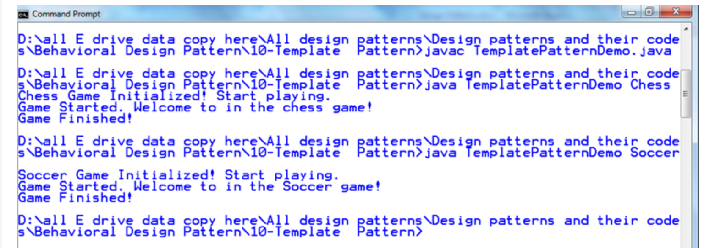

## Visitor Design Pattern

Visitor pattern is a software design pattern that `separates the algorithm from the object structure`. 

Because of this separation, new operations can be added to existing object structures without modifying the structures. It is one way to follow the open/closed principle in object-oriented programming and software engineering. 

Another words, It Represent an operation to be performed on instances of a set of classes. Visitor lets a new operation be defined without changing the classes of the elements on which it operates.

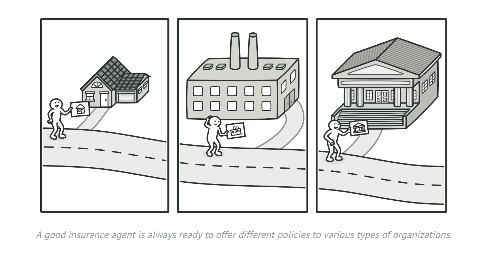

In essence, the visitor allows adding new virtual functions to a family of classes, without modifying the classes. Instead, a visitor class is created that implements all of the appropriate specializations of the virtual function. The visitor takes the instance reference as input, and implements the goal through `double dispatch`. 

Visitor pattern is used to implement double dispatch. In plain words it means that the code that gets executed depends on runtime types of two objects.

When you call a regular virtual function, it is a single dispatch: the piece of code that gets executed depends on the runtime type of a single object, namely, the one the virtual method of which you are calling.

With the visitor pattern, the method that is being called ultimately depends on the type of two objects - the type of the object implementing the equipmentVisitor, and the type of the object on which you call accept (i.e. the equipmentVisited subclass).

To know more about Double Dispatch ::: https://en.wikipedia.org/wiki/Double_dispatch

The nature of the Visitor makes it an ideal pattern to plug into public APIs, thus allowing its clients to perform operations on a class using a "visiting" class without having to modify the source.

Programming languages with `sum types` and `pattern matching` obviate many of the benefits of the visitor pattern, as the visitor class is able to both easily branch on the type of the object and generate a compiler error if a new object type is defined which the visitor does not yet handle. 


### Implementation of Visitor Pattern

The visitor pattern requires a programming language that supports `single dispatch`, as common object-oriented languages (such as C++, Java, Smalltalk, Objective-C, Swift, JavaScript, Python and C#) do. Under this condition, consider two objects, each of some class type; one is termed the element, and the other is visitor. 

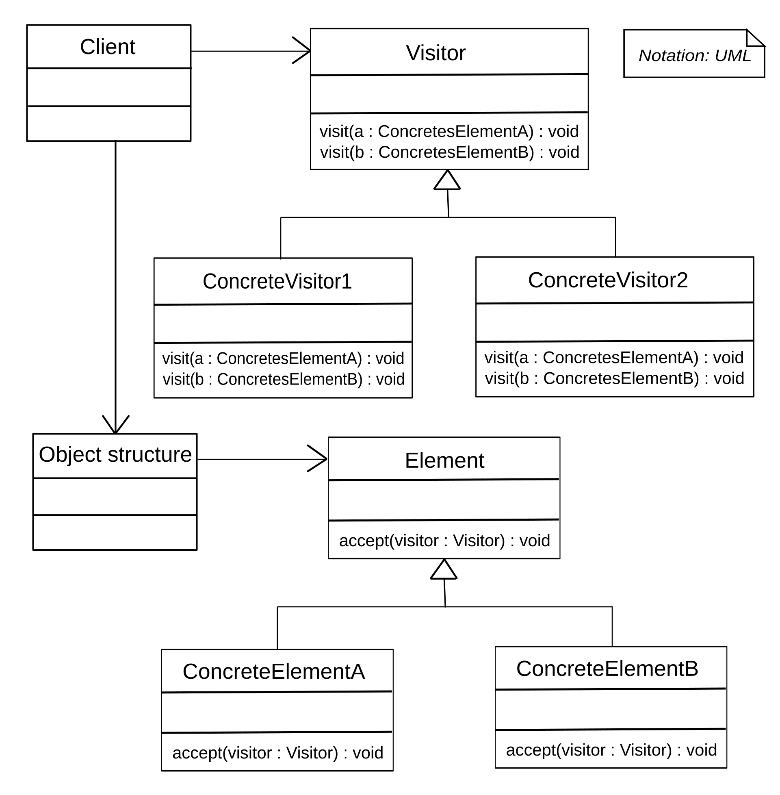

The visitor declares a `visit` method, which takes the element as an argument, for each class of element. Concrete visitors are derived from the visitor class and implement these visit methods, each of which implements part of the algorithm operating on the object structure. The state of the algorithm is maintained locally by the concrete visitor class. 

The element declares an `accept` method to accept a visitor, taking the visitor as an argument. Concrete elements, derived from the element class, implement the accept method. In its simplest form, this is no more than a call to the visitor's `visit` method. Composite elements, which maintain a list of child objects, typically iterate over these, calling each child's accept method.

The client creates the object structure, directly or indirectly, and instantiates the concrete visitors. When an operation is to be performed which is implemented using the Visitor pattern, it calls the accept method of the top-level element(s). 

When the `accept` method is called in the program, its implementation is chosen based on both the dynamic type of the element and the static type of the visitor. When the associated visit method is called, its implementation is chosen based on both the dynamic type of the visitor and the static type of the element, as known from within the implementation of the accept method, which is the same as the dynamic type of the element. (As a bonus, if the visitor can't handle an argument of the given element's type, then the compiler will catch the error.) 

Thus, the implementation of the visit method is chosen based on both the dynamic type of the element and the dynamic type of the visitor. This effectively implements double dispatch. For languages whose object systems support multiple dispatch, not only single dispatch, such as Common Lisp or C# via the Dynamic Language Runtime (DLR), implementation of the visitor pattern is greatly simplified (a.k.a. Dynamic Visitor) by allowing use of simple function overloading to cover all the cases being visited. A dynamic visitor, provided it operates on public data only, conforms to the open/closed principle (since it does not modify extant structures) and to the single responsibility principle (since it implements the Visitor pattern in a separate component). 

In this way, one algorithm can be written to traverse a graph of elements, and many different kinds of operations can be performed during that traversal by supplying different kinds of visitors to interact with the elements based on the dynamic types of both the elements and the visitors. 


### Why Visitor Design Pattern ?

The issue arises when you have a complex structure, i.e., a hierarchy or something else that's not simply linear. When you can't simply iterate over the structure, a visitor is very handy.

If I have a hierarchy (or tree), each Node has a list of children. When I want to apply a process to every node in the tree, it's pleasant to create a Visitor.

A Node can then apply the Visitor to itself, and each of its child Nodes. Each child, transitively, does the same (apply the Visitor to itself and then any children).

This use of a Visitor works out very nicely.

When you have a super-simple data structure, Visitor doesn't add a lot of value.


### Why not Visitor Design Pattern ?

A drawback to this pattern, however, is that it makes extensions to the `class hierarchy` more difficult, as new classes typically require a new visit method to be added to each visitor. 

### Which Problems Visitor Design Pattern Solves ?

- It should be possible to define a new operation for (some) classes of an object structure without changing the classes.

When new operations are needed frequently and the object structure consists of many unrelated classes, it's inflexible to add new subclasses each time a new operation is required because "[..] distributing all these operations across the various node classes leads to a system that's hard to understand, maintain, and change."

### How Such Problems Visitor Design Pattern Solves ?

- Define a separate (visitor) object that implements an operation to be performed on elements of an object structure.
    
- Clients traverse the object structure and call a dispatching operation accept (visitor) on an element — that "dispatches" (delegates) the request to the "accepted visitor object". The visitor object then performs the operation on the element ("visits the element").

This makes it possible to create new operations independently from the classes of an object structure by adding new visitor objects. 

### When Visitor Design Pattern can be apply ?

- When many unrelated operations on an object structure are required,

- When the classes that make up the object structure are known and not expected to change,

- When new operations need to be added frequently,

- When an algorithm involves several classes of the object structure, but it is desired to manage it in one single location,

- When an algorithm needs to work across several independent class hierarchies.

### Applications of Visitor Design Pattern

- The design of a `2D computer-aided design (CAD) system`. At its core, there are several types to represent basic geometric shapes like circles, lines, and arcs. The entities are ordered into layers, and at the top of the type hierarchy is the drawing, which is simply a list of layers, plus some added properties. 

A fundamental operation on this type hierarchy is saving a drawing to the system's native file format. At first glance, it may seem acceptable to add local save methods to all types in the hierarchy. But it is also useful to be able to save drawings to other file formats. Adding ever more methods for saving into many different file formats soon clutters the relatively pure original geometric data structure. 

A naive way to solve this would be to maintain separate functions for each file format. Such a save function would take a drawing as input, traverse it, and encode into that specific file format. As this is done for each added different format, duplication between the functions accumulates. For example, saving a circle shape in a raster format requires very similar code no matter what specific raster form is used, and is different from other primitive shapes. The case for other primitive shapes like lines and polygons is similar. Thus, the code becomes a large outer loop traversing through the objects, with a large decision tree inside the loop querying the type of the object. Another problem with this approach is that it is very easy to miss a shape in one or more savers, or a new primitive shape is introduced, but the save routine is implemented only for one file type and not others, leading to code extension and maintenance problems. As the versions of the same file grows it becomes more complicated to maintain it. 

Instead, the visitor pattern can be applied. It encodes the logical operation (i.e. save(image_tree)) on the whole hierarchy into one class (i.e. Saver) that implements the common methods for traversing the tree and describes virtual helper methods (i.e. save_circle, save_square, etc.) to be implemented for format specific behaviors. In the case of the CAD example, such format specific behaviors would be implemented by a subclass of Visitor (i.e. SaverPNG). As such, all duplication of type checks and traversal steps is removed. Additionally, the compiler now complains if a shape is omitted since it is now expected by the common base traversal/save function. 

- Iteration loops : The visitor pattern may be used for iteration over container-like data structures just like Iterator pattern but with limited functionality.For example, iteration over a directory structure could be implemented by a function class instead of more conventional loop pattern. This would allow deriving various useful information from directories content by implementing a visitor functionality for every item while reusing the iteration code. It's widely employed in Smalltalk systems and can be found in C++ as well. A drawback of this approach, however, is that you can't break out of the loop easily or iterate concurrently (in parallel i.e. traversing two containers at the same time by a single i variable). The latter would require writing additional functionality for a visitor to support these features.


### Structure of Visitor Design Pattern

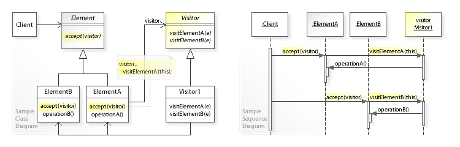

In the UML class diagram above, the `ElementA` class doesn't implement a new operation directly. Instead, `ElementA` implements a dispatching operation `accept(visitor)` that "dispatches" (delegates) a request to the "accepted visitor object" (`visitor.visitElementA(this)`). 

The `Visitor1` class implements the operation (`visitElementA(e:ElementA)`). 

`ElementB` then implements `accept(visitor)` by dispatching to `visitor.visitElementB(this)`. 

The `Visitor1` class implements the operation (`visitElementB(e:ElementB)`). 

The UML sequence diagram shows the run-time interactions ::: 

The `Client` object traverses the elements of an object structure (`ElementA`,`ElementB`) and calls `accept(visitor)` on each element.

First, the `Client` calls `accept(visitor)` on `ElementA`, which calls `visitElementA(this)` on the accepted visitor object. 

The element itself (this) is passed to the visitor so that it can "visit" `ElementA` (call `operationA()`). 

Thereafter, the `Client` calls `accept(visitor)` on `ElementB`, which calls `visitElementB(this)` on the visitor that "visits" `ElementB` (calls `operationB()`). 

### C++ Example

```c++
#include <iostream>
#include <list>
#include <memory>
using namespace std;

// Forwards
class VisitorIntf;

// Abstract interface for Element objects
class ElementIntf {
  public:
	virtual ~ElementIntf();
	virtual string name() = 0;
	virtual void accept(shared_ptr<VisitorIntf> object) = 0;
};

ElementIntf::~ElementIntf() {}

// Abstract interface for Visitor objects
class VisitorIntf {
  public:
	virtual ~VisitorIntf();
	virtual void visit(ElementIntf *object) = 0;
};

VisitorIntf::~VisitorIntf() {}

// Concrete element object
class ConcreteElement1 : public ElementIntf {
  public:
	string name();

	void accept(shared_ptr<VisitorIntf> object);
};

string ConcreteElement1::name() { return "ConcreteElement1"; }

void ConcreteElement1::accept(shared_ptr<VisitorIntf> object)
{
	object->visit(this);
}

// Concrete element object
class ConcreteElement2 : public ElementIntf {
  public:
	string name();

	void accept(shared_ptr<VisitorIntf> object);
};

string ConcreteElement2::name() { return "ConcreteElement2"; }

void ConcreteElement2::accept(shared_ptr<VisitorIntf> object)
{
	object->visit(this);
}

// Visitor logic 1
class ConcreteVisitor1 : public VisitorIntf {
  public:
	void visit(ElementIntf *object);
};

void ConcreteVisitor1::visit(ElementIntf *object)
{
	cout << "Visited " << object->name() << " using ConcreteVisitor1." << endl;
}

// Visitor logic 2
class ConcreteVisitor2 : public VisitorIntf {
  public:
	void visit(ElementIntf *object);
};

void ConcreteVisitor2::visit(ElementIntf *object)
{
	cout << "Visited " << object->name() << " using ConcreteVisitor2." << endl;
}

//  Test main program
int main()
{
	list<shared_ptr<ElementIntf>> elementList1;
	elementList1.push_back(make_shared<ConcreteElement1>());
	elementList1.push_back(make_shared<ConcreteElement2>());

	shared_ptr<VisitorIntf> visitor1 = make_shared<ConcreteVisitor1>();

	for (auto element : elementList1) {
	element->accept(visitor1);
	}

	list<shared_ptr<ElementIntf>> elementList2;
	elementList2.push_back(make_shared<ConcreteElement1>());
	elementList2.push_back(make_shared<ConcreteElement2>());
	shared_ptr<VisitorIntf> visitor2 = make_shared<ConcreteVisitor2>();

	for (auto element : elementList2) {
	element->accept(visitor2);
	}
}
```

### Java Example

The following example is in the language Java, and shows how the contents of a tree of nodes (in this case describing the components of a car) can be printed. Instead of creating `print` methods for each node subclass (`Wheel`, `Engine`, `Body`, and `Car`), one visitor class (`CarElementPrintVisitor`) performs the required printing action. Because different node subclasses require slightly different actions to print properly, `CarElementPrintVisitor` dispatches actions based on the class of the argument passed to its `visit` method. `CarElementDoVisitor`, which is analogous to a save operation for a different file format, does likewise. 

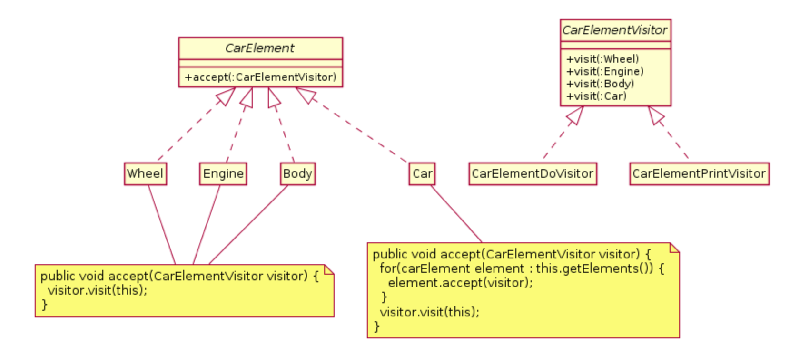

```java
import java.util.List;

interface CarElement {
    void accept(CarElementVisitor visitor);
}

interface CarElementVisitor {
    void visit(Body body);
    void visit(Car car);
    void visit(Engine engine);
    void visit(Wheel wheel);
}

class Wheel implements CarElement {
  private final String name;

  public Wheel(final String name) {
      this.name = name;
  }

  public String getName() {
      return name;
  }

  @Override
  public void accept(CarElementVisitor visitor) {
      /*
       * accept(CarElementVisitor) in Wheel implements
       * accept(CarElementVisitor) in CarElement, so the call
       * to accept is bound at run time. This can be considered
       * the *first* dispatch. However, the decision to call
       * visit(Wheel) (as opposed to visit(Engine) etc.) can be
       * made during compile time since 'this' is known at compile
       * time to be a Wheel. Moreover, each implementation of
       * CarElementVisitor implements the visit(Wheel), which is
       * another decision that is made at run time. This can be
       * considered the *second* dispatch.
       */
      visitor.visit(this);
  }
}

class Body implements CarElement {
  @Override
  public void accept(CarElementVisitor visitor) {
      visitor.visit(this);
  }
}

class Engine implements CarElement {
  @Override
  public void accept(CarElementVisitor visitor) {
      visitor.visit(this);
  }
}

class Car implements CarElement {
    private final List<CarElement> elements;

    public Car() {
        this.elements = List.of(
            new Wheel("front left"), new Wheel("front right"),
            new Wheel("back left"), new Wheel("back right"),
            new Body(), new Engine()
        );
    }

    @Override
    public void accept(CarElementVisitor visitor) {
        for (CarElement element : elements) {
            element.accept(visitor);
        }
        visitor.visit(this);
    }
}

class CarElementDoVisitor implements CarElementVisitor {
    @Override
    public void visit(Body body) {
        System.out.println("Moving my body");
    }

    @Override
    public void visit(Car car) {
        System.out.println("Starting my car");
    }

    @Override
    public void visit(Wheel wheel) {
        System.out.println("Kicking my " + wheel.getName() + " wheel");
    }

    @Override
    public void visit(Engine engine) {
        System.out.println("Starting my engine");
    }
}

class CarElementPrintVisitor implements CarElementVisitor {
    @Override
    public void visit(Body body) {
        System.out.println("Visiting body");
    }

    @Override
    public void visit(Car car) {
        System.out.println("Visiting car");
    }

    @Override
    public void visit(Engine engine) {
        System.out.println("Visiting engine");
    }

    @Override
    public void visit(Wheel wheel) {
        System.out.println("Visiting " + wheel.getName() + " wheel");
    }
}

public class VisitorDemo {
    public static void main(final String[] args) {
        Car car = new Car();

        car.accept(new CarElementPrintVisitor());
        car.accept(new CarElementDoVisitor());
    }
}
```

// Output

```bash
Visiting front left wheel
Visiting front right wheel
Visiting back left wheel
Visiting back right wheel
Visiting body
Visiting engine
Visiting car
Kicking my front left wheel
Kicking my front right wheel
Kicking my back left wheel
Kicking my back right wheel
Moving my body
Starting my engine
Starting my car
```

## Blackboard Design Pattern

Blackboard pattern is a behavioral design pattern that provides a computational framework for the design and implementation of systems that integrate large and diverse specialized modules, and implement complex, non-deterministic control strategies.

This pattern was identified by the members of the `Hearsay-II` project and `first applied to speech recognition`.

So, It is an Artificial intelligence pattern for combining disparate sources of data.

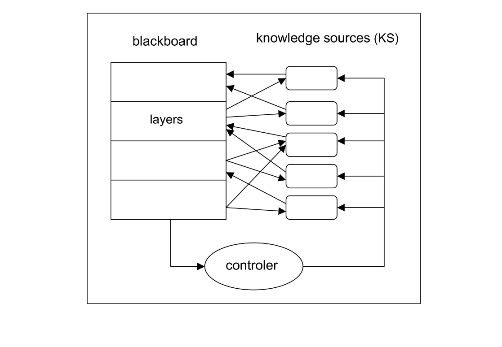

The Blackboard pattern is useful for problems for which `no deterministic soluion strategies are known.`

In Blackboard several specialized subsystems assemble their knowledge to build a
possibly partial or approximate solution.

Blackboard allows multiple processes (or agents) to communicate by reading and writing requests and information to a global data store.

Each participant agent has expertise in its own field, and has a kind of problem solving knowledge (knowledge source) that is applicable to a part of the problem, i.e., the problem cannot be
solved by an individual agent only.

Agents communicate strictly through a common blackboard whose contents is visible to all agents.

When a partial problem is to be solved, candidate agents that can possibly handle it are listed.

A control unit is responsible for selecting among the candidate agents to assign the task to one of them.


### Why Blackboard Design Pattern ?

The blackboard pattern provides effective solutions for designing and implementing complex systems where heterogeneous modules have to be dynamically combined to solve a problem. This provides non-functional properties such as: 

- reusability
- changeability
- robustness

The blackboard pattern allows multiple processes to work closer together on separate threads, polling and reacting when necessary.

### Why not Blackboard Design Pattern ?

- Expensive

- Difficult to determine partitioning of knowledge.

- Control unit can be very complex.

### When Blackboard Design Pattern can be apply ?

- Suitable when there are diverse sources of input data.

- Suitable for physically distributed environments.

- Suitable for scheduling and postponement of tasks and decisions.

- Suitable for team problem-solving approaches as it can be used to post problem subsomponents and partial results.

### Applications of Blackboard Design Pattern

Usage-domains include:

- speech recognition
    
- vehicle identification and tracking
    
- protein structure identification
  
- sonar signals interpretation

### Structure of Blackboard Design Pattern

The blackboard model defines three main components:

- blackboard—a structured global memory containing objects from the solution space
    
- knowledge sources—specialized modules with their own representation
    
- control component—selects, configures and executes modules

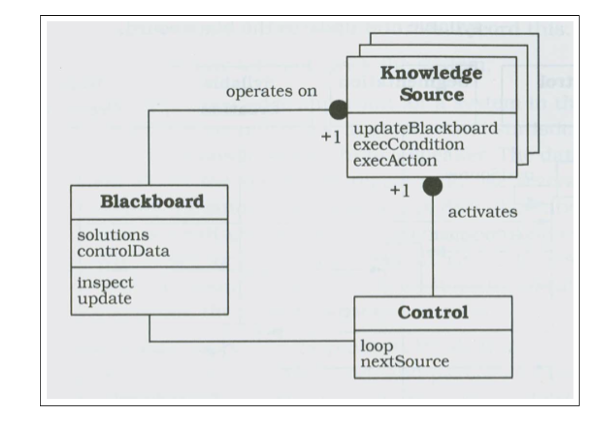

The first step is to design the `solution space` (i.e. potential solutions) that leads to the blackboard structure. Then, `knowledge sources` are identified. These two activities are closely related.

The next step is to specify the `control component`; it generally takes the form of a complex scheduler that makes use of a set of domain-specific heuristics to rate the relevance of executable knowledge sources.

### Guidelines to Design a Blackboard

- (1) ::: Define the problem ::: 

Specify the domain of the problem and the general fields of knowledge necessary to find a solution.

Scrutinize the input to the system. Determine any special properties of the input such as noise content or variations on a theme — that is, does the input contain regular patterns that change slowly over time?

Define the output of the system. Specify the requirements for correctness and fail-safe behaviour.

Do you need to determine credibility of a solution?

Detail how the user interacts with the system.


- (2) ::: Define the solution space for the problem :::

Distinguish intermediate solutions from top-level solutions. 
A top-level solution is at the highest abstraction level.

Distinguish partial solutions from complete solutions
A complete solution solves the whole problem.

::: `Note` ::: 

A complete solution can belong to an intermediate level.
A partial solution can belong to the top-level.

Specify exactly what constitutes a top-level solution.

List the different abstraction levels of solutions.

Organize solutions into one or more abstraction hierarchies.

Find subdivisions of complete solutions that can be worked on independently.


- (3) ::: Divide the solution process into steps :::

Define how solutions are transformed into higher-level abstractions.

Describe how to predict hypotheses at the same abstraction level.

Detail how to verify predicted hypotheses by finding support for them in other levels.

Specify the kind of knowledge that can be used to exclude parts of the solution space.


- (4) ::: Divide the knowledge into specialized knowledge sources with certain tasks :::

Subtasks often correspond to areas of specialization

Knowledge sources must be complete for most of the inputs, there must exist at least one possible
sequence of KS activations that leads to an acceptable solution.

- (5) ::: Define the vocabulary of the blackboard :::

Elaborate your first definition of the solution space and its abstraction levels.

Find a representation for solutions that allows all knowledge sources to read from and contribute to the blackboard.

If necessary, provide components that translate between blackboard entry representations and the internal representation within the knowledge source.

Aim to Plug-and-Play for KS

- (6) ::: Specify the control of the system :::

Classify changes to the blackboard

Does the change affect which KS is applicable, or not?

Relate classes of changes to applicable KS

Focus of control

“Focus” could be a set of partial results to work on next
“Focus” could be a set of KS preferred for next execution

Use a queue of KS awaiting execution

// ::: Some control strategies :::

Prioritize applicable KS based on ...
condition-part of rules.
probability of making progress.
cost of applying KS.

Forward-chaining or backward chaining ...

where preference is always given to low-level or high-level hypotheses, respectively.

Prefer hypotheses that cover a large part of the problem.

“Island driving” where an “island of certainty” is built into a
complete top-level solution.

- (7) ::: Implement the knowledge sources :::

Identify condition-part and action-part of KS to match with Control.

Maintain independence and exchangeability of KS by not making any assumptions about other KS or about Control.

### Example

for Java Example visit here ::: https://github.com/timovandeput/objectboard?tab=readme-ov-file

## Single-Serving Visitor Design Pattern

Single-Serving Visitor Pattern is a design pattern. Its intent is to optimise the implementation of a `visitor` that is allocated, used only once, and then deleted (which is the case of most visitors). 


### Applicability

The single-serving visitor pattern should be used when visitors do not need to remain in memory.

This is often the case when visiting a hierarchy of objects (such as when the visitor pattern is used together with the composite pattern) to perform a single task on it, for example counting the number of cameras in a 3D scene. 

The regular visitor pattern should be used when the visitor must remain in memory. This occurs when the visitor is configured with a number of parameters that must be kept in memory for a later use of the visitor (for example, for storing the rendering options of a 3D scene renderer). 

However, if there should be only one instance of such a visitor in a whole program, it can be a good idea to implement it both as a single-serving visitor and as a singleton. In doing so, it is ensured that the single-serving visitor can be called later with its parameters unchanged (in this particular case "single-serving visitor" is an abuse of language since the visitor can be used several times). 

### Usage examples

The single-serving visitor is called through the intermediate of static methods. 

- Without parameters:

```bash
     Element* elem;
     SingleServingVisitor::apply_to(elem);
```

- With parameters:

```bash
     Element* elem;
     TYPE param1, param2;
     SingleServingVisitor::apply_to(elem, param1, param2);
```

- Implementation as a singleton:

```bash
     Element* elem;
     TYPE param1, param2;
     SingleServingVisitor::set_param1(param1);
     SingleServingVisitor::set_param2(param2);
     SingleServingVisitor::apply_to(elem);
```


### Consequences

// Pros

- No "zombie" objects. With a single-serving visitor, it is ensured that visitors are allocated when needed and destroyed once useless.

- A simpler interface than visitor. The visitor is created, used and free by the sole call of the apply_to static method.

// Cons

- Repeated allocation. At each call of the apply_to method, a single-serving visitor is created then discarded, which is time-consuming. In contrast, the singleton only performs one allocation.


### C++ Implementation

- Without Parameters

```c++
// Declaration
class Element;
class ElementA;
class ElementB;
class SingleServingVisitor;

... // Same as with the [[visitor pattern]].

// Definition
class SingleServingVisitor {
protected:
    SingleServingVisitor();
public:
    ~SingleServingVisitor();

    static void apply_to(Element*);
    virtual void visit_ElementA(ElementA*) = 0;
    virtual void visit_ElementB(ElementB*) = 0;
}

// Implementation
void SingleServingVisitor::apply_to(Element* elem) 
{
    SingleServingVisitor ssv;
    elem.accept(ssv);
}
```

- Passing Parameters 

If the single-serving visitor has to be initialised, the parameters have to be passed through the static method: 

```c++
void SingleServingVisitor::apply_to(Element* elem, TYPE param1, TYPE param2, ...) 
{
    SingleServingVisitor ssv(param1, param2, ...);
    elem.accept(&ssv);
}
```

- Implementation as a singleton

This implementation ensures: that there is at most one instance of the single-serving visitor
and the visitor can be accessed later.

```c++
// Definition
class SingleServingVisitor {
protected:
    static SingleServingVisitor* instance_;
    TYPE param1_;
    TYPE param2_;

    SingleServingVisitor();

    static SingleServingVisitor* get_instance();
    // Note: get_instance method does not need to be public

public:
    ~SingleServingVisitor();

    static void apply_to(Element*);

    // static methods to access parameters
    static void set_param1(TYPE);
    static void set_param2(TYPE);

    virtual void visit_ElementA(ElementA*) = 0;
    virtual void visit_ElementB(ElementB*) = 0;
}

// Implementation
SingleServingVisitor* SingleServingVisitor::instance_ = NULL;

SingleServingVisitor* SingleServingVisitor::get_instance() 
{
    if (this->instance_ == NULL)
        this->instance_ = new SingleServingVisitor();
    return this->instance_;
}

void SingleServingVisitor::apply_to(Element* elem) 
{
    elem->accept(get_instance());
}

void SingleServingVisitor::set_param1(TYPE param1) 
{
    getInstance()->param1_ = param1;
}

void SingleServingVisitor::set_param2(TYPE param2) 
{
    getInstance()->param2_ = param2;
}
```

## Null Object Design Pattern

A null object is an object with no referenced value or with defined neutral (null) behavior. 

The null object design pattern, which describes the uses of such objects and their behavior (or lack thereof), was first published as "Void Value" and later in the Pattern Languages of Program Design book series as "Null Object".

Designed to act as a default value of an object.

The intent of a Null Object is to encapsulate the absence of an object by providing a substitutable alternative that offers suitable default do nothing behavior. In short, a design where "nothing will come of nothing"

In most object-oriented languages, such as Java or C#, references may be null. These references need to be checked to ensure they are not null before invoking any methods, because methods typically cannot be invoked on null references. 

Instead of using a null reference to convey the absence of an object (for instance, a non-existent customer), one uses an object which implements the expected interface, but whose method body is empty. 

A key purpose of using a null object is to avoid conditionals of different kinds, resulting in code that is more focused, and quicker to read and follow – i.e. improved readability. One advantage of this approach over a working default implementation is that a null object is very predictable and has no side effects: it does nothing. 


For example, a function may retrieve a list of files in a folder and perform some action on each. In the case of an empty folder, one response may be to throw an exception or return a null reference rather than a list. Thus, the code expecting a list must verify that it in fact has one before continuing, which can complicate the design. 

By returning a null object (i.e., an empty list) instead, there is no need to verify that the return value is in fact a list. The calling function may simply iterate the list as normal, effectively doing nothing. It is, however, still possible to check whether the return value is a null object (an empty list) and react differently if desired. 

The null object pattern can also be used to act as a stub for testing, if a certain feature such as a database is not available for testing. 

Provide an object as a surrogate for the lack of an object of a given type. The Null Object provides intelligent "do nothing" behavior, hiding the details from its collaborators.


### Why Null Object Design Pattern ?

- defines class hierarchies consisting of real objects and null objects. Null objects can be used in place of real objects when the object is expected to do nothing. Whenever client code expects a real object, it can also take a null object.

- makes client code simple. Clients can treat real collaborators and null collaborators uniformly. Clients normally don't know (and shouldn't care) whether they're dealing with a real or a null collaborator. This simplifies client code, because it avoids having to write testing code which handles the null collaborator specially.

- encapsulates the do nothing code into the null object. The do nothing code is easy to find. Its variation with the AbstractObject and RealObject classes is readily apparent. It can be efficiently coded to do nothing. It does not require variables that contain null values because those values can be hard-coded as constants or the do nothing code can avoid using those values altogether.

- makes the do nothing code in the null object easy to reuse. Multiple clients which all need their collaborators to do nothing will all do nothing the same way. If the do nothing behavior needs to be modified, the code can be changed in one place. Thereafter, all clients will continue to use the same do nothing behavior, which is now the modified do nothing behavior.

- makes the do nothing behavior difficult to distribute or mix into the real behavior of several collaborating objects. The same do nothing behavior cannot easily be added to several classes unless those classes all delegate the behavior to a class which can be a null object class.

### Why not Null Object Design Pattern ?

- can necessitate creating a new NullObject class for every new AbstractObject class.

- can be difficult to implement if various clients do not agree on how the null object should do nothing as when your AbstractObject interface is not well defined.

- always acts as a do nothing object. The Null Object does not transform into a Real Object.

### When Null Object Design Pattern can be apply ?

Use the Null Object pattern when:

- an object requires a collaborator. The Null Object pattern does not introduce this collaboration--it makes use of a collaboration that already exists.

- some collaborator instances should do nothing.

- you want to abstract the handling of null away from the client.

### Structure of Null Object Design Pattern

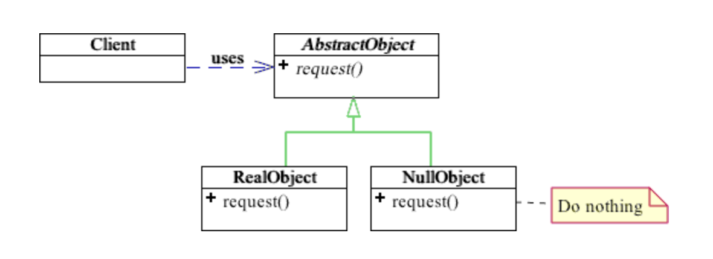

// Participants

- `Client`  :::  requires a collaborator.

- `AbstractObject` ::: declares the interface for Client's collaborator and implements default behavior for the interface common to all classes, as appropriate.

- `RealObject` ::: defines a concrete subclass of AbstractObject whose instances provide useful behavior that Client expects.

- `NullObject` ::: provides an interface identical to AbstractObject's so that a null object can be substituted for a real object. and implements its interface to do nothing. What exactly it means to do nothing depends on what sort of behavior Client is expecting. when there is more than one way to do nothing, more than one NullObject class may be required.


// Collaborations

Clients use the AbstractObject class interface to interact with their collaborators. If the receiver is a RealObject, then the request is handled to provide real behavior. If the receiver is a NullObject, the request is handled by doing nothing or at least providing a null result.


### Implementation of Null Object pattern

There are several issues to consider when implementing the Null Object pattern:

- Null Object as Singleton. The Null Object class is often implemented as a Singleton [GHJV95, page 127]. Since a null object usually does not have any state, its state can't change, so multiple instances are identical. Rather than use multiple identical instances, the system can just use a single instance repeatedly.

- Clients don't agree on null behavior. If some clients expect the null object to do nothing one way and some another, multiple NullObject classes will be required. If the do nothing behavior must be customized at run time, the NullObject class will require pluggable variables so that the client can specify how the null object should do nothing (see the discussion of pluggable adaptors in the Adapter pattern [GHJV95, page 142]). This may generally be a symptom of the AbstractObject not having a well defined (semantic) interface.

- Transformation to Real Object. A Null Object does not transform to become a Real Object. If the object may decide to stop providing do nothing behavior and start providing real behavior, it is not a null object. It may be a real object with a do nothing mode, such as a controller which can switch in and out of read-only mode. If it is a single object which must mutate from a do nothing object to a real one, it should be implemented with the State pattern [GHJV95, page 305] or perhaps the Proxy pattern [GHJV95, page 207]. In this case a Null State may be used or the proxy may hold a Null Object.

- Null Object is not Proxy. The use of a null object can be similar to that of a Proxy [GHJV95, page 207], but the two patterns have different purposes. A proxy provides a level of indirection when accessing a real subject, thus controlling access to the subject. A null collaborator does not hide a real object and control access to it, it replaces the real object. A proxy may eventually mutate to start acting like a real subject. A null object will not mutate to start providing real behavior, it will always provide do nothing behavior.

- Null Object as special Strategy. A Null Object can be a special case of the Strategy pattern [GHJV95, page 315]. Strategy specifies several ConcreteStrategy classes as different approaches for accomplishing a task. If one of those approaches is to consistently do nothing, that ConcreteStrategy is a NullObject. For example, a Controller is a View's Strategy for handling input, and NoController is the Strategy that ignores all input.

- Null Object as special State. A Null Object can be a special case of the State pattern [GHJV95, page 305]. Normally, each ConcreteState has some do nothing methods because they're not appropriate for that state. In fact, a given method is often implemented to do something useful in most states but to do nothing in at least one state. If a particular ConcreteState implements most of its methods to do nothing or at least give null results, it becomes a do nothing state and as such is a null state.

- Null Object as Visitor host. A Null Object can be used to allow a Visitor [GHJV95, page 331] to safely visit a hierarchy and handle the null situation.

- The Null Object class is not a mixin. Null Object is a concrete collaborator class that acts as the collaborator for a client which needs one. The null behavior is not designed to be mixed into an object that needs some do nothing behavior. It is designed for a class which delegates to a collaborator all of the behavior that may or may not be do nothing behavior. [Woolf96]

### C++ Example

```c++
#include <iostream>

class Animal {
 public:
  virtual ~Animal() = default;

  virtual void MakeSound() const = 0;
};

class Dog : public Animal {
 public:
  virtual void MakeSound() const override { std::cout << "woof!" << std::endl; }
};

class NullAnimal : public Animal {
 public:
  virtual void MakeSound() const override {}
};
```

Here, the idea is that there are situations where a pointer or reference to an `Animal` object is required, but there is no appropriate object available. A null reference is impossible in standard-conforming C++. 

A null` Animal*` pointer is possible, and could be useful as a place-holder, but may not be used for direct dispatch: `a->MakeSound()` is undefined behavior if `a` is a null pointer. 

The null object pattern solves this problem by providing a special `NullAnimal` class which can be instantiated bound to an `Animal` pointer or reference. 


The special null class must be created for each class hierarchy that is to have a null object, since a `NullAnimal` is of no use when what is needed is a null object with regard to some Widget base class that is not related to the `Animal` hierarchy. 


Note that NOT having a null class at all is an important feature, in contrast to languages where "anything is a reference" (e.g., Java and C#). In C++, the design of a function or method may explicitly state whether null is allowed or not. 


```c++
// Function which requires an |Animal| instance, and will not accept null.
void DoSomething(const Animal& animal) {
  // |animal| may never be null here.
}

// Function which may accept an |Animal| instance or null.
void DoSomething(const Animal* animal) {
  // |animal| may be null.
}
```

### Java Example

```java
public interface Animal {
	void makeSound();
}

public class Dog implements Animal {
	public void makeSound() {
		System.out.println("woof!");
	}
}

public class NullAnimal implements Animal {
	public void makeSound() {
        // silence...
	}
}
```

This code illustrates a variation of the C++ example, above, using the Java language. As with C++, a null class can be instantiated in situations where a reference to an `Animal` object is required, but there is no appropriate object available. 

A null `Animal` object is possible (`Animal myAnimal = null;`) and could be useful as a place-holder, but may not be used for calling a method. In this example, `myAnimal.makeSound();` will throw a `NullPointerException`. Therefore, additional code may be necessary to test for null objects. 

The null object pattern solves this problem by providing a special `NullAnimal` class which can be instantiated as an object of type `Animal`. As with C++ and related languages, that special null class must be created for each class hierarchy that needs a null object, since a `NullAnimal` is of no use when what is needed is a null object that does not implement the `Animal` interface. 

### JavaScript Example

In `duck-typed languages like JavaScript`, language inheritance is not necessary to provide expected behavior. 

```javascript
class Dog {
  sound() {
    return 'bark';
  }
}

class NullAnimal {
  sound() {
    return null;
  }
}

function getAnimal(type) {
  return type === 'dog' ? new Dog() : new NullAnimal();
}

['dog', null].map((animal) => getAnimal(animal).sound());
// Returns ["bark", null]
```

## Protocol Stack Design Pattern

Protocol stacks are a layered collection of protocols that work together to provide communication services. Each protocol in the stack is responsible for a specific task, and by layering them, we can create a more robust and reliable system.

The protocol stack or network stack is an implementation of a computer networking protocol suite or protocol family. in which, Communications are handled by multiple layers, which form an encapsulation hierarchy.

Some of these terms are used interchangeably but strictly speaking, the suite is the definition of the communication protocols, and the stack is the software implementation of them.

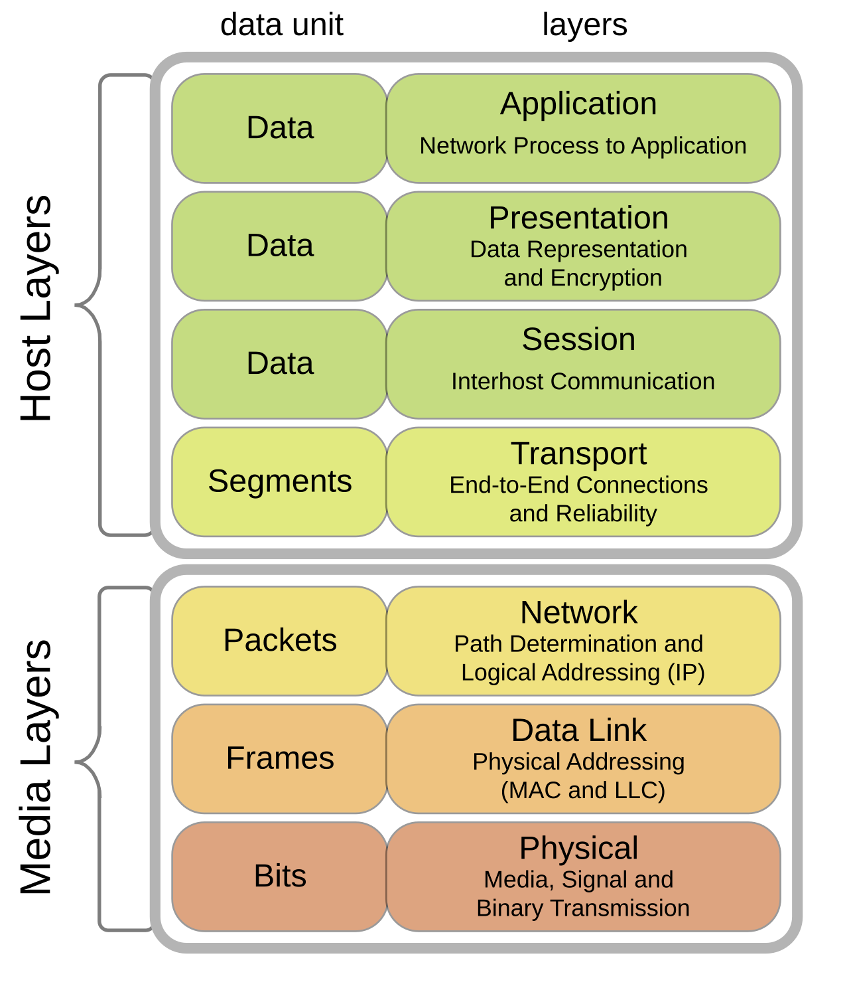

Individual protocols within a suite are often designed with a single purpose in mind. 

This modularization simplifies design and evaluation. Because each protocol module usually communicates with two others, they are commonly imagined as layers in a stack of protocols. 

The lowest protocol always deals with low-level interaction with the communications hardware. Each higher layer adds additional capabilities. User applications usually deal only with the topmost layers.

// To know more about this pattern

- https://novelbits.io/protocol-stacks-layered-architecture/

- https://www.sciencedirect.com/topics/computer-science/protocol-stack

- https://www.w3.org/People/Frystyk/thesis/TcpIp.html

- https://www2.it.uu.se/education/course/homepage/dsp/vt19/modules/module-1/tcpip-protocol-stack/


### General protocol suite description

```c#
 T ~ ~ ~ T
[A]     [B]_____[C]
```

Imagine three computers: A, B, and C. A and B both have radio equipment and can communicate via the airwaves using a suitable network protocol (such as IEEE 802.11). 

B and C are connected via a cable, using it to exchange data (again, with the help of a protocol, for example Point-to-Point Protocol). However, neither of these two protocols will be able to transport information from A to C, because these computers are conceptually on different networks. An inter-network protocol is required to connect them. 

One could combine the two protocols to form a powerful third, mastering both cable and wireless transmission, but a different super-protocol would be needed for each possible combination of protocols. It is easier to leave the base protocols alone, and design a protocol that can work on top of any of them (the Internet Protocol is an example). This will make two stacks of two protocols each. The inter-network protocol will communicate with each of the base protocol in their simpler language; the base protocols will not talk directly to each other. 

A request on computer A to send a chunk of data to C is taken by the upper protocol, which (through whatever means) knows that C is reachable through B. It, therefore, instructs the wireless protocol to transmit the data packet to B. On this computer, the lower layer handlers will pass the packet up to the inter-network protocol, which, on recognizing that B is not the final destination, will again invoke lower-level functions. This time, the cable protocol is used to send the data to C. There, the received packet is again passed to the upper protocol, which (with C being the destination) will pass it on to a higher protocol or application on C. 


In practical implementation, protocol stacks are often divided into three major sections: `media`, `transport`, and `applications`. 

A particular operating system or platform will often have two well-defined software interfaces: one between the media and transport layers, and one between the transport layers and applications. The media-to-transport interface defines how transport protocol software makes use of particular media and hardware types and is associated with a device driver. For example, this interface level would define how TCP/IP transport software would talk to the network interface controller. Examples of these interfaces include ODI and NDIS in the Microsoft Windows and DOS environment. The application-to-transport interface defines how application programs make use of the transport layers. For example, this interface level would define how a web browser program would talk to TCP/IP transport software. Examples of these interfaces include Berkeley sockets and System V STREAMS in Unix-like environments, and Winsock for Microsoft Windows. 


### List of protocol stack architectures

This is a list of `protocol stack architectures`. A protocol stack is a suite of complementary communications protocols in a computer network or a computer bus system. 

- ARCNET     ::: https://en.wikipedia.org/wiki/ARCNET
- AppleTalk  ::: https://en.wikipedia.org/wiki/AppleTalk
- ATM        ::: https://en.wikipedia.org/wiki/Asynchronous_Transfer_Mode
- Bluetooth  ::: https://en.wikipedia.org/wiki/Bluetooth
- DECnet     ::: https://en.wikipedia.org/wiki/DECnet
- Ethernet   ::: https://en.wikipedia.org/wiki/Ethernet
- FDDI       ::: https://en.wikipedia.org/wiki/Fiber_distributed_data_interface
- HIPPI      ::: https://en.wikipedia.org/wiki/HIPPI
- USB        ::: https://en.wikipedia.org/wiki/Universal_Serial_Bus
- IPX        ::: https://en.wikipedia.org/wiki/IPX
- Myrinet    ::: https://en.wikipedia.org/wiki/Myrinet  
- QsNet      ::: https://en.wikipedia.org/wiki/QsNet
- SPX        ::: https://en.wikipedia.org/wiki/Sequenced_packet_exchange
- Token Ring ::: https://en.wikipedia.org/wiki/Token_Ring
- Frame Relay ::: https://en.wikipedia.org/wiki/Frame_Relay
- OSI protocol suite ::: https://en.wikipedia.org/wiki/OSI_protocol_suite
- System Network Architecture ::: https://en.wikipedia.org/wiki/System_network_architecture
- X.25 protocol suite  ::: https://en.wikipedia.org/wiki/X.25_protocol_suite
- Internet protocol suite https://en.wikipedia.org/wiki/Internet_protocol_suite
- IEEE-488 ::: https://en.wikipedia.org/wiki/IEEE-488
- IEEE 1394 aka FireWire, iLink ::: https://en.wikipedia.org/wiki/FireWire
- IEEE 802.11 aka Wireless LAN (Wi-Fi certification) ::: https://en.wikipedia.org/wiki/IEEE_802.11

## Specification Design Pattern

Specification pattern is a particular software design pattern, whereby business rules can be recombined by chaining the business rules together using boolean logic. 

It allows us to encapsulate some piece of domain knowledge into a single unit - specification - and reuse it in different parts of the code base.

The pattern is frequently used in the context of `domain-driven design`. 

One Domain-Driven-Design solution to the problem of where to place querying, sorting, and paging logic is to use a Specification. The Specification design pattern describes a query in an object. 

So to encapsulate a paged query that searches for some products, one might create a PagedProduct specification that would take in any necessary parameters (pageSize, pageNumber, filter). 
Then one of your repository methods (usually a List() overload) would accept an ISpecification and would be able to produce the expected result given the specification. There are several benefits to this approach. The specification has a name (as opposed to just a bunch of LINQ expressions) that you can reason about and discuss. It can be unit tested in isolation to ensure correctness. And it can easily be reused if you need the same behavior (say on an MVC View action and a Web API action, as well as in various services). Further, a specification can also be used to describe the shape of the data to be returned, so that queries can return just the data they required. This eliminates the need for lazy loading in web applications (bad idea) and helps keep repository implementations from becoming cluttered with these details.

`Recombinable business logic in a Boolean fashion. `

A specification pattern outlines a business rule that is combinable with other business rules. 

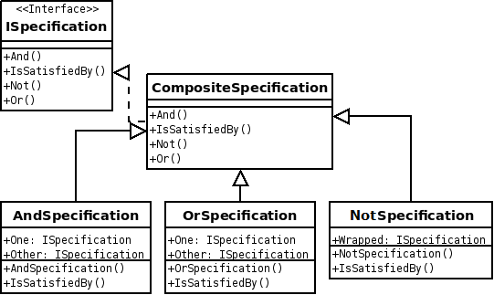

In this pattern, a unit of business logic inherits its functionality from the abstract aggregate Composite Specification class. The Composite Specification class has one function called IsSatisfiedBy that returns a boolean value. 

After instantiation, the specification is "chained" with other specifications, making new specifications easily maintainable, yet highly customizable business logic. Furthermore, upon instantiation the business logic may, through method invocation or inversion of control, have its state altered in order to become a delegate of other classes such as a persistence repository.

As a consequence of performing runtime composition of high-level business/domain logic, the Specification pattern is a convenient tool for converting ad-hoc user search criteria into low level logic to be processed by repositories. 

Since a specification is an encapsulation of logic in a reusable form it is very simple to thoroughly unit test, and when used in this context is also an implementation of the humble object pattern. 

To know more about ::: http://www.martinfowler.com/apsupp/spec.pdf


### C++

```c++
template <class T>
class ISpecification
{
public:
	virtual ~ISpecification() = default;
	virtual bool IsSatisfiedBy(T Candidate) const = 0;
	virtual ISpecification<T>* And(const ISpecification<T>& Other) const = 0;
	virtual ISpecification<T>* AndNot(const ISpecification<T>& Other) const = 0;
	virtual ISpecification<T>* Or(const ISpecification<T>& Other) const = 0;
	virtual ISpecification<T>* OrNot(const ISpecification<T>& Other) const = 0;
	virtual ISpecification<T>* Not() const = 0;
};

template <class T>
class CompositeSpecification : public ISpecification<T>
{
public:
	virtual bool IsSatisfiedBy(T Candidate) const override = 0;

	virtual ISpecification<T>* And(const ISpecification<T>& Other) const override;
	virtual ISpecification<T>* AndNot(const ISpecification<T>& Other) const override;
	virtual ISpecification<T>* Or(const ISpecification<T>& Other) const override;
	virtual ISpecification<T>* OrNot(const ISpecification<T>& Other) const override;
	virtual ISpecification<T>* Not() const override;
};

template <class T>
class AndSpecification final : public CompositeSpecification<T>
{
public:
	const ISpecification<T>& Left;
	const ISpecification<T>& Right;

	AndSpecification(const ISpecification<T>& InLeft, const ISpecification<T>& InRight)
		: Left(InLeft),
		  Right(InRight) { }

	virtual bool IsSatisfiedBy(T Candidate) const override
	{
		return Left.IsSatisfiedBy(Candidate) && Right.IsSatisfiedBy(Candidate);
	}
};

template <class T>
ISpecification<T>* CompositeSpecification<T>::And(const ISpecification<T>& Other) const
{
	return new AndSpecification<T>(*this, Other);
}

template <class T>
class AndNotSpecification final : public CompositeSpecification<T>
{
public:
	const ISpecification<T>& Left;
	const ISpecification<T>& Right;

	AndNotSpecification(const ISpecification<T>& InLeft, const ISpecification<T>& InRight)
		: Left(InLeft),
		  Right(InRight) { }

	virtual bool IsSatisfiedBy(T Candidate) const override
	{
		return Left.IsSatisfiedBy(Candidate) && !Right.IsSatisfiedBy(Candidate);
	}
};

template <class T>
class OrSpecification final : public CompositeSpecification<T>
{
public:
	const ISpecification<T>& Left;
	const ISpecification<T>& Right;

	OrSpecification(const ISpecification<T>& InLeft, const ISpecification<T>& InRight)
		: Left(InLeft),
		  Right(InRight) { }

	virtual bool IsSatisfiedBy(T Candidate) const override
	{
		return Left.IsSatisfiedBy(Candidate) || Right.IsSatisfiedBy(Candidate);
	}
};

template <class T>
class OrNotSpecification final : public CompositeSpecification<T>
{
public:
	const ISpecification<T>& Left;
	const ISpecification<T>& Right;

	OrNotSpecification(const ISpecification<T>& InLeft, const ISpecification<T>& InRight)
		: Left(InLeft),
		  Right(InRight) { }

	virtual bool IsSatisfiedBy(T Candidate) const override
	{
		return Left.IsSatisfiedBy(Candidate) || !Right.IsSatisfiedBy(Candidate);
	}
};

template <class T>
class NotSpecification final : public CompositeSpecification<T>
{
public:
	const ISpecification<T>& Other;

	NotSpecification(const ISpecification<T>& InOther)
		: Other(InOther) { }

	virtual bool IsSatisfiedBy(T Candidate) const override
	{
		return !Other.IsSatisfiedBy(Candidate);
	}
};

template <class T>
ISpecification<T>* CompositeSpecification<T>::AndNot(const ISpecification<T>& Other) const
{
	return new AndNotSpecification<T>(*this, Other);
}

template <class T>
ISpecification<T>* CompositeSpecification<T>::Or(const ISpecification<T>& Other) const
{
	return new OrSpecification<T>(*this, Other);
}

template <class T>
ISpecification<T>* CompositeSpecification<T>::OrNot(const ISpecification<T>& Other) const
{
	return new OrNotSpecification<T>(*this, Other);
}

template <class T>
ISpecification<T>* CompositeSpecification<T>::Not() const
{
	return new NotSpecification<T>(*this);
}
```

### TypeScript Example

```typescript
export interface ISpecification {
  isSatisfiedBy(candidate: unknown): boolean;
  and(other: ISpecification): ISpecification;
  andNot(other: ISpecification): ISpecification;
  or(other: ISpecification): ISpecification;
  orNot(other: ISpecification): ISpecification;
  not(): ISpecification;
}

export abstract class CompositeSpecification implements ISpecification {
  abstract isSatisfiedBy(candidate: unknown): boolean;

  and(other: ISpecification): ISpecification {
    return new AndSpecification(this, other);
  }

  andNot(other: ISpecification): ISpecification {
    return new AndNotSpecification(this, other);
  }

  or(other: ISpecification): ISpecification {
    return new OrSpecification(this, other);
  }

  orNot(other: ISpecification): ISpecification {
    return new OrNotSpecification(this, other);
  }

  not(): ISpecification {
    return new NotSpecification(this);
  }
}

export class AndSpecification extends CompositeSpecification {
  constructor(private leftCondition: ISpecification, private rightCondition: ISpecification) {
    super();
  }

  isSatisfiedBy(candidate: unknown): boolean {
    return this.leftCondition.isSatisfiedBy(candidate) && this.rightCondition.isSatisfiedBy(candidate);
  }
}

export class AndNotSpecification extends CompositeSpecification {
  constructor(private leftCondition: ISpecification, private rightCondition: ISpecification) {
    super();
  }

  isSatisfiedBy(candidate: unknown): boolean {
    return this.leftCondition.isSatisfiedBy(candidate) && this.rightCondition.isSatisfiedBy(candidate) !== true;
  }
}

export class OrSpecification extends CompositeSpecification {
  constructor(private leftCondition: ISpecification, private rightCondition: ISpecification) {
    super();
  }

  isSatisfiedBy(candidate: unknown): boolean {
    return this.leftCondition.isSatisfiedBy(candidate) || this.rightCondition.isSatisfiedBy(candidate);
  }
}

export class OrNotSpecification extends CompositeSpecification {
  constructor(private leftCondition: ISpecification, private rightCondition: ISpecification) {
    super();
  }

  isSatisfiedBy(candidate: unknown): boolean {
    return this.leftCondition.isSatisfiedBy(candidate) || this.rightCondition.isSatisfiedBy(candidate) !== true;
  }
}

export class NotSpecification extends CompositeSpecification {
  constructor(private wrapped: ISpecification) {
    super();
  }

  isSatisfiedBy(candidate: unknown): boolean {
    return !this.wrapped.isSatisfiedBy(candidate);
  }
}
```

In the following example, we are retrieving invoices and sending them to a collection agency if

- they are overdue,
- notices have been sent, and
- they are not already with the collection agency.

This example is meant to show the result of how the logic is 'chained' together.

This usage example assumes a previously defined `OverdueSpecification` class that is satisfied when an invoice's due date is 30 days or older, a `NoticeSentSpecification` class that is satisfied when three notices have been sent to the customer, and an `InCollectionSpecification` class that is satisfied when an invoice has already been sent to the collection agency. The implementation of these classes isn't important here.

Using these three specifications, we created a new specification called `SendToCollection` which will be satisfied when an invoice is overdue, when notices have been sent to the customer, and are not already with the collection agency.

```typescript

var overDue = new OverDueSpecification();
var noticeSent = new NoticeSentSpecification();
var inCollection = new InCollectionSpecification();

// Example of specification pattern logic chaining
var sendToCollection = overDue.And(noticeSent).And(inCollection.Not());

var invoiceCollection = Service.GetInvoices();

foreach (var currentInvoice in invoiceCollection)
{
    if (sendToCollection.IsSatisfiedBy(currentInvoice))
    {
        currentInvoice.SendToCollection();
    }
}

```

## Fluent interface Design Pattern

## Servant Design Pattern

## Scheduled-task Design Pattern


 