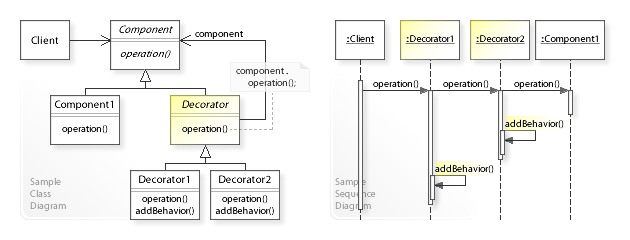

# Design Pattern

A design pattern is the re-usable form of a solution to a design problem. The idea was introduced by the architect `Christopher Alexander`.


# Why Design Patterns ?

Documenting a pattern requires explaining why a particular situation causes problems, and how the components of the pattern relate to each other to give the solution. Christopher Alexander describes common design problems as arising from "conflicting forces"—such as the conflict between wanting a room to be sunny and wanting it not to overheat on summer afternoons. A pattern would not tell the designer how many windows to put in the room; instead, it would propose a set of values to guide the designer toward a decision that is best for their particular application. Alexander, for example, suggests that enough windows should be included to direct light all around the room. He considers this a good solution because he believes it increases the enjoyment of the room by its occupants. Other authors might come to different conclusions, if they place higher value on heating costs, or material costs. These values, used by the pattern's author to determine which solution is "best", must also be documented within the pattern.

Pattern documentation should also explain when it is applicable. Since two houses may be very different from one another, a design pattern for houses must be broad enough to apply to both of them, but not so vague that it doesn't help the designer make decisions. The range of situations in which a pattern can be used is called its context. Some examples might be "all houses", "all two-story houses", or "all places where people spend time". 

For instance, in Christopher Alexander's work, bus stops and waiting rooms in a surgery center are both within the context for the pattern "A PLACE TO WAIT". 


So, The single biggest benefit of design patterns in my opinion is that `it gives developers a common vocabulary to talk about software solutions.`

If I say, "We should implement this using the singleton pattern", we have a common point of reference to begin discussing whether or not that is a good idea without me having to actually implement the solution first so you know what I mean.

Add in `readability` and `maintainability` that comes with familiar solutions to common problems, instead of every developer trying to solve the problem in their own way over an over again.

Pretty important. Software can be made without them, but it's certainly a lot harder.


# Differenet Types of Design Patterns

there are various types of design patterns exits in software engineering.

- `Software Design Pattern` in software design
- `Architectural Pattern`:  for software architecture
- `Interaction design pattern`: used in interaction design / human–computer interaction
- `Pedagogical patterns`:  in teaching
- `Pattern gardening` : in gardening


we will discuss `Software Design Pattern` & `Architectural Pattern` only.


# Software Design Pattern

A design pattern describes a relatively small, well-defined aspect (i.e. functionality) of a computer program in terms of how to write the code.

Using a pattern is intended to leverage an existing concept rather than re-inventing it. This can decrease the time to develop software and increase the quality of the resulting program. 

Notably, a pattern does not consist of a software artifact. Most development resources that a programmer uses involve configuring the codebase to use an artifact such as a library (to name just one example). In contrast, to use a pattern, a programmer writes code as described by the pattern. The result is unique every time even though the result may be recognizable as based on the pattern. 

Conceptually, design pattern may be described as more specific than programming paradigm and less specific than algorithm. 


## Motivation for Software Design Pattern

Design patterns can speed up the development process by providing proven development paradigms.Effective software design requires considering issues that may not become apparent until later in the implementation. Freshly written code can often have hidden, subtle issues that take time to be detected; issues that sometimes can cause major problems down the road. Reusing design patterns can help to prevent such issues, and enhance code readability for those familiar with the patterns. 

Software design techniques are difficult to apply to a broader range of problems.[citation needed] Design patterns provide general solutions, documented in a format that does not require specifics tied to a particular problem. 

`A pattern describes a design motif, a.k.a. prototypical micro-architecture, as a set of program constituents (e.g., classes, methods...) and their relationships. A developer adapts the motif to their codebase to solve the problem described by the pattern. The resulting code has structure and organization similar to the chosen motif. `


## Object-Oriented Design Patterns

Object-oriented design patterns typically show relationships and interactions between classes or objects, without specifying the final application classes or objects that are involved. Patterns that imply mutable state may be unsuited for functional programming languages. Some patterns can be rendered unnecessary in languages that have built-in support for solving the problem they are trying to solve, and object-oriented patterns are not necessarily suitable for non-object-oriented languages. 

Design patterns can be organized into groups based on what kind of problem they solve. 

- `Creational Design Patterns :` create objects. 

- `Structural Design Patterns :` organize classes and objects to form larger structures that provide new functionality. 

- `Behavioral Design Patterns :` provide communication between objects and realizing these patterns. 


# Creational Design Patterns

Creational Design Patterns are design patterns that `deal with object creation mechanisms, trying to create objects in a manner suitable to the situation.` The basic form of object creation could result in design problems or in added complexity to the design due to inflexibility in the creation procedures. Creational design patterns solve this problem by somehow controlling this object creation. 

Simply we can say, `Creational design patterns provide various object creation mechanisms, which increase flexibility and reuse of existing code.`

Creational design patterns are composed of two dominant ideas. `One is encapsulating knowledge about which concrete classes the system uses.` Another is `hiding how instances of these concrete classes are created and combined.`

Creational design patterns are further categorized into object-creational patterns and class-creational patterns, where object-creational patterns deal with object creation and class-creational patterns deal with class-instantiation. In greater details, object-creational patterns defer part of its object creation to another object, while class-creational patterns defer its object creation to subclasses.


The creational patterns aim to `separate a system from how its objects are created, composed, and represented. `They increase the system's flexibility in terms of the what, who, how, and when of object creation.


## Why Creational Design Patterns ?

As modern software engineering depends more on object composition than class inheritance, emphasis shifts away from hard-coding behaviors toward defining a smaller set of basic behaviors that can be composed into more complex ones. Hard-coding behaviors are inflexible because they require overriding or re-implementing the whole thing in order to change parts of the design. Additionally, hard-coding does not promote reuse and makes it difficult to keep track of errors. For these reasons, creational patterns are more useful than hard-coding behaviors. Creational patterns make design become more flexible. They provide different ways to remove explicit references in the concrete classes from the code that needs to instantiate them. In other words, they create independency for objects and classes. 


## When Creational Design Patterns can be apply ?

Consider applying creational patterns when:

- A system should be independent of how its objects and products are created.
- A set of related objects is designed to be used together.
- Hiding the implementations of a class library or product, revealing only their interfaces.
- Constructing different representation of independent complex objects.
- A class wants its subclass to implement the object it creates.
- The class instantiations are specified at run-time.
- There must be a single instance and client can access this instance at all times.
- Instance should be extensible without being modified.


## Structure of Creational Design Patterns

Below is a simple class diagram that most creational patterns have in common. Note that different creational patterns require additional and different participated classes. 


`Participants:`

-    `Creator:` Declares object interface. Returns object.

-    `ConcreteCreator:` Implements object's interface.


## Examples of Creational Design Patterns

There are some 10 examples of creational design patterns exist may be exist more than that as these are patterns for common occuring problems in software engineering:


- `Multiton:` Ensure a class has only named instances, and provide a global point of access to them.

- `Builder pattern:` Separate the construction of a complex object from its representation, allowing the same construction process to create various representations. 

- `Prototype pattern:` Specify the kinds of objects to create using a prototypical instance, and create new objects from the 'skeleton' of an existing object, thus boosting performance and keeping memory footprints to a minimum. 

- `Singleton pattern:` Ensure a class has only one instance, and provide a global point of access to it. 

- `Object pool pattern:` Avoid expensive acquisition and release of resources by recycling objects that are no longer in use. Can be considered a generalisation of connection pool and thread pool patterns. 

- `Factory method pattern:` Define an interface for creating a single object, but let subclasses decide which class to instantiate. Factory Method lets a class defer instantiation to subclasses.

- `Abstract Factory pattern:` Provide an interface for creating families of related or dependent objects without specifying their concrete classes. 

- `Lazy initialization pattern:` Tactic of delaying the creation of an object, the calculation of a value, or some other expensive process until the first time it is needed. This pattern appears in the GoF catalog as "virtual proxy", an implementation strategy for the Proxy pattern.

- `Dependency Injection pattern:` A class accepts the objects it requires from an injector instead of creating the objects directly. 

- `Resource acquisition is initialization (RAII):` Ensure that resources are properly released by tying them to the lifespan of suitable objects. 


## Factory Method Pattern

Factory Method is a creational design pattern that `provides an interface or abstract class` for creating objects in a superclass, `but allows subclasses to alter the type of objects that will be created [IMP.]`. In other words  `subclasses are responsible to create the instance of the class.`

The Factory Method Pattern is also known as `Virtual Constructor`.

Factory method pattern is a design pattern that uses factory methods to deal with the problem of creating objects without having to specify their exact class. Rather than by calling a constructor, this is done by calling a factory method to create an object.


Factory methods can either be specified in an interface and implemented by child classes, or implemented in a base class and optionally overridden by derived classes.

Factory Method Pattern "Define an interface for creating an object, but let subclasses decide which class to instantiate. The Factory method lets a class defer instantiation it uses to subclasses."


Creating an object often requires complex processes not appropriate to include within a composing object. The object's creation may lead to a significant duplication of code, may require information not accessible to the composing object, may not provide a sufficient level of abstraction, or may otherwise not be part of the composing object's concerns. The factory method design pattern handles these problems by defining a separate method for creating the objects, which subclasses can then override to specify the derived type of product that will be created. 


The factory method pattern relies on inheritance, as object creation is delegated to subclasses that implement the factory method to create objects.


### Which Problems Factory Method Pattern Solves ?

The Factory Method design pattern solves problems like:

- How can an object be created so that subclasses can redefine its subsequent and distinct implementation?
- How can an object's instantiation be deferred to a subclass?

### How Such Problems Factory Method Pattern Solves ?

The Factory Method design pattern describes how to solve such problems: 

- Define a factory method within the superclass that defers the object's creation to a subclass's factory method.
- Create an object by calling a factory method instead of directly calling a constructor.

This enables the writing of subclasses that can change the way an object is created (e.g. by redefining which class to instantiate).


### Structure of Factory Method

A sample UML class diagram for the Factory Method design pattern.


In the above UML class diagram, the Creator class that requires a Product object does not instantiate the Product1 class directly. Instead, the Creator refers to a separate factoryMethod() to create a product object, which makes the Creator independent of which concrete class is instantiated. Subclasses of Creator can redefine which class to instantiate. In this example, the Creator1 subclass implements the abstract factoryMethod() by instantiating the Product1 class. 


### Why Factory Method Pattern ?

The factory method pattern can improve performance by reducing the number of object creations and dependencies, and by enabling lazy initialization and caching of objects. It can also enhance maintainability by decoupling the client code from the concrete classes, and by allowing you to add new types of objects without modifying the existing code. The factory method pattern can also support the principle of open-closed design, which states that software entities should be open for extension but closed for modification.


Factory Method Pattern allows the sub-classes to choose the type of objects to create.

It promotes the `loose-coupling` by eliminating the need to bind application-specific classes into the code. That means the code interacts solely with the resultant interface or abstract class, so that it will work with any classes that implement that interface or that extends that abstract class.


### Why not Factory Method Pattern ?

The factory method pattern can also introduce some drawbacks that can affect performance and maintainability. For example, it can increase the complexity and size of the code, as you need to create a separate factory class or method for each type of object. It can also introduce an extra level of abstraction and indirection, which can make the code harder to understand and debug. Moreover, it can create tight coupling between the factory and the concrete classes, which can make the code less flexible and testable.


### C++ Example

```C++ 
#include <iostream>
#include <memory>

enum ProductId {MINE, YOURS};

// defines the interface of objects the factory method creates.
class Product {
public:
  virtual void print() = 0;
  virtual ~Product() = default;
};

// implements the Product interface.
class ConcreteProductMINE: public Product {
public:
  void print() {
    std::cout << "this=" << this << " print MINE\n";
  }
};

// implements the Product interface.
class ConcreteProductYOURS: public Product {
public:
  void print() {
    std::cout << "this=" << this << " print YOURS\n";
  }
};

// declares the factory method, which returns an object of type Product.
class Creator {
public:
  virtual std::unique_ptr<Product> create(ProductId id) {
    if (ProductId::MINE == id) return std::make_unique<ConcreteProductMINE>();
    if (ProductId::YOURS == id) return std::make_unique<ConcreteProductYOURS>();
    // repeat for remaining products...

    return nullptr;
  }
  virtual ~Creator() = default;
};

int main() {
  // The unique_ptr prevent memory leaks.
  std::unique_ptr<Creator> creator = std::make_unique<Creator>();
  std::unique_ptr<Product> product = creator->create(ProductId::MINE);
  product->print();

  product = creator->create(ProductId::YOURS);
  product->print();
}
```

// The program output is like 

```bash
this=0x6e5e90 print MINE
this=0x6e62c0 print YOURS
```


### JAVA Example


#1 Create a Plan abstract class.

```JAVA
import java.io.*;      
    abstract class Plan{  
             protected double rate;  
             abstract void getRate();  
       
             public void calculateBill(int units){  
                  System.out.println(units*rate);  
              }  
    }//end of Plan class.    
```  

#2 Create the concrete classes that extends Plan abstract class. 

```JAVA
class  DomesticPlan extends Plan{  
        @override  
         public void getRate(){  
             rate=3.50;              
        }  
   }//end of DomesticPlan class.


class  CommercialPlan extends Plan{  
    @override   
    public void getRate(){   
        rate=7.50;  
   }
}   
//end of CommercialPlan class. 

class  InstitutionalPlan extends Plan{  
    @override  
    public void getRate(){   
        rate=5.50;  
   }
}   
//end of InstitutionalPlan class.

```
#3 Create a GetPlanFactory `to generate object of concrete classes based on given information`.

```JAVA
class GetPlanFactory{     
   //use getPlan method to get object of type Plan   
       public Plan getPlan(String planType){  
            if(planType == null){  
             return null;  
            }  
          if(planType.equalsIgnoreCase("DOMESTICPLAN")) {  
                 return new DomesticPlan();  
               }   
           else if(planType.equalsIgnoreCase("COMMERCIALPLAN")){  
                return new CommercialPlan();  
            }   
          else if(planType.equalsIgnoreCase("INSTITUTIONALPLAN")) {  
                return new InstitutionalPlan();  
          }  
      return null;  
   }  
}//end of GetPlanFactory class.
```
#4 Generate Bill by using the GetPlanFactory to get the object of concrete classes by passing an information such as type of plan DOMESTICPLAN or COMMERCIALPLAN or INSTITUTIONALPLAN.

```JAVA
import java.io.*;    
class GenerateBill{  
    public static void main(String args[])throws IOException{  
      GetPlanFactory planFactory = new GetPlanFactory();  
        
      System.out.print("Enter the name of plan for which the bill will be generated: ");  
      BufferedReader br=new BufferedReader(new InputStreamReader(System.in));  
  
      String planName=br.readLine();  
      System.out.print("Enter the number of units for bill will be calculated: ");  
      int units=Integer.parseInt(br.readLine());  
  
      Plan p = planFactory.getPlan(planName);  
      //call getRate() method and calculateBill()method of DomesticPaln.  
  
       System.out.print("Bill amount for "+planName+" of  "+units+" units is: ");  
           p.getRate();  
           p.calculateBill(units);  
            }  
    }//end of GenerateBill class.
```

similar example :: https://www.tutorialspoint.com/design_pattern/factory_pattern.htm


## Abstract Factory Pattern

The Abstract factory pattern in software engineering is a creational design pattern that provides a way to create families of related objects without imposing their concrete classes, by encapsulating a group of individual factories that have a common theme without specifying their concrete classes.

`Abstract factory pattern define as "an interface for creating families of related or dependent objects without specifying their concrete classes."`

That means Abstract Factory lets a class returns a factory of classes. So, this is the reason that Abstract Factory Pattern is one level higher than the Factory Pattern.

An Abstract Factory Pattern is also known as `Kit`. 


According to this pattern, a client software component creates a concrete implementation of the abstract factory and then uses the generic interface of the factory to create the concrete objects that are part of the family.

The client does not know which concrete objects it receives from each of these internal factories, as it uses only the generic interfaces of their products.

This pattern separates the details of implementation of a set of objects from their general usage and relies on object composition, as object creation is implemented in methods exposed in the factory interface.


### When Abstract Factory Pattern can be apply ?

- When the system needs to be independent of how its object are created, composed, and represented.
- When the family of related objects has to be used together, then this constraint needs to be enforced.
- When you want to provide a library of objects that does not show implementations and only reveals interfaces.
- When the system needs to be configured with one of a multiple family of objects.


### Which Problems Abstract Factory Pattern Solves ?

Creating objects directly within the class that requires the objects is inflexible. Doing so commits the class to particular objects and makes it impossible to change the instantiation later without changing the class. It prevents the class from being reusable if other objects are required, and it makes the class difficult to test because real objects cannot be replaced with mock objects. 

A factory is the location of a concrete class in the code at which objects are constructed. Implementation of the pattern intends to insulate the creation of objects from their usage and to create families of related objects without depending on their concrete classes. This allows for new derived types to be introduced with no change to the code that uses the base class. 

It may be used to solve problems such as:

- How can an application be independent of how its objects are created?
- How can a class be independent of how the objects that it requires are created?
- How can families of related or dependent objects be created?

### How Such Problems Abstract Factory Pattern Solves ?

This makes a class independent of how its objects are created. A class may be configured with a factory object, which it uses to create objects, and the factory object can be exchanged at runtime.

- Encapsulate object creation in a separate (factory) object by defining and implementing an interface for creating objects.
- Delegate object creation to a factory object instead of creating objects directly. 


### Why Abstract Factory Pattern ?

Abstract Factory is a very central design pattern for `Dependency Injection (DI)`.

Here's a list of Stack Overflow questions where application of Abstract Factory has been accepted as the solution.

https://stackoverflow.com/questions/2280170/why-do-we-need-abstract-factory-design-pattern


### Why not Abstract Factory Pattern ?

Use of this pattern enables interchangeable concrete implementations without changing the code that uses them, even at runtime. However, employment of this pattern, as with similar design patterns, may result in `unnecessary complexity` and `extra work in the initial writing of code`. Additionally, higher levels of separation and abstraction can result in systems that are more `difficult to debug and maintain`. 


### Structure of Abstract Factory Pattern


In the above UML class diagram, the Client class that requires ProductA and ProductB objects does not instantiate the ProductA1 and ProductB1 classes directly. Instead, the Client refers to the AbstractFactory interface for creating objects, which makes the Client independent of how the objects are created (which concrete classes are instantiated). The Factory1 class implements the AbstractFactory interface by instantiating the ProductA1 and ProductB1 classes.

The UML sequence diagram shows the runtime interactions. The Client object calls createProductA() on the Factory1 object, which creates and returns a ProductA1 object. Thereafter, the Client calls createProductB() on Factory1, which creates and returns a ProductB1 object. 

- `Variants of Abstract Factory Pattern` 

The original structure of the abstract factory pattern, as defined in 1994 in Design Patterns, is based on abstract classes for the abstract factory and the abstract products to be created. The concrete factories and products are classes that specialize the abstract classes using inheritance.

A more recent structure of the pattern is based on interfaces that define the abstract factory and the abstract products to be created. This design uses native support for interfaces or protocols in mainstream programming languages to avoid inheritance. In this case, the concrete factories and products are classes that realize the interface by implementing it.


### C++ Example

```C++ 
#include <iostream>

enum Direction {North, South, East, West};

class MapSite {
public:
  virtual void enter() = 0;
  virtual ~MapSite() = default;
};

class Room : public MapSite {
public:
  Room() :roomNumber(0) {}
  Room(int n) :roomNumber(n) {}
  void setSide(Direction d, MapSite* ms) {
    std::cout << "Room::setSide " << d << ' ' << ms << '\n';
  }
  virtual void enter() {}
  Room(const Room&) = delete; // rule of three
  Room& operator=(const Room&) = delete;
private:
  int roomNumber;
};

class Wall : public MapSite {
public:
  Wall() {}
  virtual void enter() {}
};

class Door : public MapSite {
public:
  Door(Room* r1 = nullptr, Room* r2 = nullptr)
    :room1(r1), room2(r2) {}
  virtual void enter() {}
  Door(const Door&) = delete; // rule of three
  Door& operator=(const Door&) = delete;
private:
  Room* room1;
  Room* room2;
};

class Maze {
public:
  void addRoom(Room* r) {
    std::cout << "Maze::addRoom " << r << '\n';
  }
  Room* roomNo(int) const {
    return nullptr;
  }
};

class MazeFactory {
public:
  MazeFactory() = default;
  virtual ~MazeFactory() = default;

  virtual Maze* makeMaze() const {
    return new Maze;
  }
  virtual Wall* makeWall() const {
    return new Wall;
  }
  virtual Room* makeRoom(int n) const {
    return new Room(n);
  }
  virtual Door* makeDoor(Room* r1, Room* r2) const {
    return new Door(r1, r2);
  }
};

// If createMaze is passed an object as a parameter to use to create rooms, walls, and doors, then you can change the classes of rooms, walls, and doors by passing a different parameter. This is an example of the Abstract Factory (99) pattern.

class MazeGame {
public:
  Maze* createMaze(MazeFactory& factory) {
    Maze* aMaze = factory.makeMaze();
    Room* r1 = factory.makeRoom(1);
    Room* r2 = factory.makeRoom(2);
    Door* aDoor = factory.makeDoor(r1, r2);
    aMaze->addRoom(r1);
    aMaze->addRoom(r2);
    r1->setSide(North, factory.makeWall());
    r1->setSide(East, aDoor);
    r1->setSide(South, factory.makeWall());
    r1->setSide(West, factory.makeWall());
    r2->setSide(North, factory.makeWall());
    r2->setSide(East, factory.makeWall());
    r2->setSide(South, factory.makeWall());
    r2->setSide(West, aDoor);
    return aMaze;
  }
};

int main() {
  MazeGame game;
  MazeFactory factory;
  game.createMaze(factory);
}
```
//The program output is:

```bash
Maze::addRoom 0x1317ed0
Maze::addRoom 0x1317ef0
Room::setSide 0 0x1318340
Room::setSide 2 0x1317f10
Room::setSide 1 0x1318360
Room::setSide 3 0x1318380
Room::setSide 0 0x13183a0
Room::setSide 2 0x13183c0
Room::setSide 1 0x13183e0
Room::setSide 3 0x1317f10
```

### Java Example

We are going to create a `Bank interface` and a `Loan abstract class` as well as their sub-classes.
Then we will create `AbstractFactory` class as next step.
Then after we will create concrete classes, `BankFactory`, and `LoanFactory` that will extends `AbstractFactory` class
After that, `AbstractFactoryPatternExample` (main function) class uses the `FactoryCreator` to get an object of `AbstractFactory` class. 


#1 Create a Bank interface

```java
import java.io.*;     
interface Bank{  
        String getBankName();  
}
```

#2 Create concrete classes that implement the Bank interface. 

```java

class HDFC implements Bank{  
             private final String BNAME;  
             public HDFC(){  
                    BNAME="HDFC BANK";  
            }  
            public String getBankName() {  
                      return BNAME;  
            }  
}

class ICICI implements Bank{  
           private final String BNAME;  
           ICICI(){  
                    BNAME="ICICI BANK";  
            }  
            public String getBankName() {  
                      return BNAME;  
           }  
}

class SBI implements Bank{  
      private final String BNAME;  
      public SBI(){  
                BNAME="SBI BANK";  
        }  
       public String getBankName(){  
                  return BNAME;  
       }  
}

```

#3 Create the Loan abstract class.

```java
abstract class Loan{  
   protected double rate;  
   abstract void getInterestRate(double rate);  
   public void calculateLoanPayment(double loanamount, int years)  
   {  
        /* 
              to calculate the monthly loan payment i.e. EMI   
                            
              rate=annual interest rate/12*100; 
              n=number of monthly installments;            
              1year=12 months. 
              so, n=years*12; 
 
            */  
                
         double EMI;  
         int n;  
  
         n=years*12;  
         rate=rate/1200;  
         EMI=((rate*Math.pow((1+rate),n))/((Math.pow((1+rate),n))-1))*loanamount;  
  
System.out.println("your monthly EMI is "+ EMI +" for the amount"+loanamount+" you have borrowed");     
 }  
}// end of the Loan abstract class.
```

#4 Create concrete classes that extend the Loan abstract class.

```java
class HomeLoan extends Loan{  
         public void getInterestRate(double r){  
             rate=r;  
        }  
}//End of the HomeLoan class.  

class BussinessLoan extends Loan{  
    public void getInterestRate(double r){  
          rate=r;  
     }  
  
}//End of the BusssinessLoan class.

class EducationLoan extends Loan{  
     public void getInterestRate(double r){  
       rate=r;  
 }  
}//End of the EducationLoan class.
```

#5 Create an abstract class (i.e AbstractFactory) to get the factories for Bank and Loan Objects.

```java
abstract class AbstractFactory{  
  public abstract Bank getBank(String bank);  
  public abstract Loan getLoan(String loan);  
}
```

#6 Create the factory classes that inherit AbstractFactory class to generate the object of concrete class based on given information.

```java
class BankFactory extends AbstractFactory{  
   public Bank getBank(String bank){  
      if(bank == null){  
         return null;  
      }  
      if(bank.equalsIgnoreCase("HDFC")){  
         return new HDFC();  
      } else if(bank.equalsIgnoreCase("ICICI")){  
         return new ICICI();  
      } else if(bank.equalsIgnoreCase("SBI")){  
         return new SBI();  
      }  
      return null;  
   }  
  public Loan getLoan(String loan) {  
      return null;  
   }  
}//End of the BankFactory class.

class LoanFactory extends AbstractFactory{  
           public Bank getBank(String bank){  
                return null;  
          }  
        
     public Loan getLoan(String loan){  
      if(loan == null){  
         return null;  
      }  
      if(loan.equalsIgnoreCase("Home")){  
         return new HomeLoan();  
      } else if(loan.equalsIgnoreCase("Business")){  
         return new BussinessLoan();  
      } else if(loan.equalsIgnoreCase("Education")){  
         return new EducationLoan();  
      }  
      return null;  
   }  
     
}
```

#7 Create a FactoryCreator class to get the factories by passing an information such as Bank or Loan.

```java
class FactoryCreator {  
     public static AbstractFactory getFactory(String choice){  
      if(choice.equalsIgnoreCase("Bank")){  
         return new BankFactory();  
      } else if(choice.equalsIgnoreCase("Loan")){  
         return new LoanFactory();  
      }  
      return null;  
   }  
}//End of the FactoryCreator.
```
#8 Use the FactoryCreator to get AbstractFactory in order to get factories of concrete classes by passing an information such as type.

```java
import java.io.*;  
class AbstractFactoryPatternExample {  
          public static void main(String args[])throws IOException {  
           
          BufferedReader br=new BufferedReader(new InputStreamReader(System.in));  
      
          System.out.print("Enter the name of Bank from where you want to take loan amount: ");  
          String bankName=br.readLine();  
      
    System.out.print("\n");  
    System.out.print("Enter the type of loan e.g. home loan or business loan or education loan : ");  
      
    String loanName=br.readLine();  
    AbstractFactory bankFactory = FactoryCreator.getFactory("Bank");  
    Bank b=bankFactory.getBank(bankName);  
      
    System.out.print("\n");  
    System.out.print("Enter the interest rate for "+b.getBankName()+ ": ");  
      
    double rate=Double.parseDouble(br.readLine());  
    System.out.print("\n");  
    System.out.print("Enter the loan amount you want to take: ");  
      
    double loanAmount=Double.parseDouble(br.readLine());  
    System.out.print("\n");  
    System.out.print("Enter the number of years to pay your entire loan amount: ");  
    int years=Integer.parseInt(br.readLine());  
      
    System.out.print("\n");  
    System.out.println("you are taking the loan from "+ b.getBankName());  
      
    AbstractFactory loanFactory = FactoryCreator.getFactory("Loan");  
               Loan l=loanFactory.getLoan(loanName);  
               l.getInterestRate(rate);  
               l.calculateLoanPayment(loanAmount,years);  
      }  
}//End of the  AbstractFactoryPatternExample
```   


## Builder Pattern

Builder Pattern allows us to `"construct a complex object from simple objects using step-by-step approach".`

It is mostly used `when object can't be created in single step` like in the `de-serialization of a complex object.`


The intent of the Builder design pattern is `to separate the construction of a complex object from its representation`. By doing so, `the same construction process can create different representations.`


### Why Builder Pattern ?

- Allows you to vary a product's internal representation.
- Encapsulates code for construction and representation.
- Provides control over the steps of the construction process.

### Why not Builder Pattern ?

- A distinct ConcreteBuilder must be created for each type of product.
- Builder classes must be mutable.
- May hamper/complicate dependency injection.


### Which Problems Builder Pattern Solves ?

The Builder design pattern solves problems like:

- How can a class (the same construction process) create different representations of a complex object?
- How can a class that includes creating a complex object be simplified?

Creating and assembling the parts of a complex object directly within a class is inflexible. It commits the class to creating a particular representation of the complex object and makes it impossible to change the representation later independently from (without having to change) the class. 

### How Such Problems Builder Pattern Solves ?

The Builder design pattern describes how to solve such problems:

- Encapsulate creating and assembling the parts of a complex object in a separate Builder object.
- A class delegates object creation to a Builder object instead of creating the objects directly.

A class (the same construction process) can delegate to different Builder objects to create different representations of a complex object. 


### When Builder Pattern can be apply ?

Use the Builder pattern when:

- the algorithm for creating a complex object should be
independent of the parts that make up the object and how
they are assembled.

- the construction process must allow different
representations for the object that is constructed.


### Structure of Builder Pattern


In the above UML class diagram, the `Director` class doesn't create and assemble the `ProductA1` and `ProductB1` objects directly. Instead, the `Director` refers to the `Builder interface` for building (creating and assembling) the parts of a complex object, which makes the `Director` independent of which concrete classes are instantiated (which representation is created). The `Builder1` class implements the `Builder` interface by creating and assembling the `ProductA1` and `ProductB1` objects. 

The UML sequence diagram shows the run-time interactions: The `Director` object calls `buildPartA()` on the `Builder1` object, which creates and assembles the `ProductA1` object. Thereafter, the `Director` calls `buildPartB()` on `Builder1`, which creates and assembles the `ProductB1` object. 

- Class diagram


`Builder :` Abstract interface for creating objects (product).

`ConcreteBuilder :` Provides implementation for Builder. It is an object able to construct other objects. Constructs and assembles parts to build the objects.


### C++ Example

```C++
#include <iostream>
#include <memory>
#include <string>

class Product {
public:
    void set_part_a(std::string const& part_a) {
        part_a_ = part_a;
    }

    void set_part_b(std::string const& part_b) {
        part_b_ = part_b;
    }

    void set_part_c(std::string const& part_c) {
        part_c_ = part_c;
    }

    void show() const {
        std::cout << "Part A: " << part_a_ << "\n";
        std::cout << "Part B: " << part_b_ << "\n";
        std::cout << "Part C: " << part_c_ << "\n";
    }

private:
    std::string part_a_;
    std::string part_b_;
    std::string part_c_;
};

class Builder {
public:
    virtual ~Builder() = default;

    virtual void build_part_a() = 0;
    virtual void build_part_b() = 0;
    virtual void build_part_c() = 0;
    virtual std::unique_ptr<Product> get_product() = 0;
};

class ConcreteBuilder: public Builder {
public:
    ConcreteBuilder(): product_{std::make_unique<Product>()} {}

    void build_part_a() override {
        product_->set_part_a("Part A");
    }

    void build_part_b() override {
        product_->set_part_b("Part B");
    }

    void build_part_c() override {
        product_->set_part_c("Part C");
    }

    std::unique_ptr<Product> get_product() override {
        return std::move(product_);
    }

private:
    std::unique_ptr<Product> product_;
};

class Director {
public:
    void set_builder(std::shared_ptr<Builder> const& builder) {
        builder_ = builder;
    }

    void construct() {
        builder_->build_part_a();
        builder_->build_part_b();
        builder_->build_part_c();
    }

private:
    std::shared_ptr<Builder> builder_;
};

int main() {
    std::shared_ptr<ConcreteBuilder> builder = std::make_shared<ConcreteBuilder>();
    std::shared_ptr<Director> director = std::make_shared<Director>();

    director->set_builder(builder);
   director->construct();

    std::unique_ptr<Product> product = builder->get_product();
    product->show();

    return 0;
}
```

### Java Example


```java

public interface Packing {  
  public String pack();  
  public int price();  
}  

public abstract class CD implements Packing{  
  public abstract String pack();  
} 

public abstract class Company extends CD{  
  public abstract int price();  
} 

public class Sony extends Company{  
    @Override  
        public int price(){   
                        return 20;  
      }  
    @Override  
    public String pack(){  
             return "Sony CD";  
        }         
}//End of the Sony class.


public class Samsung extends Company {  
        @Override  
            public int price(){   
                            return 15;  
        }  
        @Override  
        public String pack(){  
                 return "Samsung CD";  
            }         
}//End of the Samsung class.  


import java.util.ArrayList;  
import java.util.List;  
public class CDType {  
                 private List<Packing> items=new ArrayList<Packing>();  
                 public void addItem(Packing packs) {    
                        items.add(packs);  
                 }  
                 public void getCost(){  
                  for (Packing packs : items) {  
                            packs.price();  
                  }   
                 }  
                 public void showItems(){  
                  for (Packing packing : items){  
                 System.out.print("CD name : "+packing.pack());  
                 System.out.println(", Price : "+packing.price());  
              }       
              }     
}//End of the CDType class.  


public class CDBuilder {  
                      public CDType buildSonyCD(){   
                         CDType cds=new CDType();  
                         cds.addItem(new Sony());  
                         return cds;  
                  }  
                  public CDType buildSamsungCD(){  
                 CDType cds=new CDType();  
                 cds.addItem(new Samsung());  
                 return cds;  
                  }  
}// End of the CDBuilder class.  

public class BuilderDemo{  
     public static void main(String args[]){  
       CDBuilder cdBuilder=new CDBuilder();  
       CDType cdType1=cdBuilder.buildSonyCD();  
       cdType1.showItems();  
      
       CDType cdType2=cdBuilder.buildSamsungCD();  
       cdType2.showItems();  
     }  
}
```  

## Prototype Pattern

`Meaning of Prototype` ::: Prototype is an early sample, model, or release of a product built to test a concept or process.It is a term used in a variety of contexts, including semantics, design, electronics, and software programming.

A prototype is generally used to evaluate a new design to enhance precision by system analysts and users.

Prototyping serves to provide specifications for a real, working system rather than a theoretical one.


`Prototype pattern` is a creational design pattern in software development. It is used when the types of objects to create is determined by a `prototypical instance`, which is cloned to produce new objects.

OR we can say, `cloning of an existing object instead of creating new one and can also be customized as per the requirement.`

`As Copying an object “from the outside” isn’t always possible.`

So, Prototype Pattern `lets us to copy existing objects without making your code dependent on their classes.`

Prototype does not require subclassing, but it does require an "initialize" operation. Factory method requires subclassing, but does not require initialization

This pattern is used to avoid subclasses of an object creator in the client application, like the factory method pattern does, and to avoid the inherent cost of creating a new object in the standard way (e.g., using the 'new' keyword) when it is prohibitively expensive for a given application.

To implement the pattern, the client declares an abstract base class that specifies a pure virtual clone() method. Any class that needs a "polymorphic constructor" capability derives itself from the abstract base class, and implements the clone() operation.

The client, instead of writing code that invokes the "new" operator on a hard-coded class name, calls the clone() method on the prototype, calls a factory method with a parameter designating the particular concrete derived class desired, or invokes the clone() method through some mechanism provided by another design pattern.


The mitotic division of a cell — resulting in two identical cells — is an example of a prototype that plays an active role in copying itself and thus, demonstrates the Prototype pattern. When a cell splits, two cells of identical genotype result. In other words, the cell clones itself.

### Why Prototype Pattern ?

The pattern is useful to remove a bunch of boilerplate code, when the configuration required would be onerous. I think of Prototypes as a preset object, where you save a bunch of state as a new starting point.

- It reduces the need of sub-classing.
- It hides complexities of creating objects.
- The clients can get new objects without knowing which type of object it will be.
- It lets you add or remove objects at runtime.

### Why not Prototype Pattern ?

- Cloning complex objects that have circular references might be very tricky.

i will let you know more once i get some more experince with this pattern...

### Which Problems Prototype Pattern Solves ?

Creating objects directly within the class that requires (uses) the objects is inflexible because it commits the class to particular objects at compile-time and makes it impossible to specify which objects to create at run-time.

- How can objects be created so that which objects to create can be specified at run-time?
- How can dynamically loaded classes be instantiated?

### How Such Problems Prototype Pattern Solves ?

- Define a `Prototype` object that returns a copy of itself.
- Create new objects by copying a `Prototype` object.

This enables configuration of a class with different `Prototype` objects, which are copied to create new objects, and even more, `Prototype` objects can be added and removed at run-time.

### When Prototype Pattern can be apply ?

- When the classes are instantiated at runtime.
- When the cost of creating an object is expensive or complicated.
- When you want to keep the number of classes in an application minimum.
- When the client application needs to be unaware of object creation and representation.

### Structure of Prototype Pattern


In the above `UML class diagram (LEFT)`, the `Client` class refers to the `Prototype` interface for cloning a `Product`. The `Product1` class implements the `Prototype` interface by creating a copy of itself.

The `UML sequence diagram (RIGHT)` shows the run-time interactions: The `Client` object calls `clone()` on a prototype:`Product1` object, which creates and returns a copy of itself (a product:`Product1` object).

### C++ Example

```C++
#include <iostream>

enum Direction {North, South, East, West};

class MapSite {
public:
  virtual void enter() = 0;
  virtual MapSite* clone() const = 0;
  virtual ~MapSite() = default;
};

class Room : public MapSite {
public:
  Room() :roomNumber(0) {}
  Room(int n) :roomNumber(n) {}
  void setSide(Direction d, MapSite* ms) {
    std::cout << "Room::setSide " << d << ' ' << ms << '\n';
  }
  virtual void enter() {}
  virtual Room* clone() const { // implements an operation for cloning itself.
    return new Room(*this);
  }
  Room& operator=(const Room&) = delete;
private:
  int roomNumber;
};

class Wall : public MapSite {
public:
  Wall() {}
  virtual void enter() {}
  virtual Wall* clone() const {
    return new Wall(*this);
  }
};

class Door : public MapSite {
public:
  Door(Room* r1 = nullptr, Room* r2 = nullptr)
    :room1(r1), room2(r2) {}
  Door(const Door& other)
    :room1(other.room1), room2(other.room2) {}
  virtual void enter() {}
  virtual Door* clone() const {
    return new Door(*this);
  }
  virtual void initialize(Room* r1, Room* r2) {
    room1 = r1;
    room2 = r2;
  }
  Door& operator=(const Door&) = delete;
private:
  Room* room1;
  Room* room2;
};

class Maze {
public:
  void addRoom(Room* r) {
    std::cout << "Maze::addRoom " << r << '\n';
  }
  Room* roomNo(int) const {
    return nullptr;
  }
  virtual Maze* clone() const {
    return new Maze(*this);
  }
  virtual ~Maze() = default;
};

class MazeFactory {
public:
  MazeFactory() = default;
  virtual ~MazeFactory() = default;

  virtual Maze* makeMaze() const {
    return new Maze;
  }
  virtual Wall* makeWall() const {
    return new Wall;
  }
  virtual Room* makeRoom(int n) const {
    return new Room(n);
  }
  virtual Door* makeDoor(Room* r1, Room* r2) const {
    return new Door(r1, r2);
  }
};

class MazePrototypeFactory : public MazeFactory {
public:
  MazePrototypeFactory(Maze* m, Wall* w, Room* r, Door* d)
    :prototypeMaze(m), prototypeRoom(r),
     prototypeWall(w), prototypeDoor(d) {}
  virtual Maze* makeMaze() const {
    // creates a new object by asking a prototype to clone itself.
    return prototypeMaze->clone();
  }
  virtual Room* makeRoom(int) const {
    return prototypeRoom->clone();
  }
  virtual Wall* makeWall() const {
    return prototypeWall->clone();
  }
  virtual Door* makeDoor(Room* r1, Room* r2) const {
    Door* door = prototypeDoor->clone();
    door->initialize(r1, r2);
    return door;
  }
  MazePrototypeFactory(const MazePrototypeFactory&) = delete;
  MazePrototypeFactory& operator=(const MazePrototypeFactory&) = delete;
private:
  Maze* prototypeMaze;
  Room* prototypeRoom;
  Wall* prototypeWall;
  Door* prototypeDoor;
};

// If createMaze is parameterized by various prototypical room, door, and wall objects, which it then copies and adds to the maze, then you can change the maze's composition by replacing these prototypical objects with different ones. This is an example of the Prototype (133) pattern.

class MazeGame {
public:
  Maze* createMaze(MazePrototypeFactory& m) {
    Maze* aMaze = m.makeMaze();
    Room* r1 = m.makeRoom(1);
    Room* r2 = m.makeRoom(2);
    Door* theDoor = m.makeDoor(r1, r2);
    aMaze->addRoom(r1);
    aMaze->addRoom(r2);
    r1->setSide(North, m.makeWall());
    r1->setSide(East, theDoor);
    r1->setSide(South, m.makeWall());
    r1->setSide(West, m.makeWall());
    r2->setSide(North, m.makeWall());
    r2->setSide(East, m.makeWall());
    r2->setSide(South, m.makeWall());
    r2->setSide(West, theDoor);
    return aMaze;
  }
};

int main() {
  MazeGame game;
  MazePrototypeFactory simpleMazeFactory(new Maze, new Wall, new Room, new Door);
  game.createMaze(simpleMazeFactory);
}
```
//Output 

```bash
Maze::addRoom 0x1160f50
Maze::addRoom 0x1160f70
Room::setSide 0 0x11613c0
Room::setSide 2 0x1160f90
Room::setSide 1 0x11613e0
Room::setSide 3 0x1161400
Room::setSide 0 0x1161420
Room::setSide 2 0x1161440
Room::setSide 1 0x1161460
Room::setSide 3 0x1160f90
```

### Java Example


- We are going to create an interface `Prototype` that contains a method `getClone()` of `Prototype` type.

- Then, we create a concrete class `EmployeeRecord` which implements `Prototype` interface that does the cloning of `EmployeeRecord` object.

- `PrototypeDemo` class will uses this concrete class `EmployeeRecord`.


```java
interface Prototype {  
  
     public Prototype getClone();  
      
}//End of Prototype interface.  

class EmployeeRecord implements Prototype{  
      
   private int id;  
   private String name, designation;  
   private double salary;  
   private String address;  
      
   public EmployeeRecord(){  
            System.out.println("   Employee Records of Oracle Corporation ");  
            System.out.println("---------------------------------------------");  
            System.out.println("Eid"+"\t"+"Ename"+"\t"+"Edesignation"+"\t"+"Esalary"+"\t\t"+"Eaddress");  
      
} 

public  EmployeeRecord(int id, String name, String designation, double salary, String address) {  
          
        this();  
        this.id = id;  
        this.name = name;  
        this.designation = designation;  
        this.salary = salary;  
        this.address = address;  
    }  
      
  public void showRecord(){  
          
        System.out.println(id+"\t"+name+"\t"+designation+"\t"+salary+"\t"+address);  
   }  
  
    @Override  
    public Prototype getClone() {  
          
        return new EmployeeRecord(id,name,designation,salary,address);  
    }  
}//End of EmployeeRecord class.  

import java.io.BufferedReader;  
import java.io.IOException;  
import java.io.InputStreamReader;  

class PrototypeDemo{  
     public static void main(String[] args) throws IOException {  
          
        BufferedReader br =new BufferedReader(new InputStreamReader(System.in));  
        System.out.print("Enter Employee Id: ");  
        int eid=Integer.parseInt(br.readLine());  
        System.out.print("\n");  
          
        System.out.print("Enter Employee Name: ");  
        String ename=br.readLine();  
        System.out.print("\n");  
          
        System.out.print("Enter Employee Designation: ");  
        String edesignation=br.readLine();  
        System.out.print("\n");  
          
        System.out.print("Enter Employee Address: ");  
        String eaddress=br.readLine();  
        System.out.print("\n");  
        System.out.print("Enter Employee Salary: ");  
        double esalary= Double.parseDouble(br.readLine());  
        System.out.print("\n");  
           
        EmployeeRecord e1=new EmployeeRecord(eid,ename,edesignation,esalary,eaddress);  
          
        e1.showRecord();  
        System.out.println("\n");  
        EmployeeRecord e2=(EmployeeRecord) e1.getClone();  
        e2.showRecord();  
    }     
}//End of the ProtoypeDemo class.
```  

## Singleton Pattern

Singleton is a creational design pattern that lets us ensure that `a class has only one instance, while providing a global access point to this instance.`

This pattern is useful when exactly one object is needed to coordinate actions across a system.
Clients may not even realize that they’re working with the same object all the time.



More specifically, the singleton pattern allows objects to:

- Ensure they only have one instance.
- Provide easy access to that instance.
- Control their instantiation (for example, hiding the constructors of a class).


In other words, a class must ensure that only single instance should be created and single object can be used by all other classes.

There are two forms of singleton design pattern

- `Early Instantiation`: creation of instance at load time.Lazy Instantiation
- `Lazy Instantiation`: creation of instance when required.


### Why Singleton Pattern ?

- Saves memory because object is not created at each request. Only single instance is reused again and again.

- Singletons are often preferred to global variables because they do not pollute the global namespace (or their containing namespace). Additionally, they permit lazy allocation and initialization, whereas global variables in many languages will always consume resources.

- The singleton pattern can also be used as a basis for other design patterns, such as the abstract factory, factory method, builder and prototype patterns. Facade objects are also often singletons because only one facade object is required. 

- Logging is a common real-world use case for singletons, because all objects that wish to log messages require a uniform point of access and conceptually write to a single source.

### Why not Singleton Pattern ?

- How many times a class is instantiated shouldn't be dictated by the class itself, but from an infrastructure that provides the single instance. Singleton makes it impossible to leave this decision to the infrastructure. It is a reusability issue, which shows up for instance in the unit tests, but also when the infrastructure tries to provide another instance for a certain purpose.

(E.g. there is only one database connection. But for importing data from another database, it needs another connection. If the database access service would be a singleton, it is impossible to open another connection.)

-  The pattern requires special treatment in a multithreaded environment so that multiple threads won’t create a singleton object several times.

- Singletons are misused and abused by less capable programmers and so everything becomes a singleton and you see code littered with Class::get_instance() references. Generally speaking there are only one or two resources (like a database connection for example) that qualify for use of the Singleton pattern.

- Singletons are essentially static classes, relying on one or more static methods and properties. All things static present real, tangible problems when you try to do Unit Testing because they represent dead ends in your code that cannot be mocked or stubbed. As a result, when you test a class that relies on a Singleton (or any other static method or class) you are not only testing that class but also the static method or class.

- Singleton to be an anti-pattern that introduces global state into an application, often unnecessarily. This introduces a potential dependency on the singleton by other objects, requiring analysis of implementation details to determine whether a dependency actually exists.This increased coupling can introduce difficulties with unit testing. In turn, this places restrictions on any abstraction that uses the singleton, such as preventing concurrent use of multiple instances.

- Singletons also violate the `single-responsibility principle` because they are responsible for enforcing their own uniqueness along with performing their normal functions.


### Which Problems Singleton Pattern Solves ?

### How Such Problems Singleton Pattern Solves ?

### When Singleton Pattern can be apply ?

Singleton pattern is mostly used in `multi-threaded` and `database applications`. It is used in `logging`, `caching`, `thread pools`, `configuration settings` etc.

### Structure of Singleton Pattern


The `Singleton` class declares the static method `getInstance` that returns the same instance of its own class.

The Singleton’s constructor should be hidden from the client code. Calling the getInstance method should be the only way of getting the Singleton object.


Implementations of the singleton pattern ensure that only one instance of the singleton class ever exists and typically provide global access to that instance. 

Typically, this is accomplished by:

- Declaring all constructors of the class to be private, which prevents it from being instantiated by other objects.
- Providing a static method that returns a reference to the instance.

The instance is usually stored as a private static variable; the instance is created when the variable is initialized, at some point before when the static method is first called. 


### C++ Example

```C++
#include <iostream>

class Singleton {
public:
  // defines an class operation that lets clients access its unique instance.
  static Singleton& get() {
    // may be responsible for creating its own unique instance.
    if (nullptr == instance) instance = new Singleton;
    return *instance;
  }
  Singleton(const Singleton&) = delete; // rule of three
  Singleton& operator=(const Singleton&) = delete;
  static void destruct() {
    delete instance;
    instance = nullptr;
  }
  // existing interface goes here
  int getValue() {
    return value;
  }
  void setValue(int value_) {
    value = value_;
  }
private:
  Singleton() = default; // no public constructor
  ~Singleton() = default; // no public destructor
  static Singleton* instance; // declaration class variable
  int value;
};

Singleton* Singleton::instance = nullptr; // definition class variable

int main() {
  Singleton::get().setValue(42);
  std::cout << "value=" << Singleton::get().getValue() << '\n';
  Singleton::destruct();
}
```
// Output

```bash 
value=42
```

### Early Instantiation of Singleton Pattern

In Early Instantiation of Singleton Pattern, we create the instance of the class at the time of declaring the static data member, so instance of the class is created at the time of classloading. 

```java
class A{  
 private static A obj=new A();//Early, instance will be created at load time  
 private A(){}  
   
 public static A getA(){  
  return obj;  
 }  
  
 public void doSomething(){  
 //write your code  
 }  
}
```

### Lazy Instantiation of Singleton Pattern

A singleton implementation may use lazy initialization in which the instance is created when the static method is first invoked. In `multithreaded programs`, this can cause race conditions that result in the creation of multiple instances. The following Java 5+ example is a thread-safe implementation, using lazy initialization with double-checked locking.

In such case, we create the instance of the class in synchronized method or synchronized block, so instance of the class is created when required.

```java
public class Singleton {

    private static volatile Singleton instance = null;

    private Singleton() {}

    public static Singleton getInstance() {
        if (instance == null) {
            synchronized(Singleton.class) {
                if (instance == null) {
                    instance = new Singleton();
                }
            }
        }
        return instance;
    }
}
```

### Java Example

- We are going to create a JDBCSingleton class. This JDBCSingleton class contains its constructor as private and a private static instance jdbc of itself.
- JDBCSingleton class provides a static method to get its static instance to the outside world. Now, JDBCSingletonDemo class will use JDBCSingleton class to get the JDBCSingleton object.


`Assumption`: you have created a table userdata that has three fields uid, uname and upassword in mysql database. Database name is ashwinirajput, username is root, password is ashwini.

- File: `JDBCSingleton.java`

```java
    import java.io.BufferedReader;  
    import java.io.IOException;  
    import java.io.InputStreamReader;  
    import java.sql.Connection;  
    import java.sql.DriverManager;  
    import java.sql.PreparedStatement;  
    import java.sql.ResultSet;  
    import java.sql.SQLException;  
      
    class JDBCSingleton {  
         //Step 1  
          // create a JDBCSingleton class.  
         //static member holds only one instance of the JDBCSingleton class.  
                 
             private static JDBCSingleton jdbc;  
               
         //JDBCSingleton prevents the instantiation from any other class.  
           private JDBCSingleton() {  }  
            
        //Now we are providing gloabal point of access.  
             public static JDBCSingleton getInstance() {    
                                         if (jdbc==null)  
                                       {  
                                                jdbc=new  JDBCSingleton();  
                                       }  
                             return jdbc;  
                 }  
                
       // to get the connection from methods like insert, view etc.   
              private static Connection getConnection()throws ClassNotFoundException, SQLException  
              {  
                    
                  Connection con=null;  
                  Class.forName("com.mysql.jdbc.Driver");  
                  con= DriverManager.getConnection("jdbc:mysql://localhost:3306/ashwanirajput", "root", "ashwani");  
                  return con;  
                    
              }  
                
     //to insert the record into the database   
              public int insert(String name, String pass) throws SQLException  
              {  
                  Connection c=null;  
                    
                  PreparedStatement ps=null;  
                    
                  int recordCounter=0;  
                    
                  try {  
                        
                          c=this.getConnection();  
                          ps=c.prepareStatement("insert into userdata(uname,upassword)values(?,?)");  
                          ps.setString(1, name);  
                          ps.setString(2, pass);  
                          recordCounter=ps.executeUpdate();  
                            
                  } catch (Exception e) { e.printStackTrace(); } finally{  
                        if (ps!=null){  
                          ps.close();  
                      }if(c!=null){  
                          c.close();  
                      }   
                  }  
                 return recordCounter;  
              }  
      
    //to view the data from the database        
          public  void view(String name) throws SQLException  
          {  
                    Connection con = null;  
            PreparedStatement ps = null;  
            ResultSet rs = null;  
                      
                    try {  
                          
                            con=this.getConnection();  
                            ps=con.prepareStatement("select * from userdata where uname=?");  
                            ps.setString(1, name);  
                            rs=ps.executeQuery();  
                            while (rs.next()) {  
                                      System.out.println("Name= "+rs.getString(2)+"\t"+"Paasword= "+rs.getString(3));      
                             
                            }  
                    
              } catch (Exception e) { System.out.println(e);}  
              finally{  
                        if(rs!=null){  
                            rs.close();  
                        }if (ps!=null){  
                          ps.close();  
                      }if(con!=null){  
                          con.close();  
                      }   
                    }  
          }  
            
         // to update the password for the given username  
          public int update(String name, String password) throws SQLException  {  
                  Connection c=null;  
                  PreparedStatement ps=null;  
                    
                  int recordCounter=0;  
                  try {  
                          c=this.getConnection();  
                          ps=c.prepareStatement(" update userdata set upassword=? where uname='"+name+"' ");  
                          ps.setString(1, password);  
                          recordCounter=ps.executeUpdate();  
                  } catch (Exception e) {  e.printStackTrace(); } finally{  
                          
                      if (ps!=null){  
                          ps.close();  
                      }if(c!=null){  
                          c.close();  
                      }   
                   }  
                 return recordCounter;  
              }  
                
    // to delete the data from the database   
             public int delete(int userid) throws SQLException{  
                  Connection c=null;  
                  PreparedStatement ps=null;  
                  int recordCounter=0;  
                  try {  
                           c=this.getConnection();  
                          ps=c.prepareStatement(" delete from userdata where uid='"+userid+"' ");  
                          recordCounter=ps.executeUpdate();  
                  } catch (Exception e) { e.printStackTrace(); }   
                  finally{  
                  if (ps!=null){  
                          ps.close();  
                 }if(c!=null){  
                          c.close();  
                  }   
               }  
                 return recordCounter;  
              }  
     }// End of JDBCSingleton class 
     
``` 
- File: `JDBCSingletonDemo.java`

 ```java
    import java.io.BufferedReader;  
    import java.io.IOException;  
    import java.io.InputStreamReader;  
    import java.sql.Connection;  
    import java.sql.DriverManager;  
    import java.sql.PreparedStatement;  
    import java.sql.ResultSet;  
    import java.sql.SQLException;  

    class JDBCSingletonDemo{  
        static int count=1;  
        static int  choice;  
        public static void main(String[] args) throws IOException {  
              
            JDBCSingleton jdbc= JDBCSingleton.getInstance();  
              
              
            BufferedReader br=new BufferedReader(new InputStreamReader(System.in));  
       do{   
            System.out.println("DATABASE OPERATIONS");  
            System.out.println(" --------------------- ");  
            System.out.println(" 1. Insertion ");  
            System.out.println(" 2. View      ");  
            System.out.println(" 3. Delete    ");  
            System.out.println(" 4. Update    ");  
            System.out.println(" 5. Exit      ");  
              
            System.out.print("\n");  
            System.out.print("Please enter the choice what you want to perform in the database: ");  
              
            choice=Integer.parseInt(br.readLine());  
            switch(choice) {  
                  
               case 1:{  
                        System.out.print("Enter the username you want to insert data into the database: ");  
                        String username=br.readLine();  
                        System.out.print("Enter the password you want to insert data into the database: ");  
                        String password=br.readLine();  
                          
                        try {  
                                int i= jdbc.insert(username, password);  
                                if (i>0) {  
                                System.out.println((count++) + " Data has been inserted successfully");  
                                }else{  
                                    System.out.println("Data has not been inserted ");      
                                }  
                              
                            } catch (Exception e) {  
                              System.out.println(e);  
                            }  
                          
                         System.out.println("Press Enter key to continue...");  
                         System.in.read();  
                           
                       }//End of case 1  
                       break;  
                case 2:{  
                        System.out.print("Enter the username : ");  
                        String username=br.readLine();  
                   
                        try  {  
                                jdbc.view(username);  
                             } catch (Exception e) {  
                              System.out.println(e);  
                            }  
                         System.out.println("Press Enter key to continue...");  
                         System.in.read();  
                           
                       }//End of case 2  
                      break;  
                 case 3:{  
                         System.out.print("Enter the userid,  you want to delete: ");  
                         int userid=Integer.parseInt(br.readLine());  
                 
                         try {  
                                int i= jdbc.delete(userid);  
                                if (i>0) {  
                                System.out.println((count++) + " Data has been deleted successfully");  
                                }else{  
                                    System.out.println("Data has not been deleted");      
                                }  
                              
                             } catch (Exception e) {  
                              System.out.println(e);  
                             }  
                         System.out.println("Press Enter key to continue...");  
                         System.in.read();  
                           
                        }//End of case 3  
                       break;  
                 case 4:{  
                        System.out.print("Enter the username,  you want to update: ");  
                        String username=br.readLine();  
                        System.out.print("Enter the new password ");  
                        String password=br.readLine();  
                          
                        try {  
                                int i= jdbc.update(username, password);  
                                if (i>0) {  
                                System.out.println((count++) + " Data has been updated successfully");  
                                }  
                              
                            } catch (Exception e) {  
                              System.out.println(e);  
                            }  
                         System.out.println("Press Enter key to continue...");  
                         System.in.read();  
                          
                       }// end of case 4  
                     break;  
                       
                 default:  
                         return;  
            }  
              
           } while (choice!=4);   
       }  
    }    
```  

## Object Pool Pattern

Object pool pattern is a creational design pattern that uses a set of initialized objects kept ready to use – a "pool" – rather than allocating and destroying them on demand. A client of the pool will request an object from the pool and perform operations on the returned object. When the client has finished, it returns the object to the pool rather than destroying it; this can be done manually or automatically. 

`The Pooling pattern describes how expensive acquisition and release of resources can be avoided by recycling the resources no longer needed.`


Object pools are primarily used for performance: in some circumstances, object pools significantly improve performance. Object pools complicate object lifetime, as objects obtained from and returned to a pool are not actually created or destroyed at this time, and thus require care in implementation. 


The object pool design pattern creates a set of objects that may be reused. When a new object is needed, it is requested from the pool. If a previously prepared object is available, it is returned immediately, avoiding the instantiation cost. If no objects are present in the pool, a new item is created and returned. When the object has been used and is no longer needed, it is returned to the pool, allowing it to be used again in the future without repeating the computationally expensive instantiation process. It is important to note that once an object has been used and returned, existing references will become invalid. 

In some object pools the resources are limited, so a maximum number of objects is specified. If this number is reached and a new item is requested, an exception may be thrown, or the thread will be blocked until an object is released back into the pool. 

The object pool design pattern is used in several places in the standard classes of the .NET Framework. One example is the .NET Framework Data Provider for SQL Server. As SQL Server database connections can be slow to create, a pool of connections is maintained. Closing a connection does not actually relinquish the link to SQL Server. Instead, the connection is held in a pool, from which it can be retrieved when requesting a new connection. This substantially increases the speed of making connections. 

// To know more about pooling visit

http://www.kircher-schwanninger.de/michael/publications/Pooling.pdf


### Why Object Pool Pattern ?

- Object pooling can offer a significant performance boost in situations where the cost of initializing a class instance is high and the rate of instantiation and destruction of a class is high – in this case objects can frequently be reused, and each reuse saves a significant amount of time. Object pooling requires resources – memory and possibly other resources, such as network sockets, and thus it is preferable that the number of instances in use at any one time is low, but this is not required. 

- The pooled object is obtained in predictable time when creation of the new objects (especially over network) may take variable time. These benefits are mostly true for objects that are expensive with respect to time, such as database connections, socket connections, threads and large graphic objects like fonts or bitmaps. 

- In other situations, simple object pooling (that hold no external resources, but only occupy memory) may not be efficient and could decrease performance. In case of simple memory pooling, the slab allocation memory management technique is more suited, as the only goal is to minimize the cost of memory allocation and deallocation by reducing fragmentation. 

### Why not Object Pool Pattern ?

- `More complicated code` ::: Some publications do not recommend using object pooling with certain languages, such as Java, especially for objects that only use memory and hold no external resources (such as connections to database). Opponents usually say that object allocation is relatively fast in modern languages with garbage collectors; while the operator new needs only ten instructions, the classic new - delete pair found in pooling designs requires hundreds of them as it does more complex work. Also, most garbage collectors scan "live" object references, and not the memory that these objects use for their content. This means that any number of "dead" objects without references can be discarded with little cost. In contrast, keeping a large number of "live" but unused objects increases the duration of garbage collection.

- `Shared resource = locking; potential bottleneck` ::: If the pool is used by multiple threads, it may need the means to prevent parallel threads from trying to reuse the same object in parallel. This is not necessary if the pooled objects are immutable or otherwise thread-safe. 

- `Data Leaks` ::: Inadequate resetting of objects can cause information leaks. Objects containing confidential data (e.g. a user's credit card numbers) must be cleared before being passed to new clients, otherwise, the data may be disclosed to an unauthorized party. 

- `Stale state` ::: may not always be an issue; it becomes dangerous when it causes the object to behave unexpectedly. For example, an object representing authentication details may fail if the "successfully authenticated" flag is not reset before it is reused, since it indicates that a user is authenticated (possibly as someone else) when they are not. However, failing to reset a value used only for debugging, such as the identity of the last authentication server used, may pose no issues.

// About Stale state

Stale state is information in an object that does not reflect reality.

Example: an object's members are filled with information from a database, but the underlying data in the database has changed since the object was filled.

Dangerously stale state is stale state that might adversely affect the operation of a program, i.e. causing it to perform incorrectly due to invalid assumptions about the data's integrity.

- `Violates GC(garbage collector)'s expectations of object lifetimes (most objects will be shortlived).` ::: Some publications do not recommend using object pooling with certain languages, such as Java, especially for objects that only use memory and hold no external resources (such as connections to database). Opponents usually say that object allocation is relatively fast in modern languages with garbage collectors; while the operator `new` needs only ten instructions, the classic `new` - `delete` pair found in pooling designs requires hundreds of them as it does more complex work. Also, most garbage collectors scan "live" object references, and not the memory that these objects use for their content. This means that any number of "dead" objects without references can be discarded with little cost. In contrast, keeping a large number of "live" but unused objects increases the duration of garbage collection.

### Which Problems Object Pool Pattern Solves ?

- `Network Connections` ::: Network connections may be managed using the Object Pool Design Pattern. It is preferable to reuse existing connections from a pool rather than having to create new ones every time one is required. This may enhance the application's functionality while lightening the burden on the network server.

- `Database Connections` ::: Database connections using the Object Pool Design Pattern. It is preferable to reuse existing connections from a pool rather than having to create new ones every time a database connection is required. This can enhance application performance while lightening the burden on the database server.

- `Thread Pools` ::: Developers working with Java programs should embrace the object pool design pattern as a means of managing thread pools efficiently. Rather than recreating each required thread as needed well-strategized usage relies on reusing pre-existing ones available in a designated work group. As a result, it encourages optimal application performance by keeping overheads low for threading creation and termination processes driven by this structure's efficiencies.

- `Image Processing` ::: When tackling intensive image processing tasks in a Java based program implementing the Object Pool Design Pattern is worth considering. By utilizing pre-existing objects from a dedicated pool you can speed up your apps performance while reducing overall computing requirements for photo editing tasks.

- `File System Operations` ::: If you're confronted with demanding image processing duties in a Java application, it's worthwhile to take into account applying the Object Pool Design Pattern. This technique makes use of existing items from a specific pool to enhance your program's output speed, and lessens the overall computational resources required for editing photographs.

### How Such Problems Object Pool Pattern Solves ?

...

### When Object Pool Pattern can be apply ?

- When it is necessary to work with numerous objects that are particularly expensive to instantiate and each object is only needed for a short period of time, the performance of an entire application may be adversely affected. An object pool design pattern may be deemed desirable in cases such as these.
- The frequency of creating further objects is also high.
- The number of objects in use is small.

### Structure of Object Pool Pattern

The UML diagram clearly shows that Object pool class is the singleton, because there is a getInstance() method that creates an object in the class. The method acquireReusable(), that is responsible for creating the object and saving it to the pool as a used object. The method releaseReusable(), which is responsible for releasing the object from the client, and inserting it into the objects available for use in Pula, but already unused, in practical examples this will be better explained.

And the last method that is responsible for the maximum number of available objects in the pool.
And of course, the client that calls the getInstance() method to create an Object Pool instance. Then, using the acquireReusable() method, it creates an object and writes it to the pool.


### Go Example

The following Go code initializes a resource pool of a specified size (concurrent initialization) to avoid resource race issues through channels, and in the case of an empty pool, sets timeout processing to prevent clients from waiting too long. 

```go
// package pool
package pool

import (
	"errors"
	"log"
	"math/rand"
	"sync"
	"time"
)

const getResMaxTime = 3 * time.Second

var (
	ErrPoolNotExist  = errors.New("pool not exist")
	ErrGetResTimeout = errors.New("get resource time out")
)

//Resource
type Resource struct {
	resId int
}

//NewResource Simulate slow resource initialization creation
// (e.g., TCP connection, SSL symmetric key acquisition, auth authentication are time-consuming)
func NewResource(id int) *Resource {
	time.Sleep(500 * time.Millisecond)
	return &Resource{resId: id}
}

//Do Simulation resources are time consuming and random consumption is 0~400ms
func (r *Resource) Do(workId int) {
	time.Sleep(time.Duration(rand.Intn(5)) * 100 * time.Millisecond)
	log.Printf("using resource #%d finished work %d finish\n", r.resId, workId)
}

//Pool based on Go channel implementation, to avoid resource race state problem
type Pool chan *Resource

//New a resource pool of the specified size
// Resources are created concurrently to save resource initialization time
func New(size int) Pool {
	p := make(Pool, size)
	wg := new(sync.WaitGroup)
	wg.Add(size)
	for i := 0; i < size; i++ {
		go func(resId int) {
			p <- NewResource(resId)
			wg.Done()
		}(i)
	}
	wg.Wait()
	return p
}

//GetResource based on channel, resource race state is avoided and resource acquisition timeout is set for empty pool
func (p Pool) GetResource() (r *Resource, err error) {
	select {
	case r := <-p:
		return r, nil
	case <-time.After(getResMaxTime):
		return nil, ErrGetResTimeout
	}
}

//GiveBackResource returns resources to the resource pool
func (p Pool) GiveBackResource(r *Resource) error {
	if p == nil {
		return ErrPoolNotExist
	}
	p <- r
	return nil
}

// package main
package main

import (
	"github.com/tkstorm/go-design/creational/object-pool/pool"
	"log"
	"sync"
)

func main() {
	// Initialize a pool of five resources,
	// which can be adjusted to 1 or 10 to see the difference
	size := 5
	p := pool.New(size)

	// Invokes a resource to do the id job
	doWork := func(workId int, wg *sync.WaitGroup) {
		defer wg.Done()
		// Get the resource from the resource pool
		res, err := p.GetResource()
		if err != nil {
			log.Println(err)
			return
		}
		// Resources to return
		defer p.GiveBackResource(res)
		// Use resources to handle work
		res.Do(workId)
	}

	// Simulate 100 concurrent processes to get resources from the asset pool
	num := 100
	wg := new(sync.WaitGroup)
	wg.Add(num)
	for i := 0; i < num; i++ {
		go doWork(i, wg)
	}
	wg.Wait()
}
```

### Java Example

There are Different Algorithms of Object Pool Design.

Using a list as its foundation, this technique facilitates building of a standard object pool that stores objects until they have been completely produced before inclusion in the collection. Whenever access to an item becomes necessary, the system peruses the pool in search possible options that can be used. If an option proves accessible then it will suffice; but if none do, then creating another new item becomes imperative.


```java
import java.util.ArrayList;
import java.util.List;

public class ObjectPool<T> {
   private List<T> pool;
    
   public ObjectPool(List<T> pool) {
      this.pool = pool;
   }
    
   public synchronized T getObject() {
      if (pool.size() > 0) {
         return pool.remove(0);
      } else {
         return createObject();
      }
   }
    
   public synchronized void releaseObject(T obj) {
      pool.add(obj);
   }
    
   private T createObject() {
      T obj = null;
      // create object code here
      return obj;
   }
    
   public static void main(String[] args) {
      List<String> pool = new ArrayList<String>();
      pool.add("Object 1");
      pool.add("Object 2");
        
      ObjectPool<String> objectPool = new ObjectPool<String>(pool);
        
      String obj1 = objectPool.getObject();
      String obj2 = objectPool.getObject();
        
      System.out.println("Object 1: " + obj1);
      System.out.println("Object 2: " + obj2);
        
      objectPool.releaseObject(obj1);
      objectPool.releaseObject(obj2);
        
      String obj3 = objectPool.getObject();
      String obj4 = objectPool.getObject();
        
      System.out.println("Object 3: " + obj3);
      System.out.println("Object 4: " + obj4);
   }
}
```
// Output
```bash
Object 1: Object 1
Object 2: Object 2
Object 3: Object 1
Object 4: Object 2
```


## Dependency Injection Pattern

## Lazy initialization Pattern

## Resource acquisition is initialization (RAII) Pattern

## Multiton Pattern


 