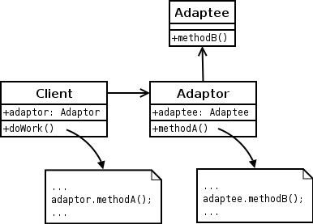

# Design Pattern

A design pattern is the re-usable form of a solution to a design problem. The idea was introduced by the architect `Christopher Alexander`.

# Why Design Patterns ?

Documenting a pattern requires explaining why a particular situation causes problems, and how the components of the pattern relate to each other to give the solution. Christopher Alexander describes common design problems as arising from "conflicting forces"—such as the conflict between wanting a room to be sunny and wanting it not to overheat on summer afternoons. A pattern would not tell the designer how many windows to put in the room; instead, it would propose a set of values to guide the designer toward a decision that is best for their particular application. Alexander, for example, suggests that enough windows should be included to direct light all around the room. He considers this a good solution because he believes it increases the enjoyment of the room by its occupants. Other authors might come to different conclusions, if they place higher value on heating costs, or material costs. These values, used by the pattern's author to determine which solution is "best", must also be documented within the pattern.

Pattern documentation should also explain when it is applicable. Since two houses may be very different from one another, a design pattern for houses must be broad enough to apply to both of them, but not so vague that it doesn't help the designer make decisions. The range of situations in which a pattern can be used is called its context. Some examples might be "all houses", "all two-story houses", or "all places where people spend time". 

For instance, in Christopher Alexander's work, bus stops and waiting rooms in a surgery center are both within the context for the pattern "A PLACE TO WAIT". 

So, The single biggest benefit of design patterns in my opinion is that `it gives developers a common vocabulary to talk about software solutions.`

If I say, "We should implement this using the singleton pattern", we have a common point of reference to begin discussing whether or not that is a good idea without me having to actually implement the solution first so you know what I mean.

Add in `readability` and `maintainability` that comes with familiar solutions to common problems, instead of every developer trying to solve the problem in their own way over an over again.

Pretty important. Software can be made without them, but it's certainly a lot harder.

# Differenet Types of Design Patterns

there are various types of design patterns exits in software engineering.

- `Software Design Pattern` in software design
- `Architectural Pattern`:  for software architecture
- `Interaction design pattern`: used in interaction design / human–computer interaction
- `Pedagogical patterns`:  in teaching
- `Pattern gardening` : in gardening

we will discuss `Software Design Pattern` & `Architectural Pattern` only.

# Software Design Pattern

A design pattern describes a relatively small, well-defined aspect (i.e. functionality) of a computer program in terms of how to write the code.

Using a pattern is intended to leverage an existing concept rather than re-inventing it. This can decrease the time to develop software and increase the quality of the resulting program. 

Notably, a pattern does not consist of a software artifact. Most development resources that a programmer uses involve configuring the codebase to use an artifact such as a library (to name just one example). In contrast, to use a pattern, a programmer writes code as described by the pattern. The result is unique every time even though the result may be recognizable as based on the pattern. 

Conceptually, design pattern may be described as more specific than programming paradigm and less specific than algorithm. 

## Motivation for Software Design Pattern

Design patterns can speed up the development process by providing proven development paradigms.Effective software design requires considering issues that may not become apparent until later in the implementation. Freshly written code can often have hidden, subtle issues that take time to be detected; issues that sometimes can cause major problems down the road. Reusing design patterns can help to prevent such issues, and enhance code readability for those familiar with the patterns. 

Software design techniques are difficult to apply to a broader range of problems.[citation needed] Design patterns provide general solutions, documented in a format that does not require specifics tied to a particular problem. 

`A pattern describes a design motif, a.k.a. prototypical micro-architecture, as a set of program constituents (e.g., classes, methods...) and their relationships. A developer adapts the motif to their codebase to solve the problem described by the pattern. The resulting code has structure and organization similar to the chosen motif. `

## Object-Oriented Design Patterns

Object-oriented design patterns typically show relationships and interactions between classes or objects, without specifying the final application classes or objects that are involved. Patterns that imply mutable state may be unsuited for functional programming languages. Some patterns can be rendered unnecessary in languages that have built-in support for solving the problem they are trying to solve, and object-oriented patterns are not necessarily suitable for non-object-oriented languages. 

Design patterns can be organized into groups based on what kind of problem they solve. 

- `Creational Design Patterns :` create objects. 

- `Structural Design Patterns :` organize classes and objects to form larger structures that provide new functionality. 

- `Behavioral Design Patterns :` provide communication between objects and realizing these patterns. 

# Creational Design Patterns

Creational Design Patterns are design patterns that `deal with object creation mechanisms, trying to create objects in a manner suitable to the situation.` The basic form of object creation could result in design problems or in added complexity to the design due to inflexibility in the creation procedures. Creational design patterns solve this problem by somehow controlling this object creation. 

Simply we can say, `Creational design patterns provide various object creation mechanisms, which increase flexibility and reuse of existing code.`

Creational design patterns are composed of two dominant ideas. `One is encapsulating knowledge about which concrete classes the system uses.` Another is `hiding how instances of these concrete classes are created and combined.`

Creational design patterns are further categorized into object-creational patterns and class-creational patterns, where object-creational patterns deal with object creation and class-creational patterns deal with class-instantiation. In greater details, object-creational patterns defer part of its object creation to another object, while class-creational patterns defer its object creation to subclasses.

The creational patterns aim to `separate a system from how its objects are created, composed, and represented. `They increase the system's flexibility in terms of the what, who, how, and when of object creation.

## Why Creational Design Patterns ?

As modern software engineering depends more on object composition than class inheritance, emphasis shifts away from hard-coding behaviors toward defining a smaller set of basic behaviors that can be composed into more complex ones. Hard-coding behaviors are inflexible because they require overriding or re-implementing the whole thing in order to change parts of the design. Additionally, hard-coding does not promote reuse and makes it difficult to keep track of errors. For these reasons, creational patterns are more useful than hard-coding behaviors. Creational patterns make design become more flexible. They provide different ways to remove explicit references in the concrete classes from the code that needs to instantiate them. In other words, they create independency for objects and classes. 

## When Creational Design Patterns can be apply ?

Consider applying creational patterns when:

- A system should be independent of how its objects and products are created.
- A set of related objects is designed to be used together.
- Hiding the implementations of a class library or product, revealing only their interfaces.
- Constructing different representation of independent complex objects.
- A class wants its subclass to implement the object it creates.
- The class instantiations are specified at run-time.
- There must be a single instance and client can access this instance at all times.
- Instance should be extensible without being modified.

## Structure of Creational Design Patterns

Below is a simple class diagram that most creational patterns have in common. Note that different creational patterns require additional and different participated classes. 

`Participants:`

-    `Creator:` Declares object interface. Returns object.

-    `ConcreteCreator:` Implements object's interface.

## Examples of Creational Design Patterns

There are 10 examples of creational design patterns exist:

- `Multiton:` Ensure a class has only named instances, and provide a global point of access to them.

- `Builder pattern:` Separate the construction of a complex object from its representation, allowing the same construction process to create various representations. 

- `Prototype pattern:` Specify the kinds of objects to create using a prototypical instance, and create new objects from the 'skeleton' of an existing object, thus boosting performance and keeping memory footprints to a minimum. 

- `Singleton pattern:` Ensure a class has only one instance, and provide a global point of access to it. 

- `Object pool pattern:` Avoid expensive acquisition and release of resources by recycling objects that are no longer in use. Can be considered a generalisation of connection pool and thread pool patterns. 

- `Factory method pattern:` Define an interface for creating a single object, but let subclasses decide which class to instantiate. Factory Method lets a class defer instantiation to subclasses.

- `Abstract Factory pattern:` Provide an interface for creating families of related or dependent objects without specifying their concrete classes. 

- `Lazy initialization pattern:` Tactic of delaying the creation of an object, the calculation of a value, or some other expensive process until the first time it is needed. This pattern appears in the GoF catalog as "virtual proxy", an implementation strategy for the Proxy pattern.

- `Dependency Injection pattern:` A class accepts the objects it requires from an injector instead of creating the objects directly. 

- `Resource acquisition is initialization (RAII):` Ensure that resources are properly released by tying them to the lifespan of suitable objects. 

 